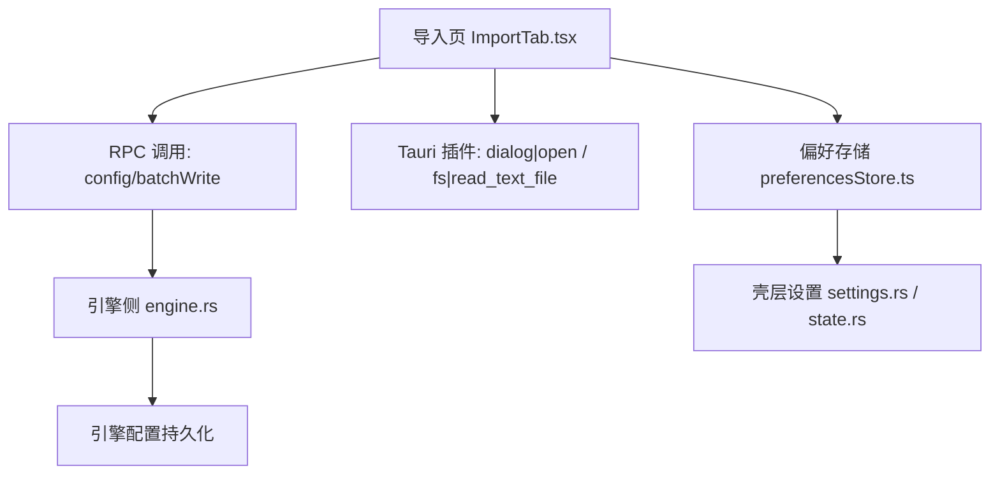
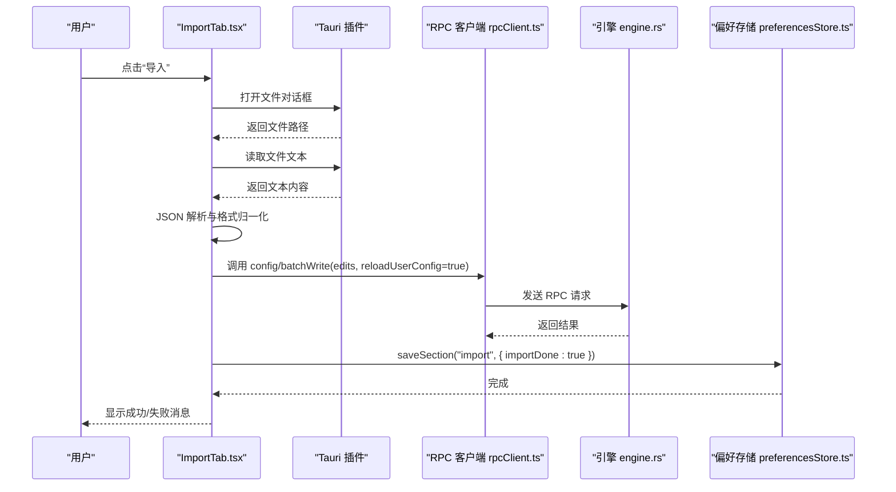
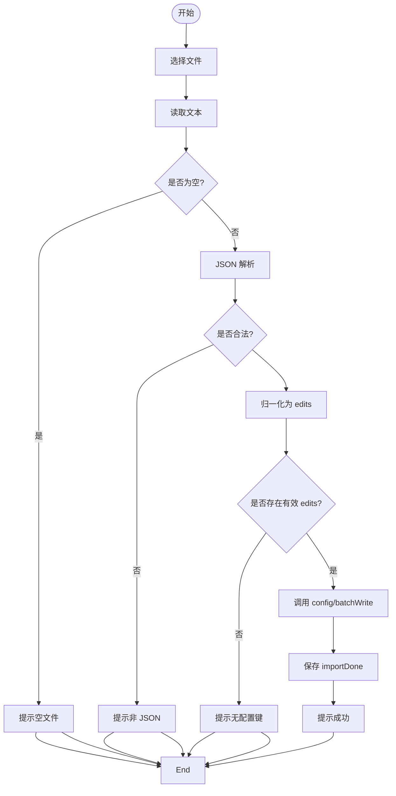
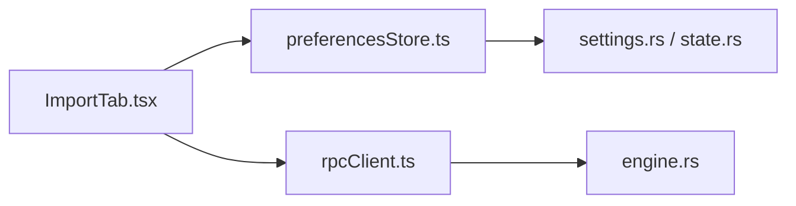

# 导入设置页面

<cite>
**本文引用的文件**
- [ImportTab.tsx](file://frontend/app/views/settings/tabs/ImportTab.tsx)
- [preferencesStore.ts](file://frontend/app/state/preferencesStore.ts)
- [settings.rs](file://src-tauri/src/commands/settings.rs)
- [state.rs](file://src-tauri/src/state.rs)
- [engine.rs](file://src-tauri/src/commands/engine.rs)
- [rpcClient.ts](file://frontend/app/devbridge/rpcClient.ts)
</cite>

## 目录
1. [简介](#简介)
2. [项目结构](#项目结构)
3. [核心组件](#核心组件)
4. [架构总览](#架构总览)
5. [详细组件分析](#详细组件分析)
6. [依赖关系分析](#依赖关系分析)
7. [性能考虑](#性能考虑)
8. [故障排查指南](#故障排查指南)
9. [结论](#结论)
10. [附录](#附录)

## 简介
本页面面向 Codex-Tauri 的“导入设置”功能，聚焦于从外部 JSON 配置文件导入并应用配置变更。当前实现以“一次性导入”为主：用户选择本地 JSON 文件，前端解析并转换为统一的批量写入编辑项，通过 RPC 调用引擎的 config/batchWrite 接口完成配置更新；随后在本地偏好中记录首次导入已完成，从而解锁后续内容选择等能力。该流程具备明确的错误提示与状态管理，但不包含自动回滚机制。

## 项目结构
导入设置页面由前端 React 组件驱动，配合 Tauri 命令与引擎 RPC 完成持久化。关键路径如下：
- 前端 UI 与交互：ImportTab.tsx
- 偏好存储与持久化：preferencesStore.ts
- 后端设置读写（壳层）：settings.rs、state.rs
- 引擎配置写入通道：engine.rs（通过 rpc 调用 config/batchWrite）
- 引擎 RPC 客户端封装：rpcClient.ts

图表来源
- [ImportTab.tsx:81-152](file://frontend/app/views/settings/tabs/ImportTab.tsx#L81-L152)
- [preferencesStore.ts:76-88](file://frontend/app/state/preferencesStore.ts#L76-L88)
- [engine.rs:578-605](file://src-tauri/src/commands/engine.rs#L578-L605)
- [settings.rs:18-52](file://src-tauri/src/commands/settings.rs#L18-L52)
- [state.rs:176-217](file://src-tauri/src/state.rs#L176-L217)

章节来源
- [ImportTab.tsx:81-152](file://frontend/app/views/settings/tabs/ImportTab.tsx#L81-L152)
- [preferencesStore.ts:76-88](file://frontend/app/state/preferencesStore.ts#L76-L88)
- [engine.rs:578-605](file://src-tauri/src/commands/engine.rs#L578-L605)
- [settings.rs:18-52](file://src-tauri/src/commands/settings.rs#L18-L52)
- [state.rs:176-217](file://src-tauri/src/state.rs#L176-L217)

## 核心组件
- 导入页组件 ImportTab
  - 负责打开文件对话框、读取文本、JSON 解析、格式归一化、调用批量写入、更新本地偏好与展示状态。
- 偏好存储 preferencesStore
  - 提供按 section 的读写与持久化，用于保存 importDone 等导入相关标记。
- 引擎配置写入 engine.rs
  - 通过 RPC 将 edits 写入引擎配置，并触发重新加载用户配置。
- 壳层设置 settings.rs / state.rs
  - 提供 get/save_preferences 等命令，持久化 shell 状态到本地文件。

章节来源
- [ImportTab.tsx:44-73](file://frontend/app/views/settings/tabs/ImportTab.tsx#L44-L73)
- [ImportTab.tsx:81-152](file://frontend/app/views/settings/tabs/ImportTab.tsx#L81-L152)
- [preferencesStore.ts:76-88](file://frontend/app/state/preferencesStore.ts#L76-L88)
- [engine.rs:578-605](file://src-tauri/src/commands/engine.rs#L578-L605)
- [settings.rs:18-52](file://src-tauri/src/commands/settings.rs#L18-L52)
- [state.rs:176-217](file://src-tauri/src/state.rs#L176-L217)

## 架构总览
导入流程采用“前端发起 -> 引擎批量写入 -> 本地偏好标记”的分层协作模式。前端负责数据校验与转换，引擎负责最终配置落盘与热重载，壳层负责本地状态持久化。

图表来源
- [ImportTab.tsx:89-152](file://frontend/app/views/settings/tabs/ImportTab.tsx#L89-L152)
- [rpcClient.ts:201-229](file://frontend/app/devbridge/rpcClient.ts#L201-L229)
- [engine.rs:578-605](file://src-tauri/src/commands/engine.rs#L578-L605)
- [preferencesStore.ts:76-88](file://frontend/app/state/preferencesStore.ts#L76-L88)

## 详细组件分析

### 导入页 ImportTab.tsx
- 功能要点
  - 打开文件对话框，限制扩展名 json/toml/txt。
  - 读取文件文本，严格 JSON 解析；非 JSON 视为失败。
  - 将多种导出形状归一化为统一 edits 列表（支持数组、edits/writes/config 字段、扁平键值映射）。
  - 调用 config/batchWrite 并开启 reloadUserConfig。
  - 成功后保存 importDone 标记，解锁内容选择下拉框。
  - 使用本地状态显示加载、成功、错误三类消息。
- 数据验证规则
  - 文件必须存在且非空。
  - 文件内容必须是合法 JSON。
  - 解析后必须至少包含一个可识别的配置键路径。
- 冲突解决策略
  - 默认 mergeStrategy 为 replace；若导入数据显式指定则按指定策略执行。
- 增量更新支持
  - 通过 edits 列表进行增量写入；每次导入仅应用文件中声明的键路径。
- 错误处理
  - 未选择文件、空文件、JSON 解析失败、无有效键路径时均直接报错并提示。
  - 网络或 RPC 异常会捕获并显示错误信息。
- 回滚机制
  - 当前实现不包含自动回滚；若批量写入部分失败，需由上层重试或手动修复。

图表来源
- [ImportTab.tsx:89-152](file://frontend/app/views/settings/tabs/ImportTab.tsx#L89-L152)

章节来源
- [ImportTab.tsx:44-73](file://frontend/app/views/settings/tabs/ImportTab.tsx#L44-L73)
- [ImportTab.tsx:81-152](file://frontend/app/views/settings/tabs/ImportTab.tsx#L81-L152)

### 偏好存储 preferencesStore.ts
- 作用
  - 维护 per-section 的偏好对象，合并默认值，并提供 saveSection 持久化。
- 导入相关
  - 导入完成后保存 importDone 标记，控制 UI 行为（如禁用/启用内容选择）。
- 持久化
  - 通过 invoke("save_preferences") 将完整 preferences 写回壳层。

章节来源
- [preferencesStore.ts:76-88](file://frontend/app/state/preferencesStore.ts#L76-L88)

### 引擎配置写入 engine.rs
- 作用
  - 通过 RPC 调用 config/batchWrite，将 edits 写入引擎配置，并设置 reloadUserConfig=true 以生效。
- 与导入页的关系
  - 导入页将前端归一化的 edits 提交给引擎，由引擎完成实际配置更新。

章节来源
- [engine.rs:578-605](file://src-tauri/src/commands/engine.rs#L578-L605)

### 壳层设置 settings.rs / state.rs
- 作用
  - 提供 get/save_preferences 等命令，持久化 shell 状态到本地文件（shell-state.json）。
- 与导入页的关系
  - 导入完成后，偏好存储通过该命令持久化 importDone 等标记。

章节来源
- [settings.rs:18-52](file://src-tauri/src/commands/settings.rs#L18-L52)
- [state.rs:176-217](file://src-tauri/src/state.rs#L176-L217)

### 引擎 RPC 客户端 rpcClient.ts
- 作用
  - 封装 JSON-RPC 请求与响应，提供超时与连接检查。
- 与导入页的关系
  - 导入页通过 invoke("rpc_raw", ...) 间接使用该客户端向引擎发送配置写入请求。

章节来源
- [rpcClient.ts:201-229](file://frontend/app/devbridge/rpcClient.ts#L201-L229)

## 依赖关系分析
- 前端依赖
  - ImportTab.tsx 依赖 preferencesStore.ts 进行偏好读写，依赖 Tauri 插件进行文件操作，依赖 RPC 客户端进行引擎通信。
- 后端依赖
  - engine.rs 依赖引擎内部配置系统；settings.rs/state.rs 依赖本地文件系统。
- 耦合度
  - 导入逻辑集中在 ImportTab.tsx，职责清晰；与引擎的耦合通过标准 RPC 接口解耦。

图表来源
- [ImportTab.tsx:81-152](file://frontend/app/views/settings/tabs/ImportTab.tsx#L81-L152)
- [preferencesStore.ts:76-88](file://frontend/app/state/preferencesStore.ts#L76-L88)
- [rpcClient.ts:201-229](file://frontend/app/devbridge/rpcClient.ts#L201-L229)
- [engine.rs:578-605](file://src-tauri/src/commands/engine.rs#L578-L605)
- [settings.rs:18-52](file://src-tauri/src/commands/settings.rs#L18-L52)
- [state.rs:176-217](file://src-tauri/src/state.rs#L176-L217)

章节来源
- [ImportTab.tsx:81-152](file://frontend/app/views/settings/tabs/ImportTab.tsx#L81-L152)
- [preferencesStore.ts:76-88](file://frontend/app/state/preferencesStore.ts#L76-L88)
- [rpcClient.ts:201-229](file://frontend/app/devbridge/rpcClient.ts#L201-L229)
- [engine.rs:578-605](file://src-tauri/src/commands/engine.rs#L578-L605)
- [settings.rs:18-52](file://src-tauri/src/commands/settings.rs#L18-L52)
- [state.rs:176-217](file://src-tauri/src/state.rs#L176-L217)

## 性能考虑
- 文件读取限制
  - 当前导入对文件大小无硬性上限，但建议在实际使用中避免超大文件导致内存压力。
- 批量写入效率
  - 通过 edits 列表进行批量写入，减少多次 RPC 往返；合理组织 edits 可降低引擎负载。
- 配置重载
  - reloadUserConfig=true 会触发引擎重新加载配置，建议在导入完成后避免频繁重复导入。

[本节为通用指导，不直接分析具体文件]

## 故障排查指南
- 常见错误与定位
  - 未选择文件或文件为空：检查文件对话框返回值与读取结果。
  - JSON 解析失败：确认文件格式为合法 JSON；当前不支持 TOML/纯文本直接导入。
  - 无有效配置键：确保导入数据包含至少一个 keyPath 或可识别的 edits/writes/config 字段。
  - RPC 调用失败：检查引擎连接状态与网络连通性；查看 RPC 客户端超时与错误信息。
- 日志与调试
  - 前端控制台输出偏好保存失败等警告信息。
  - 可通过引擎 RPC 客户端的超时与错误信息进行问题定位。

章节来源
- [ImportTab.tsx:107-152](file://frontend/app/views/settings/tabs/ImportTab.tsx#L107-L152)
- [preferencesStore.ts:76-88](file://frontend/app/state/preferencesStore.ts#L76-L88)
- [rpcClient.ts:201-229](file://frontend/app/devbridge/rpcClient.ts#L201-L229)

## 结论
导入设置页面实现了从 JSON 配置文件导入并应用配置的完整流程，具备明确的数据验证、错误提示与状态管理。通过批量写入与增量更新，能够安全地合并配置变更。当前版本不包含自动回滚机制，建议在重要导入前做好备份。未来可扩展支持更多导入格式、冲突解决策略与回滚能力。

[本节为总结性内容，不直接分析具体文件]

## 附录

### 数据格式规范（导入）
- 支持的输入形状
  - 数组条目：每个条目包含 keyPath、value、mergeStrategy（可选）。
  - 对象字段：edits、writes、config 任一数组，元素同上。
  - 扁平映射：顶层键为 keyPath，值为标量（过滤 null 与对象）。
- 字段说明
  - keyPath：目标配置键路径。
  - value：要写入的值。
  - mergeStrategy：合并策略，默认 replace。

章节来源
- [ImportTab.tsx:44-73](file://frontend/app/views/settings/tabs/ImportTab.tsx#L44-L73)

### 自定义导入器开发指南（基于现有接口）
- 目标
  - 在不修改 ImportTab.tsx 的前提下，将任意第三方导出格式转换为标准 edits 列表，再交由现有流程处理。
- 步骤
  - 在导入前增加预处理阶段，将原始数据转换为标准 edits 数组。
  - 保持与 toConfigEdits 相同的输出结构，确保兼容 batchWrite。
  - 复用现有 runImport 流程，无需改动 UI 与状态管理。
- API 参考
  - 文件读取：Tauri 插件 read_text_file。
  - 配置写入：RPC 方法 config/batchWrite，参数 edits 与 reloadUserConfig。
  - 偏好标记：saveSection("import", { importDone: true })。

章节来源
- [ImportTab.tsx:89-152](file://frontend/app/views/settings/tabs/ImportTab.tsx#L89-L152)
- [engine.rs:578-605](file://src-tauri/src/commands/engine.rs#L578-L605)
- [preferencesStore.ts:76-88](file://frontend/app/state/preferencesStore.ts#L76-L88)