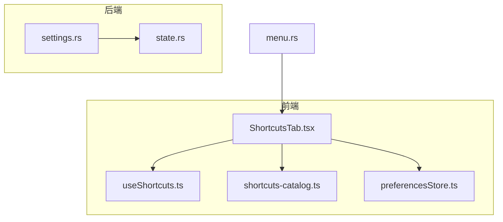
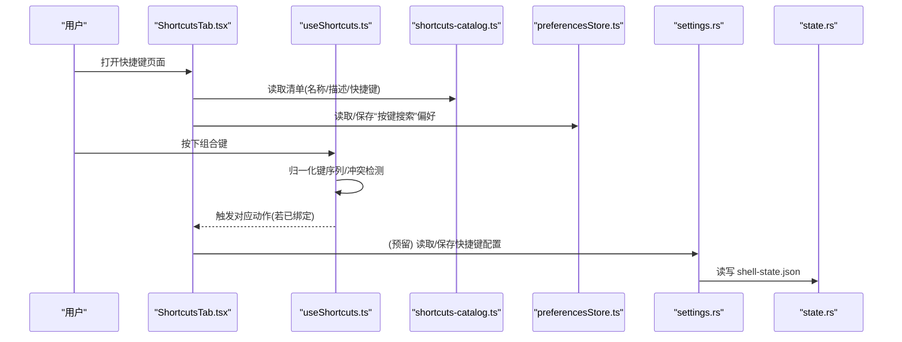
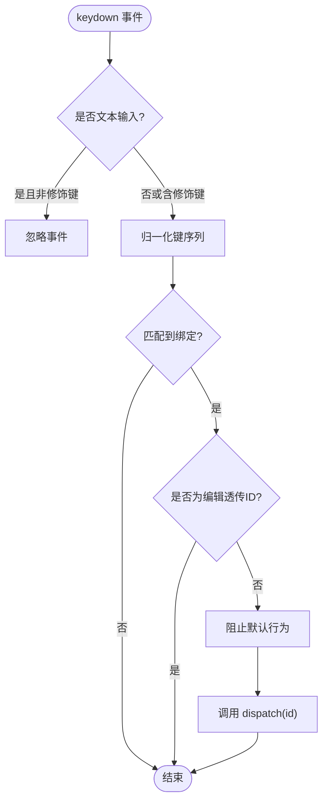
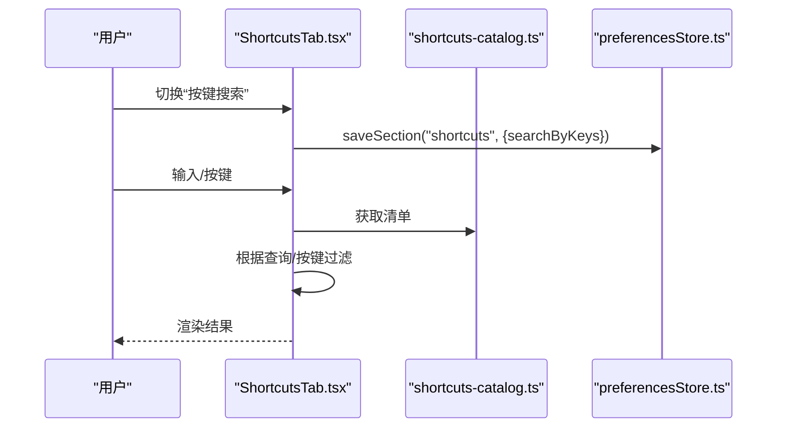
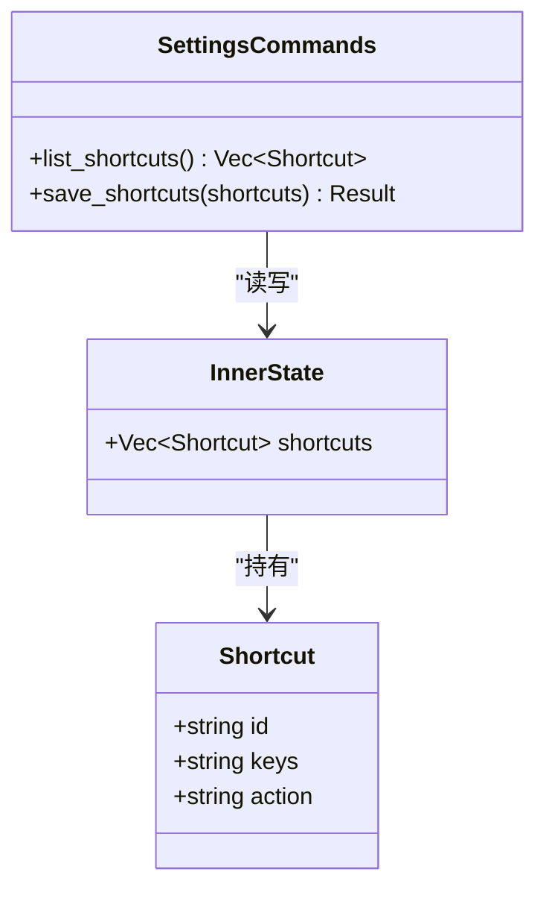
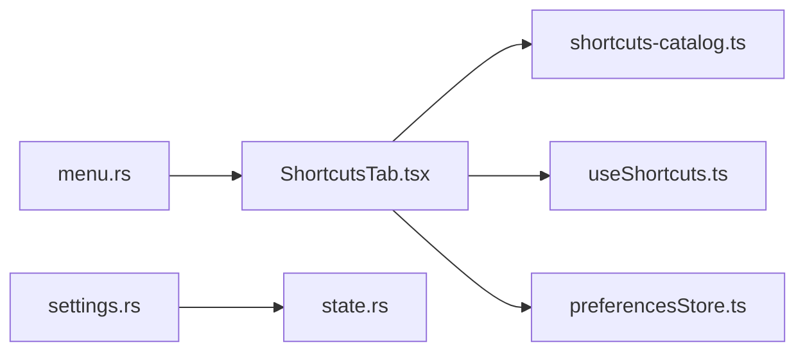

# 快捷键设置页面

<cite>
**本文引用的文件**
- [ShortcutsTab.tsx](file://frontend/app/views/settings/tabs/ShortcutsTab.tsx)
- [useShortcuts.ts](file://frontend/app/shell/useShortcuts.ts)
- [shortcuts-catalog.ts](file://frontend/app/data/shortcuts-catalog.ts)
- [preferencesStore.ts](file://frontend/app/state/preferencesStore.ts)
- [settings.rs](file://src-tauri/src/commands/settings.rs)
- [state.rs](file://src-tauri/src/state.rs)
- [menu.rs](file://src-tauri/src/menu.rs)
</cite>

## 目录
1. [简介](#简介)
2. [项目结构](#项目结构)
3. [核心组件](#核心组件)
4. [架构总览](#架构总览)
5. [详细组件分析](#详细组件分析)
6. [依赖关系分析](#依赖关系分析)
7. [性能考量](#性能考量)
8. [故障排查指南](#故障排查指南)
9. [结论](#结论)
10. [附录](#附录)

## 简介
本页面为 Codex-Tauri 的“键盘快捷键”设置页，提供快捷键清单展示、按快捷键搜索过滤、以及全局快捷键监听与分发。当前实现以只读清单为主，未暴露“更改/清除/为…设置快捷键”等编辑能力；后端已具备快捷键配置的持久化接口（读取/保存），前端尚未将 UI 与后端绑定。本文围绕以下目标展开：
- 全局快捷键的注册与事件监听机制
- 冲突检测与优先级管理
- 平台差异处理（输入框场景、WebView2 原生编辑）
- 快捷键导入导出、批量配置与重置（现状与扩展建议）
- 快捷键扩展的开发接口与最佳实践

## 项目结构
快捷键相关的前端与后端职责划分如下：
- 前端展示层：ShortcutsTab.tsx 负责渲染快捷键清单、搜索与“按键搜索”模式
- 前端事件层：useShortcuts.ts 提供全局键盘事件监听、键序列归一化、冲突检测、格式化显示
- 数据源：shortcuts-catalog.ts 提供官方快捷键清单（名称、描述、已分配快捷键）
- 偏好存储：preferencesStore.ts 提供 per-section 偏好读写（用于“按键搜索”开关）
- 后端命令：settings.rs 提供 list_shortcuts/save_shortcuts 等 IPC 命令
- 状态模型：state.rs 定义 Shortcut 结构与状态持久化
- 菜单入口：menu.rs 在帮助菜单中提供打开快捷键页面的系统级快捷键

图表来源
- [ShortcutsTab.tsx:1-164](file://frontend/app/views/settings/tabs/ShortcutsTab.tsx#L1-L164)
- [useShortcuts.ts:1-146](file://frontend/app/shell/useShortcuts.ts#L1-L146)
- [shortcuts-catalog.ts:1-800](file://frontend/app/data/shortcuts-catalog.ts#L1-L800)
- [preferencesStore.ts:1-94](file://frontend/app/state/preferencesStore.ts#L1-L94)
- [settings.rs:1-68](file://src-tauri/src/commands/settings.rs#L1-L68)
- [state.rs:117-123](file://src-tauri/src/state.rs#L117-L123)
- [menu.rs:167-173](file://src-tauri/src/menu.rs#L167-L173)

章节来源
- [ShortcutsTab.tsx:1-164](file://frontend/app/views/settings/tabs/ShortcutsTab.tsx#L1-L164)
- [useShortcuts.ts:1-146](file://frontend/app/shell/useShortcuts.ts#L1-L146)
- [shortcuts-catalog.ts:1-800](file://frontend/app/data/shortcuts-catalog.ts#L1-L800)
- [preferencesStore.ts:1-94](file://frontend/app/state/preferencesStore.ts#L1-L94)
- [settings.rs:1-68](file://src-tauri/src/commands/settings.rs#L1-L68)
- [state.rs:117-123](file://src-tauri/src/state.rs#L117-L123)
- [menu.rs:167-173](file://src-tauri/src/menu.rs#L167-L173)

## 核心组件
- 快捷键清单与交互：ShortcutsTab.tsx
  - 渲染官方快捷键清单（名称、描述、已分配快捷键）
  - 支持文本搜索与“按键搜索”模式（实时捕获非修饰键并过滤）
  - “更改/清除/为…设置快捷键”按钮当前禁用（无后端绑定）
- 全局快捷键分发：useShortcuts.ts
  - 使用 document keydown 监听全局键盘事件
  - 归一化键序列（修饰键顺序、主键标准化）
  - 冲突检测（findConflicts）
  - 文本输入场景下的行为控制（允许 Escape/Enter/Tab，忽略纯字母键）
  - WebView2 原生编辑透传（undo/cut/copy/paste/select-all 等）
- 快捷键数据源：shortcuts-catalog.ts
  - 静态清单，包含 name/desc/chords
- 偏好存储：preferencesStore.ts
  - 提供 usePrefSection/saveSection 用于“按键搜索”开关的持久化
- 后端命令：settings.rs
  - list_shortcuts/save_shortcuts 暴露给前端（当前未被 ShortcutsTab 调用）
- 状态模型：state.rs
  - Shortcut{id, keys, action} 及持久化到 shell-state.json
- 菜单入口：menu.rs
  - 帮助菜单项“Keyboard Shortcuts”，附带系统级快捷键 Ctrl+Shift+/

章节来源
- [ShortcutsTab.tsx:1-164](file://frontend/app/views/settings/tabs/ShortcutsTab.tsx#L1-L164)
- [useShortcuts.ts:1-146](file://frontend/app/shell/useShortcuts.ts#L1-L146)
- [shortcuts-catalog.ts:1-800](file://frontend/app/data/shortcuts-catalog.ts#L1-L800)
- [preferencesStore.ts:1-94](file://frontend/app/state/preferencesStore.ts#L1-L94)
- [settings.rs:1-68](file://src-tauri/src/commands/settings.rs#L1-L68)
- [state.rs:117-123](file://src-tauri/src/state.rs#L117-L123)
- [menu.rs:167-173](file://src-tauri/src/menu.rs#L167-L173)

## 架构总览
快捷键功能由“展示层 + 事件层 + 数据源 + 后端命令”构成。当前 ShortcutsTab 仅消费 catalog 进行展示，并未与后端 shortcuts 列表联动；全局快捷键分发通过 useShortcutDispatcher 在文档级别拦截键盘事件并派发至业务逻辑。

图表来源
- [ShortcutsTab.tsx:1-164](file://frontend/app/views/settings/tabs/ShortcutsTab.tsx#L1-L164)
- [useShortcuts.ts:1-146](file://frontend/app/shell/useShortcuts.ts#L1-L146)
- [shortcuts-catalog.ts:1-800](file://frontend/app/data/shortcuts-catalog.ts#L1-L800)
- [preferencesStore.ts:1-94](file://frontend/app/state/preferencesStore.ts#L1-L94)
- [settings.rs:1-68](file://src-tauri/src/commands/settings.rs#L1-L68)
- [state.rs:117-123](file://src-tauri/src/state.rs#L117-L123)

## 详细组件分析

### 全局快捷键监听与分发（useShortcuts.ts）
- 事件监听
  - 在 document 上注册 keydown 监听器，避免重复注册，使用 ref 缓存最新 bindings 与 dispatch
- 键序列归一化
  - 修饰键顺序固定为 Ctrl/Shift/Alt/Meta
  - 主键标准化：空格、方向键、Esc 等统一为内部表示
- 文本输入场景处理
  - 当焦点位于 INPUT/TEXTAREA/SELECT 或可编辑区域时，忽略非修饰键（保留 Esc/Enter/Tab）
- 编辑操作透传
  - undo/cut/copy/paste/select-all 等 ID 直接放行，避免覆盖 WebView2 原生编辑
- 冲突检测
  - findConflicts 对 bindings 进行键序列分组，返回冲突组
- 显示格式化
  - formatKeys 按修饰键顺序排序后拼接为字符串

图表来源
- [useShortcuts.ts:47-90](file://frontend/app/shell/useShortcuts.ts#L47-L90)
- [useShortcuts.ts:92-133](file://frontend/app/shell/useShortcuts.ts#L92-L133)

章节来源
- [useShortcuts.ts:1-146](file://frontend/app/shell/useShortcuts.ts#L1-L146)

### 快捷键清单与交互（ShortcutsTab.tsx）
- 数据来源
  - 从 shortcuts-catalog.ts 读取官方清单（name/desc/chords）
- 搜索模式
  - 普通搜索：按名称/描述/快捷键片段过滤
  - 按键搜索：开启后捕获非修饰键，实时生成快捷键字符串并过滤清单
- 交互限制
  - 更改/清除/为…设置快捷键按钮当前禁用，因未与后端绑定
- 偏好存储
  - 使用 preferencesStore 的 saveSection 持久化“按键搜索”开关

图表来源
- [ShortcutsTab.tsx:88-164](file://frontend/app/views/settings/tabs/ShortcutsTab.tsx#L88-L164)
- [preferencesStore.ts:76-88](file://frontend/app/state/preferencesStore.ts#L76-L88)
- [shortcuts-catalog.ts:12-19](file://frontend/app/data/shortcuts-catalog.ts#L12-L19)

章节来源
- [ShortcutsTab.tsx:1-164](file://frontend/app/views/settings/tabs/ShortcutsTab.tsx#L1-L164)
- [preferencesStore.ts:1-94](file://frontend/app/state/preferencesStore.ts#L1-L94)
- [shortcuts-catalog.ts:1-800](file://frontend/app/data/shortcuts-catalog.ts#L1-L800)

### 后端快捷键配置（settings.rs / state.rs）
- 数据结构
  - Shortcut{id, keys, action} 用于存储快捷键绑定
- 持久化
  - AppState 维护 shortcuts 列表，save() 写入 shell-state.json
- 命令接口
  - list_shortcuts：读取当前快捷键列表
  - save_shortcuts：保存新的快捷键列表
- 说明
  - 当前前端 ShortcutsTab 未调用上述命令，因此界面为只读展示

图表来源
- [state.rs:117-123](file://src-tauri/src/state.rs#L117-L123)
- [state.rs:155-174](file://src-tauri/src/state.rs#L155-L174)
- [settings.rs:54-68](file://src-tauri/src/commands/settings.rs#L54-L68)

章节来源
- [settings.rs:1-68](file://src-tauri/src/commands/settings.rs#L1-L68)
- [state.rs:117-123](file://src-tauri/src/state.rs#L117-L123)
- [state.rs:155-174](file://src-tauri/src/state.rs#L155-L174)

### 菜单入口与系统级快捷键（menu.rs）
- 帮助菜单中包含“Keyboard Shortcuts”菜单项，并绑定系统级快捷键 Ctrl+Shift+/
- 该快捷键用于快速跳转到快捷键设置页

章节来源
- [menu.rs:167-173](file://src-tauri/src/menu.rs#L167-L173)

## 依赖关系分析
- ShortcutsTab 依赖：
  - shortcuts-catalog.ts（清单数据）
  - useShortcuts.ts（键序列工具函数）
  - preferencesStore.ts（偏好持久化）
- useShortcuts 独立于 UI，提供通用事件监听与冲突检测
- 后端 settings.rs 与 state.rs 提供快捷键配置的持久化能力，但当前未被前端调用
- menu.rs 提供系统级入口，便于用户快速进入快捷键页面

图表来源
- [ShortcutsTab.tsx:1-164](file://frontend/app/views/settings/tabs/ShortcutsTab.tsx#L1-L164)
- [useShortcuts.ts:1-146](file://frontend/app/shell/useShortcuts.ts#L1-L146)
- [shortcuts-catalog.ts:1-800](file://frontend/app/data/shortcuts-catalog.ts#L1-L800)
- [preferencesStore.ts:1-94](file://frontend/app/state/preferencesStore.ts#L1-L94)
- [settings.rs:1-68](file://src-tauri/src/commands/settings.rs#L1-L68)
- [state.rs:117-123](file://src-tauri/src/state.rs#L117-L123)
- [menu.rs:167-173](file://src-tauri/src/menu.rs#L167-L173)

章节来源
- [ShortcutsTab.tsx:1-164](file://frontend/app/views/settings/tabs/ShortcutsTab.tsx#L1-L164)
- [useShortcuts.ts:1-146](file://frontend/app/shell/useShortcuts.ts#L1-L146)
- [shortcuts-catalog.ts:1-800](file://frontend/app/data/shortcuts-catalog.ts#L1-L800)
- [preferencesStore.ts:1-94](file://frontend/app/state/preferencesStore.ts#L1-L94)
- [settings.rs:1-68](file://src-tauri/src/commands/settings.rs#L1-L68)
- [state.rs:117-123](file://src-tauri/src/state.rs#L117-L123)
- [menu.rs:167-173](file://src-tauri/src/menu.rs#L167-L173)

## 性能考量
- 事件监听
  - 使用 useRef 缓存 bindings 与 dispatch，避免每次渲染重新注册监听器
- 冲突检测
  - findConflicts 使用 Map 统计键序列出现次数，时间复杂度 O(n)
- 文本输入优化
  - 在输入框内忽略纯字母键，减少不必要的匹配与 preventDefault
- 显示格式化
  - formatKeys 对修饰键排序，保证一致显示顺序

[本节为通用性能讨论，不直接分析具体文件]

## 故障排查指南
- 快捷键无效
  - 检查是否在文本输入框中触发了纯字母键（会被忽略）
  - 确认是否存在冲突（使用 findConflicts 检测）
  - 确认编辑类快捷键（如复制粘贴）被设计为透传给 WebView2
- 无法保存快捷键
  - 当前 ShortcutsTab 未调用后端保存接口，需先完成前端与后端绑定
  - 如需启用保存，确保 list_shortcuts/save_shortcuts 正确调用并处理错误
- 按键搜索不生效
  - 检查 preferencesStore 的 searchByKeys 开关是否正确加载与保存
  - 确认事件捕获阶段（capture=true）是否正确阻止冒泡

章节来源
- [useShortcuts.ts:92-133](file://frontend/app/shell/useShortcuts.ts#L92-L133)
- [ShortcutsTab.tsx:94-112](file://frontend/app/views/settings/tabs/ShortcutsTab.tsx#L94-L112)
- [preferencesStore.ts:59-88](file://frontend/app/state/preferencesStore.ts#L59-L88)
- [settings.rs:54-68](file://src-tauri/src/commands/settings.rs#L54-L68)

## 结论
- 当前快捷键设置页以只读清单为主，提供强大的全局快捷键监听与冲突检测能力
- 后端已具备快捷键配置的持久化接口，但前端尚未启用编辑能力
- 建议在后续迭代中：
  - 将 ShortcutsTab 与后端 list_shortcuts/save_shortcuts 打通
  - 实现“更改/清除/为…设置快捷键”流程，包括冲突提示与优先级策略
  - 增加导入/导出、批量配置与重置功能，提升用户体验
  - 完善平台差异处理（如不同系统的修饰键映射）

[本节为总结性内容，不直接分析具体文件]

## 附录

### 快捷键导入导出、批量配置与重置（现状与建议）
- 现状
  - 前端未提供导入/导出、批量配置与重置 UI
  - 后端 state.rs 支持 shortcuts 列表的序列化与反序列化
- 建议实现
  - 导入：解析 JSON 格式的快捷键配置，合并到现有列表，执行冲突检测
  - 导出：导出当前 shortcuts 列表为 JSON
  - 批量配置：提供模板或预设，一键应用多组快捷键
  - 重置：恢复默认快捷键配置（可从 catalog 或内置默认值生成）

[本节为概念性建议，不直接分析具体文件]

### 快捷键扩展开发接口与最佳实践
- 扩展点
  - 使用 useShortcutDispatcher 注册新快捷键绑定（id/keys）
  - 在 dispatch 回调中实现业务逻辑
- 最佳实践
  - 保持键序列归一化（修饰键顺序、主键标准化）
  - 避免与系统或 WebView2 原生编辑冲突
  - 在文本输入场景中谨慎拦截按键
  - 使用 findConflicts 提前检测冲突并提示用户
  - 将快捷键配置持久化到后端并通过 list_shortcuts 同步

[本节为概念性指导，不直接分析具体文件]