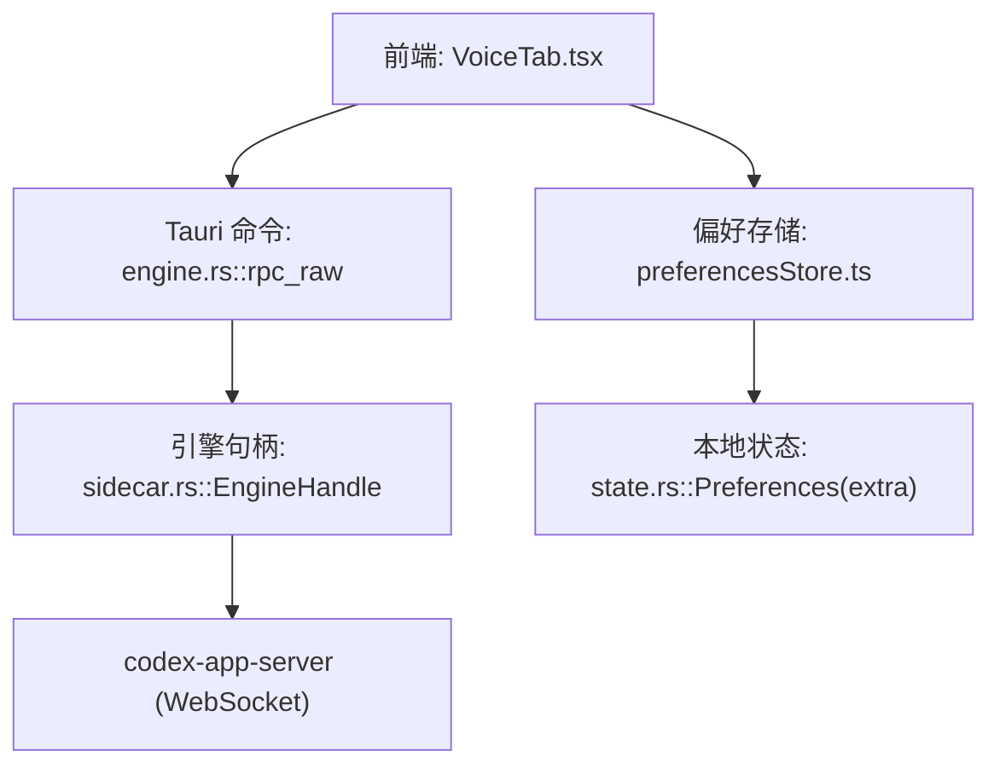
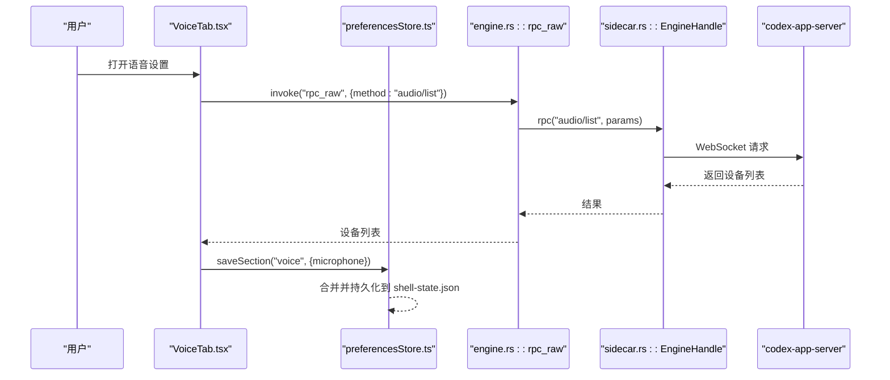
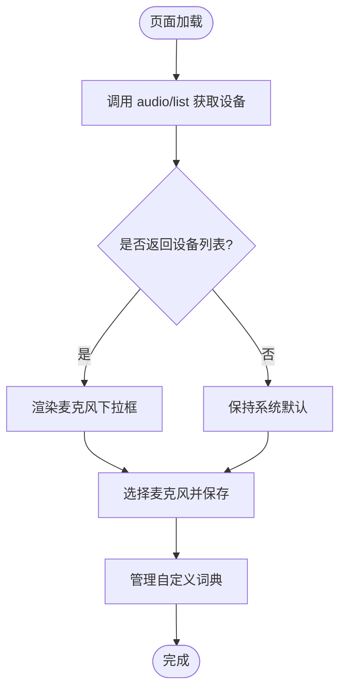
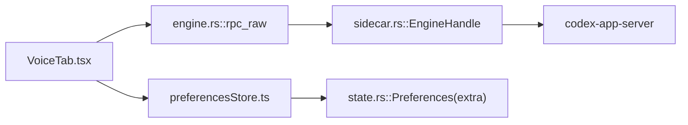

# 语音设置页面

<cite>
**本文引用的文件**
- [VoiceTab.tsx](file://frontend/app/views/settings/tabs/VoiceTab.tsx)
- [preferencesStore.ts](file://frontend/app/state/preferencesStore.ts)
- [engine.rs](file://src-tauri/src/commands/engine.rs)
- [sidecar.rs](file://src-tauri/src/codex/sidecar.rs)
- [mod.rs](file://src-tauri/src/codex/mod.rs)
- [state.rs](file://src-tauri/src/state.rs)
</cite>

## 目录
1. [简介](#简介)
2. [项目结构](#项目结构)
3. [核心组件](#核心组件)
4. [架构总览](#架构总览)
5. [详细组件分析](#详细组件分析)
6. [依赖关系分析](#依赖关系分析)
7. [性能考虑](#性能考虑)
8. [故障排查指南](#故障排查指南)
9. [结论](#结论)
10. [附录](#附录)

## 简介
本页面为 Codex-Tauri 的“语音设置”界面，提供麦克风设备选择、听写快捷键与自定义词典等配置能力。该页面通过 Tauri 命令将前端请求转发到后端引擎（codex-app-server），以枚举音频设备并加载语言列表；同时使用本地偏好存储持久化用户设置。当前实现聚焦于输入设备与听写相关设置，未直接暴露 TTS 引擎或音质参数选项。

## 项目结构
- 前端设置页：React 组件 VoiceTab 负责渲染“语音”标签页，包含通用设置、聊天状态提示、听写快捷键与词典管理。
- 偏好存储：preferencesStore 提供按 section 读取/保存偏好的能力，voice 区段用于持久化麦克风、快捷键与词典条目。
- 后端桥接：engine.rs 暴露 rpc_raw 命令，将任意方法名（如 audio/list）透传到 codex-app-server。
- 引擎侧管：sidecar.rs 负责启动/连接 codex-app-server，维护 WebSocket 客户端与事件广播，并提供 connect_with_retry 等健壮性逻辑。
- 状态模型：state.rs 中 Preferences 使用 flatten 机制保存任意额外 section（包括 voice）。

**图表来源**
- [VoiceTab.tsx:45-118](file://frontend/app/views/settings/tabs/VoiceTab.tsx#L45-L118)
- [preferencesStore.ts:45-88](file://frontend/app/state/preferencesStore.ts#L45-L88)
- [engine.rs:854-860](file://src-tauri/src/commands/engine.rs#L854-L860)
- [sidecar.rs:225-244](file://src-tauri/src/codex/sidecar.rs#L225-L244)
- [state.rs:49-64](file://src-tauri/src/state.rs#L49-L64)

**章节来源**
- [VoiceTab.tsx:1-183](file://frontend/app/views/settings/tabs/VoiceTab.tsx#L1-L183)
- [preferencesStore.ts:1-94](file://frontend/app/state/preferencesStore.ts#L1-L94)
- [engine.rs:840-861](file://src-tauri/src/commands/engine.rs#L840-L861)
- [sidecar.rs:1-276](file://src-tauri/src/codex/sidecar.rs#L1-L276)
- [state.rs:49-64](file://src-tauri/src/state.rs#L49-L64)

## 核心组件
- 语音设置页（VoiceTab）
  - 功能：列出麦克风设备、尝试加载语言列表、配置听写快捷键、维护自定义词典。
  - 数据流：通过 rpc_raw("audio/list") 获取设备列表；用户修改写入 voice section 并持久化。
- 偏好存储（preferencesStore）
  - 功能：按 section 合并与持久化偏好；voice 区段包含 microphone、dictEntries、holdKey、toggleKey。
  - 持久化：调用 save_preferences 将完整 preferences 对象落盘，Rust 端 Preferences.extra 使用 flatten 保留未知 section。
- 引擎命令（engine.rs::rpc_raw）
  - 功能：作为“逃生舱”，将前端传入的方法名与参数透传给引擎。
  - 用途：当前被用于 "audio/list" 等实验性/内部方法。
- 引擎句柄（sidecar.rs::EngineHandle）
  - 功能：启动/连接 codex-app-server，维护 WebSocket 客户端，提供 rpc() 方法与事件广播。
  - 健壮性：connect_with_retry 在首次冷启动时重试连接，避免瞬时失败影响 UI。
- 状态模型（state.rs::Preferences）
  - 功能：通过 serde(flatten) 将任意 section（如 voice）存入 extra 字段，保证前后端扩展互不破坏。

**章节来源**
- [VoiceTab.tsx:45-118](file://frontend/app/views/settings/tabs/VoiceTab.tsx#L45-L118)
- [preferencesStore.ts:45-88](file://frontend/app/state/preferencesStore.ts#L45-L88)
- [engine.rs:854-860](file://src-tauri/src/commands/engine.rs#L854-L860)
- [sidecar.rs:225-244](file://src-tauri/src/codex/sidecar.rs#L225-L244)
- [state.rs:49-64](file://src-tauri/src/state.rs#L49-L64)

## 架构总览
语音设置页面的关键交互流程如下：
- 页面初始化时调用 rpc_raw("audio/list") 获取麦克风设备列表。
- 用户选择麦克风后，更新 voice.microphone 并持久化。
- 语言列表通过同一方法尝试加载，成功则显示下拉框，否则显示重试按钮。
- 听写快捷键捕获键盘组合键并保存到 voice.holdKey / voice.toggleKey。
- 自定义词典以数组形式保存在 voice.dictEntries。

**图表来源**
- [VoiceTab.tsx:61-70](file://frontend/app/views/settings/tabs/VoiceTab.tsx#L61-L70)
- [engine.rs:854-860](file://src-tauri/src/commands/engine.rs#L854-L860)
- [sidecar.rs:225-244](file://src-tauri/src/codex/sidecar.rs#L225-L244)
- [preferencesStore.ts:76-88](file://frontend/app/state/preferencesStore.ts#L76-L88)

## 详细组件分析

### 语音设置页（VoiceTab）
- 设备枚举：通过 rpc_raw("audio/list") 获取设备列表，若引擎离线则回退到系统默认。
- 语言列表：同样使用 "audio/list" 进行探测，成功则展示下拉框，失败显示“重试”。
- 快捷键捕获：captureKey 监听一次键盘事件，生成组合键字符串并保存。
- 词典管理：支持添加/删除条目，至少保留一行空项。

**图表来源**
- [VoiceTab.tsx:61-82](file://frontend/app/views/settings/tabs/VoiceTab.tsx#L61-L82)
- [VoiceTab.tsx:128-179](file://frontend/app/views/settings/tabs/VoiceTab.tsx#L128-L179)

**章节来源**
- [VoiceTab.tsx:26-43](file://frontend/app/views/settings/tabs/VoiceTab.tsx#L26-L43)
- [VoiceTab.tsx:45-118](file://frontend/app/views/settings/tabs/VoiceTab.tsx#L45-L118)
- [VoiceTab.tsx:128-179](file://frontend/app/views/settings/tabs/VoiceTab.tsx#L128-L179)

### 偏好存储（preferencesStore）
- 读取：usePrefSection 合并默认值，确保 voice 区段键存在。
- 写入：saveSection 先本地合并再持久化，失败仅记录日志。
- 持久化：调用 save_preferences 将完整 preferences 对象写入 Rust 端，由 state.rs 的 Preferences.extra 承载。

**章节来源**
- [preferencesStore.ts:45-88](file://frontend/app/state/preferencesStore.ts#L45-L88)
- [state.rs:49-64](file://src-tauri/src/state.rs#L49-L64)

### 引擎命令与句柄（engine.rs, sidecar.rs）
- rpc_raw：将任意方法名透传至引擎，当前用于 "audio/list"。
- EngineHandle::rpc：自动连接/握手，必要时重试；成功后缓存客户端并转发请求。
- 启动与发现：根据环境、配置与二进制位置解析并启动 codex-app-server，附带会话源与环境变量注入。

**章节来源**
- [engine.rs:854-860](file://src-tauri/src/commands/engine.rs#L854-L860)
- [sidecar.rs:32-125](file://src-tauri/src/codex/sidecar.rs#L32-L125)
- [sidecar.rs:188-244](file://src-tauri/src/codex/sidecar.rs#L188-L244)

## 依赖关系分析
- 前端依赖 Tauri invoke 调用 engine.rs 暴露的命令。
- engine.rs 依赖 sidecar.rs 提供的 EngineHandle 进行 RPC。
- sidecar.rs 依赖 codex-app-server 的 WebSocket 协议进行通信。
- 偏好数据通过 preferencesStore 与 Rust 端 Preferences.extra 双向同步。

**图表来源**
- [VoiceTab.tsx:45-118](file://frontend/app/views/settings/tabs/VoiceTab.tsx#L45-L118)
- [preferencesStore.ts:76-88](file://frontend/app/state/preferencesStore.ts#L76-L88)
- [engine.rs:854-860](file://src-tauri/src/commands/engine.rs#L854-L860)
- [sidecar.rs:225-244](file://src-tauri/src/codex/sidecar.rs#L225-L244)
- [state.rs:49-64](file://src-tauri/src/state.rs#L49-L64)

**章节来源**
- [mod.rs:1-9](file://src-tauri/src/codex/mod.rs#L1-L9)
- [engine.rs:854-860](file://src-tauri/src/commands/engine.rs#L854-L860)
- [sidecar.rs:225-244](file://src-tauri/src/codex/sidecar.rs#L225-L244)

## 性能考虑
- 设备枚举与语言列表：每次调用都会触发引擎 RPC，建议在 UI 层做最小化刷新与错误态缓存，避免频繁重试。
- 连接重试：EngineHandle 已内置重试逻辑，可避免冷启动时的瞬时失败导致 UI 卡顿。
- 偏好写入：saveSection 先本地提交再异步持久化，减少 UI 阻塞；但应避免在高频场景下反复调用。
- 词典编辑：建议对输入变更做防抖处理，降低不必要的持久化频率。

[本节为通用指导，无需特定文件引用]

## 故障排查指南
- 无法枚举设备
  - 现象：设备列表为空或始终显示“系统默认”。
  - 可能原因：引擎未启动或离线；RPC 调用失败。
  - 排查步骤：检查 EngineHandle 是否 running；查看 rpc_raw 返回值；确认 codex-app-server 是否监听默认地址。
- 语言列表加载失败
  - 现象：语言行显示“重试”且无法切换。
  - 可能原因：引擎未就绪或方法不支持。
  - 排查步骤：点击重试；观察控制台错误；验证 "audio/list" 是否可用。
- 快捷键无效
  - 现象：设置的 holdKey/toggleKey 无响应。
  - 可能原因：全局快捷键未在应用内生效或被其他程序占用。
  - 排查步骤：重新捕获组合键；检查是否有冲突；确认保存成功。
- 词典条目丢失
  - 现象：重启后词典为空。
  - 可能原因：持久化失败或 preferences 合并异常。
  - 排查步骤：检查 save_preferences 调用；确认 Preferences.extra 是否正确序列化。

**章节来源**
- [VoiceTab.tsx:61-70](file://frontend/app/views/settings/tabs/VoiceTab.tsx#L61-L70)
- [preferencesStore.ts:76-88](file://frontend/app/state/preferencesStore.ts#L76-L88)
- [sidecar.rs:188-244](file://src-tauri/src/codex/sidecar.rs#L188-L244)

## 结论
当前语音设置页面实现了麦克风设备选择、语言列表探测、听写快捷键与自定义词典管理等核心能力。其通过 Tauri 命令与 codex-app-server 的 WebSocket 通信完成设备枚举，并使用本地偏好存储持久化用户设置。尚未暴露 TTS 引擎选择与音质优化选项；如需扩展，可在现有 rpc_raw 通道基础上增加相应方法，并在前端新增对应设置项。

[本节为总结性内容，无需特定文件引用]

## 附录
- Web Audio API 集成说明
  - 当前页面未直接使用浏览器 Web Audio API；设备枚举与语音能力由后端引擎提供。
  - 若未来需要在前端进行实时音频采集与处理，可结合 navigator.mediaDevices.getUserMedia 与 AudioContext，并通过 IPC 将流数据发送至引擎。
- 麦克风权限管理
  - 若引入前端采集，需申请麦克风权限；当前实现依赖引擎侧设备枚举，不涉及浏览器权限弹窗。
- 音频格式支持与跨平台兼容
  - 引擎侧负责具体格式与平台差异；前端仅需关注设备名称与状态。
- 调试工具建议
  - 启用 Tauri 日志与引擎日志，定位 RPC 失败与连接问题。
  - 在 VoiceTab 中增加网络请求与错误状态的可视化提示，便于快速定位。

[本节为概念性内容，无需特定文件引用]