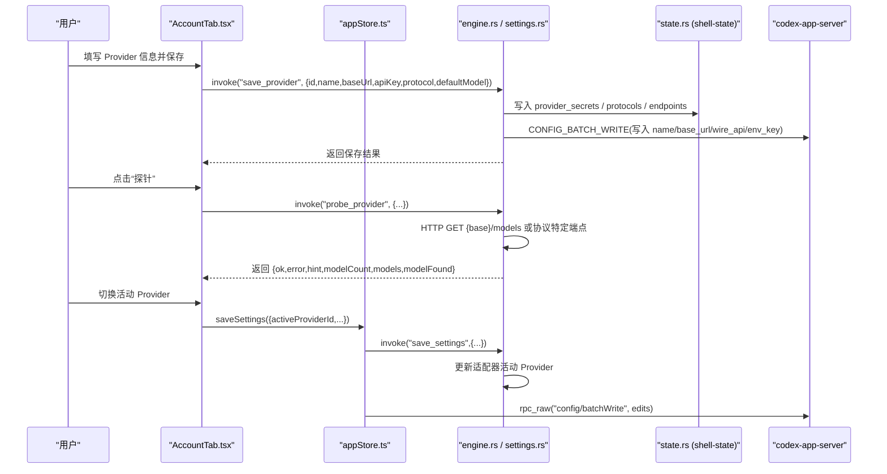
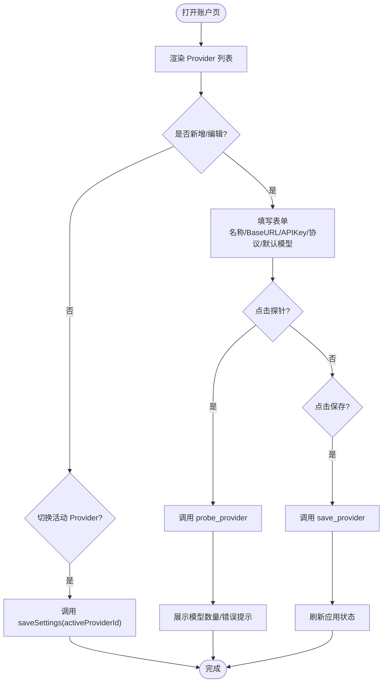
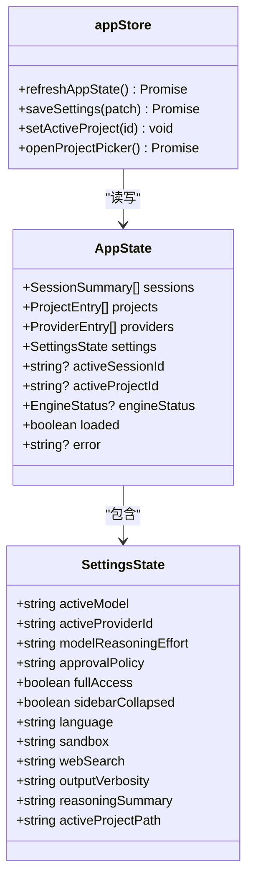
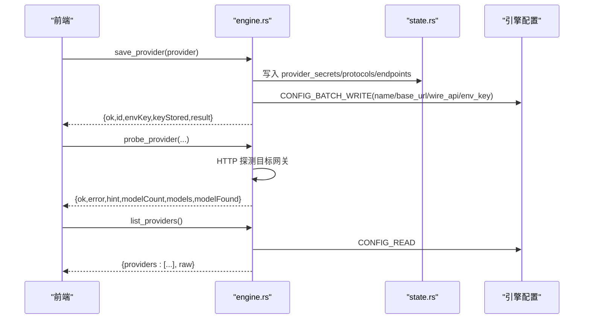
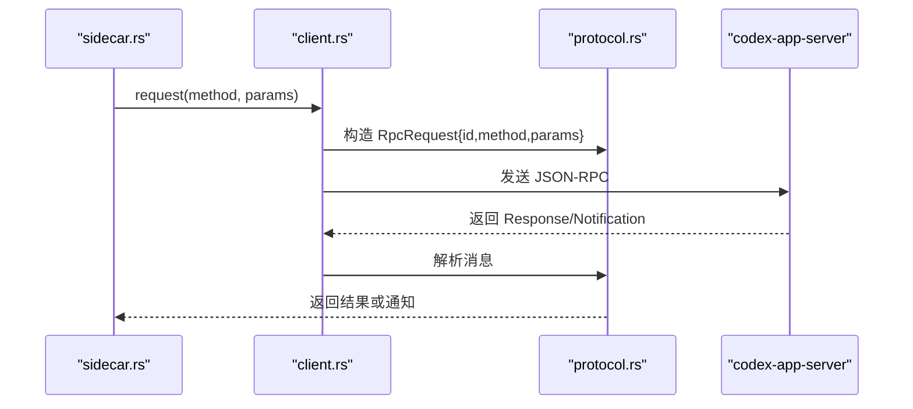
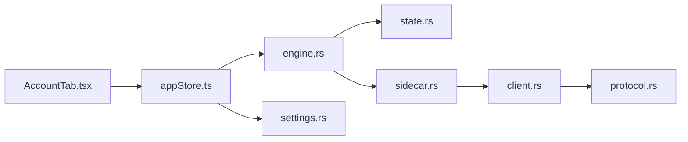

# 账户设置页面

<cite>
**本文引用的文件**
- [AccountTab.tsx](file://frontend/app/views/settings/tabs/AccountTab.tsx)
- [appStore.ts](file://frontend/app/state/appStore.ts)
- [settings.rs](file://src-tauri/src/commands/settings.rs)
- [engine.rs](file://src-tauri/src/commands/engine.rs)
- [state.rs](file://src-tauri/src/state.rs)
- [shellState.ts](file://frontend/app/devbridge/shellState.ts)
- [sidecar.rs](file://src-tauri/src/codex/sidecar.rs)
- [client.rs](file://src-tauri/src/codex/client.rs)
- [protocol.rs](file://src-tauri/src/codex/protocol.rs)
</cite>

## 目录
1. [简介](#简介)
2. [项目结构](#项目结构)
3. [核心组件](#核心组件)
4. [架构总览](#架构总览)
5. [详细组件分析](#详细组件分析)
6. [依赖关系分析](#依赖关系分析)
7. [性能考虑](#性能考虑)
8. [故障排除指南](#故障排除指南)
9. [结论](#结论)
10. [附录](#附录)

## 简介
本文件面向 Codex-Tauri 的“账户设置”页面，系统性说明以下能力：
- 用户认证流程与 API 密钥管理（保存、注入、校验）
- 多账户（多 Provider）切换与会话状态管理
- OAuth 集成现状与令牌刷新机制说明
- 安全存储方案（本地 shell-state.json、环境变量注入）
- 配置验证、错误处理与异常恢复策略
- 第三方服务集成配置与排障方法

该页面通过前端 React 组件与 Tauri 后端命令协作，完成 Provider 的增删改查、连通性探测、激活切换以及持久化。

## 项目结构
账户设置相关代码主要分布在前后端：
- 前端 UI：AccountTab.tsx 提供 Provider 列表、新增/编辑表单、探针结果展示与活动 Provider 切换
- 前端状态：appStore.ts 负责加载会话/Provider/设置，并统一持久化到引擎配置与本地 shell-state
- 后端命令：engine.rs 实现 save_provider、probe_provider、list_providers；settings.rs 实现 save_settings 等
- 状态存储：state.rs 定义 AppState、InnerState、provider_secrets/provider_protocols/provider_endpoints 等
- 侧车通信：sidecar.rs/client.rs/protocol.rs 负责与官方 codex-app-server 的 JSON-RPC 连接与消息处理

```mermaid
graph TB
subgraph "前端"
A["AccountTab.tsx"]
B["appStore.ts"]
end
subgraph "Tauri 后端"
C["engine.rs"]
D["settings.rs"]
E["state.rs"]
end
subgraph "侧车与引擎"
F["sidecar.rs"]
G["client.rs"]
H["protocol.rs"]
end
A --> |invoke("save_provider"/"probe_provider")| C
A --> |invoke("get_settings"/"list_providers")| C
A --> |调用| B
B --> |invoke("save_settings"/"rpc_raw config/batchWrite")| D
B --> |读取/写入| E
C --> |JSON-RPC| F
F --> |WebSocket| G
G --> |消息编解码| H
```

图表来源
- [AccountTab.tsx:55-147](file://frontend/app/views/settings/tabs/AccountTab.tsx#L55-L147)
- [appStore.ts:378-511](file://frontend/app/state/appStore.ts#L378-L511)
- [engine.rs:185-404](file://src-tauri/src/commands/engine.rs#L185-L404)
- [settings.rs:18-33](file://src-tauri/src/commands/settings.rs#L18-L33)
- [state.rs:150-217](file://src-tauri/src/state.rs#L150-L217)
- [sidecar.rs:224-260](file://src-tauri/src/codex/sidecar.rs#L224-L260)
- [client.rs:126-170](file://src-tauri/src/codex/client.rs#L126-L170)
- [protocol.rs:173-206](file://src-tauri/src/codex/protocol.rs#L173-L206)

章节来源
- [AccountTab.tsx:1-336](file://frontend/app/views/settings/tabs/AccountTab.tsx#L1-L336)
- [appStore.ts:1-519](file://frontend/app/state/appStore.ts#L1-L519)
- [engine.rs:1-861](file://src-tauri/src/commands/engine.rs#L1-L861)
- [settings.rs:1-69](file://src-tauri/src/commands/settings.rs#L1-L69)
- [state.rs:1-331](file://src-tauri/src/state.rs#L1-L331)

## 核心组件
- 账户页 UI（AccountTab.tsx）
  - 提供 Provider 列表、活动 Provider 下拉选择、新增/编辑表单（名称、Base URL、API Key、协议、默认模型）、探针按钮与结果提示
  - 通过 invoke 调用后端命令保存 Provider 或执行连通性探测
- 应用状态（appStore.ts）
  - 统一从引擎拉取 sessions/providers/settings，归一化为前端类型
  - 提供 saveSettings 将设置同时写入本地 shell-state 与引擎配置（config/batchWrite）
- 后端命令（engine.rs、settings.rs）
  - save_provider：仅写入官方 schema 字段，并将 API Key 保存在本地 shell-state 中，通过 env_key 注入侧车环境
  - probe_provider：直接 HTTP 探测目标网关，返回模型列表与诊断信息
  - list_providers：从引擎配置读取 provider 列表，并附加协议与实际 Base URL
  - settings 读写：保存 activeProviderId 并同步到适配器状态
- 状态存储（state.rs）
  - InnerState 包含 provider_secrets、provider_protocols、provider_endpoints，持久化到 shell-state.json
  - 提供 provider_env_key 生成环境变量名，用于向侧车注入密钥
- 侧车通信（sidecar.rs、client.rs、protocol.rs）
  - 维护与 codex-app-server 的 WebSocket 连接，封装 JSON-RPC 请求/响应与超时处理

章节来源
- [AccountTab.tsx:55-147](file://frontend/app/views/settings/tabs/AccountTab.tsx#L55-L147)
- [appStore.ts:378-511](file://frontend/app/state/appStore.ts#L378-L511)
- [engine.rs:248-404](file://src-tauri/src/commands/engine.rs#L248-L404)
- [engine.rs:406-521](file://src-tauri/src/commands/engine.rs#L406-L521)
- [settings.rs:18-33](file://src-tauri/src/commands/settings.rs#L18-L33)
- [state.rs:8-25](file://src-tauri/src/state.rs#L8-L25)
- [state.rs:150-217](file://src-tauri/src/state.rs#L150-L217)
- [sidecar.rs:224-260](file://src-tauri/src/codex/sidecar.rs#L224-L260)
- [client.rs:126-170](file://src-tauri/src/codex/client.rs#L126-L170)
- [protocol.rs:173-206](file://src-tauri/src/codex/protocol.rs#L173-L206)

## 架构总览
账户设置的核心交互路径如下：
- 用户在 AccountTab 中填写 Provider 信息并点击“保存”，前端调用 save_provider
- 后端将 API Key 存入本地 shell-state，并通过 env_key 在启动侧车时注入为环境变量
- 同时使用 engine 的 CONFIG_BATCH_WRITE 写入官方 schema 字段（name、base_url、wire_api、requires_openai_auth、env_key）
- 若需要适配不同协议，后端会设置路由到本地适配器端口
- 用户点击“探针”，后端发起 HTTP 请求到目标网关，解析模型列表并返回诊断信息
- 切换活动 Provider 时，前端调用 save_settings，后端更新本地设置并通知适配器切换活动 Provider



图表来源
- [AccountTab.tsx:87-147](file://frontend/app/views/settings/tabs/AccountTab.tsx#L87-L147)
- [engine.rs:248-404](file://src-tauri/src/commands/engine.rs#L248-L404)
- [engine.rs:406-521](file://src-tauri/src/commands/engine.rs#L406-L521)
- [settings.rs:18-33](file://src-tauri/src/commands/settings.rs#L18-L33)
- [appStore.ts:446-511](file://frontend/app/state/appStore.ts#L446-L511)

## 详细组件分析

### 账户页 UI（AccountTab.tsx）
- 功能要点
  - 显示已配置的 Provider 列表与活动标识
  - 支持新增/编辑 Provider（名称、Base URL、API Key、协议、默认模型）
  - 支持“探针”连通性检查，展示模型数量与缺失默认模型的提示
  - 支持切换活动 Provider，立即生效
- 关键交互
  - 保存 Provider：调用 save_provider，成功后刷新应用状态
  - 探针 Provider：调用 probe_provider，根据返回结果展示成功/失败与提示
  - 切换活动：调用 saveSettings，持久化 activeProviderId



图表来源
- [AccountTab.tsx:55-147](file://frontend/app/views/settings/tabs/AccountTab.tsx#L55-L147)
- [AccountTab.tsx:156-176](file://frontend/app/views/settings/tabs/AccountTab.tsx#L156-L176)
- [AccountTab.tsx:178-248](file://frontend/app/views/settings/tabs/AccountTab.tsx#L178-L248)
- [AccountTab.tsx:250-331](file://frontend/app/views/settings/tabs/AccountTab.tsx#L250-L331)

章节来源
- [AccountTab.tsx:55-147](file://frontend/app/views/settings/tabs/AccountTab.tsx#L55-L147)
- [AccountTab.tsx:156-176](file://frontend/app/views/settings/tabs/AccountTab.tsx#L156-L176)
- [AccountTab.tsx:178-248](file://frontend/app/views/settings/tabs/AccountTab.tsx#L178-L248)
- [AccountTab.tsx:250-331](file://frontend/app/views/settings/tabs/AccountTab.tsx#L250-L331)

### 应用状态与持久化（appStore.ts）
- 数据加载
  - refreshAppState 并发调用 list_sessions、list_providers、get_settings，归一化后更新 UI
- 设置持久化
  - saveSettings 将 patch 合并到本地 state，调用 save_settings 写 shell-state
  - 同时将需要的键通过 rpc_raw("config/batchWrite") 写入引擎配置，并触发重载
- 项目与活动选择
  - setActiveProject 与 openProjectPicker 管理项目选择与持久化



图表来源
- [appStore.ts:63-113](file://frontend/app/state/appStore.ts#L63-L113)
- [appStore.ts:378-511](file://frontend/app/state/appStore.ts#L378-L511)

章节来源
- [appStore.ts:378-511](file://frontend/app/state/appStore.ts#L378-L511)

### 后端命令与状态（engine.rs、settings.rs、state.rs）
- save_provider
  - 校验 id、name、base_url、api_key、protocol、default_model
  - 设置适配器路由与活动 Provider
  - 将 API Key 保存到本地 shell-state（provider_secrets），并记录 protocol 与 endpoint
  - 通过 CONFIG_BATCH_WRITE 写入官方 schema 字段（name、base_url、wire_api、requires_openai_auth、env_key）
  - 返回 env_key 与 keyStored 标志，便于前端提示
- probe_provider
  - 对 OpenAI 兼容、Anthropic、Ollama 进行协议特定的端点探测
  - 解析模型列表，判断默认模型是否存在
  - 返回 ok/error/hint/modelCount/models/modelFound
- list_providers
  - 从引擎配置读取 model_providers，并附加 protocol 与 realBaseUrl
- settings 读写
  - save_settings 更新 activeProviderId，并通知适配器切换活动 Provider



图表来源
- [engine.rs:248-404](file://src-tauri/src/commands/engine.rs#L248-L404)
- [engine.rs:406-521](file://src-tauri/src/commands/engine.rs#L406-L521)
- [engine.rs:185-246](file://src-tauri/src/commands/engine.rs#L185-L246)
- [settings.rs:18-33](file://src-tauri/src/commands/settings.rs#L18-L33)
- [state.rs:150-217](file://src-tauri/src/state.rs#L150-L217)

章节来源
- [engine.rs:248-404](file://src-tauri/src/commands/engine.rs#L248-L404)
- [engine.rs:406-521](file://src-tauri/src/commands/engine.rs#L406-L521)
- [engine.rs:185-246](file://src-tauri/src/commands/engine.rs#L185-L246)
- [settings.rs:18-33](file://src-tauri/src/commands/settings.rs#L18-L33)
- [state.rs:150-217](file://src-tauri/src/state.rs#L150-L217)

### 侧车通信与会话状态（sidecar.rs、client.rs、protocol.rs）
- sidecar.rs
  - 维护与 codex-app-server 的连接，按需重连
  - 提供 rpc 与 respond 接口，用于发送请求与回复服务器请求
- client.rs
  - 封装 JSON-RPC 请求，带超时控制与 pending map
  - 初始化握手后通知 initialized
- protocol.rs
  - 解析服务端消息（Request/Notification/Response），标准化 id 键



图表来源
- [sidecar.rs:224-260](file://src-tauri/src/codex/sidecar.rs#L224-L260)
- [client.rs:126-170](file://src-tauri/src/codex/client.rs#L126-L170)
- [protocol.rs:173-206](file://src-tauri/src/codex/protocol.rs#L173-L206)

章节来源
- [sidecar.rs:224-260](file://src-tauri/src/codex/sidecar.rs#L224-L260)
- [client.rs:126-170](file://src-tauri/src/codex/client.rs#L126-L170)
- [protocol.rs:173-206](file://src-tauri/src/codex/protocol.rs#L173-L206)

## 依赖关系分析
- 前端依赖
  - AccountTab 依赖 appStore 提供的状态与持久化方法
  - appStore 依赖 Tauri invoke 调用后端命令
- 后端依赖
  - engine.rs 依赖 state.rs 的 AppState 与 provider 相关映射
  - settings.rs 依赖 AdapterState 以切换活动 Provider
  - sidecar.rs/client.rs/protocol.rs 共同维护与引擎的 JSON-RPC 通道
- 外部依赖
  - reqwest 用于 probe_provider 的 HTTP 探测
  - 引擎配置通过 CONFIG_BATCH_WRITE 持久化



图表来源
- [AccountTab.tsx:55-147](file://frontend/app/views/settings/tabs/AccountTab.tsx#L55-L147)
- [appStore.ts:378-511](file://frontend/app/state/appStore.ts#L378-L511)
- [engine.rs:185-404](file://src-tauri/src/commands/engine.rs#L185-L404)
- [settings.rs:18-33](file://src-tauri/src/commands/settings.rs#L18-L33)
- [state.rs:150-217](file://src-tauri/src/state.rs#L150-L217)
- [sidecar.rs:224-260](file://src-tauri/src/codex/sidecar.rs#L224-L260)
- [client.rs:126-170](file://src-tauri/src/codex/client.rs#L126-L170)
- [protocol.rs:173-206](file://src-tauri/src/codex/protocol.rs#L173-L206)

章节来源
- [AccountTab.tsx:55-147](file://frontend/app/views/settings/tabs/AccountTab.tsx#L55-L147)
- [appStore.ts:378-511](file://frontend/app/state/appStore.ts#L378-L511)
- [engine.rs:185-404](file://src-tauri/src/commands/engine.rs#L185-L404)
- [settings.rs:18-33](file://src-tauri/src/commands/settings.rs#L18-L33)
- [state.rs:150-217](file://src-tauri/src/state.rs#L150-L217)
- [sidecar.rs:224-260](file://src-tauri/src/codex/sidecar.rs#L224-L260)
- [client.rs:126-170](file://src-tauri/src/codex/client.rs#L126-L170)
- [protocol.rs:173-206](file://src-tauri/src/codex/protocol.rs#L173-L206)

## 性能考虑
- 并发加载：refreshAppState 并发获取 sessions/providers/settings，减少首屏等待
- 探针超时：probe_provider 使用 20 秒超时，避免长时间阻塞
- 配置批量写入：saveSettings 使用 batchWrite 一次性提交多个键，降低网络往返
- 适配器路由：非 responses 协议通过本地适配器端口转发，减少跨域与协议差异问题

[本节为通用性能建议，不直接分析具体文件]

## 故障排除指南
- 探针失败常见原因
  - Base URL 为空或不以 http/https 开头：检查输入格式
  - 401/403：API Key 无效或被拒绝，核对密钥完整性与协议匹配（OpenAI 兼容用 Bearer，Anthropic 用 x-api-key）
  - 404：地址或路径不对，OpenAI 兼容通常以 /v1 结尾，Anthropic 官方地址不带 /v1
- 保存失败
  - 检查 provider id 是否为空
  - 确认引擎可访问（engine_status 检查）
- 切换活动 Provider 未生效
  - 确认 save_settings 成功，且适配器状态已更新
- 侧车连接问题
  - 检查 sidecar 连接与 JSON-RPC 超时（client.rs 中的 REQUEST_TIMEOUT）
  - 查看 initialize 元数据是否正常

章节来源
- [engine.rs:406-521](file://src-tauri/src/commands/engine.rs#L406-L521)
- [engine.rs:248-404](file://src-tauri/src/commands/engine.rs#L248-L404)
- [client.rs:126-170](file://src-tauri/src/codex/client.rs#L126-L170)
- [sidecar.rs:224-260](file://src-tauri/src/codex/sidecar.rs#L224-L260)

## 结论
账户设置页面通过前后端协作实现了安全的 API Key 管理、多 Provider 配置与切换、连通性探测与诊断。密钥不直接写入配置文件，而是保存在本地 shell-state 并通过环境变量注入侧车，确保安全性。配置变更通过 batchWrite 高效持久化，探针逻辑覆盖主流协议，提供清晰的错误提示与恢复指引。

[本节为总结性内容，不直接分析具体文件]

## 附录

### 认证流程与 OAuth 集成说明
- 当前实现基于 API Key 认证，不支持 OAuth 流程
- 对于 OpenAI 兼容网关，使用 Bearer Token；对于 Anthropic，使用 x-api-key
- 令牌刷新机制未在仓库中实现；如需支持 OAuth，需在前端增加授权流程并在后端处理回调与刷新

[本节为概念性说明，不直接分析具体文件]

### 安全存储方案
- API Key 保存在本地 shell-state.json 的 provider_secrets 字段
- 通过 provider_env_key 生成环境变量名，在启动侧车时注入，避免明文落盘
- 配置文件仅保留 env_key 引用，不直接存储密钥

章节来源
- [state.rs:8-25](file://src-tauri/src/state.rs#L8-L25)
- [engine.rs:331-345](file://src-tauri/src/commands/engine.rs#L331-L345)

### 第三方服务集成配置指南
- 支持的协议：openai_chat、openai_responses、anthropic、ollama
- 配置步骤
  - 在账户页添加 Provider，填写名称、Base URL、API Key、协议、默认模型
  - 点击“探针”验证连通性与模型列表
  - 保存后切换为活动 Provider
- 注意事项
  - Base URL 必须正确（OpenAI 兼容通常以 /v1 结尾）
  - 协议选择需与网关匹配（Anthropic 不使用 /v1）

章节来源
- [AccountTab.tsx:284-297](file://frontend/app/views/settings/tabs/AccountTab.tsx#L284-L297)
- [engine.rs:447-464](file://src-tauri/src/commands/engine.rs#L447-L464)

### 会话状态管理
- 活动 Provider 切换通过 save_settings 持久化 activeProviderId
- 适配器状态随之更新，确保后续请求使用正确的 Provider
- 会话列表与项目选择由 appStore 统一管理，支持离线恢复

章节来源
- [settings.rs:18-33](file://src-tauri/src/commands/settings.rs#L18-L33)
- [appStore.ts:446-511](file://frontend/app/state/appStore.ts#L446-L511)