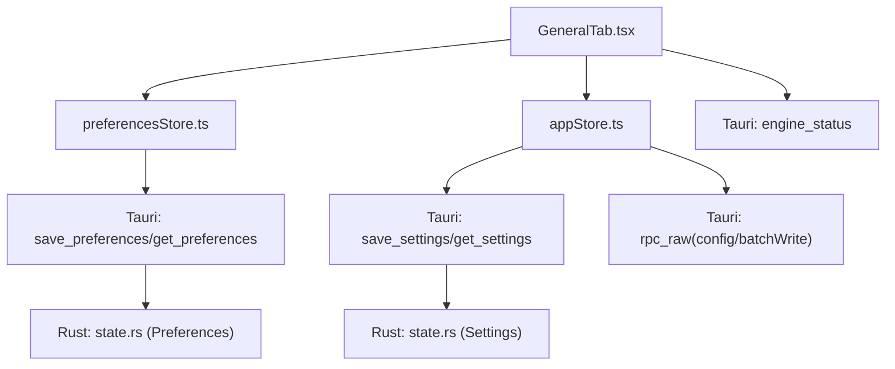
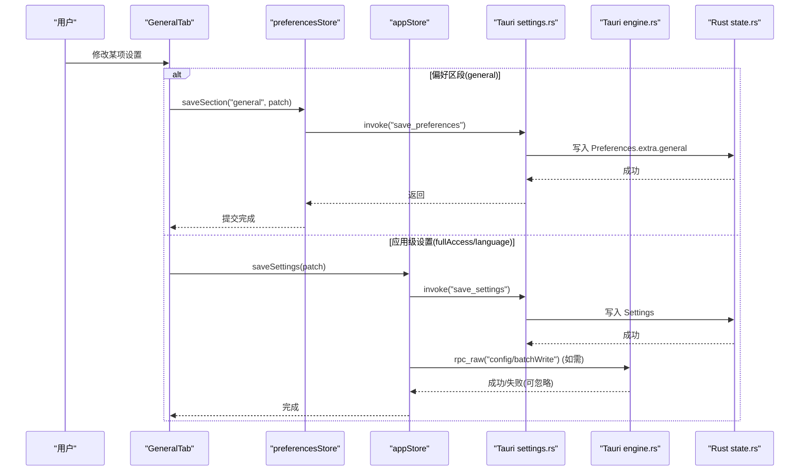
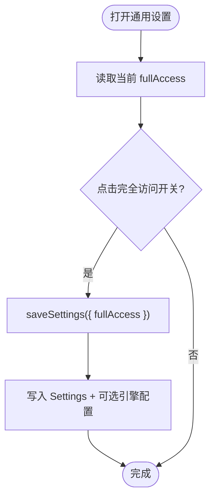
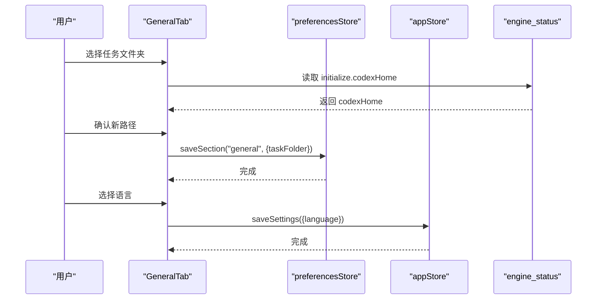
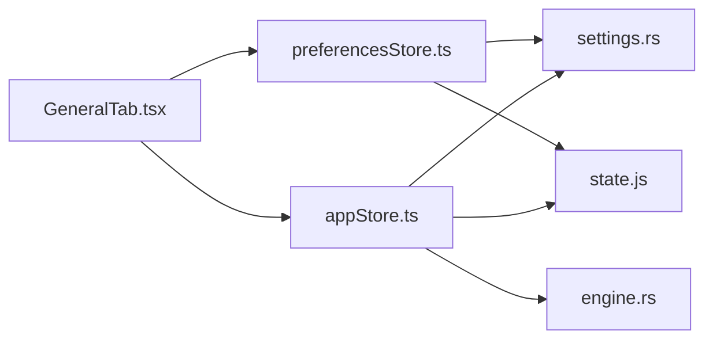

# 通用设置页面

<cite>
**本文引用的文件**
- [GeneralTab.tsx](file://frontend/app/views/settings/tabs/GeneralTab.tsx)
- [preferencesStore.ts](file://frontend/app/state/preferencesStore.ts)
- [appStore.ts](file://frontend/app/state/appStore.ts)
- [settings.rs](file://src-tauri/src/commands/settings.rs)
- [engine.rs](file://src-tauri/src/commands/engine.rs)
- [state.rs](file://src-tauri/src/state.rs)
- [notificationReducer.ts](file://frontend/app/state/notificationReducer.ts)
- [settings-general.css](file://frontend/app/styles/settings-general.css)
- [state.js](file://frontend/src/js/state.js)
</cite>

## 目录
1. [简介](#简介)
2. [项目结构](#项目结构)
3. [核心组件](#核心组件)
4. [架构总览](#架构总览)
5. [详细组件分析](#详细组件分析)
6. [依赖关系分析](#依赖关系分析)
7. [性能考虑](#性能考虑)
8. [故障排查指南](#故障排查指南)
9. [结论](#结论)
10. [附录](#附录)

## 简介
本文件为 Codex-Tauri 的“通用设置”页面提供完整技术文档，覆盖权限管理、常规设置、编辑器配置、弹出窗口设置、通知系统以及趣味实验功能。重点说明各项设置的验证规则、数据持久化机制、用户交互流程，以及与引擎状态的实时同步和动态更新机制。

## 项目结构
通用设置页面由前端 React 组件与后端 Tauri 命令共同实现：
- 前端：GeneralTab 负责 UI 渲染与用户交互；preferencesStore 负责偏好区段（general）的本地合并与持久化；appStore 负责应用级设置（如 fullAccess、language）的读写与引擎配置写入。
- 后端：settings.rs 暴露 get/save settings/preferences 等命令；engine.rs 提供 engine_status 查询引擎初始化信息（用于显示无项目任务文件夹默认路径）。

图表来源
- [GeneralTab.tsx:93-428](file://frontend/app/views/settings/tabs/GeneralTab.tsx#L93-L428)
- [preferencesStore.ts:45-88](file://frontend/app/state/preferencesStore.ts#L45-L88)
- [appStore.ts:446-511](file://frontend/app/state/appStore.ts#L446-L511)
- [engine.rs:22-28](file://src-tauri/src/commands/engine.rs#L22-L28)
- [settings.rs:8-52](file://src-tauri/src/commands/settings.rs#L8-L52)
- [state.rs:176-217](file://src-tauri/src/state.rs#L176-L217)

章节来源
- [GeneralTab.tsx:93-428](file://frontend/app/views/settings/tabs/GeneralTab.tsx#L93-L428)
- [preferencesStore.ts:45-88](file://frontend/app/state/preferencesStore.ts#L45-L88)
- [appStore.ts:446-511](file://frontend/app/state/appStore.ts#L446-L511)
- [engine.rs:22-28](file://src-tauri/src/commands/engine.rs#L22-L28)
- [settings.rs:8-52](file://src-tauri/src/commands/settings.rs#L8-L52)
- [state.rs:176-217](file://src-tauri/src/state.rs#L176-L217)

## 核心组件
- GeneralTab：按区块组织权限、常规、编辑器、弹出窗口、通知、趣味实验等设置项，统一通过 patch/saveSection/saveSettings 进行持久化或生效。
- preferencesStore：维护 per-section 的偏好映射，支持增量保存与回退到默认值。
- appStore：集中管理应用级设置（fullAccess、language、activeModel 等），并负责将关键设置写入引擎配置。
- Rust 命令层：settings.rs 提供设置/偏好读写；engine.rs 提供 engine_status 查询引擎元信息。
- 状态持久化：state.rs 定义 Settings/Preferences 结构体及 shell-state.json 的序列化/反序列化。

章节来源
- [GeneralTab.tsx:93-428](file://frontend/app/views/settings/tabs/GeneralTab.tsx#L93-L428)
- [preferencesStore.ts:1-94](file://frontend/app/state/preferencesStore.ts#L1-L94)
- [appStore.ts:446-511](file://frontend/app/state/appStore.ts#L446-L511)
- [settings.rs:8-52](file://src-tauri/src/commands/settings.rs#L8-L52)
- [engine.rs:22-28](file://src-tauri/src/commands/engine.rs#L22-L28)
- [state.rs:27-64](file://src-tauri/src/state.rs#L27-L64)

## 架构总览
通用设置页面的数据流遵循“前端交互 → 本地状态 → 持久化/引擎配置”的路径：
- 普通偏好项（如 integratedShell、sendShortcut、followUpMode 等）通过 preferencesStore.saveSection 写入 Preferences.general，最终落盘到 shell-state.json。
- 应用级设置（如 fullAccess、language）通过 appStore.saveSettings 写入 Settings，并可能触发引擎配置 batchWrite 以影响引擎行为。
- 引擎相关展示（如无项目任务文件夹默认路径）通过 engine_status 读取 initialize.codexHome 并回显。

图表来源
- [GeneralTab.tsx:111-118](file://frontend/app/views/settings/tabs/GeneralTab.tsx#L111-L118)
- [preferencesStore.ts:76-88](file://frontend/app/state/preferencesStore.ts#L76-L88)
- [settings.rs:18-52](file://src-tauri/src/commands/settings.rs#L18-L52)
- [appStore.ts:446-511](file://frontend/app/state/appStore.ts#L446-L511)
- [engine.rs:22-28](file://src-tauri/src/commands/engine.rs#L22-L28)
- [state.rs:176-217](file://src-tauri/src/state.rs#L176-L217)

## 详细组件分析

### 权限管理（默认权限与完全访问控制）
- 默认权限：UI 上始终禁用且不可更改，仅作为提示存在。
- 完全访问：通过 Switch 切换，调用 saveSettings({ fullAccess }) 写入 Settings.fullAccess，并在必要时触发引擎配置更新。
- 说明文案包含“了解更多”链接，指向官方沙箱概念页。

验证规则
- fullAccess 为布尔值，直接透传至后端 Settings。
- 默认权限开关 disabled，不产生任何写操作。

数据持久化
- 通过 settings.rs 的 save_settings 命令写入 Rust Settings，并持久化到 shell-state.json。

用户交互流程
- 点击“完全访问”开关 → 调用 saveSettings → 更新本地状态 → 可选地调用引擎配置批量写入。

图表来源
- [GeneralTab.tsx:158-184](file://frontend/app/views/settings/tabs/GeneralTab.tsx#L158-L184)
- [appStore.ts:446-511](file://frontend/app/state/appStore.ts#L446-L511)
- [settings.rs:18-33](file://src-tauri/src/commands/settings.rs#L18-L33)

章节来源
- [GeneralTab.tsx:158-184](file://frontend/app/views/settings/tabs/GeneralTab.tsx#L158-L184)
- [appStore.ts:446-511](file://frontend/app/state/appStore.ts#L446-L511)
- [settings.rs:18-33](file://src-tauri/src/commands/settings.rs#L18-L33)

### 常规设置（任务文件夹、文件打开方式、集成终端 Shell、语言选择）
- 无项目任务文件夹：首次加载时调用 engine_status 获取 initialize.codexHome 作为默认值；用户可通过原生对话框选择新路径并保存到 general.taskFolder。
- 文件打开方式：下拉选择 default/chrome/edge/firefox，保存到 general.fileOpenWith。
- 集成终端 Shell：下拉选择 powershell/windowspowershell/cmd/gitbash，保存到 general.integratedShell。
- 语言：下拉选择语言，调用 saveSettings({ language }) 即时生效并同步到旧版 i18n。

验证规则
- taskFolder 为空时回退到 codexHome；否则使用用户选择路径。
- fileOpenWith 与 integratedShell 为枚举值集合内的字符串。
- language 必须来自语言选项列表。

数据持久化
- 任务文件夹、文件打开方式、终端 Shell 通过 preferencesStore.saveSection 写入 Preferences.general。
- 语言通过 appStore.saveSettings 写入 Settings.language，并触发引擎配置更新（若需要）。

用户交互流程
- 选择任务文件夹 → 调用 pickProjectDirectory → 保存 general.taskFolder。
- 选择文件打开方式/终端 Shell → 保存对应 general.*。
- 选择语言 → 保存 Settings.language 并刷新界面语言。

图表来源
- [GeneralTab.tsx:99-118](file://frontend/app/views/settings/tabs/GeneralTab.tsx#L99-L118)
- [GeneralTab.tsx:186-282](file://frontend/app/views/settings/tabs/GeneralTab.tsx#L186-L282)
- [engine.rs:22-28](file://src-tauri/src/commands/engine.rs#L22-L28)
- [preferencesStore.ts:76-88](file://frontend/app/state/preferencesStore.ts#L76-L88)
- [appStore.ts:446-511](file://frontend/app/state/appStore.ts#L446-L511)

章节来源
- [GeneralTab.tsx:99-118](file://frontend/app/views/settings/tabs/GeneralTab.tsx#L99-L118)
- [GeneralTab.tsx:186-282](file://frontend/app/views/settings/tabs/GeneralTab.tsx#L186-L282)
- [engine.rs:22-28](file://src-tauri/src/commands/engine.rs#L22-L28)
- [preferencesStore.ts:76-88](file://frontend/app/state/preferencesStore.ts#L76-L88)
- [appStore.ts:446-511](file://frontend/app/state/appStore.ts#L446-L511)

### 编辑器配置（纯文本编辑器、上下文窗口使用显示、发送快捷键、后续处理模式）
- 纯文本编辑器：Switch 切换，保存到 general.plainTextEditor。
- 显示上下文窗口使用情况：Switch 切换，保存到 general.showContextUsage，供 Composer 消费以显示上下文用量。
- 发送快捷键：下拉选择 enter 或 cmdenter，保存到 general.sendShortcut，供 Composer 消费。
- 后续处理模式：Segmented 选择 queue 或 adjust，保存到 general.followUpMode。

验证规则
- 均为受控输入，值域固定。
- sendShortcut 与 showContextUsage 被 Composer 实时消费，无需额外持久化逻辑。

数据持久化
- 全部通过 preferencesStore.saveSection 写入 Preferences.general。

用户交互流程
- 切换/选择后即时保存，界面立即反映变化。

章节来源
- [GeneralTab.tsx:284-330](file://frontend/app/views/settings/tabs/GeneralTab.tsx#L284-L330)
- [preferencesStore.ts:76-88](file://frontend/app/state/preferencesStore.ts#L76-L88)

### 弹出窗口设置（弹出快捷键、独立聊天默认行为）
- 弹出快捷键：下拉选择 off/ctrl+shift+space/alt+space/ctrl+alt+space，保存到 general.popoutShortcut。
- 独立聊天默认行为：Switch 切换，保存到 general.standaloneChat。

验证规则
- popoutShortcut 为预定义值集合。
- standaloneChat 为布尔值。

数据持久化
- 通过 preferencesStore.saveSection 写入 Preferences.general。

用户交互流程
- 选择/切换后立即保存，下次启动保持该行为。

章节来源
- [GeneralTab.tsx:332-361](file://frontend/app/views/settings/tabs/GeneralTab.tsx#L332-L361)
- [preferencesStore.ts:76-88](file://frontend/app/state/preferencesStore.ts#L76-L88)

### 通知系统（完成通知、权限通知、问题通知）
- 回合完成通知：下拉 never/unfocused/always，保存到 general.turnNotifications。
- 启用权限通知：Switch，保存到 general.permissionNotifications。
- 启用问题通知：Switch，保存到 general.questionNotifications。

验证规则
- turnNotifications 为枚举值集合。
- permissionNotifications/questionNotifications 为布尔值。

数据持久化
- 通过 preferencesStore.saveSection 写入 Preferences.general。

用户交互流程
- 修改后即时保存，影响通知策略。

章节来源
- [GeneralTab.tsx:363-400](file://frontend/app/views/settings/tabs/GeneralTab.tsx#L363-L400)
- [preferencesStore.ts:76-88](file://frontend/app/state/preferencesStore.ts#L76-L88)

### 趣味实验功能（彩纸炮效果）
- 彩纸炮：Switch 切换，保存到 general.confetti，用于开启趣味动效。

验证规则
- confetti 为布尔值。

数据持久化
- 通过 preferencesStore.saveSection 写入 Preferences.general。

用户交互流程
- 切换后即时保存，下次会话生效。

章节来源
- [GeneralTab.tsx:402-409](file://frontend/app/views/settings/tabs/GeneralTab.tsx#L402-L409)
- [preferencesStore.ts:76-88](file://frontend/app/state/preferencesStore.ts#L76-L88)

### 开源许可证查看
- 点击“查看”按钮，在模态框中展示内嵌的 LICENSES.md 文本。

用户交互流程
- 打开模态 → 展示文本 → 关闭模态。

章节来源
- [GeneralTab.tsx:265-281](file://frontend/app/views/settings/tabs/GeneralTab.tsx#L265-L281)
- [GeneralTab.tsx:411-424](file://frontend/app/views/settings/tabs/GeneralTab.tsx#L411-L424)

## 依赖关系分析
- GeneralTab 依赖：
  - preferencesStore：用于 general 区段的增量保存。
  - appStore：用于 fullAccess/language 等应用级设置与引擎配置写入。
  - engine.rs：用于读取引擎初始化信息（codexHome）。
- preferencesStore 依赖：
  - Tauri settings.rs：get/save_preferences。
  - state.js：默认偏好合并逻辑。
- appStore 依赖：
  - Tauri settings.rs：get/save_settings。
  - engine.rs：rpc_raw(config/batchWrite)。
  - state.js：旧版设置合并与语言同步。

图表来源
- [GeneralTab.tsx:93-428](file://frontend/app/views/settings/tabs/GeneralTab.tsx#L93-L428)
- [preferencesStore.ts:1-94](file://frontend/app/state/preferencesStore.ts#L1-L94)
- [appStore.ts:446-511](file://frontend/app/state/appStore.ts#L446-L511)
- [settings.rs:8-52](file://src-tauri/src/commands/settings.rs#L8-L52)
- [engine.rs:22-28](file://src-tauri/src/commands/engine.rs#L22-L28)
- [state.js:60-136](file://frontend/src/js/state.js#L60-L136)

章节来源
- [GeneralTab.tsx:93-428](file://frontend/app/views/settings/tabs/GeneralTab.tsx#L93-L428)
- [preferencesStore.ts:1-94](file://frontend/app/state/preferencesStore.ts#L1-L94)
- [appStore.ts:446-511](file://frontend/app/state/appStore.ts#L446-L511)
- [settings.rs:8-52](file://src-tauri/src/commands/settings.rs#L8-L52)
- [engine.rs:22-28](file://src-tauri/src/commands/engine.rs#L22-L28)
- [state.js:60-136](file://frontend/src/js/state.js#L60-L136)

## 性能考虑
- 偏好保存采用先本地提交再异步持久化的策略，确保 UI 即时响应，避免阻塞。
- 引擎配置写入失败会被记录警告但不影响 shell store 的保存，保证 UI 可用性。
- 语言切换会同步到旧版 i18n，减少重复计算。

[本节为通用指导，不直接分析具体文件]

## 故障排查指南
- 无法读取任务文件夹默认路径：检查 engine_status 是否可用；若引擎离线，将回退到已存储的 override。
- 保存偏好失败：preferencesStore 会捕获错误并打印日志；检查 Tauri 权限与后端服务状态。
- 应用级设置未生效：确认 saveSettings 成功；若引擎离线，batchWrite 会失败但 shell store 仍保存。
- 通知未触发：确认通知相关偏好已正确保存；检查通知处理器是否覆盖对应方法。

章节来源
- [GeneralTab.tsx:103-109](file://frontend/app/views/settings/tabs/GeneralTab.tsx#L103-L109)
- [preferencesStore.ts:76-88](file://frontend/app/state/preferencesStore.ts#L76-L88)
- [appStore.ts:446-511](file://frontend/app/state/appStore.ts#L446-L511)
- [notificationReducer.ts:189-445](file://frontend/app/state/notificationReducer.ts#L189-L445)

## 结论
通用设置页面通过清晰的前后端职责划分，实现了权限、常规、编辑器、弹出窗口、通知与趣味实验等多类设置的可视化配置。偏好项通过 preferencesStore 持久化，应用级设置通过 appStore 同时更新 shell store 与引擎配置，确保设置的一致性与实时性。引擎状态查询增强了用户体验（如任务文件夹默认路径）。整体设计兼顾了健壮性与可维护性。

[本节为总结，不直接分析具体文件]

## 附录
- 样式：settings-general.css 定义了路径显示、内联链接、弹出快捷键触发器、许可证模态框等样式。
- 通知：notificationReducer.ts 负责将服务器通知映射到内部状态，确保 UI 能正确响应各类事件。

章节来源
- [settings-general.css:1-77](file://frontend/app/styles/settings-general.css#L1-L77)
- [notificationReducer.ts:189-445](file://frontend/app/state/notificationReducer.ts#L189-L445)