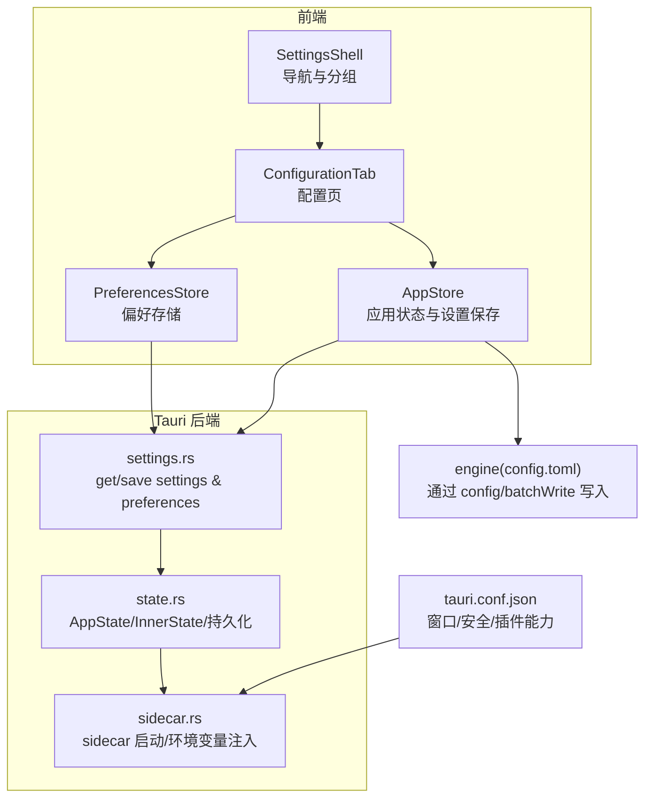
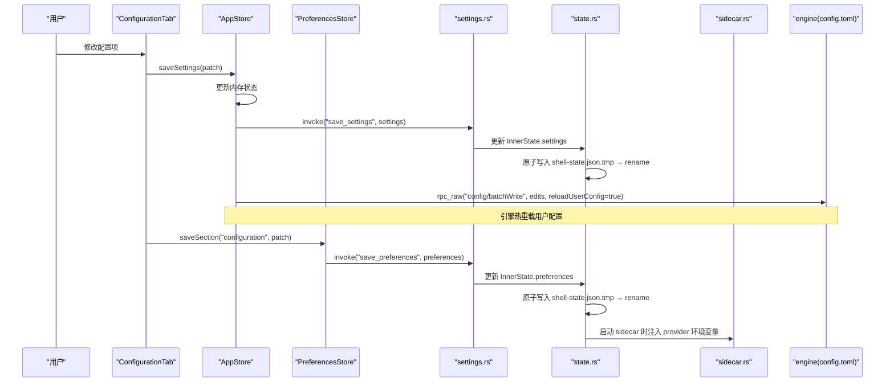
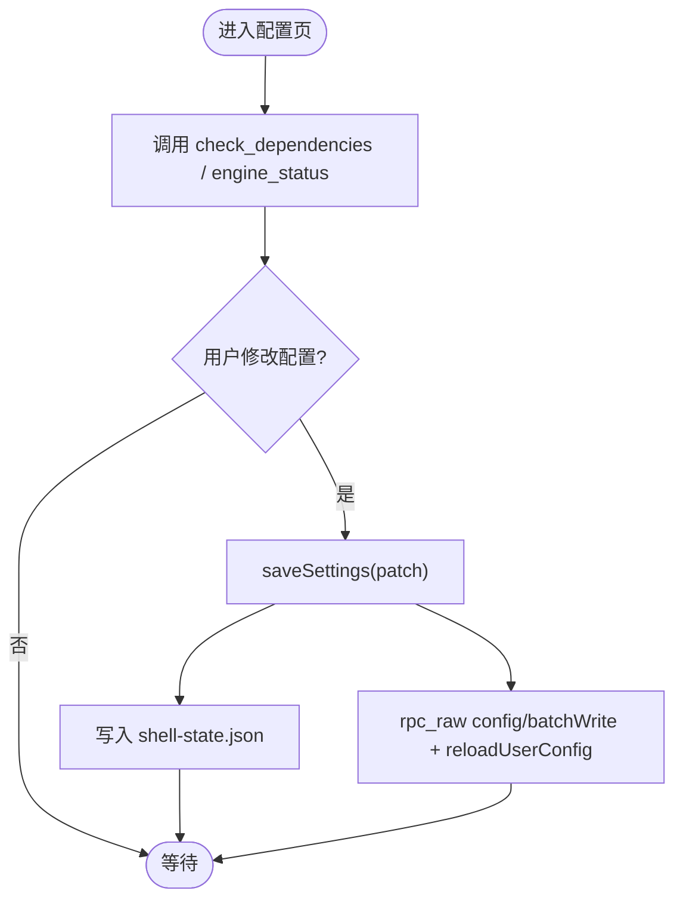
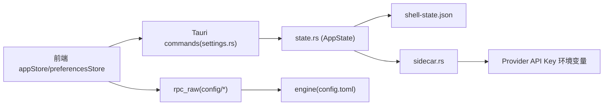

# 配置设置页面

<cite>
**本文引用的文件**
- [frontend/app/views/settings/SettingsShell.tsx](file://frontend/app/views/settings/SettingsShell.tsx)
- [frontend/app/views/settings/tabs/ConfigurationTab.tsx](file://frontend/app/views/settings/tabs/ConfigurationTab.tsx)
- [frontend/app/views/settings/sections.ts](file://frontend/app/views/settings/sections.ts)
- [frontend/app/state/preferencesStore.ts](file://frontend/app/state/preferencesStore.ts)
- [frontend/app/state/appStore.ts](file://frontend/app/state/appStore.ts)
- [src-tauri/src/commands/settings.rs](file://src-tauri/src/commands/settings.rs)
- [src-tauri/src/state.rs](file://src-tauri/src/state.rs)
- [src-tauri/src/codex/sidecar.rs](file://src-tauri/src/codex/sidecar.rs)
- [src-tauri/tauri.conf.json](file://src-tauri/tauri.conf.json)
- [frontend/app/views/settings/tabs/PluginsTab.tsx](file://frontend/app/views/settings/tabs/PluginsTab.tsx)
- [frontend/app/views/settings/tabs/ImportTab.tsx](file://frontend/app/views/settings/tabs/ImportTab.tsx)
</cite>

## 目录
1. [简介](#简介)
2. [项目结构](#项目结构)
3. [核心组件](#核心组件)
4. [架构总览](#架构总览)
5. [详细组件分析](#详细组件分析)
6. [依赖关系分析](#依赖关系分析)
7. [性能考虑](#性能考虑)
8. [故障排查指南](#故障排查指南)
9. [结论](#结论)
10. [附录](#附录)

## 简介
本文件面向 Codex-Tauri 的“配置设置页面”，系统性说明高级配置选项、开发者与调试模式、系统级配置管理，以及配置文件结构定义、环境变量注入、运行时配置热重载机制。文档还涵盖配置验证、默认值管理与版本兼容性处理，并提供插件扩展与自定义配置项的开发指南。

## 项目结构
设置页由前端 React Shell 与 Rust Tauri 后端共同实现：
- 前端负责导航、UI 渲染、用户交互与本地偏好存储（preferences）。
- 后端负责持久化 shell 状态（shell-state.json）、提供 RPC 调用以读写引擎配置（config.toml），并管理 sidecar（codex-app-server）生命周期与环境变量注入。

图表来源
- [frontend/app/views/settings/SettingsShell.tsx:66-162](file://frontend/app/views/settings/SettingsShell.tsx#L66-L162)
- [frontend/app/views/settings/tabs/ConfigurationTab.tsx:75-321](file://frontend/app/views/settings/tabs/ConfigurationTab.tsx#L75-L321)
- [frontend/app/state/preferencesStore.ts:20-88](file://frontend/app/state/preferencesStore.ts#L20-L88)
- [frontend/app/state/appStore.ts:446-511](file://frontend/app/state/appStore.ts#L446-L511)
- [src-tauri/src/commands/settings.rs:8-68](file://src-tauri/src/commands/settings.rs#L8-L68)
- [src-tauri/src/state.rs:150-231](file://src-tauri/src/state.rs#L150-L231)
- [src-tauri/src/codex/sidecar.rs:31-125](file://src-tauri/src/codex/sidecar.rs#L31-L125)
- [src-tauri/tauri.conf.json:1-61](file://src-tauri/tauri.conf.json#L1-L61)

章节来源
- [frontend/app/views/settings/SettingsShell.tsx:66-162](file://frontend/app/views/settings/SettingsShell.tsx#L66-L162)
- [frontend/app/views/settings/sections.ts:44-86](file://frontend/app/views/settings/sections.ts#L44-L86)

## 核心组件
- SettingsShell：设置页外壳，负责侧边栏分组、搜索过滤、路由切换与内容区挂载。
- ConfigurationTab：配置页主体，包含智能体默认设置、模型功能、工作空间依赖项等区块；通过 saveSettings 将变更同步到 shell 状态与引擎配置。
- PreferencesStore：偏好存储层，按 section 维度合并、持久化偏好；未知 section 通过后端 extra 字段保留，支持无后端改动的扩展。
- AppStore：应用状态与设置保存；saveSettings 同时写 shell-state.json 与 engine config.toml（通过 rpc_raw config/batchWrite）。
- settings.rs：暴露 get_settings/save_settings/get_preferences/save_preferences/list_shortcuts/save_shortcuts 等命令。
- state.rs：定义 Settings/Preferences 等数据结构，负责加载默认值、持久化到 shell-state.json，以及 provider 密钥与环境键映射。
- sidecar.rs：启动 codex-app-server，注入 provider API Key 为环境变量，传递监听地址与会话源参数。
- tauri.conf.json：窗口与安全策略、插件能力（shell.open、fs）等。

章节来源
- [frontend/app/views/settings/tabs/ConfigurationTab.tsx:75-321](file://frontend/app/views/settings/tabs/ConfigurationTab.tsx#L75-L321)
- [frontend/app/state/preferencesStore.ts:20-88](file://frontend/app/state/preferencesStore.ts#L20-L88)
- [frontend/app/state/appStore.ts:446-511](file://frontend/app/state/appStore.ts#L446-L511)
- [src-tauri/src/commands/settings.rs:8-68](file://src-tauri/src/commands/settings.rs#L8-L68)
- [src-tauri/src/state.rs:27-64](file://src-tauri/src/state.rs#L27-L64)
- [src-tauri/src/codex/sidecar.rs:31-125](file://src-tauri/src/codex/sidecar.rs#L31-L125)
- [src-tauri/tauri.conf.json:29-59](file://src-tauri/tauri.conf.json#L29-L59)

## 架构总览
配置设置页面的数据流遵循“前端 UI → 状态层 → Tauri 命令 → 后端状态 → 引擎配置”的路径，关键路径如下：
- 用户操作触发 saveSettings，先更新前端内存状态，再并发调用：
  - save_settings（Rust 命令）→ 写入 shell-state.json
  - rpc_raw("config/batchWrite") → 写入 engine 的 config.toml，并请求 reloadUserConfig
- 偏好设置通过 saveSection 写入 preferences，后端使用 flatten 的 extra 字段保持未知 section 兼容。
- Provider 密钥不落地明文，而是以环境变量形式在 sidecar 启动时注入。

图表来源
- [frontend/app/state/appStore.ts:446-511](file://frontend/app/state/appStore.ts#L446-L511)
- [src-tauri/src/commands/settings.rs:18-52](file://src-tauri/src/commands/settings.rs#L18-L52)
- [src-tauri/src/state.rs:176-217](file://src-tauri/src/state.rs#L176-L217)
- [src-tauri/src/codex/sidecar.rs:53-80](file://src-tauri/src/codex/sidecar.rs#L53-L80)

## 详细组件分析

### 设置外壳与导航（SettingsShell）
- 提供侧边栏分组与搜索过滤，点击链接通过路由切换到具体 Tab。
- 当前仅启用 account 标签，其他标签显示占位提示，引导至自定义供应商配置。

章节来源
- [frontend/app/views/settings/SettingsShell.tsx:66-162](file://frontend/app/views/settings/SettingsShell.tsx#L66-L162)
- [frontend/app/views/settings/sections.ts:44-86](file://frontend/app/views/settings/sections.ts#L44-L86)

### 配置页（ConfigurationTab）
- 智能体默认设置：审批策略、沙箱模式、网络搜索、输出详细度、推理摘要等，均通过 saveSettings 同步到 shell 与引擎配置。
- 模型功能：推理强度多选（reasoningLevels）保存在 preferences；Ultra 开关当前禁用（上游控制）。
- 工作空间依赖项：诊断通过 check_dependencies 获取依赖状态；重装按钮暂不可用；当前版本来自 engine_status。
- 打开 config.toml：通过 rpc_raw("config/read") 获取路径并使用 shell 插件打开。

图表来源
- [frontend/app/views/settings/tabs/ConfigurationTab.tsx:75-321](file://frontend/app/views/settings/tabs/ConfigurationTab.tsx#L75-L321)
- [frontend/app/state/appStore.ts:446-511](file://frontend/app/state/appStore.ts#L446-L511)

章节来源
- [frontend/app/views/settings/tabs/ConfigurationTab.tsx:75-321](file://frontend/app/views/settings/tabs/ConfigurationTab.tsx#L75-L321)

### 偏好存储（PreferencesStore）
- 按 section 维度维护偏好，合并默认值后提交到后端。
- 后端 Preferences.extra 使用 flatten，允许新增 section 无需后端改动，保证向前兼容。

章节来源
- [frontend/app/state/preferencesStore.ts:20-88](file://frontend/app/state/preferencesStore.ts#L20-L88)
- [src-tauri/src/state.rs:49-64](file://src-tauri/src/state.rs#L49-L64)

### 应用状态与设置保存（AppStore）
- saveSettings 双写：
  - 本地 shell 状态（shell-state.json）
  - 引擎配置（config.toml），通过 batchWrite 指定 keyPath/value/mergeStrategy，并开启 reloadUserConfig 实现热重载。
- normaliseSettings 兼容 camelCase 与 snake_case 字段，提升前后端版本兼容性。

章节来源
- [frontend/app/state/appStore.ts:410-511](file://frontend/app/state/appStore.ts#L410-L511)

### 后端命令（settings.rs）
- 暴露 get/save settings 与 get/save preferences、list/save shortcuts 等命令。
- save_settings 中若 active_provider_id 变化，会通知 AdapterState 切换活动提供者。

章节来源
- [src-tauri/src/commands/settings.rs:8-68](file://src-tauri/src/commands/settings.rs#L8-L68)

### 状态与持久化（state.rs）
- Settings 与 Preferences 结构定义，含默认值填充逻辑（如 theme/language/app_server_listen）。
- 原子写入 shell-state.json（先写 .tmp 再 rename），避免损坏。
- provider_secrets/provider_protocols/provider_endpoints 用于适配器与 sidecar 环境注入。

章节来源
- [src-tauri/src/state.rs:27-64](file://src-tauri/src/state.rs#L27-L64)
- [src-tauri/src/state.rs:176-217](file://src-tauri/src/state.rs#L176-L217)

### Sidecar 与环境变量注入（sidecar.rs）
- 启动 codex-app-server 时，从 AppState 读取 provider_secrets，生成环境变量名（provider_env_key），注入子进程。
- 支持通过 CODEX_APP_SERVER 环境变量或 settings.app_server_binary 覆盖二进制路径。
- 通过 CLI 探测决定多调用入口或独立二进制，并决定是否传递 --session-source。

章节来源
- [src-tauri/src/codex/sidecar.rs:31-125](file://src-tauri/src/codex/sidecar.rs#L31-L125)
- [src-tauri/src/state.rs:8-25](file://src-tauri/src/state.rs#L8-L25)

### Tauri 配置（tauri.conf.json）
- 窗口尺寸、最小尺寸、全屏、装饰、拖拽等。
- 安全策略：CSP 为空，资源协议启用。
- 插件能力：shell.open、fs 的 requireLiteralLeadingDot 关闭。

章节来源
- [src-tauri/tauri.conf.json:1-61](file://src-tauri/tauri.conf.json#L1-L61)

## 依赖关系分析
- 前端依赖：
  - @tauri-apps/api/core.invoke 调用后端命令与 RPC。
  - 本地状态通过 useSyncExternalStore 订阅更新。
- 后端依赖：
  - serde_json 序列化/反序列化。
  - dirs crate 定位配置目录。
  - tokio broadcast 转发 sidecar 事件。
- 外部集成：
  - engine 通过 rpc_raw 暴露 config 相关方法（read、batchWrite）。
  - 插件能力（shell.open）用于打开配置文件。

图表来源
- [frontend/app/state/appStore.ts:446-511](file://frontend/app/state/appStore.ts#L446-L511)
- [src-tauri/src/commands/settings.rs:18-52](file://src-tauri/src/commands/settings.rs#L18-L52)
- [src-tauri/src/state.rs:176-217](file://src-tauri/src/state.rs#L176-L217)
- [src-tauri/src/codex/sidecar.rs:53-80](file://src-tauri/src/codex/sidecar.rs#L53-L80)

章节来源
- [frontend/app/state/appStore.ts:446-511](file://frontend/app/state/appStore.ts#L446-L511)
- [src-tauri/src/commands/settings.rs:18-52](file://src-tauri/src/commands/settings.rs#L18-L52)
- [src-tauri/src/state.rs:176-217](file://src-tauri/src/state.rs#L176-L217)
- [src-tauri/src/codex/sidecar.rs:53-80](file://src-tauri/src/codex/sidecar.rs#L53-L80)

## 性能考虑
- 配置保存采用原子写入（.tmp + rename），降低损坏风险。
- 引擎配置热重载通过 reloadUserConfig 实现，避免重启应用。
- sidecar 启动前进行 CLI 探测，减少无效参数导致的失败重试。
- 依赖检查与引擎状态查询在页面初始化时异步执行，避免阻塞 UI。

[本节为通用性能建议，不直接分析具体文件]

## 故障排查指南
- 无法连接引擎：
  - 检查 sidecar 是否成功启动与监听端口；查看日志中的 spawn 与 connect 信息。
  - 确认 settings.app_server_listen 与 CODEX_APP_SERVER 环境变量配置正确。
- 配置未生效：
  - 确认 saveSettings 已调用且 batchWrite 返回成功；必要时手动检查 config.toml 对应 keyPath。
  - 若引擎离线，shell 状态仍会保存，但引擎配置写入可能失败，需稍后重试。
- 偏好未持久化：
  - 检查 saveSection 调用与后端 save_preferences 是否成功；注意 unknown sections 会被 extra 保留。
- 打开配置文件失败：
  - 确认 shell 插件 open 能力已启用；检查 config/read 返回的 config_path 是否为有效字符串。

章节来源
- [src-tauri/src/codex/sidecar.rs:195-244](file://src-tauri/src/codex/sidecar.rs#L195-L244)
- [frontend/app/views/settings/tabs/ConfigurationTab.tsx:98-112](file://frontend/app/views/settings/tabs/ConfigurationTab.tsx#L98-L112)
- [frontend/app/state/preferencesStore.ts:76-88](file://frontend/app/state/preferencesStore.ts#L76-L88)

## 结论
Codex-Tauri 的配置设置页面通过清晰的前后端分层与稳健的持久化机制，实现了用户友好的配置体验与可靠的运行时热重载。Provider 密钥通过环境变量注入，确保敏感信息不落盘。Preferences 的 extra 字段设计使新增配置项无需后端改动，具备良好的扩展性与兼容性。

[本节为总结性内容，不直接分析具体文件]

## 附录

### 配置文件结构与字段说明
- shell-state.json（后端持久化）
  - settings：主题、语言、活动提供者/模型、终端 shell、审批策略、沙箱模式、app server 监听地址与二进制路径等。
  - preferences：首选项集合，extra 字段以 flatten 方式承载任意 section。
  - provider_secrets/protocols/endpoints：适配器与 sidecar 所需元数据。
- engine config.toml（通过 batchWrite 编辑）
  - model、model_provider、model_reasoning_effort、approval_policy、sandbox_mode、web_search、model_output_verbosity、model_reasoning_summary 等。

章节来源
- [src-tauri/src/state.rs:27-64](file://src-tauri/src/state.rs#L27-L64)
- [frontend/app/state/appStore.ts:467-500](file://frontend/app/state/appStore.ts#L467-L500)

### 环境变量注入与调试模式
- 环境变量命名规则：CODEX_PROVIDER_{PROVIDER_ID}_API_KEY，其中 PROVIDER_ID 经大小写与非法字符清洗。
- 调试模式：
  - 可通过 CODEX_APP_SERVER 指定 sidecar 二进制路径。
  - 通过 settings.app_server_binary 覆盖二进制路径。
  - 使用 engine_status 与 check_dependencies 辅助诊断。

章节来源
- [src-tauri/src/state.rs:8-25](file://src-tauri/src/state.rs#L8-L25)
- [src-tauri/src/codex/sidecar.rs:17-19](file://src-tauri/src/codex/sidecar.rs#L17-L19)
- [src-tauri/src/codex/sidecar.rs:420-464](file://src-tauri/src/codex/sidecar.rs#L420-L464)

### 配置验证与默认值管理
- 默认值：theme 默认为 light，language 默认为 zh-CN，app_server_listen 默认为 ws://127.0.0.1:17457。
- 验证策略：
  - 前端对输入进行基本校验（如枚举值）。
  - 后端通过 serde default 与结构体约束保障可序列化性。
  - 引擎配置通过 batchWrite 的 keyPath/value/mergeStrategy 精确控制写入。

章节来源
- [src-tauri/src/state.rs:176-207](file://src-tauri/src/state.rs#L176-L207)
- [frontend/app/state/appStore.ts:467-500](file://frontend/app/state/appStore.ts#L467-L500)

### 版本兼容性与迁移
- 字段兼容：normaliseSettings 同时接受 camelCase 与 snake_case，降低前后端版本差异影响。
- 偏好兼容：Preferences.extra 使用 flatten，新增 section 无需后端改动。
- 导入兼容：ImportTab 支持多种导出格式（edits/writes/config 扁平键值），统一转换为标准 edits。

章节来源
- [frontend/app/state/appStore.ts:410-433](file://frontend/app/state/appStore.ts#L410-L433)
- [src-tauri/src/state.rs:49-64](file://src-tauri/src/state.rs#L49-L64)
- [frontend/app/views/settings/tabs/ImportTab.tsx:40-79](file://frontend/app/views/settings/tabs/ImportTab.tsx#L40-L79)

### 插件扩展与自定义配置项开发指南
- 新增偏好 section：
  - 在前端 preferencesStore 中定义新 section 类型并在 UI 中读写。
  - 后端无需改动，因为 extra 字段会保留未知 section。
- 新增引擎配置项：
  - 在 ConfigurationTab 或相应 Tab 中添加控件，并通过 saveSettings 的 edits 写入对应 keyPath。
  - 确保 batchWrite 的 mergeStrategy 合理（通常为 replace）。
- 插件管理：
  - PluginsTab 展示插件与 MCP 服务器列表，支持启用/禁用与测试连接（待 L3 后端完善）。
  - 市场与安装状态通过 market.rs 管理（installed.json/marketplaces.json）。

章节来源
- [frontend/app/state/preferencesStore.ts:76-88](file://frontend/app/state/preferencesStore.ts#L76-L88)
- [frontend/app/state/appStore.ts:467-500](file://frontend/app/state/appStore.ts#L467-L500)
- [frontend/app/views/settings/tabs/PluginsTab.tsx:1-183](file://frontend/app/views/settings/tabs/PluginsTab.tsx#L1-L183)