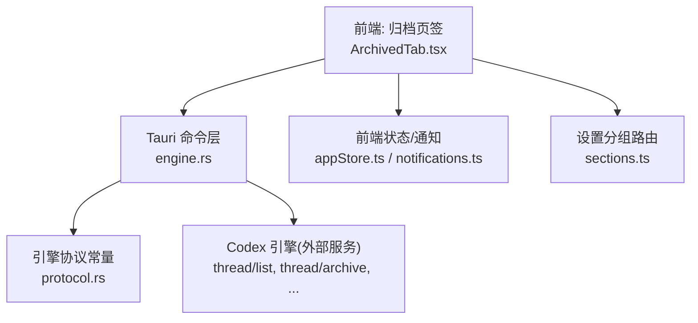
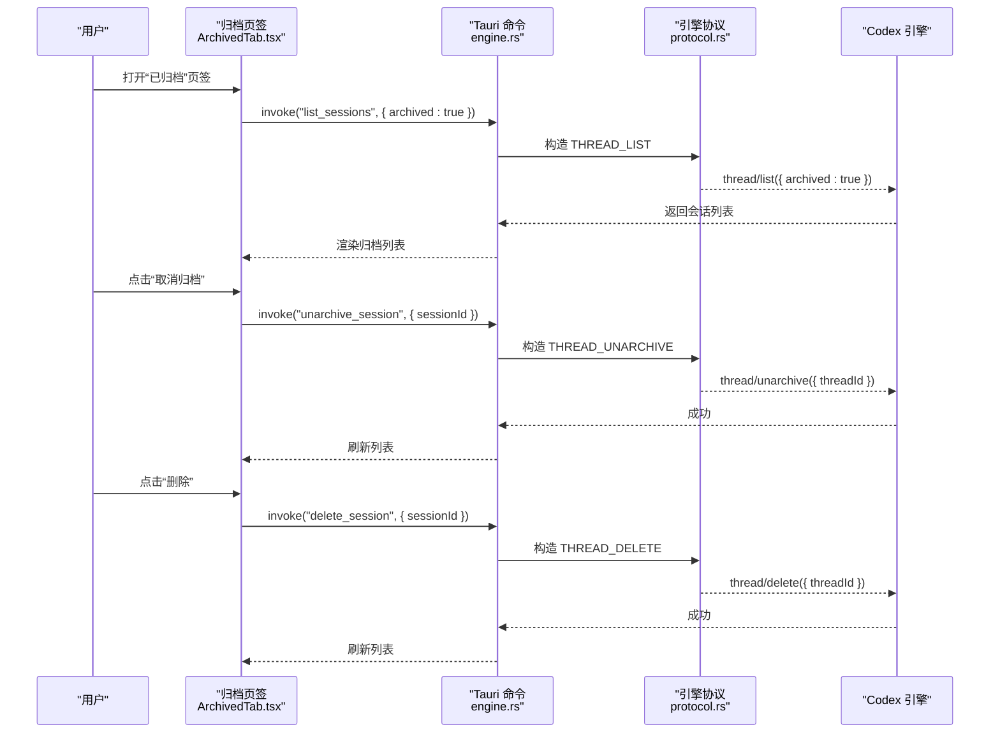
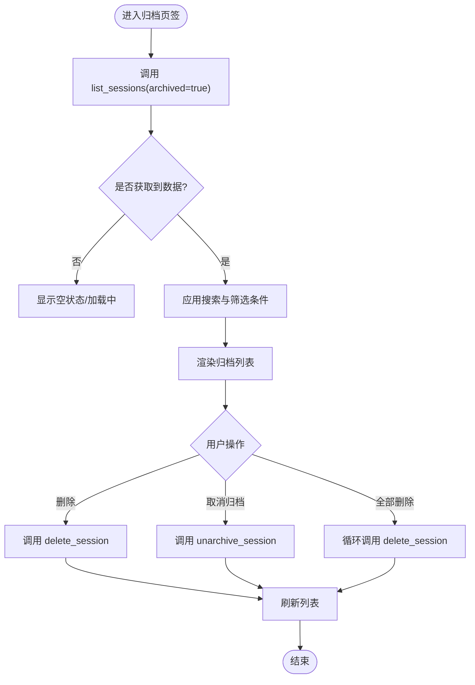
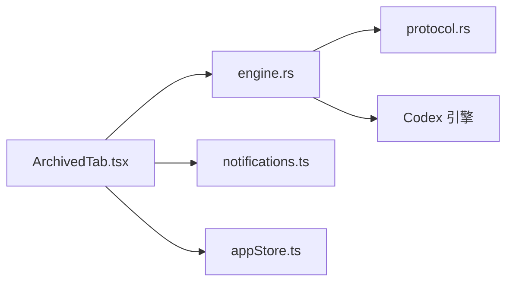

# 归档设置页面

<cite>
**本文引用的文件**
- [ArchivedTab.tsx](file://frontend/app/views/settings/tabs/ArchivedTab.tsx)
- [engine.rs](file://src-tauri/src/commands/engine.rs)
- [protocol.rs](file://src-tauri/src/codex/protocol.rs)
- [sections.ts](file://frontend/app/views/settings/sections.ts)
- [notifications.ts](file://frontend/src/protocol/notifications.ts)
- [appStore.ts](file://frontend/app/state/appStore.ts)
- [state.rs](file://src-tauri/src/state.rs)
</cite>

## 目录
1. [简介](#简介)
2. [项目结构](#项目结构)
3. [核心组件](#核心组件)
4. [架构总览](#架构总览)
5. [详细组件分析](#详细组件分析)
6. [依赖关系分析](#依赖关系分析)
7. [性能考虑](#性能考虑)
8. [故障排查指南](#故障排查指南)
9. [结论](#结论)
10. [附录](#附录)

## 简介
本文件面向 Codex-Tauri 的“归档设置页面”，聚焦 ArchivedTab（已归档任务）的功能与实现。内容涵盖：
- 历史任务的查看、搜索与清理机制
- 归档数据的存储策略、压缩与备份恢复能力说明
- 分类管理、标签系统与过滤条件
- 导出导入功能、数据格式兼容性与迁移工具
- 性能优化建议、存储空间管理与生命周期策略
- 访问权限控制与审计日志能力

## 项目结构
归档设置页面由前端设置页签与后端命令层共同构成，通过 Tauri 命令调用引擎协议完成归档会话的列表、归档/取消归档与删除等操作。

图表来源
- [ArchivedTab.tsx:55-102](file://frontend/app/views/settings/tabs/ArchivedTab.tsx#L55-L102)
- [engine.rs:54-100](file://src-tauri/src/commands/engine.rs#L54-L100)
- [protocol.rs:12-25](file://src-tauri/src/codex/protocol.rs#L12-L25)
- [sections.ts:82-84](file://frontend/app/views/settings/sections.ts#L82-L84)
- [notifications.ts:133-135](file://frontend/src/protocol/notifications.ts#L133-L135)

章节来源
- [ArchivedTab.tsx:1-193](file://frontend/app/views/settings/tabs/ArchivedTab.tsx#L1-L193)
- [engine.rs:54-100](file://src-tauri/src/commands/engine.rs#L54-L100)
- [protocol.rs:12-25](file://src-tauri/src/codex/protocol.rs#L12-L25)
- [sections.ts:82-84](file://frontend/app/views/settings/sections.ts#L82-L84)
- [notifications.ts:133-135](file://frontend/src/protocol/notifications.ts#L133-L135)

## 核心组件
- 归档页签界面（ArchivedTab）
  - 提供“已归档聊天”标题、搜索框、筛选下拉（类型/项目）、分组头与列表项
  - 支持单条删除、批量删除、取消归档
  - 通过 Tauri invoke 调用 list_sessions、unarchive_session、delete_session
- 后端命令层（engine.rs）
  - 将 Tauri 命令转发为引擎 JSON-RPC 方法：thread/list、thread/archive、thread/unarchive、thread/delete
  - 统一错误返回，便于 UI 降级展示
- 协议常量（protocol.rs）
  - 定义 thread/* 系列方法名，确保前后端一致
- 设置分组与路由（sections.ts）
  - 将“归档”作为设置分组下的子项注册
- 通知与状态（notifications.ts、appStore.ts）
  - 订阅 thread/archived、thread/unarchived 等事件，驱动 UI 更新或状态同步

章节来源
- [ArchivedTab.tsx:20-102](file://frontend/app/views/settings/tabs/ArchivedTab.tsx#L20-L102)
- [engine.rs:54-100](file://src-tauri/src/commands/engine.rs#L54-L100)
- [protocol.rs:12-25](file://src-tauri/src/codex/protocol.rs#L12-L25)
- [sections.ts:82-84](file://frontend/app/views/settings/sections.ts#L82-L84)
- [notifications.ts:133-135](file://frontend/src/protocol/notifications.ts#L133-L135)
- [appStore.ts:36-36](file://frontend/app/state/appStore.ts#L36-L36)

## 架构总览
归档流程的关键路径如下：
- 前端加载时调用 list_sessions(archived=true) 获取归档会话列表
- 用户执行“取消归档”或“删除”时，分别调用 unarchive_session 或 delete_session
- 后端命令层将请求映射到引擎的 thread/unarchive 或 thread/delete
- 引擎处理完成后，可能触发 thread/archived 或 thread/unarchived 通知，前端据此刷新状态

图表来源
- [ArchivedTab.tsx:55-102](file://frontend/app/views/settings/tabs/ArchivedTab.tsx#L55-L102)
- [engine.rs:54-100](file://src-tauri/src/commands/engine.rs#L54-L100)
- [protocol.rs:12-25](file://src-tauri/src/codex/protocol.rs#L12-L25)

## 详细组件分析

### 归档页签（ArchivedTab）
- 功能特性
  - 历史任务查看：通过 list_sessions(archived=true) 拉取归档会话并渲染
  - 搜索：基于标题进行本地模糊匹配
  - 筛选：按“类型”和“项目”两个维度进行过滤
  - 清理：支持单条删除与批量删除；支持取消归档回到活跃会话
- 数据结构
  - 会话对象包含 id、title、updatedAt、project 等字段，用于显示与过滤
- 交互流程
  - 初始化时刷新列表
  - 操作成功后统一 refresh() 刷新视图
  - 失败时记录警告日志并继续

图表来源
- [ArchivedTab.tsx:55-102](file://frontend/app/views/settings/tabs/ArchivedTab.tsx#L55-L102)

章节来源
- [ArchivedTab.tsx:20-193](file://frontend/app/views/settings/tabs/ArchivedTab.tsx#L20-L193)

### 后端命令层（engine.rs）
- 职责
  - 将 Tauri 命令映射为引擎 JSON-RPC 方法：thread/list、thread/archive、thread/unarchive、thread/delete
  - 对返回值进行必要扁平化处理，保证 UI 可稳定读取字段
- 错误处理
  - 未知或可选端点返回结构化错误，使 UI 能优雅降级

章节来源
- [engine.rs:54-100](file://src-tauri/src/commands/engine.rs#L54-L100)

### 协议常量（protocol.rs）
- 作用
  - 集中定义 thread/* 系列方法名，避免硬编码字符串散落各处
- 关键常量
  - thread/list、thread/archive、thread/unarchive、thread/delete 等

章节来源
- [protocol.rs:12-25](file://src-tauri/src/codex/protocol.rs#L12-L25)

### 设置分组与路由（sections.ts）
- 作用
  - 将“归档”作为设置分组下的子项注册，提供导航入口

章节来源
- [sections.ts:82-84](file://frontend/app/views/settings/sections.ts#L82-L84)

### 通知与状态（notifications.ts、appStore.ts）
- 通知
  - 订阅 thread/archived、thread/unarchived 等事件，用于在状态变化时刷新或提示
- 状态
  - appStore 中维护 archived 字段，参与会话列表过滤与展示逻辑

章节来源
- [notifications.ts:133-135](file://frontend/src/protocol/notifications.ts#L133-L135)
- [appStore.ts:36-36](file://frontend/app/state/appStore.ts#L36-L36)

## 依赖关系分析
- 前端依赖
  - ArchivedTab 依赖 Tauri invoke 接口与 i18n 文本
  - 使用 Dropdown、SettingsButton 等基础组件构建界面
- 后端依赖
  - engine.rs 依赖 EngineHandle 与 protocol 常量，将命令转发至引擎
- 运行时依赖
  - 引擎侧负责会话的持久化、归档状态变更及通知推送

图表来源
- [ArchivedTab.tsx:55-102](file://frontend/app/views/settings/tabs/ArchivedTab.tsx#L55-L102)
- [engine.rs:54-100](file://src-tauri/src/commands/engine.rs#L54-L100)
- [protocol.rs:12-25](file://src-tauri/src/codex/protocol.rs#L12-L25)
- [notifications.ts:133-135](file://frontend/src/protocol/notifications.ts#L133-L135)
- [appStore.ts:36-36](file://frontend/app/state/appStore.ts#L36-L36)

章节来源
- [ArchivedTab.tsx:55-102](file://frontend/app/views/settings/tabs/ArchivedTab.tsx#L55-L102)
- [engine.rs:54-100](file://src-tauri/src/commands/engine.rs#L54-L100)
- [protocol.rs:12-25](file://src-tauri/src/codex/protocol.rs#L12-L25)
- [notifications.ts:133-135](file://frontend/src/protocol/notifications.ts#L133-L135)
- [appStore.ts:36-36](file://frontend/app/state/appStore.ts#L36-L36)

## 性能考虑
- 列表加载
  - 仅在进入页签时拉取一次，后续通过操作后刷新，减少重复网络开销
- 本地过滤
  - 搜索与筛选在前端内存中进行，适合中小规模数据集；若数据量增长，建议在后端增加分页或增量查询
- 批量删除
  - 当前采用循环逐条删除，建议在大量数据场景下引入批量接口或异步队列，避免阻塞 UI
- 渲染优化
  - 列表项仅渲染可见区域，必要时可结合虚拟滚动提升长列表性能

[本节为通用性能建议，不直接分析具体文件]

## 故障排查指南
- 列表为空
  - 检查 list_sessions 调用是否传入 archived=true
  - 确认引擎是否返回结构化错误，UI 会降级为空列表
- 操作失败
  - 删除/取消归档失败时会记录警告日志，需检查引擎响应与网络连通性
- 通知未生效
  - 确认前端已订阅 thread/archived、thread/unarchived 事件，并在收到通知后刷新状态

章节来源
- [ArchivedTab.tsx:65-93](file://frontend/app/views/settings/tabs/ArchivedTab.tsx#L65-L93)
- [engine.rs:54-100](file://src-tauri/src/commands/engine.rs#L54-L100)
- [notifications.ts:133-135](file://frontend/src/protocol/notifications.ts#L133-L135)

## 结论
归档设置页面通过清晰的前后端分工实现了归档会话的查看、搜索、筛选与清理能力。前端负责交互与本地过滤，后端命令层负责将操作映射到引擎协议。通知机制保障状态一致性。针对大规模数据与复杂需求，可在后端引入分页、批量接口与更丰富的过滤能力，同时在前端采用虚拟化与懒加载优化体验。

[本节为总结性内容，不直接分析具体文件]

## 附录

### 归档数据存储策略、压缩算法与备份恢复
- 存储位置
  - 会话数据由 Codex 引擎管理；桌面壳的状态（如主题、语言、偏好等）保存在 shell-state.json
- 压缩与备份
  - 代码库未实现归档数据的压缩与内置备份恢复；如需离线备份，可直接复制 shell-state.json 与引擎侧数据目录（由引擎决定）
- 迁移工具
  - 无专用迁移脚本；可通过导出 shell-state.json 与引擎数据目录进行手动迁移

章节来源
- [state.rs:176-217](file://src-tauri/src/state.rs#L176-L217)

### 分类管理、标签系统与过滤条件
- 分类与项目
  - 会话对象包含 project 字段，可用于按项目筛选；当前“类型”筛选为占位下拉
- 标签系统
  - 当前未实现标签字段；如需扩展，可在会话模型中添加 tags 字段并在后端/引擎侧支持
- 过滤条件
  - 前端支持标题搜索与项目筛选；未来可扩展时间范围、状态等条件

章节来源
- [ArchivedTab.tsx:95-102](file://frontend/app/views/settings/tabs/ArchivedTab.tsx#L95-L102)

### 导出导入功能、数据格式兼容性与迁移工具
- 导出/导入
  - 未提供内置导出/导入；可基于 shell-state.json 进行手动备份与恢复
- 数据格式兼容性
  - shell-state.json 使用 serde 序列化，新增字段默认忽略旧版本中的多余键，具备一定向前兼容性
- 迁移工具
  - 无专用工具；可按需编写脚本合并新旧版本的 shell-state.json

章节来源
- [state.rs:234-299](file://src-tauri/src/state.rs#L234-L299)

### 访问权限控制与审计日志
- 访问权限
  - 当前未实现细粒度访问控制；所有操作均基于本地进程权限
- 审计日志
  - 未实现归档操作的审计日志；可在后端命令层添加日志记录以追踪归档/取消归档/删除行为

[本节为通用安全与合规建议，不直接分析具体文件]