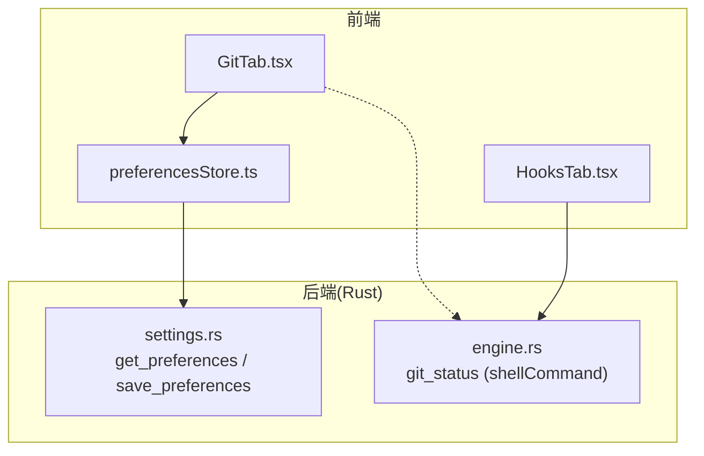
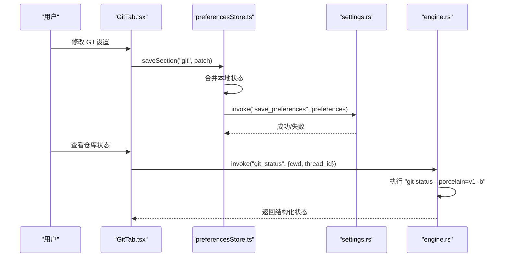
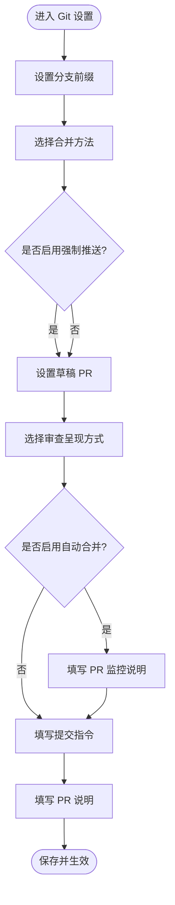
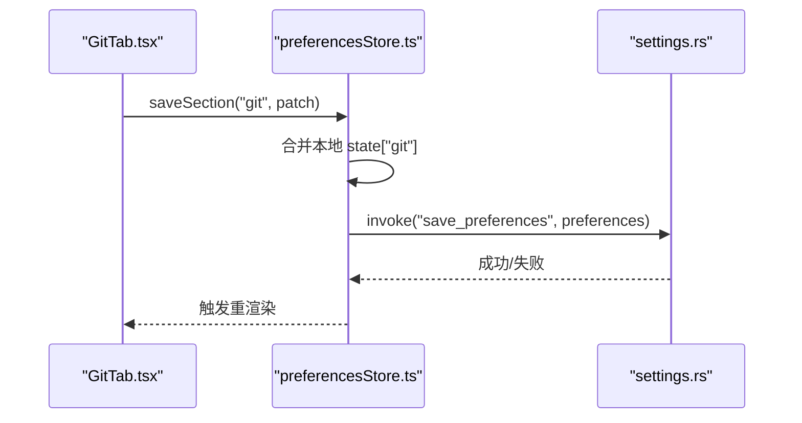
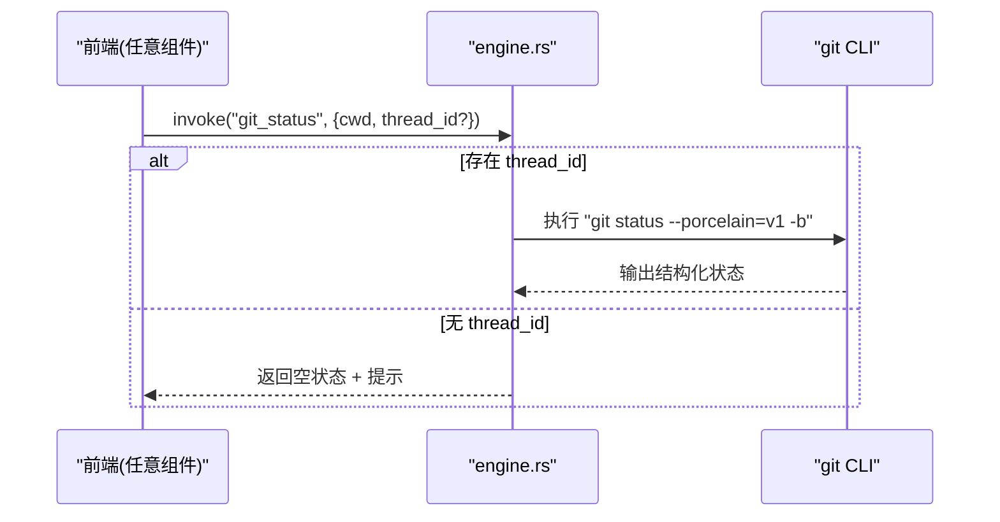
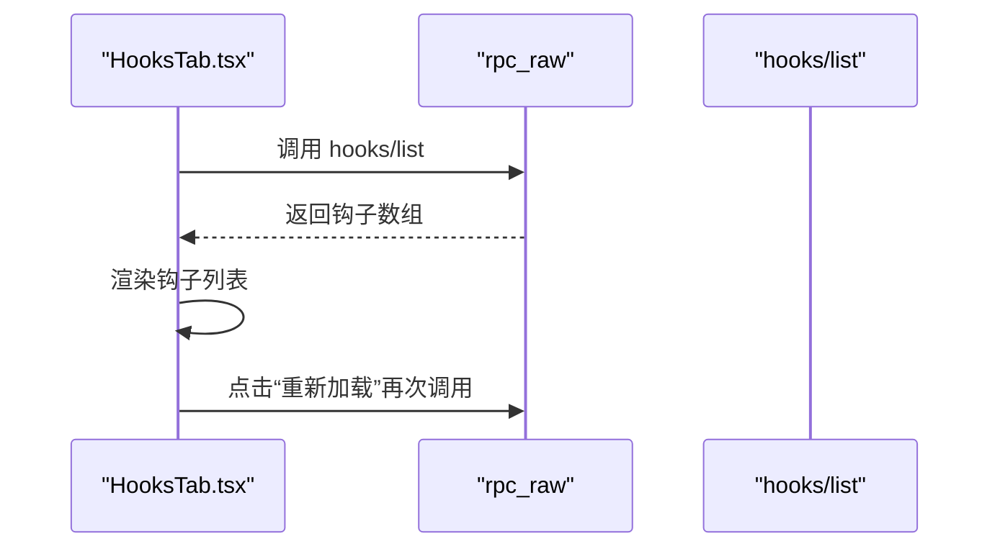
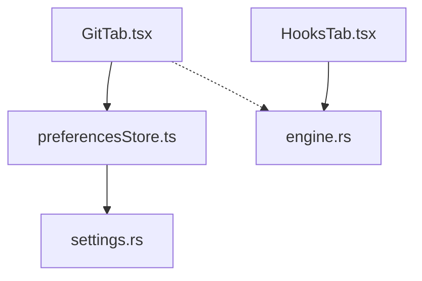

# Git 设置

<cite>
**本文引用的文件**
- [GitTab.tsx](file://frontend/app/views/settings/tabs/GitTab.tsx)
- [preferencesStore.ts](file://frontend/app/state/preferencesStore.ts)
- [settings.rs](file://src-tauri/src/commands/settings.rs)
- [engine.rs](file://src-tauri/src/commands/engine.rs)
- [HooksTab.tsx](file://frontend/app/views/settings/tabs/HooksTab.tsx)
- [git.txt](file://docs/uia/outlines-t41/git.txt)
- [hooks.txt](file://docs/uia/outlines-t41/hooks.txt)
</cite>

## 目录
1. [简介](#简介)
2. [项目结构](#项目结构)
3. [核心组件](#核心组件)
4. [架构总览](#架构总览)
5. [详细组件分析](#详细组件分析)
6. [依赖关系分析](#依赖关系分析)
7. [性能考虑](#性能考虑)
8. [故障排除指南](#故障排除指南)
9. [结论](#结论)
10. [附录](#附录)

## 简介
本文件面向 Codex-Tauri 的“Git 设置”页面，系统性说明 GitTab 组件的版本控制集成功能：仓库配置、分支管理、提交策略、代码审查流程、合并策略与冲突处理、远程连接与身份验证、钩子集成与工作流自动化、协作能力，以及最佳实践、性能优化与故障排除。内容基于前端设置页、偏好存储、Rust 命令层与 UIA 文档进行梳理，确保读者既能快速上手，也能深入理解实现细节。

## 项目结构
Git 设置相关的前端界面位于设置页签中，通过偏好存储持久化到 Rust 后端；部分 Git 状态查询通过引擎命令执行 shell 命令完成。钩子功能在独立的“钩子”页签中展示与管理。

图表来源
- [GitTab.tsx:1-153](file://frontend/app/views/settings/tabs/GitTab.tsx#L1-L153)
- [preferencesStore.ts:1-94](file://frontend/app/state/preferencesStore.ts#L1-L94)
- [settings.rs:35-52](file://src-tauri/src/commands/settings.rs#L35-L52)
- [engine.rs:801-829](file://src-tauri/src/commands/engine.rs#L801-L829)
- [HooksTab.tsx:1-103](file://frontend/app/views/settings/tabs/HooksTab.tsx#L1-L103)

章节来源
- [GitTab.tsx:1-153](file://frontend/app/views/settings/tabs/GitTab.tsx#L1-L153)
- [preferencesStore.ts:1-94](file://frontend/app/state/preferencesStore.ts#L1-L94)
- [settings.rs:35-52](file://src-tauri/src/commands/settings.rs#L35-L52)
- [engine.rs:801-829](file://src-tauri/src/commands/engine.rs#L801-L829)
- [HooksTab.tsx:1-103](file://frontend/app/views/settings/tabs/HooksTab.tsx#L1-L103)

## 核心组件
- GitTab 组件：提供分支前缀、合并方法（合并/压缩合并）、强制推送开关、草稿 PR、审查结果呈现方式（内联/单独）、自动合并开关、PR 监控说明、提交指令、PR 说明等配置项。
- 偏好存储：以“节”为单位读写偏好，git 节包含上述所有键值；保存时先更新本地状态再调用后端持久化。
- 后端设置命令：提供 get_preferences/save_preferences，将前端偏好写入应用状态并持久化。
- 引擎命令：提供 git_status，通过线程/Shell 命令执行 git status --porcelain=v1 -b 获取仓库状态。
- 钩子页签：通过 rpc_raw 调用 hooks/list 获取已配置的钩子列表，支持重新加载。

章节来源
- [GitTab.tsx:15-153](file://frontend/app/views/settings/tabs/GitTab.tsx#L15-L153)
- [preferencesStore.ts:45-88](file://frontend/app/state/preferencesStore.ts#L45-L88)
- [settings.rs:35-52](file://src-tauri/src/commands/settings.rs#L35-L52)
- [engine.rs:801-829](file://src-tauri/src/commands/engine.rs#L801-L829)
- [HooksTab.tsx:19-103](file://frontend/app/views/settings/tabs/HooksTab.tsx#L19-L103)

## 架构总览
Git 设置的数据流分为两条主线：
- 配置持久化：前端 GitTab 修改 git 节偏好 → preferencesStore 合并并调用 saveSection → 后端 settings.rs 保存偏好。
- 仓库状态读取：前端或工作流触发 git_status → 后端 engine.rs 通过线程/Shell 命令执行 git status，返回结构化状态供 UI 使用。

图表来源
- [GitTab.tsx:40-150](file://frontend/app/views/settings/tabs/GitTab.tsx#L40-L150)
- [preferencesStore.ts:76-88](file://frontend/app/state/preferencesStore.ts#L76-L88)
- [settings.rs:35-52](file://src-tauri/src/commands/settings.rs#L35-L52)
- [engine.rs:801-829](file://src-tauri/src/commands/engine.rs#L801-L829)

## 详细组件分析

### GitTab 组件：版本控制集成功能
- 分支前缀：用于新分支命名约定，默认值为 codex/。
- 合并方法：提供“合并”和“压缩合并”两种模式，兼容历史值回退。
- 强制推送：开启后从应用推送时使用带租约的强制推送，避免覆盖他人提交。
- 草稿 PR：创建 PR 时默认作为草稿，便于内部审阅。
- 审查呈现：可选择在当前聊天内联启动审查或打开独立审查聊天。
- 自动合并与监控：可启用自动合并，并提供 PR 监控说明文本。
- 提交与 PR 指令：为生成提交信息与 PR 标题/描述提供提示模板。

图表来源
- [GitTab.tsx:40-150](file://frontend/app/views/settings/tabs/GitTab.tsx#L40-L150)
- [git.txt:73-103](file://docs/uia/outlines-t41/git.txt#L73-L103)

章节来源
- [GitTab.tsx:15-153](file://frontend/app/views/settings/tabs/GitTab.tsx#L15-L153)
- [git.txt:73-103](file://docs/uia/outlines-t41/git.txt#L73-L103)

### 偏好存储与持久化
- 读偏好：usePrefSection 按节读取，git 节包含所有 Git 相关键。
- 写偏好：saveSection 先合并本地状态，再调用后端 save_preferences 持久化。
- 错误容错：加载失败时降级为默认值，保证界面可用。

图表来源
- [preferencesStore.ts:45-88](file://frontend/app/state/preferencesStore.ts#L45-L88)
- [settings.rs:35-52](file://src-tauri/src/commands/settings.rs#L35-L52)

章节来源
- [preferencesStore.ts:1-94](file://frontend/app/state/preferencesStore.ts#L1-L94)
- [settings.rs:35-52](file://src-tauri/src/commands/settings.rs#L35-L52)

### 仓库状态与 Git 客户端
- 状态查询：通过 engine.rs 暴露的 git_status 命令，使用线程/Shell 命令执行 git status --porcelain=v1 -b，返回分支、脏状态与文件变更。
- 无线程上下文：返回结构化空状态，提示需传入 thread_id 以运行 shell 命令。
- 适用场景：适用于本地仓库的状态快照，不直接涉及远程仓库操作。

图表来源
- [engine.rs:801-829](file://src-tauri/src/commands/engine.rs#L801-L829)

章节来源
- [engine.rs:801-829](file://src-tauri/src/commands/engine.rs#L801-L829)

### 钩子集成与工作流自动化
- 钩子列表：HooksTab 通过 rpc_raw 调用 hooks/list 获取已配置的钩子，显示名称与命令。
- 重新加载：支持手动刷新钩子列表。
- 与 Git 的关系：钩子可用于生命周期事件触发，结合 Git 工作流实现自动化（如提交前检查、PR 构建等）。

图表来源
- [HooksTab.tsx:42-103](file://frontend/app/views/settings/tabs/HooksTab.tsx#L42-L103)
- [hooks.txt:73-81](file://docs/uia/outlines-t41/hooks.txt#L73-L81)

章节来源
- [HooksTab.tsx:1-103](file://frontend/app/views/settings/tabs/HooksTab.tsx#L1-L103)
- [hooks.txt:73-81](file://docs/uia/outlines-t41/hooks.txt#L73-L81)

### 远程仓库连接与身份验证
- SSH 连接器：ConnectionsTab 展示来自后端的 SSH 连接器，仅过滤 ssh 类型，显示主机与用户信息。
- 用途：为需要 SSH 访问的远程仓库提供连接能力，配合 Git 操作进行拉取/推送。
- 注意：当前 GitTab 未直接暴露远程仓库配置项，远程连接由连接器统一管理。

图表来源
- [ConnectionsTab.tsx:1-40](file://frontend/app/views/settings/tabs/ConnectionsTab.tsx#L1-L40)

章节来源
- [ConnectionsTab.tsx:1-40](file://frontend/app/views/settings/tabs/ConnectionsTab.tsx#L1-L40)

### 代码审查流程、合并策略与冲突解决
- 合并策略：支持“合并”与“压缩合并”，影响 PR 合并行为。
- 审查呈现：可选择内联或在独立聊天中启动审查，便于团队协作。
- 冲突解决：当合并或变基产生冲突时，建议优先采用压缩合并减少历史噪音；必要时人工介入解决冲突后再提交。

章节来源
- [GitTab.tsx:52-99](file://frontend/app/views/settings/tabs/GitTab.tsx#L52-L99)
- [git.txt:77-92](file://docs/uia/outlines-t41/git.txt#L77-L92)

### 工作流自动化与协作
- 自动合并：可启用自动合并，配合 PR 监控说明，持续跟踪直至合并完成。
- 提交与 PR 指令：通过模板化指令提升提交信息与 PR 描述的一致性，便于团队规范。
- 钩子联动：利用钩子在关键事件触发自动化任务（如测试、构建、通知），增强协作效率。

章节来源
- [GitTab.tsx:103-150](file://frontend/app/views/settings/tabs/GitTab.tsx#L103-L150)
- [HooksTab.tsx:42-103](file://frontend/app/views/settings/tabs/HooksTab.tsx#L42-L103)

## 依赖关系分析
- GitTab 依赖 preferencesStore 进行偏好读写。
- preferencesStore 依赖后端 settings.rs 的 get_preferences/save_preferences。
- 仓库状态读取依赖 engine.rs 的 git_status，通过线程/Shell 命令执行 git CLI。
- 钩子功能依赖 HooksTab 与 rpc_raw 调用 hooks/list。

图表来源
- [GitTab.tsx:1-153](file://frontend/app/views/settings/tabs/GitTab.tsx#L1-L153)
- [preferencesStore.ts:1-94](file://frontend/app/state/preferencesStore.ts#L1-L94)
- [settings.rs:35-52](file://src-tauri/src/commands/settings.rs#L35-L52)
- [engine.rs:801-829](file://src-tauri/src/commands/engine.rs#L801-L829)
- [HooksTab.tsx:1-103](file://frontend/app/views/settings/tabs/HooksTab.tsx#L1-L103)

章节来源
- [GitTab.tsx:1-153](file://frontend/app/views/settings/tabs/GitTab.tsx#L1-L153)
- [preferencesStore.ts:1-94](file://frontend/app/state/preferencesStore.ts#L1-L94)
- [settings.rs:35-52](file://src-tauri/src/commands/settings.rs#L35-L52)
- [engine.rs:801-829](file://src-tauri/src/commands/engine.rs#L801-L829)
- [HooksTab.tsx:1-103](file://frontend/app/views/settings/tabs/HooksTab.tsx#L1-L103)

## 性能考虑
- 偏好保存：先更新本地状态再异步持久化，避免 UI 卡顿。
- 仓库状态：git_status 通过线程/Shell 命令执行，建议在具备线程上下文的场景中调用以获得完整状态。
- 钩子列表：按需刷新，避免频繁请求导致性能下降。
- 合并策略：压缩合并在大型仓库中可减少历史复杂度，提高后续操作效率。

[本节为通用指导，不直接分析具体文件]

## 故障排除指南
- 偏好加载失败：前端会降级为默认值并记录警告，检查后端 get_preferences 是否正常。
- 偏好保存失败：saveSection 捕获异常并记录错误，确认后端 save_preferences 权限与持久化路径。
- 仓库状态为空：若无 thread_id，git_status 返回空状态并提示需传入线程 ID；请确保在合适的线程上下文中调用。
- 钩子列表为空：确认 hooks/list 可用，必要时点击“重新加载”刷新。

章节来源
- [preferencesStore.ts:59-68](file://frontend/app/state/preferencesStore.ts#L59-L68)
- [preferencesStore.ts:76-88](file://frontend/app/state/preferencesStore.ts#L76-L88)
- [engine.rs:801-829](file://src-tauri/src/commands/engine.rs#L801-L829)
- [HooksTab.tsx:42-103](file://frontend/app/views/settings/tabs/HooksTab.tsx#L42-L103)

## 结论
Git 设置页面通过 GitTab 提供了完整的版本控制配置入口，涵盖分支前缀、合并策略、强制推送、草稿 PR、审查呈现、自动合并与监控、提交与 PR 指令等。偏好通过 preferencesStore 与后端 settings.rs 持久化，仓库状态通过 engine.rs 的 git_status 获取。钩子页签则扩展了生命周期自动化能力。结合 SSH 连接器，可实现远程仓库连接与协作。遵循最佳实践与性能建议，可有效提升团队协作效率与稳定性。

[本节为总结性内容，不直接分析具体文件]

## 附录
- 最佳实践
  - 统一分支前缀，便于识别与自动化。
  - 根据团队规范选择合并策略，推荐在复杂历史中使用压缩合并。
  - 谨慎启用强制推送，避免覆盖他人提交。
  - 使用提交与 PR 指令模板，保持信息一致性。
  - 通过钩子实现自动化检查与通知，提升质量与效率。
- 性能优化
  - 仅在必要场景调用 git_status，避免频繁 shell 命令。
  - 合理刷新钩子列表，减少不必要的网络与计算开销。
  - 在大仓库中优先考虑压缩合并，降低历史复杂度。
- 常见问题
  - 无法获取仓库状态：检查是否传入 thread_id。
  - 偏好未持久化：检查后端保存接口与权限。
  - 钩子未生效：确认 hooks/list 可用并重新加载。

[本节为补充指导，不直接分析具体文件]