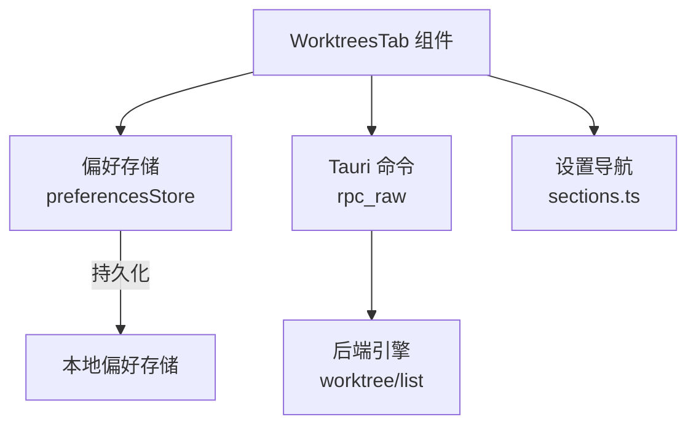
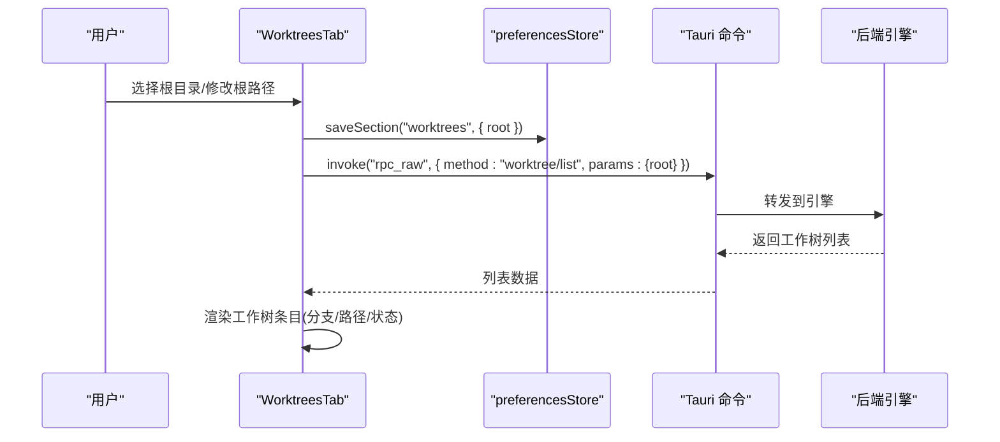
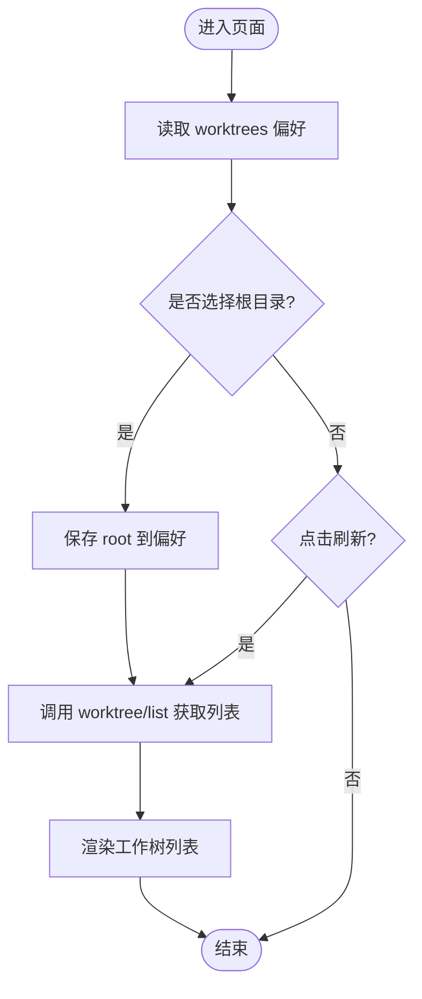
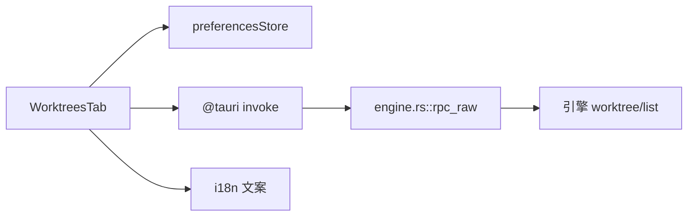

# 工作树设置

<cite>
**本文引用的文件**
- [WorktreesTab.tsx](file://frontend/app/views/settings/tabs/WorktreesTab.tsx)
- [preferencesStore.ts](file://frontend/app/state/preferencesStore.ts)
- [sections.ts](file://frontend/app/views/settings/sections.ts)
- [engine.rs](file://src-tauri/src/commands/engine.rs)
- [worktrees.txt](file://docs/uia/outlines-t41/worktrees.txt)
</cite>

## 目录
1. [简介](#简介)
2. [项目结构](#项目结构)
3. [核心组件](#核心组件)
4. [架构总览](#架构总览)
5. [详细组件分析](#详细组件分析)
6. [依赖关系分析](#依赖关系分析)
7. [性能考虑](#性能考虑)
8. [故障排查指南](#故障排查指南)
9. [结论](#结论)
10. [附录](#附录)

## 简介
本页面为 Codex-Tauri 的“工作树设置”提供完整文档，聚焦 WorktreesTab 组件的多工作区管理能力。内容涵盖：
- 工作树根目录选择、列表刷新与展示
- 创建前拉取上游更新、自动清理策略与保留数量
- 工作树与主仓库的关系、分支映射与状态展示
- 生命周期管理、资源占用控制与清理策略
- 共享、权限与协作相关说明（基于当前实现）
- 多项目工作流优化建议与性能调优方案

## 项目结构
工作树设置由前端 React 组件与 Tauri 命令通道组成：
- 前端通过 preferencesStore 持久化 worktrees 配置段（根路径、自动拉取、自动清理、保留数量）
- 通过 Tauri 的 rpc_raw 调用后端引擎的 worktree/list 方法获取工作树列表
- 设置项在设置导航中归类于“编码”分组

图表来源
- [WorktreesTab.tsx:44-81](file://frontend/app/views/settings/tabs/WorktreesTab.tsx#L44-L81)
- [preferencesStore.ts:76-88](file://frontend/app/state/preferencesStore.ts#L76-L88)
- [engine.rs:854-860](file://src-tauri/src/commands/engine.rs#L854-L860)
- [sections.ts:70-79](file://frontend/app/views/settings/sections.ts#L70-L79)

章节来源
- [WorktreesTab.tsx:1-163](file://frontend/app/views/settings/tabs/WorktreesTab.tsx#L1-L163)
- [preferencesStore.ts:1-94](file://frontend/app/state/preferencesStore.ts#L1-L94)
- [sections.ts:1-95](file://frontend/app/views/settings/sections.ts#L1-L95)
- [engine.rs:840-861](file://src-tauri/src/commands/engine.rs#L840-L861)

## 核心组件
- WorktreesTab：负责工作树根目录选择、偏好项切换、列表刷新与渲染
- preferencesStore：提供 worktrees 配置段的读取与保存（root、autoFetch、autoCleanup、retention）
- 设置导航 sections：将 Worktrees 纳入“编码”分组
- Tauri 命令 engine.rs：暴露 rpc_raw 透传至引擎的 worktree/list

章节来源
- [WorktreesTab.tsx:19-81](file://frontend/app/views/settings/tabs/WorktreesTab.tsx#L19-L81)
- [preferencesStore.ts:45-88](file://frontend/app/state/preferencesStore.ts#L45-L88)
- [sections.ts:70-79](file://frontend/app/views/settings/sections.ts#L70-L79)
- [engine.rs:854-860](file://src-tauri/src/commands/engine.rs#L854-L860)

## 架构总览
工作树设置的交互流程如下：
- 用户选择根目录或修改文本框后，保存 worktrees 配置段
- 通过 rpc_raw 调用 worktree/list 获取工作树列表
- 列表数据包含分支、路径与状态，用于界面展示

图表来源
- [WorktreesTab.tsx:48-81](file://frontend/app/views/settings/tabs/WorktreesTab.tsx#L48-L81)
- [preferencesStore.ts:76-88](file://frontend/app/state/preferencesStore.ts#L76-L88)
- [engine.rs:854-860](file://src-tauri/src/commands/engine.rs#L854-L860)

## 详细组件分析

### WorktreesTab 组件
职责与行为：
- 根目录选择：调用系统对话框选择目录，保存 root 并立即刷新列表
- 偏好项：
  - 创建工作树前始终获取上游更新（autoFetch）
  - 自动删除旧工作树（autoCleanup）
  - 自动删除限制/保留数量（retention，默认 15）
- 列表刷新：根据当前 root 调用 worktree/list 获取并渲染
- 空态提示：无工作树时显示“尚无工作树”与刷新按钮

数据结构：
- 偏好对象 WorktreesPrefs：root、autoFetch、autoCleanup、retention
- 工作树条目 WorktreeEntry：branch、path、status

图表来源
- [WorktreesTab.tsx:44-81](file://frontend/app/views/settings/tabs/WorktreesTab.tsx#L44-L81)
- [WorktreesTab.tsx:87-137](file://frontend/app/views/settings/tabs/WorktreesTab.tsx#L87-L137)
- [WorktreesTab.tsx:139-160](file://frontend/app/views/settings/tabs/WorktreesTab.tsx#L139-L160)

章节来源
- [WorktreesTab.tsx:19-81](file://frontend/app/views/settings/tabs/WorktreesTab.tsx#L19-L81)
- [WorktreesTab.tsx:87-160](file://frontend/app/views/settings/tabs/WorktreesTab.tsx#L87-L160)

### 偏好存储 preferencesStore
- usePrefSection：读取 worktrees 配置段，合并默认值保证键存在
- saveSection：先本地提交以即时更新 UI，再异步持久化到后端；失败记录日志但不阻断 UI
- loadPreferences：首次加载偏好，失败回退到默认值

章节来源
- [preferencesStore.ts:45-88](file://frontend/app/state/preferencesStore.ts#L45-L88)

### 设置导航 sections
- 将 Worktrees 置于“编码”分组下，作为独立标签页
- 提供统一的图标与标签键，便于侧边栏与路由识别

章节来源
- [sections.ts:70-79](file://frontend/app/views/settings/sections.ts#L70-L79)

### 后端命令 engine.rs
- rpc_raw：透传任意 app-server 方法，此处用于 worktree/list
- 该命令将请求转发给引擎处理，返回 JSON 结果

章节来源
- [engine.rs:854-860](file://src-tauri/src/commands/engine.rs#L854-L860)

## 依赖关系分析
- WorktreesTab 依赖：
  - preferencesStore：读写 worktrees 配置段
  - Tauri invoke：调用 plugin:dialog|open 与 rpc_raw
  - 国际化 i18n：用于文案与标题
- 后端依赖：
  - engine.rs 暴露 rpc_raw，转发到引擎的 worktree/list

图表来源
- [WorktreesTab.tsx:9-13](file://frontend/app/views/settings/tabs/WorktreesTab.tsx#L9-L13)
- [preferencesStore.ts:76-88](file://frontend/app/state/preferencesStore.ts#L76-L88)
- [engine.rs:854-860](file://src-tauri/src/commands/engine.rs#L854-L860)

章节来源
- [WorktreesTab.tsx:9-13](file://frontend/app/views/settings/tabs/WorktreesTab.tsx#L9-L13)
- [preferencesStore.ts:76-88](file://frontend/app/state/preferencesStore.ts#L76-L88)
- [engine.rs:854-860](file://src-tauri/src/commands/engine.rs#L854-L860)

## 性能考虑
- 列表刷新频率：仅在根目录变更或用户主动刷新时调用 worktree/list，避免频繁网络开销
- 数据转换：asWorktrees 对返回数组进行类型安全转换，缺失字段使用默认值，减少渲染异常
- 偏好写入：saveSection 先本地提交再异步持久化，提升响应性
- 资源控制：通过 retention 限制保留的工作树数量，配合 autoCleanup 自动清理旧工作树，控制磁盘占用
- 错误容忍：网络或引擎异常时清空列表并提示，避免阻塞用户操作

[本节为通用性能建议，不直接分析具体文件]

## 故障排查指南
- 无法列出工作树：
  - 检查根目录是否正确设置
  - 确认 rpc_raw 能成功转发到 worktree/list
  - 查看控制台日志中的警告信息
- 偏好未生效：
  - 确认 saveSection 已调用且未抛出异常
  - 检查本地偏好存储是否被其他模块覆盖
- 自动清理未触发：
  - 确认 autoCleanup 已开启
  - 确认 retention 阈值合理
- 界面为空：
  - 点击“刷新”重新拉取列表
  - 检查 worktree/list 返回是否为数组

章节来源
- [WorktreesTab.tsx:48-81](file://frontend/app/views/settings/tabs/WorktreesTab.tsx#L48-L81)
- [preferencesStore.ts:76-88](file://frontend/app/state/preferencesStore.ts#L76-L88)

## 结论
WorktreesTab 提供了简洁直观的多工作区管理能力：
- 通过根目录选择与列表刷新，快速掌握当前工作树状态
- 借助 autoFetch、autoCleanup 与 retention，实现创建前同步与自动清理，降低维护成本
- 通过 Tauri 的 rpc_raw 与引擎通信，保持前后端解耦与可扩展性
- 当前实现侧重于本地管理与展示，共享、权限与协作能力需结合后端引擎与团队规范进一步扩展

[本节为总结性内容，不直接分析具体文件]

## 附录

### 工作树与主仓库关系、分支映射与状态跟踪
- 工作树条目包含 branch、path、status 三个关键字段，分别表示关联分支、工作区路径与当前状态
- 列表由 worktree/list 返回，UI 仅做展示与刷新，不直接参与创建/切换逻辑
- 状态字段可用于指示工作树的活跃程度或健康度，便于用户决策

章节来源
- [WorktreesTab.tsx:26-42](file://frontend/app/views/settings/tabs/WorktreesTab.tsx#L26-L42)
- [WorktreesTab.tsx:147-160](file://frontend/app/views/settings/tabs/WorktreesTab.tsx#L147-L160)

### 生命周期管理、资源占用控制与清理策略
- 生命周期：
  - 创建：由引擎负责，前端通过 worktree/list 观察结果
  - 运行：通过 status 字段反映当前状态
  - 清理：当超过 retention 数量时，autoCleanup 会触发旧工作树清理
- 资源控制：
  - 通过 retention 限制保留数量，避免磁盘膨胀
  - 建议在团队内统一 retention 策略，平衡可恢复性与空间占用

章节来源
- [WorktreesTab.tsx:102-137](file://frontend/app/views/settings/tabs/WorktreesTab.tsx#L102-L137)
- [worktrees.txt:77-85](file://docs/uia/outlines-t41/worktrees.txt#L77-L85)

### 共享、权限控制与协作功能
- 当前前端实现未包含工作树共享、权限控制与协作入口
- 如需团队协作，建议在后端引擎层增加共享与权限校验，并在前端新增相应设置与操作入口

[本节为概念性说明，不直接分析具体文件]

### 多项目工作流优化建议与性能调优方案
- 工作流建议：
  - 为每个项目设定独立的 root，避免混用导致列表混乱
  - 启用 autoFetch 确保创建前同步最新远程分支
  - 合理设置 retention，兼顾历史可恢复与磁盘占用
- 性能调优：
  - 减少不必要的刷新，仅在根目录变更或用户主动刷新时调用 worktree/list
  - 利用 asWorktrees 的类型安全转换，避免渲染异常导致的重绘
  - 在大规模工作树下，考虑分页或虚拟滚动以提升列表性能（需后续扩展）

[本节为通用优化建议，不直接分析具体文件]