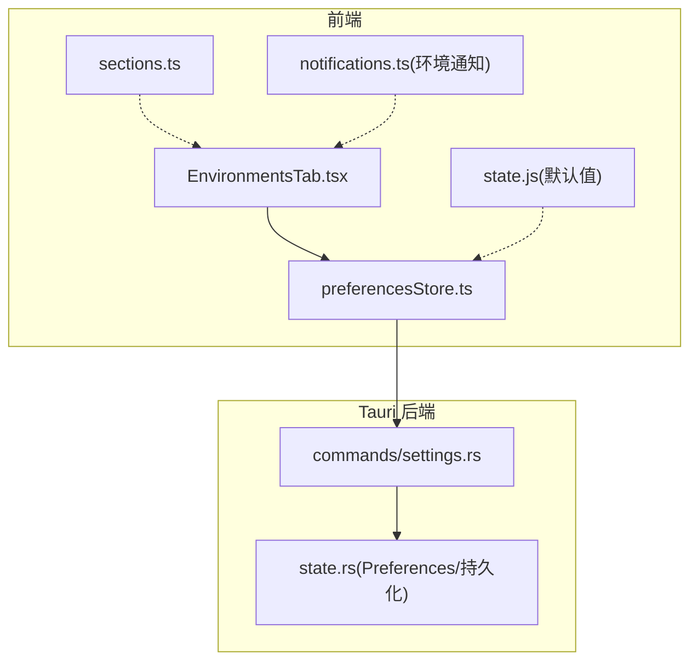
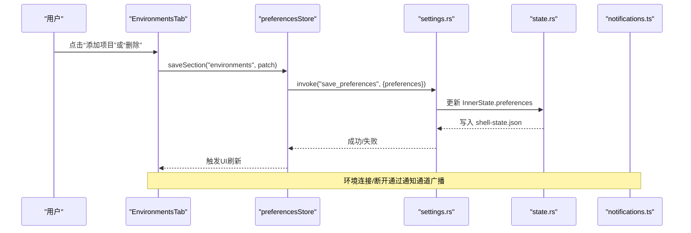
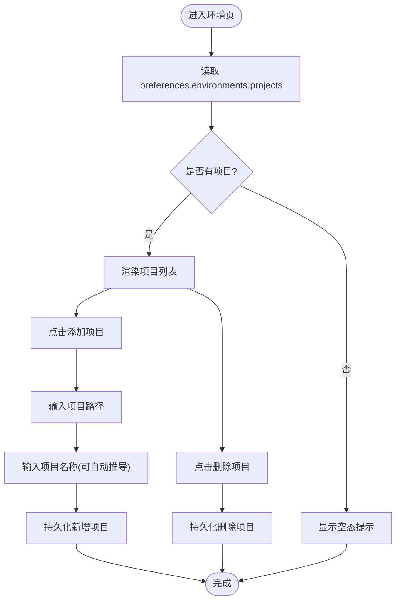
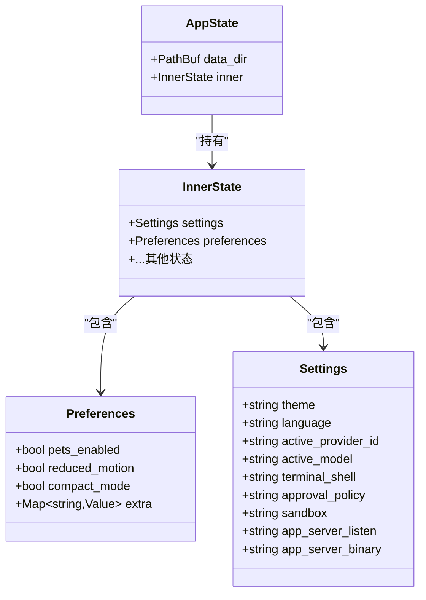
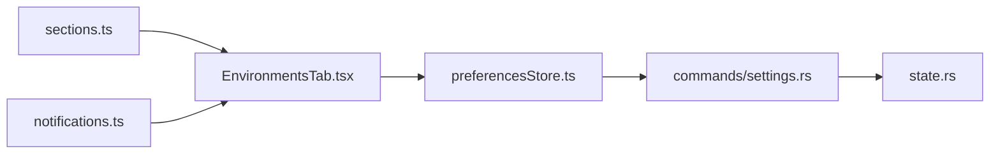

# 环境设置

<cite>
**本文引用的文件**
- [EnvironmentsTab.tsx](file://frontend/app/views/settings/tabs/EnvironmentsTab.tsx)
- [preferencesStore.ts](file://frontend/app/state/preferencesStore.ts)
- [settings.rs](file://src-tauri/src/commands/settings.rs)
- [state.rs](file://src-tauri/src/state.rs)
- [sections.ts](file://frontend/app/views/settings/sections.ts)
- [state.js](file://frontend/src/js/state.js)
- [notifications.ts](file://frontend/src/protocol/notifications.ts)
- [appStore.ts](file://frontend/app/state/appStore.ts)
- [environments.txt](file://docs/uia/outlines-t41/environments.txt)
</cite>

## 目录
1. [简介](#简介)
2. [项目结构](#项目结构)
3. [核心组件](#核心组件)
4. [架构总览](#架构总览)
5. [详细组件分析](#详细组件分析)
6. [依赖关系分析](#依赖关系分析)
7. [性能考虑](#性能考虑)
8. [故障排查指南](#故障排查指南)
9. [结论](#结论)
10. [附录](#附录)

## 简介
本文件为 Codex-Tauri 的“环境设置”页面提供完整技术文档，聚焦 EnvironmentsTab 组件的环境管理能力：环境变量管理、配置文件组织、环境切换机制、隔离策略、变量继承与覆盖规则、环境验证、模板系统与部署配置、安全与敏感信息保护、审计日志，以及最佳实践与迁移指南。内容基于前端 React 组件、偏好存储层、Rust 后端命令与状态模型进行系统化说明，并辅以架构图、流程图和时序图帮助理解。

## 项目结构
环境设置功能由以下层次构成：
- 前端 UI：EnvironmentsTab 负责展示与管理“本地环境（项目）”列表，支持添加/删除并持久化。
- 偏好存储：preferencesStore 提供按 section 的读写能力，合并默认值并通过 Tauri IPC 持久化。
- Rust 后端：settings 命令暴露 get/save_preferences；state 定义 Preferences 结构与持久化格式，支持任意扩展段。
- 导航与协议：sections.ts 将“环境”纳入设置导航；notifications.ts 定义环境连接/断开通知类型。
- 默认值与兼容：state.js 提供默认 preferences，确保前后端一致。

图表来源
- [EnvironmentsTab.tsx:28-113](file://frontend/app/views/settings/tabs/EnvironmentsTab.tsx#L28-L113)
- [preferencesStore.ts:45-88](file://frontend/app/state/preferencesStore.ts#L45-L88)
- [settings.rs:35-52](file://src-tauri/src/commands/settings.rs#L35-L52)
- [state.rs:49-64](file://src-tauri/src/state.rs#L49-L64)
- [sections.ts:70-79](file://frontend/app/views/settings/sections.ts#L70-L79)
- [notifications.ts:27-28](file://frontend/src/protocol/notifications.ts#L27-L28)

章节来源
- [EnvironmentsTab.tsx:28-113](file://frontend/app/views/settings/tabs/EnvironmentsTab.tsx#L28-L113)
- [preferencesStore.ts:45-88](file://frontend/app/state/preferencesStore.ts#L45-L88)
- [settings.rs:35-52](file://src-tauri/src/commands/settings.rs#L35-L52)
- [state.rs:49-64](file://src-tauri/src/state.rs#L49-L64)
- [sections.ts:70-79](file://frontend/app/views/settings/sections.ts#L70-L79)
- [notifications.ts:27-28](file://frontend/src/protocol/notifications.ts#L27-L28)

## 核心组件
- EnvironmentsTab：渲染“环境”页，维护 projects 列表，提供添加/删除操作，调用 saveSection 持久化。
- preferencesStore：以 section 为单位读取/合并/保存偏好，使用 invoke("get_preferences"/"save_preferences") 与后端交互。
- settings.rs：实现 get_preferences/save_preferences 命令，更新内存中的 Preferences 并落盘。
- state.rs：定义 Preferences 结构，通过 flatten 支持任意扩展段（如 environments），并提供 provider 密钥注入相关能力。
- sections.ts：将“环境”注册到设置导航中。
- notifications.ts：定义 thread/environment/connected 与 disconnected 事件类型，用于环境生命周期通知。

章节来源
- [EnvironmentsTab.tsx:28-113](file://frontend/app/views/settings/tabs/EnvironmentsTab.tsx#L28-L113)
- [preferencesStore.ts:45-88](file://frontend/app/state/preferencesStore.ts#L45-L88)
- [settings.rs:35-52](file://src-tauri/src/commands/settings.rs#L35-L52)
- [state.rs:49-64](file://src-tauri/src/state.rs#L49-L64)
- [sections.ts:70-79](file://frontend/app/views/settings/sections.ts#L70-L79)
- [notifications.ts:27-28](file://frontend/src/protocol/notifications.ts#L27-L28)

## 架构总览
下图展示了从用户操作到数据持久化的完整链路，以及环境生命周期通知的位置。

图表来源
- [EnvironmentsTab.tsx:33-54](file://frontend/app/views/settings/tabs/EnvironmentsTab.tsx#L33-L54)
- [preferencesStore.ts:76-88](file://frontend/app/state/preferencesStore.ts#L76-L88)
- [settings.rs:45-52](file://src-tauri/src/commands/settings.rs#L45-L52)
- [state.rs:209-217](file://src-tauri/src/state.rs#L209-L217)
- [notifications.ts:27-28](file://frontend/src/protocol/notifications.ts#L27-L28)

## 详细组件分析

### EnvironmentsTab 组件
- 职责：展示“环境”列表，支持添加/删除项目，持久化到 preferences.environments.projects。
- 数据结构：EnvironmentProject{name, path?}，EnvironmentsPrefs{projects?: EnvironmentProject[]}。
- 交互流程：
  - 添加项目：弹出路径与名称输入，追加到 projects 并持久化。
  - 删除项目：移除指定索引项并持久化。
  - 空态提示：当无项目时显示空态文案。
- 国际化：标题、描述、按钮文案通过 i18n key 获取。
- 外部链接：提供“了解更多”跳转至官方文档。

图表来源
- [EnvironmentsTab.tsx:28-113](file://frontend/app/views/settings/tabs/EnvironmentsTab.tsx#L28-L113)

章节来源
- [EnvironmentsTab.tsx:28-113](file://frontend/app/views/settings/tabs/EnvironmentsTab.tsx#L28-L113)

### 偏好存储与持久化（preferencesStore + settings.rs + state.rs）
- 读取：usePrefSection(section) 返回合并默认值后的 section；loadPreferences 调用 get_preferences 拉取后端数据。
- 写入：saveSection(section, patch) 先本地合并提交，再调用 save_preferences 持久化。
- 后端：settings.rs 的 get/save_preferences 直接读写 AppState.InnerState.preferences，并调用 save() 落盘。
- 结构：state.rs 中 Preferences 使用 flatten 字段 extra 承载任意扩展段，因此 environments 无需后端改动即可新增。

图表来源
- [state.rs:27-64](file://src-tauri/src/state.rs#L27-L64)
- [state.rs:150-174](file://src-tauri/src/state.rs#L150-L174)

章节来源
- [preferencesStore.ts:45-88](file://frontend/app/state/preferencesStore.ts#L45-L88)
- [settings.rs:35-52](file://src-tauri/src/commands/settings.rs#L35-L52)
- [state.rs:49-64](file://src-tauri/src/state.rs#L49-L64)
- [state.rs:150-174](file://src-tauri/src/state.rs#L150-L174)

### 环境导航与默认值
- 导航：sections.ts 将“环境”加入“编码”分组，统一驱动侧边栏与路由。
- 默认值：state.js 中 defaultPreferences 定义了 environments.projects 为空数组，保证首次加载有稳定结构。

章节来源
- [sections.ts:70-79](file://frontend/app/views/settings/sections.ts#L70-L79)
- [state.js:119-121](file://frontend/src/js/state.js#L119-L121)

### 环境生命周期通知
- 通知类型：thread/environment/connected 与 thread/environment/disconnected，用于表示环境连接/断开。
- 用途：前端可在需要时监听这些事件以更新界面或执行后续逻辑。

章节来源
- [notifications.ts:27-28](file://frontend/src/protocol/notifications.ts#L27-L28)

## 依赖关系分析
- EnvironmentsTab 依赖 preferencesStore 提供的 usePrefSection/saveSection。
- preferencesStore 依赖 Tauri invoke 调用 settings.rs 的命令。
- settings.rs 依赖 state.rs 的 AppState 与持久化逻辑。
- sections.ts 为 UI 导航提供元数据，间接影响 EnvironmentsTab 的可见性。
- notifications.ts 提供环境事件类型，供上层消费。

图表来源
- [EnvironmentsTab.tsx:28-113](file://frontend/app/views/settings/tabs/EnvironmentsTab.tsx#L28-L113)
- [preferencesStore.ts:45-88](file://frontend/app/state/preferencesStore.ts#L45-L88)
- [settings.rs:35-52](file://src-tauri/src/commands/settings.rs#L35-L52)
- [state.rs:49-64](file://src-tauri/src/state.rs#L49-L64)
- [sections.ts:70-79](file://frontend/app/views/settings/sections.ts#L70-L79)
- [notifications.ts:27-28](file://frontend/src/protocol/notifications.ts#L27-L28)

章节来源
- [EnvironmentsTab.tsx:28-113](file://frontend/app/views/settings/tabs/EnvironmentsTab.tsx#L28-L113)
- [preferencesStore.ts:45-88](file://frontend/app/state/preferencesStore.ts#L45-L88)
- [settings.rs:35-52](file://src-tauri/src/commands/settings.rs#L35-L52)
- [state.rs:49-64](file://src-tauri/src/state.rs#L49-L64)
- [sections.ts:70-79](file://frontend/app/views/settings/sections.ts#L70-L79)
- [notifications.ts:27-28](file://frontend/src/protocol/notifications.ts#L27-L28)

## 性能考虑
- 本地优先更新：saveSection 先提交本地状态再异步持久化，避免 UI 卡顿。
- 最小化重绘：仅对 environments.projects 做增量合并，减少不必要的重新渲染。
- 错误容忍：loadPreferences 在异常时降级为默认值，保障页面可用性。
- 建议：若未来项目数量增长，可考虑虚拟滚动与分页加载以提升渲染性能。

[本节为通用性能建议，不直接分析具体文件]

## 故障排查指南
- 无法保存环境列表：
  - 检查 preferencesStore.saveSection 是否抛出异常，查看控制台错误日志。
  - 确认 settings.rs 的 save_preferences 是否正确调用 save() 并写回 shell-state.json。
- 重启后环境丢失：
  - 确认 state.rs 的 Preferences 使用 flatten 正确序列化 extra 字段。
  - 检查 ShellStateFile 的 preferences 字段是否被正确读写。
- 环境未出现在设置导航：
  - 核对 sections.ts 中是否包含 environments 条目。
- 环境连接/断开无反馈：
  - 检查前端是否订阅了 notifications.ts 中的环境事件类型。

章节来源
- [preferencesStore.ts:59-88](file://frontend/app/state/preferencesStore.ts#L59-L88)
- [settings.rs:45-52](file://src-tauri/src/commands/settings.rs#L45-L52)
- [state.rs:209-217](file://src-tauri/src/state.rs#L209-L217)
- [sections.ts:70-79](file://frontend/app/views/settings/sections.ts#L70-L79)
- [notifications.ts:27-28](file://frontend/src/protocol/notifications.ts#L27-L28)

## 结论
当前“环境设置”实现了轻量而稳健的项目级环境管理：通过 EnvironmentsTab 提供直观的前端操作，借助 preferencesStore 与 Rust 后端命令完成跨进程持久化，并以扁平化 Preferences 结构支持可扩展的环境配置。结合环境连接/断开通知，系统具备基础的环境生命周期感知能力。后续可在此基础上增强环境发现、模板化配置、变量继承与覆盖、安全审计等高级特性。

[本节为总结性内容，不直接分析具体文件]

## 附录

### 环境变量管理与敏感信息保护
- 提供者密钥注入：后端通过 provider_env_key 生成环境变量名，并在启动 sidecar 时将密钥注入其进程环境，避免明文落入配置文件。
- 建议：所有敏感信息（API Key、Token 等）应遵循此模式，不在任何明文配置文件中记录。

章节来源
- [state.rs:8-25](file://src-tauri/src/state.rs#L8-L25)
- [state.rs:167-174](file://src-tauri/src/state.rs#L167-L174)

### 环境隔离策略、变量继承与覆盖规则
- 隔离策略：当前 environments.projects 以“项目路径”为维度进行区分，每个项目对应一个环境上下文。
- 继承与覆盖：
  - 默认值：state.js 提供默认 preferences，确保 environments.projects 存在且为空数组。
  - 覆盖规则：saveSection 采用浅合并策略，新值覆盖旧值；后端 Preferences.extra 通过 flatten 保留未知键，便于扩展。
- 建议：如需更复杂的继承链（全局→团队→个人），可在 environments 下引入层级结构并实现合并算法。

章节来源
- [state.js:119-121](file://frontend/src/js/state.js#L119-L121)
- [preferencesStore.ts:76-88](file://frontend/app/state/preferencesStore.ts#L76-L88)
- [state.rs:49-64](file://src-tauri/src/state.rs#L49-L64)

### 环境验证与模板系统
- 验证：当前 EnvironmentsTab 对输入仅做基本非空校验；建议在 addProject 前增加路径存在性与可读性检查。
- 模板：可在 environments 下引入模板对象（如 base/env.local/.env），通过合并策略生成最终环境变量集，支持多环境覆盖。

[本节为概念性建议，不直接分析具体文件]

### 部署配置与环境切换机制
- 切换机制：当前通过修改 environments.projects 列表实现环境切换；实际运行时的环境选择可由上层业务根据项目路径决定。
- 部署：shell-state.json 作为本地状态文件，随应用配置目录持久化；迁移时可整体备份/恢复该文件。

章节来源
- [state.rs:176-217](file://src-tauri/src/state.rs#L176-L217)

### 审计日志
- 现状：当前代码未显式记录环境变更审计日志。
- 建议：在 save_preferences 处追加审计条目（时间戳、操作者、变更摘要），并限制日志写入权限，防止敏感信息泄露。

[本节为通用建议，不直接分析具体文件]

### 最佳实践
- 命名规范：environment.name 建议使用可读的项目名，path 保持绝对路径以避免歧义。
- 数据安全：避免在 name/path 中记录敏感信息；密钥一律通过环境变量注入。
- 版本兼容：扩展 environments 结构时保持向后兼容，利用 Preferences.extra 的灵活性。
- 用户体验：在添加/删除过程中提供明确的成功/失败反馈，必要时重试或提示修复步骤。

[本节为通用建议，不直接分析具体文件]

### 迁移指南
- 从旧版迁移：若此前使用其他格式存储环境，可在应用启动时读取旧文件并转换为 environments.projects 结构，再调用 save_preferences 持久化。
- 回滚策略：由于持久化采用临时文件+原子替换，崩溃风险较低；如需回滚，可备份 shell-state.json 并在需要时恢复。

章节来源
- [state.rs:209-217](file://src-tauri/src/state.rs#L209-L217)

### 参考与验收
- 界面元素与行为可对照无障碍测试输出，确认“环境”页的标题、描述、按钮与列表项符合预期。

章节来源
- [environments.txt:73-84](file://docs/uia/outlines-t41/environments.txt#L73-L84)