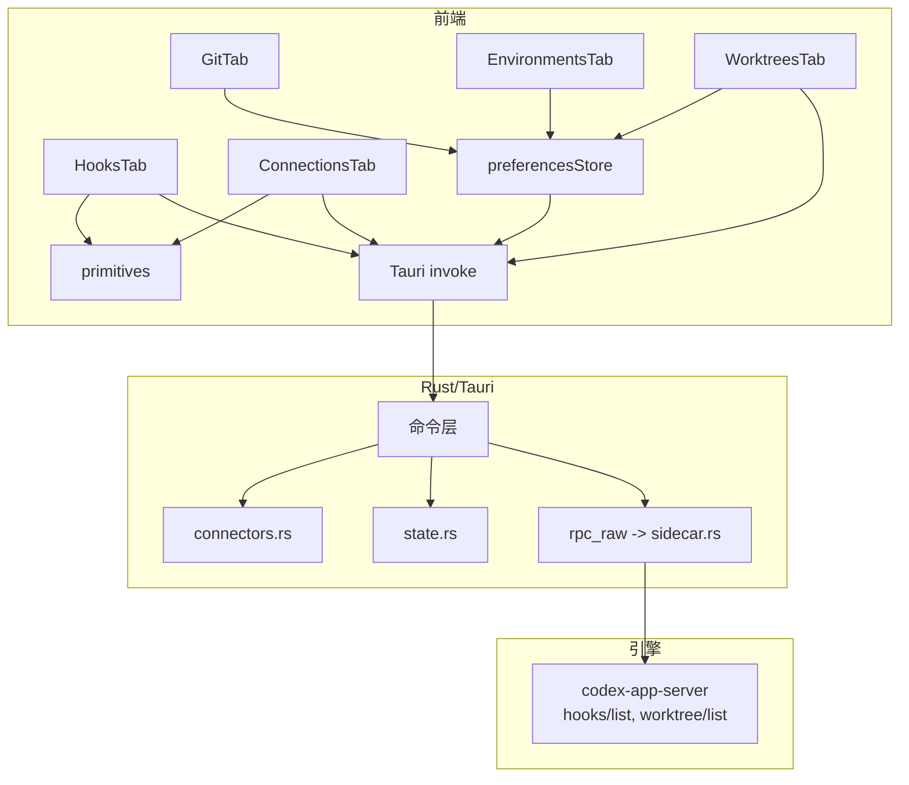
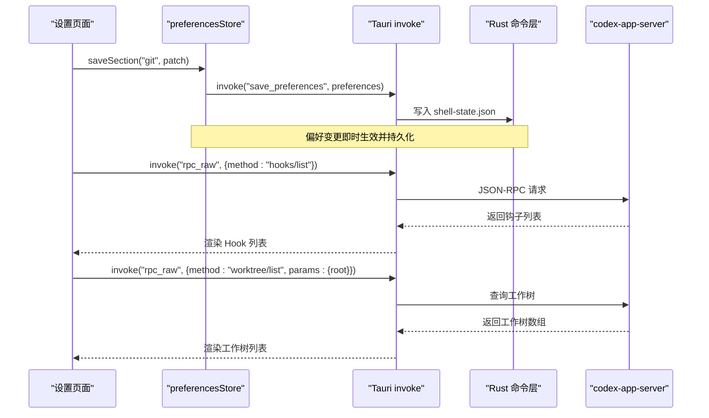
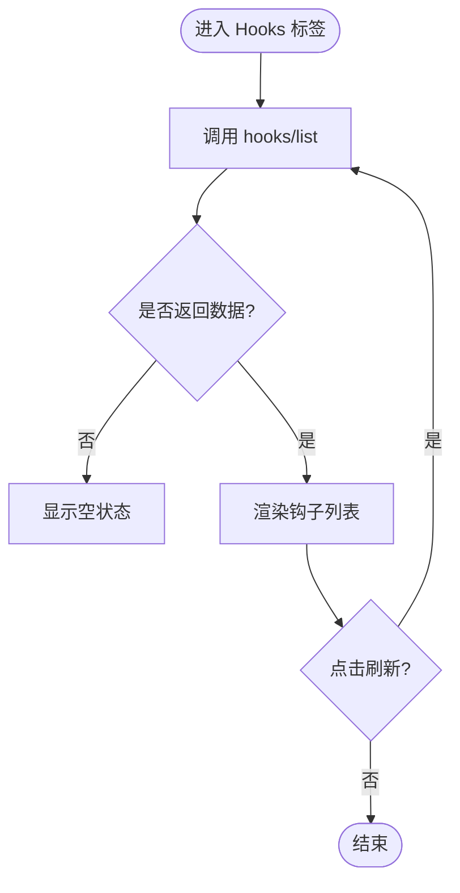
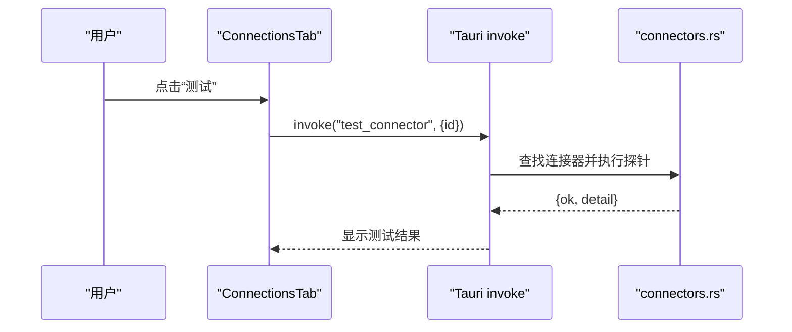
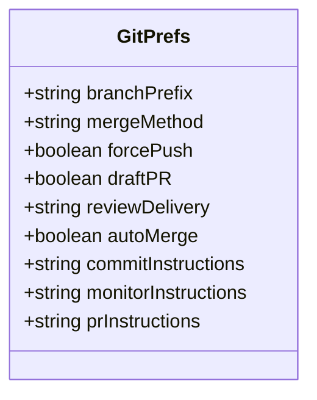
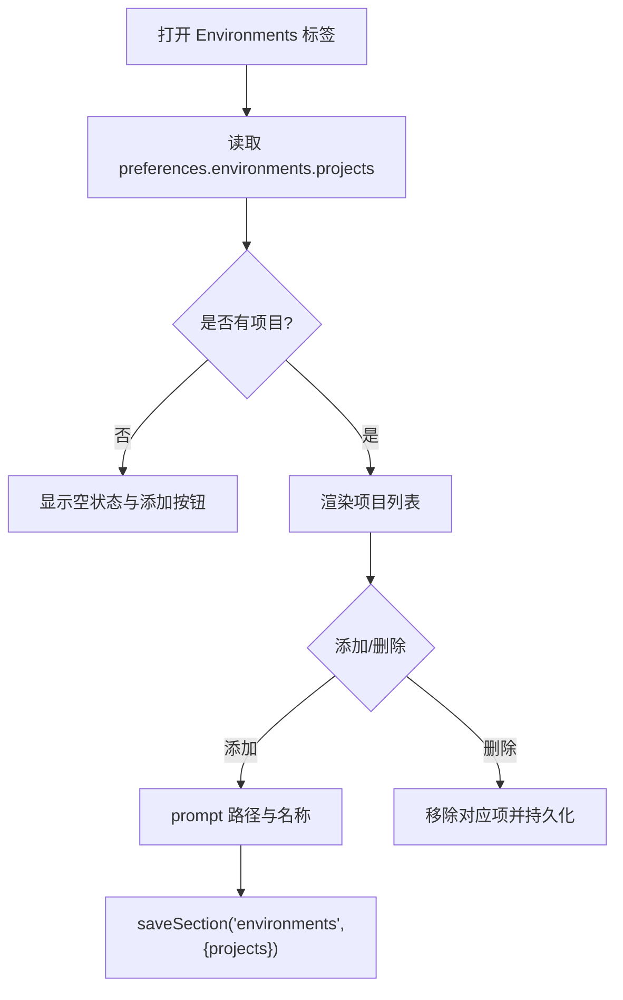
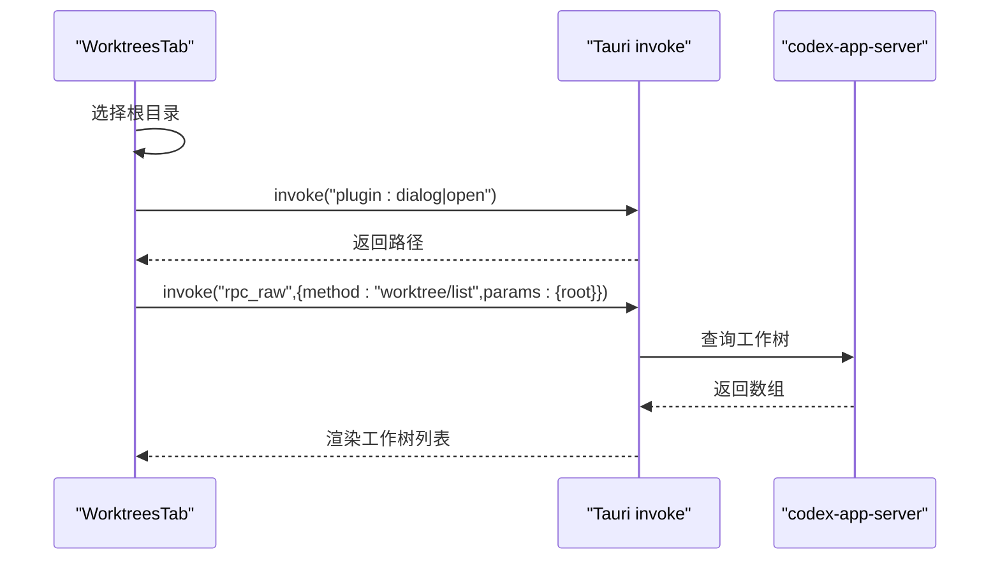
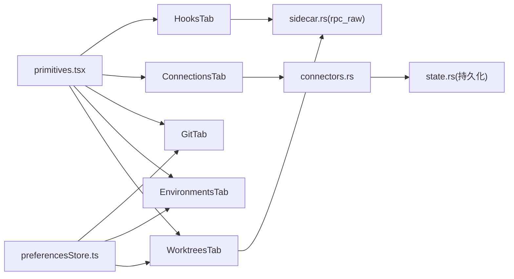

# 编码设置页面

<cite>
**本文引用的文件**
- [HooksTab.tsx](file://frontend/app/views/settings/tabs/HooksTab.tsx)
- [ConnectionsTab.tsx](file://frontend/app/views/settings/tabs/ConnectionsTab.tsx)
- [GitTab.tsx](file://frontend/app/views/settings/tabs/GitTab.tsx)
- [EnvironmentsTab.tsx](file://frontend/app/views/settings/tabs/EnvironmentsTab.tsx)
- [WorktreesTab.tsx](file://frontend/app/views/settings/tabs/WorktreesTab.tsx)
- [preferencesStore.ts](file://frontend/app/state/preferencesStore.ts)
- [primitives.tsx](file://frontend/app/views/settings/primitives.tsx)
- [connectors.rs](file://src-tauri/src/commands/connectors.rs)
- [state.rs](file://src-tauri/src/state.rs)
- [sidecar.rs](file://src-tauri/src/codex/sidecar.rs)
</cite>

## 目录
1. [简介](#简介)
2. [项目结构](#项目结构)
3. [核心组件](#核心组件)
4. [架构总览](#架构总览)
5. [详细组件分析](#详细组件分析)
6. [依赖关系分析](#依赖关系分析)
7. [性能与可靠性](#性能与可靠性)
8. [故障排查指南](#故障排查指南)
9. [结论](#结论)
10. [附录](#附录)

## 简介
本文件面向 Codex-Tauri 的“编码相关设置”页面，系统性说明以下五个标签页的能力、数据流与配置项：
- 钩子设置（HooksTab）：事件监听器列表展示与刷新机制。
- 连接设置（ConnectionsTab）：外部服务连接管理（当前实现为 SSH 连接器）与测试能力。
- Git 设置（GitTab）：分支前缀、合并策略、强制推送、草稿 PR、审阅投递方式、PR 监控与指令模板等。
- 环境设置（EnvironmentsTab）：本地开发项目列表管理与持久化。
- 工作树设置（WorktreesTab）：根目录选择、自动拉取/清理策略、保留数量与工作树列表展示。

同时涵盖各编码工具的集成点、脚本执行环境与调试支持，并提供自动化配置与最佳实践建议。

## 项目结构
前端设置页面采用 React 组件 + Tauri IPC 的模式：
- 每个设置标签页是一个独立组件，通过 primitives 提供的通用 UI 原语构建界面。
- 偏好设置通过 preferencesStore 统一读写，后端持久化到 shell-state.json。
- 需要与引擎交互的功能（如 hooks/list、worktree/list）通过 Tauri 命令 rpc_raw 转发至 codex-app-server。
- 连接管理由 Rust 侧 connectors 命令提供 CRUD 与测试能力。

图表来源
- [HooksTab.tsx:42-53](file://frontend/app/views/settings/tabs/HooksTab.tsx#L42-L53)
- [WorktreesTab.tsx:48-81](file://frontend/app/views/settings/tabs/WorktreesTab.tsx#L48-L81)
- [ConnectionsTab.tsx:42-86](file://frontend/app/views/settings/tabs/ConnectionsTab.tsx#L42-L86)
- [connectors.rs:4-52](file://src-tauri/src/commands/connectors.rs#L4-L52)
- [state.rs:150-231](file://src-tauri/src/state.rs#L150-L231)
- [sidecar.rs:224-244](file://src-tauri/src/codex/sidecar.rs#L224-L244)

章节来源
- [primitives.tsx:11-229](file://frontend/app/views/settings/primitives.tsx#L11-L229)
- [preferencesStore.ts:1-94](file://frontend/app/state/preferencesStore.ts#L1-L94)

## 核心组件
- HooksTab：通过 rpc_raw 调用 hooks/list 获取钩子列表，支持刷新；无数据时显示空状态。
- ConnectionsTab：列出 SSH 连接器，支持新增、删除、测试连通性；结果以文本提示。
- GitTab：基于 preferencesStore 维护 git 段配置，包括分支前缀、合并方法、强制推送、草稿 PR、审阅投递、自动合并及各类指令模板。
- EnvironmentsTab：维护 environments.projects 列表，支持添加/删除并持久化。
- WorktreesTab：维护 worktrees 段配置（root、autoFetch、autoCleanup、retention），并通过 rpc_raw 调用 worktree/list 获取工作树列表。

章节来源
- [HooksTab.tsx:19-53](file://frontend/app/views/settings/tabs/HooksTab.tsx#L19-L53)
- [ConnectionsTab.tsx:17-86](file://frontend/app/views/settings/tabs/ConnectionsTab.tsx#L17-L86)
- [GitTab.tsx:15-150](file://frontend/app/views/settings/tabs/GitTab.tsx#L15-L150)
- [EnvironmentsTab.tsx:19-54](file://frontend/app/views/settings/tabs/EnvironmentsTab.tsx#L19-L54)
- [WorktreesTab.tsx:19-81](file://frontend/app/views/settings/tabs/WorktreesTab.tsx#L19-L81)

## 架构总览
设置页面的数据流分为两类：
- 偏好类配置（Git、Environments、Worktrees 的部分开关/输入）：通过 preferencesStore 合并到内存状态，立即落盘到 shell-state.json，供应用重启后恢复。
- 引擎动态数据（Hooks、Worktrees 列表、连接器列表）：通过 Tauri 命令与 codex-app-server 或 Rust 状态交互，实时获取。

图表来源
- [preferencesStore.ts:76-88](file://frontend/app/state/preferencesStore.ts#L76-L88)
- [sidecar.rs:224-244](file://src-tauri/src/codex/sidecar.rs#L224-L244)
- [HooksTab.tsx:45-53](file://frontend/app/views/settings/tabs/HooksTab.tsx#L45-L53)
- [WorktreesTab.tsx:71-81](file://frontend/app/views/settings/tabs/WorktreesTab.tsx#L71-L81)

## 详细组件分析

### 钩子设置（HooksTab）
- 功能要点
  - 通过 rpc_raw 调用 hooks/list 获取引擎上报的钩子列表。
  - 支持手动刷新；加载失败或无数据时显示空状态。
  - 提供“了解更多”外链，便于查阅官方文档。
- 数据模型
  - 将后端返回的多种结构归一化为 name/command 字段。
- 交互流程
  - 组件挂载即触发一次刷新；点击刷新按钮再次调用同一接口。

图表来源
- [HooksTab.tsx:42-53](file://frontend/app/views/settings/tabs/HooksTab.tsx#L42-L53)
- [HooksTab.tsx:24-40](file://frontend/app/views/settings/tabs/HooksTab.tsx#L24-L40)

章节来源
- [HooksTab.tsx:1-103](file://frontend/app/views/settings/tabs/HooksTab.tsx#L1-L103)

### 连接设置（ConnectionsTab）
- 功能要点
  - 仅展示 SSH 类型的连接器。
  - 支持新增（prompt 主机名）、删除、测试连通性。
  - 测试结果以文本形式反馈。
- 后端能力
  - list_connectors：读取 Rust 状态中的连接器列表。
  - save_connector / delete_connector：增删改连接器并持久化。
  - test_connector：占位探针，返回 ok/detail。
- 认证与配置
  - 连接器配置以 JSON 存储，包含 host/user 等字段；实际认证细节由连接器类型决定。

图表来源
- [ConnectionsTab.tsx:75-86](file://frontend/app/views/settings/tabs/ConnectionsTab.tsx#L75-L86)
- [connectors.rs:34-52](file://src-tauri/src/commands/connectors.rs#L34-L52)

章节来源
- [ConnectionsTab.tsx:1-131](file://frontend/app/views/settings/tabs/ConnectionsTab.tsx#L1-L131)
- [connectors.rs:1-53](file://src-tauri/src/commands/connectors.rs#L1-L53)
- [state.rs:108-115](file://src-tauri/src/state.rs#L108-L115)

### Git 设置（GitTab）
- 功能要点
  - 分支前缀：默认值 codex/，可自定义。
  - 合并方法：merge 或 squash（兼容历史 rebase 值）。
  - 强制推送：开关控制。
  - 草稿 PR：默认开启。
  - 审阅投递：inline 或 detached（兼容历史 comments/detached）。
  - PR 监控：自动合并开关与监控说明。
  - 提交与 PR 指令模板：可编辑的文本框。
- 数据持久化
  - 所有选项均通过 preferencesStore 保存至 git 段，重启后恢复。

图表来源
- [GitTab.tsx:15-25](file://frontend/app/views/settings/tabs/GitTab.tsx#L15-L25)
- [GitTab.tsx:27-150](file://frontend/app/views/settings/tabs/GitTab.tsx#L27-L150)

章节来源
- [GitTab.tsx:1-154](file://frontend/app/views/settings/tabs/GitTab.tsx#L1-L154)
- [preferencesStore.ts:45-88](file://frontend/app/state/preferencesStore.ts#L45-L88)

### 环境设置（EnvironmentsTab）
- 功能要点
  - 维护 projects 列表（name/path），用于本地开发环境快速定位。
  - 支持添加（路径+名称）与删除，操作后立即持久化。
  - 提供“了解更多”链接指向官方文档。
- 数据模型
  - EnvironmentsPrefs.projects 为 EnvironmentProject[]。

图表来源
- [EnvironmentsTab.tsx:28-54](file://frontend/app/views/settings/tabs/EnvironmentsTab.tsx#L28-L54)
- [EnvironmentsTab.tsx:56-113](file://frontend/app/views/settings/tabs/EnvironmentsTab.tsx#L56-L113)

章节来源
- [EnvironmentsTab.tsx:1-114](file://frontend/app/views/settings/tabs/EnvironmentsTab.tsx#L1-L114)
- [preferencesStore.ts:76-88](file://frontend/app/state/preferencesStore.ts#L76-L88)

### 工作树设置（WorktreesTab）
- 功能要点
  - 根目录：支持文本输入与系统目录选择器；选择后自动拉取该根下的工作树列表。
  - 自动拉取：创建前是否先 fetch。
  - 自动清理：是否自动删除旧工作树。
  - 保留数量：最多保留的工作树数量。
  - 列表展示：分支、路径、状态。
- 数据源
  - 配置项保存在 worktrees 段；列表通过 rpc_raw 调用 worktree/list 获取。

图表来源
- [WorktreesTab.tsx:48-81](file://frontend/app/views/settings/tabs/WorktreesTab.tsx#L48-L81)
- [WorktreesTab.tsx:83-163](file://frontend/app/views/settings/tabs/WorktreesTab.tsx#L83-L163)

章节来源
- [WorktreesTab.tsx:1-164](file://frontend/app/views/settings/tabs/WorktreesTab.tsx#L1-L164)
- [preferencesStore.ts:76-88](file://frontend/app/state/preferencesStore.ts#L76-L88)

## 依赖关系分析
- 前端依赖
  - primitives：统一的设置页 UI 原语（PageHead、Block、Row、Switch、Segmented、TextInput、SettingsButton）。
  - preferencesStore：偏好段的读取、订阅、合并与持久化。
  - i18n：国际化文案。
- 后端依赖
  - state.rs：定义 Settings、Preferences、Connector 等数据结构，负责加载/保存 shell-state.json。
  - connectors.rs：暴露连接器管理的 Tauri 命令。
  - sidecar.rs：启动/连接 codex-app-server，封装 rpc_raw 转发。

图表来源
- [primitives.tsx:11-229](file://frontend/app/views/settings/primitives.tsx#L11-L229)
- [preferencesStore.ts:1-94](file://frontend/app/state/preferencesStore.ts#L1-L94)
- [connectors.rs:1-53](file://src-tauri/src/commands/connectors.rs#L1-L53)
- [sidecar.rs:224-244](file://src-tauri/src/codex/sidecar.rs#L224-L244)

章节来源
- [state.rs:27-64](file://src-tauri/src/state.rs#L27-L64)
- [state.rs:108-115](file://src-tauri/src/state.rs#L108-L115)
- [state.rs:150-231](file://src-tauri/src/state.rs#L150-L231)

## 性能与可靠性
- 偏好更新
  - 先本地合并再异步持久化，保证 UI 即时响应；失败时记录日志但不阻断交互。
- 引擎通信
  - hooks/list、worktree/list 等 RPC 在失败时降级为空列表，避免页面崩溃。
  - sidecar 连接具备重试逻辑，避免冷启动时的竞态导致首次请求失败。
- 连接器测试
  - 当前为占位探针，后续可扩展真实连通性检查。

[本节为通用指导，不直接分析具体文件]

## 故障排查指南
- 无法加载钩子/工作树列表
  - 检查 codex-app-server 是否已启动并可连接（sidecar 会尝试连接并记录错误）。
  - 确认 rpc_raw 方法名与参数格式正确。
- 连接器测试失败
  - 确认连接器 id 存在且配置完整；查看 test_connector 返回的 detail/error。
- 偏好未持久化
  - 检查 save_preferences 调用是否成功；查看控制台日志中保存失败的错误信息。
- 工作树根目录无效
  - 使用系统目录选择器选取有效 Git 仓库根；若列表为空，点击刷新重试。

章节来源
- [sidecar.rs:188-222](file://src-tauri/src/codex/sidecar.rs#L188-L222)
- [preferencesStore.ts:76-88](file://frontend/app/state/preferencesStore.ts#L76-L88)
- [connectors.rs:34-52](file://src-tauri/src/commands/connectors.rs#L34-L52)

## 结论
Codex-Tauri 的设置页面通过清晰的前后端职责划分，实现了：
- 偏好驱动的静态配置（Git、Environments、Worktrees 部分开关/输入）的可靠持久化。
- 引擎驱动的动态数据（Hooks、Worktrees 列表、连接器列表）的实时获取与展示。
- 可扩展的连接测试与未来更多连接器类型的接入点。
建议在实际使用中遵循：
- 优先使用系统目录选择器配置根目录，减少路径错误。
- 合理设置工作树保留数量与自动清理策略，避免磁盘占用过高。
- 为 Git 审阅与 PR 监控配置清晰的指令模板，提升协作效率。

[本节为总结性内容，不直接分析具体文件]

## 附录
- 常用配置项速查
  - Git：branchPrefix、mergeMethod、forcePush、draftPR、reviewDelivery、autoMerge、commitInstructions、monitorInstructions、prInstructions。
  - Environments：projects（name/path）。
  - Worktrees：root、autoFetch、autoCleanup、retention。
- 扩展建议
  - 为 test_connector 增加真实连通性探测（如 SSH 握手）。
  - 为 HooksTab 增加启用/禁用开关与编辑能力（需后端支持）。
  - 为 WorktreesTab 增加创建/删除工作树的命令通道。

[本节为补充信息，不直接分析具体文件]