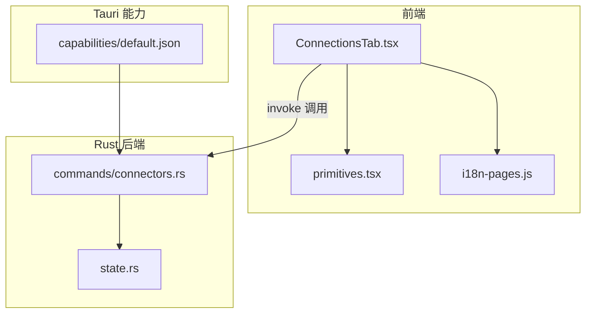
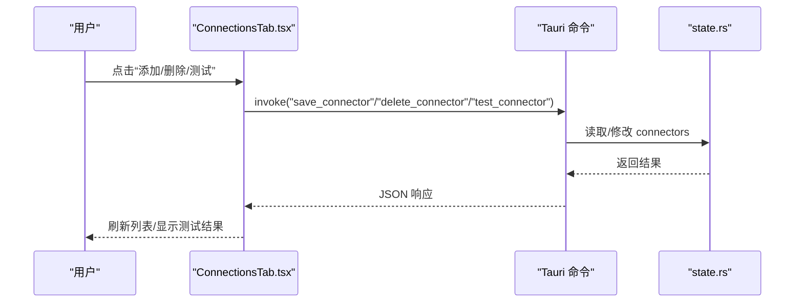
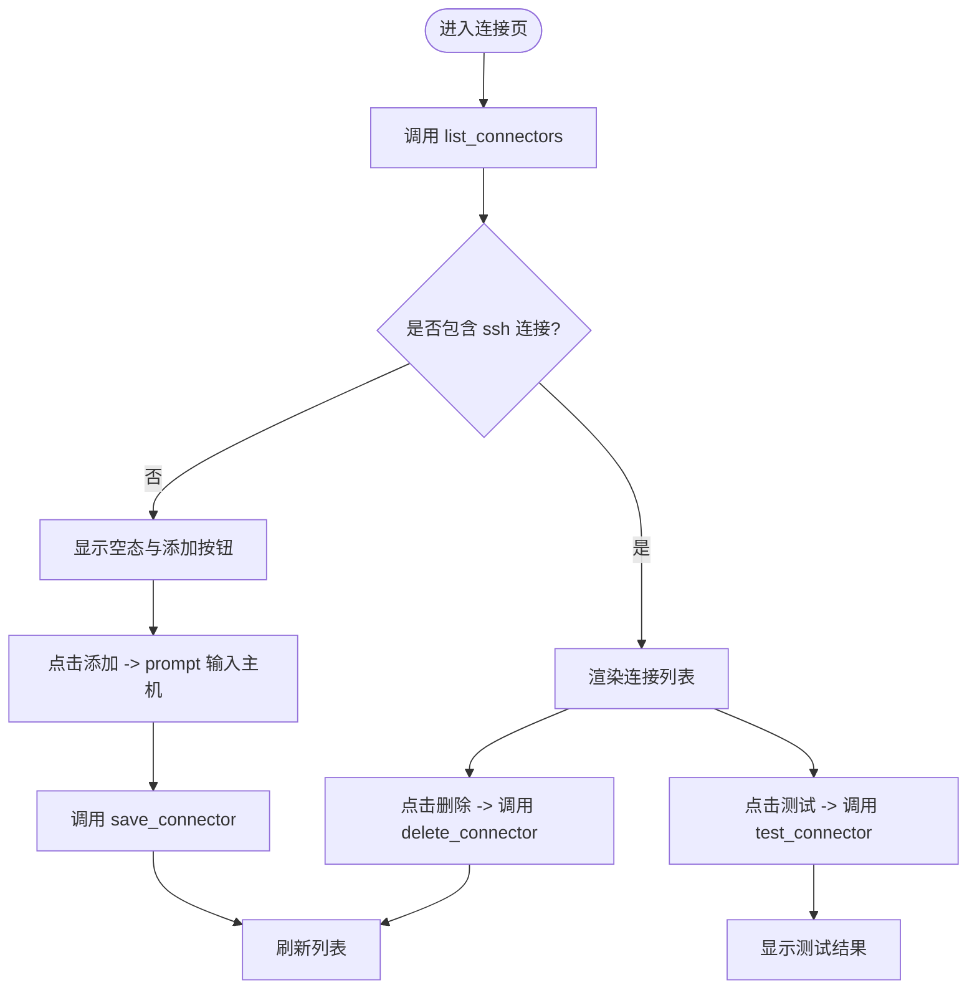
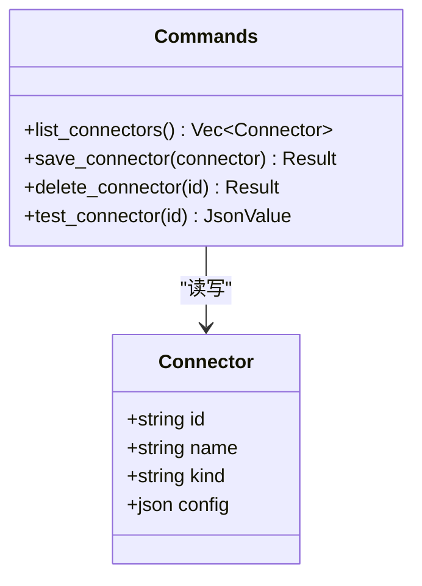
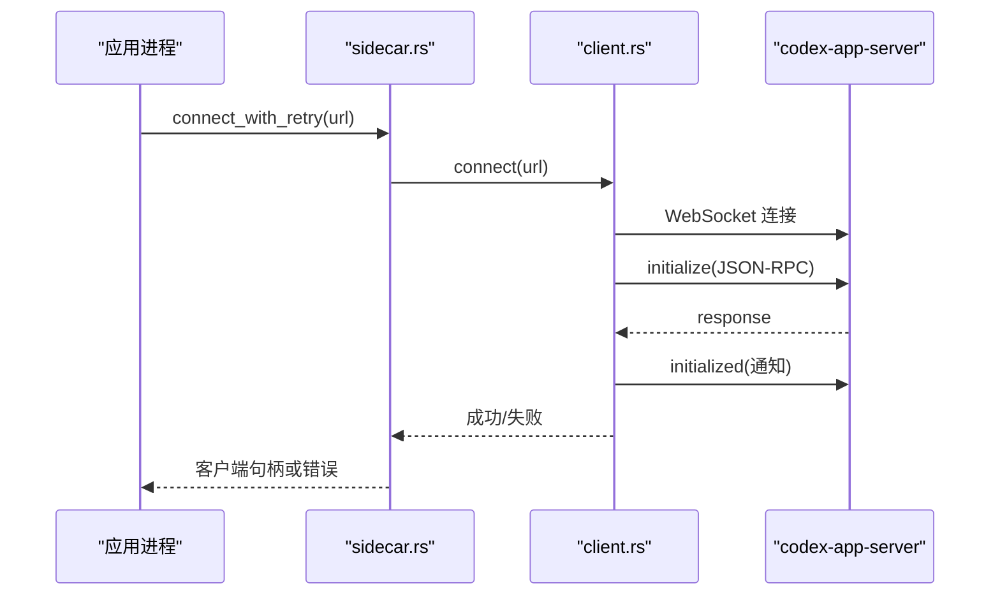
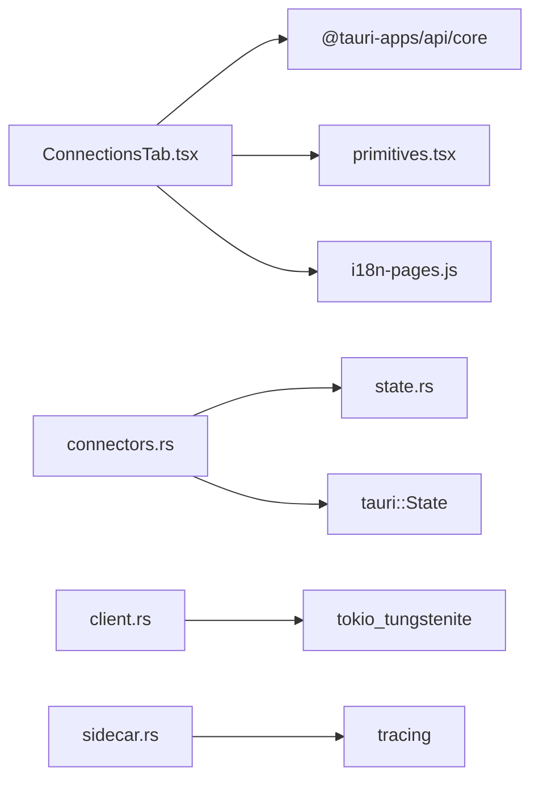

# 连接设置

<cite>
**本文引用的文件**
- [ConnectionsTab.tsx](file://frontend/app/views/settings/tabs/ConnectionsTab.tsx)
- [connectors.rs](file://src-tauri/src/commands/connectors.rs)
- [state.rs](file://src-tauri/src/state.rs)
- [primitives.tsx](file://frontend/app/views/settings/primitives.tsx)
- [i18n-pages.js](file://frontend/src/js/i18n-pages.js)
- [mod.rs](file://src-tauri/src/commands/mod.rs)
- [default.json](file://src-tauri/capabilities/default.json)
- [client.rs](file://src-tauri/src/codex/client.rs)
- [sidecar.rs](file://src-tauri/src/codex/sidecar.rs)
- [adapter.rs](file://src-tauri/src/codex/adapter.rs)
</cite>

## 目录
1. [简介](#简介)
2. [项目结构](#项目结构)
3. [核心组件](#核心组件)
4. [架构总览](#架构总览)
5. [详细组件分析](#详细组件分析)
6. [依赖关系分析](#依赖关系分析)
7. [性能考虑](#性能考虑)
8. [故障排查指南](#故障排查指南)
9. [结论](#结论)
10. [附录](#附录)

## 简介
本文件为 Codex-Tauri 的“连接设置”页面提供完整技术文档，聚焦 ConnectionsTab 组件与后端连接器（Connector）管理。内容涵盖：
- 连接配置界面与数据流
- 认证机制与网络通信协议
- 外部服务连接类型、配置参数与状态监控
- 连接池管理、故障转移与重试策略
- 安全性配置、代理支持与网络诊断工具
- 常见问题排查与性能调优建议

## 项目结构
连接设置由前端 React 组件与 Tauri Rust 命令共同实现：
- 前端：ConnectionsTab 负责展示 SSH 连接器列表、添加/删除/测试连接，并通过 Tauri invoke 调用后端命令。
- 后端：connectors.rs 暴露 list/save/delete/test 四个命令；state.rs 维护连接器持久化状态；capabilities 控制文件系统权限以保存 shell-state.json。

图表来源
- [ConnectionsTab.tsx:42-130](file://frontend/app/views/settings/tabs/ConnectionsTab.tsx#L42-L130)
- [connectors.rs:4-52](file://src-tauri/src/commands/connectors.rs#L4-L52)
- [state.rs:108-174](file://src-tauri/src/state.rs#L108-L174)
- [default.json:1-31](file://src-tauri/capabilities/default.json#L1-L31)

章节来源
- [ConnectionsTab.tsx:42-130](file://frontend/app/views/settings/tabs/ConnectionsTab.tsx#L42-L130)
- [connectors.rs:4-52](file://src-tauri/src/commands/connectors.rs#L4-L52)
- [state.rs:108-174](file://src-tauri/src/state.rs#L108-L174)
- [default.json:1-31](file://src-tauri/capabilities/default.json#L1-L31)

## 核心组件
- 前端 ConnectionsTab：
  - 加载并过滤仅显示 kind=ssh 的连接
  - 通过 prompt 输入主机名创建新连接
  - 支持删除与测试连接
  - 使用 primitives 提供的 PageHead/Block/SettingsButton 渲染
- 后端 connectors 命令：
  - list_connectors：返回内存中的连接器列表
  - save_connector：新增或更新连接器并持久化
  - delete_connector：按 id 删除并持久化
  - test_connector：占位探针，返回 ok/detail
- 状态 state.rs：
  - Connector 结构体包含 id/name/kind/config
  - InnerState 持有 connectors 集合
  - AppState.save() 将状态写入 shell-state.json（需要 fs 权限）

章节来源
- [ConnectionsTab.tsx:17-86](file://frontend/app/views/settings/tabs/ConnectionsTab.tsx#L17-L86)
- [connectors.rs:4-52](file://src-tauri/src/commands/connectors.rs#L4-L52)
- [state.rs:108-174](file://src-tauri/src/state.rs#L108-L174)

## 架构总览
连接设置的数据流遵循“前端 UI → Tauri 命令 → 状态持久化”的模式。当前 test 为占位实现，后续可扩展为真实连通性探测。

图表来源
- [ConnectionsTab.tsx:46-86](file://frontend/app/views/settings/tabs/ConnectionsTab.tsx#L46-L86)
- [connectors.rs:4-52](file://src-tauri/src/commands/connectors.rs#L4-L52)
- [state.rs:108-174](file://src-tauri/src/state.rs#L108-L174)

## 详细组件分析

### 连接配置界面（ConnectionsTab）
- 功能要点
  - 初始化时调用 list_connectors 获取连接器列表，并过滤出 ssh 类型
  - 空列表时提示“通过 SSH 连接到远程设备”，并提供“添加”按钮
  - 添加流程：prompt 输入主机名，生成唯一 id，kind=ssh，config 包含 host/user
  - 删除：调用 delete_connector 后刷新
  - 测试：调用 test_connector，根据返回的 ok/detail/error 显示结果
- 国际化
  - 标题、按钮文案、提示信息均通过 i18n 键值获取

图表来源
- [ConnectionsTab.tsx:42-130](file://frontend/app/views/settings/tabs/ConnectionsTab.tsx#L42-L130)
- [i18n-pages.js:828-841](file://frontend/src/js/i18n-pages.js#L828-L841)

章节来源
- [ConnectionsTab.tsx:42-130](file://frontend/app/views/settings/tabs/ConnectionsTab.tsx#L42-L130)
- [i18n-pages.js:828-841](file://frontend/src/js/i18n-pages.js#L828-L841)

### 后端连接器命令（connectors.rs）
- list_connectors：从 AppState 中克隆 connectors 返回
- save_connector：新增或覆盖同 id 的连接器，随后持久化
- delete_connector：移除指定 id 的连接器，随后持久化
- test_connector：当前为占位实现，返回固定 ok=true 与 stub 信息

图表来源
- [state.rs:108-115](file://src-tauri/src/state.rs#L108-L115)
- [connectors.rs:4-52](file://src-tauri/src/commands/connectors.rs#L4-L52)

章节来源
- [connectors.rs:4-52](file://src-tauri/src/commands/connectors.rs#L4-L52)
- [state.rs:108-115](file://src-tauri/src/state.rs#L108-L115)

### 状态与持久化（state.rs）
- Connector 结构体用于表示一个连接条目，kind 区分连接类型（当前仅 ssh）
- InnerState 集中管理 settings/preferences/pets/calendar/cinema/connectors/shortcuts 等
- AppState.save() 将 InnerState 序列化为 shell-state.json，采用临时文件+原子重命名保证一致性
- 默认语言 zh-CN、默认 app_server_listen 地址在启动时填充

章节来源
- [state.rs:108-174](file://src-tauri/src/state.rs#L108-L174)
- [state.rs:176-217](file://src-tauri/src/state.rs#L176-L217)

### 权限与安全（capabilities）
- default.json 启用 fs:default 及若干 fs 子权限，允许读写文本文件、检查存在、创建目录等，支撑 shell-state.json 的持久化
- 未启用系统级网络访问能力，连接器测试不涉及直接网络操作（当前为占位）

章节来源
- [default.json:1-31](file://src-tauri/capabilities/default.json#L1-L31)

### 认证机制与网络通信协议
- 连接器认证：当前 Connector.config 仅包含 host/user 字段，密码/密钥等敏感信息未在 UI 暴露，亦未存储于明文配置中（可视为预留扩展点）
- 应用内通信协议：CodexClient 通过 WebSocket 与 codex-app-server 建立连接，完成 initialize/initialized 握手，并使用 JSON-RPC 进行请求/通知/响应
- 侧车（sidecar）连接：sidecar 层对首次连接进行有限次重试，避免冷启动竞态导致的瞬时失败

图表来源
- [sidecar.rs:188-222](file://src-tauri/src/codex/sidecar.rs#L188-L222)
- [client.rs:37-133](file://src-tauri/src/codex/client.rs#L37-L133)

章节来源
- [client.rs:37-133](file://src-tauri/src/codex/client.rs#L37-L133)
- [sidecar.rs:188-222](file://src-tauri/src/codex/sidecar.rs#L188-L222)

### 连接类型、配置参数与状态监控
- 连接类型：当前仅支持 ssh
- 配置参数：
  - id：唯一标识
  - name：显示名称
  - kind：连接类型（ssh）
  - config.host：目标主机
  - config.user：用户名（可选）
- 状态监控：
  - 前端通过 test_connector 触发探针，当前返回固定成功消息
  - 实际连通性可由未来扩展实现（如端口探测、SSH 握手等）

章节来源
- [ConnectionsTab.tsx:17-86](file://frontend/app/views/settings/tabs/ConnectionsTab.tsx#L17-L86)
- [connectors.rs:34-52](file://src-tauri/src/commands/connectors.rs#L34-L52)

### 连接池管理、故障转移与重试策略
- 连接器池：当前以内存数组形式维护，无连接复用或池化逻辑
- 故障转移：未实现多连接自动切换
- 重试策略：
  - 应用内部与 codex-app-server 的 WebSocket 连接具备有限重试（侧车层），避免冷启动竞态
  - 连接器测试目前无重试

章节来源
- [sidecar.rs:188-222](file://src-tauri/src/codex/sidecar.rs#L188-L222)
- [connectors.rs:34-52](file://src-tauri/src/commands/connectors.rs#L34-L52)

### 代理支持与网络诊断工具
- 代理支持：当前代码未暴露代理配置项，也未在连接器测试中集成代理
- 网络诊断：
  - 可通过浏览器控制台或 Tauri 日志观察 WebSocket 连接与 JSON-RPC 交互
  - 适配器（adapter.rs）监听本地 HTTP 端口处理连接，便于调试协议适配层

章节来源
- [adapter.rs:81-116](file://src-tauri/src/codex/adapter.rs#L81-L116)

## 依赖关系分析
- 前端依赖
  - @tauri-apps/api/core 用于 invoke 调用
  - 自定义 primitives 提供统一 UI 控件
  - i18n 提供多语言文案
- 后端依赖
  - tauri::State 注入 AppState
  - serde/serde_json 序列化/反序列化
  - tokio/tokio_tungstenite 用于 WebSocket 通信（在 client.rs）
  - tracing 用于日志（在 sidecar.rs）

图表来源
- [ConnectionsTab.tsx:8-11](file://frontend/app/views/settings/tabs/ConnectionsTab.tsx#L8-L11)
- [connectors.rs:1-3](file://src-tauri/src/commands/connectors.rs#L1-L3)
- [client.rs:1-21](file://src-tauri/src/codex/client.rs#L1-L21)
- [sidecar.rs:188-222](file://src-tauri/src/codex/sidecar.rs#L188-L222)

章节来源
- [mod.rs:1-11](file://src-tauri/src/commands/mod.rs#L1-L11)
- [package.json:15-29](file://frontend/package.json#L15-L29)

## 性能考虑
- 前端
  - 列表渲染基于简单数组映射，数据量较小时性能良好
  - 测试操作为异步，不会阻塞 UI
- 后端
  - 状态读写使用 Mutex 保护，适合桌面端单进程场景
  - 持久化采用临时文件+原子重命名，降低损坏风险
- 网络
  - WebSocket 请求超时与初始化超时已内置，避免长时间挂起
  - 侧车层重试次数与间隔可调，平衡冷启动体验与资源占用

[本节为通用指导，不直接分析具体文件]

## 故障排查指南
- 无法加载连接器列表
  - 检查 Tauri 能力是否包含 fs:default 及相关权限
  - 确认 shell-state.json 可读且格式正确
- 添加/删除无效
  - 确认 save_connector/delete_connector 调用成功
  - 检查持久化是否执行（查看文件变更时间戳）
- 测试连接始终成功
  - 当前为占位实现，需扩展真实探针逻辑
- WebSocket 连接失败
  - 检查 codex-app-server 是否运行且端口可达
  - 关注 sidecar 层的重试日志与错误信息
- 适配器连接异常
  - 检查 adapter 监听端口是否被占用
  - 查看 handle_connection 的错误日志

章节来源
- [default.json:1-31](file://src-tauri/capabilities/default.json#L1-L31)
- [state.rs:176-217](file://src-tauri/src/state.rs#L176-L217)
- [connectors.rs:4-52](file://src-tauri/src/commands/connectors.rs#L4-L52)
- [sidecar.rs:188-222](file://src-tauri/src/codex/sidecar.rs#L188-L222)
- [adapter.rs:81-116](file://src-tauri/src/codex/adapter.rs#L81-L116)

## 结论
当前连接设置页面实现了 SSH 连接器的基本增删查与占位测试能力，配合 Tauri 命令与状态持久化形成闭环。WebSocket 与 JSON-RPC 协议保障了与 codex-app-server 的稳定通信，并在侧车层提供了冷启动重试。后续可在以下方面增强：
- 完善连接器测试的真实连通性探测（端口/SSH 握手）
- 扩展认证方式（密钥、证书、代理）
- 引入连接池与故障转移策略
- 增加更丰富的网络诊断与可视化

[本节为总结性内容，不直接分析具体文件]

## 附录
- 相关命令注册
  - commands/mod.rs 中注册了 connectors 模块，使前端可通过 invoke 调用对应命令
- 国际化键值
  - i18n-pages.js 定义了连接页所需的多语言文案键值

章节来源
- [mod.rs:1-11](file://src-tauri/src/commands/mod.rs#L1-L11)
- [i18n-pages.js:828-841](file://frontend/src/js/i18n-pages.js#L828-L841)