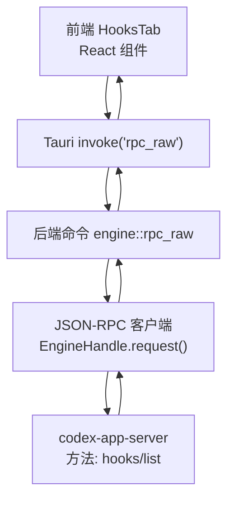
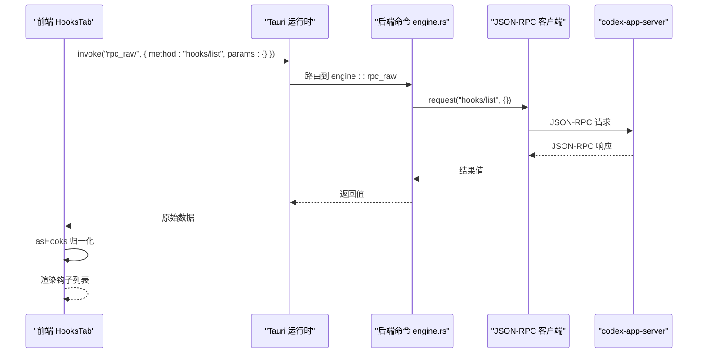
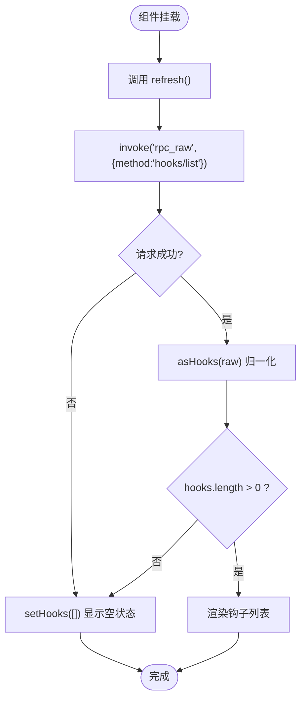
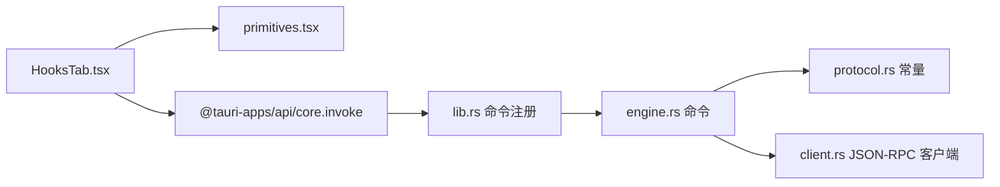

# 钩子设置

<cite>
**本文引用的文件**
- [HooksTab.tsx](file://frontend/app/views/settings/tabs/HooksTab.tsx)
- [primitives.tsx](file://frontend/app/views/settings/primitives.tsx)
- [protocol.rs](file://src-tauri/src/codex/protocol.rs)
- [engine.rs](file://src-tauri/src/commands/engine.rs)
- [lib.rs](file://src-tauri/src/lib.rs)
</cite>

## 目录
1. [简介](#简介)
2. [项目结构](#项目结构)
3. [核心组件](#核心组件)
4. [架构总览](#架构总览)
5. [详细组件分析](#详细组件分析)
6. [依赖关系分析](#依赖关系分析)
7. [性能考虑](#性能考虑)
8. [故障排查指南](#故障排查指南)
9. [结论](#结论)
10. [附录](#附录)

## 简介
本章节面向 Codex-Tauri 的“钩子设置”页面，聚焦 HooksTab 组件的实现机制与数据流。该页面通过 Tauri invoke 调用后端命令 rpc_raw，将 JSON-RPC 方法 hooks/list 转发给官方 codex-app-server，获取并渲染当前引擎报告的钩子列表。若服务端不可用或返回空，页面会展示诚实的空状态。

## 项目结构
- 前端设置页：HooksTab 位于设置页签中，使用统一的设置原语组件进行布局与交互。
- 后端桥接：Tauri 暴露命令 rpc_raw，用于透传任意 JSON-RPC 方法到引擎侧（codex-app-server）。
- 协议常量：hooks/list 在协议层以常量定义，确保前后端一致。

图表来源
- [HooksTab.tsx:42-53](file://frontend/app/views/settings/tabs/HooksTab.tsx#L42-L53)
- [lib.rs:147-147](file://src-tauri/src/lib.rs#L147-L147)
- [engine.rs:13-20](file://src-tauri/src/commands/engine.rs#L13-L20)
- [protocol.rs:76-76](file://src-tauri/src/codex/protocol.rs#L76-L76)

章节来源
- [HooksTab.tsx:1-103](file://frontend/app/views/settings/tabs/HooksTab.tsx#L1-L103)
- [lib.rs:71-148](file://src-tauri/src/lib.rs#L71-L148)
- [protocol.rs:76-76](file://src-tauri/src/codex/protocol.rs#L76-L76)

## 核心组件
- HooksTab：负责加载、转换和渲染钩子列表；提供刷新按钮；处理空态与加载中状态。
- asHooks：对服务端返回的数据进行兼容解析，支持数组、data 包裹、hooks 包裹等多种格式，并将条目标准化为 { name, command }。
- 设置原语：PageHead、Block、SettingsButton 等统一样式与交互。

章节来源
- [HooksTab.tsx:19-40](file://frontend/app/views/settings/tabs/HooksTab.tsx#L19-L40)
- [HooksTab.tsx:42-103](file://frontend/app/views/settings/tabs/HooksTab.tsx#L42-L103)
- [primitives.tsx:11-51](file://frontend/app/views/settings/primitives.tsx#L11-L51)
- [primitives.tsx:101-126](file://frontend/app/views/settings/primitives.tsx#L101-L126)

## 架构总览
HooksTab 通过 Tauri 的 invoke 调用后端命令 rpc_raw，该方法将 JSON-RPC 请求转发至 codex-app-server。服务端响应后，前端进行数据归一化并渲染。整个流程遵循“前端发起 → 后端透传 → 服务端处理 → 响应回传 → 前端渲染”的标准链路。

图表来源
- [HooksTab.tsx:45-49](file://frontend/app/views/settings/tabs/HooksTab.tsx#L45-L49)
- [lib.rs:147-147](file://src-tauri/src/lib.rs#L147-L147)
- [engine.rs:13-20](file://src-tauri/src/commands/engine.rs#L13-L20)
- [protocol.rs:148-170](file://src-tauri/src/codex/protocol.rs#L148-L170)

## 详细组件分析

### HooksTab 组件实现机制
- 事件监听与生命周期
  - 组件挂载时自动触发一次刷新，调用 rpc_raw 获取 hooks/list。
  - 用户点击“重新加载”按钮时再次触发相同 RPC。
- 数据获取与渲染
  - 使用 useState 管理 hooks 状态，初始为 null（加载中）。
  - 成功时通过 asHooks 将多种返回格式转换为标准 HookEntry[]。
  - 失败或无数据时显示空状态或“未找到钩子”。
- 国际化与外链
  - 标题、描述、按钮文案通过 i18n 函数 label 获取。
  - “了解更多”链接打开官方文档站点。

图表来源
- [HooksTab.tsx:42-53](file://frontend/app/views/settings/tabs/HooksTab.tsx#L42-L53)
- [HooksTab.tsx:24-40](file://frontend/app/views/settings/tabs/HooksTab.tsx#L24-L40)
- [HooksTab.tsx:69-100](file://frontend/app/views/settings/tabs/HooksTab.tsx#L69-L100)

章节来源
- [HooksTab.tsx:42-103](file://frontend/app/views/settings/tabs/HooksTab.tsx#L42-L103)

### asHooks 数据格式转换
- 输入兼容：支持直接数组、{ data: [...] }、{ hooks: [...] } 三种常见返回结构。
- 条目映射：每个条目映射为 { name, command }；name 优先取 name，否则 fallback 到 event；command 必须为字符串，否则为空串。
- 健壮性：对非对象或非数组输入安全降级为空列表。

章节来源
- [HooksTab.tsx:24-40](file://frontend/app/views/settings/tabs/HooksTab.tsx#L24-L40)

### 后端命令与 RPC 转发
- Tauri 命令注册：lib.rs 中注册了 commands::engine::rpc_raw，供前端 invoke 调用。
- 通用转发：engine.rs 中的 rpc 辅助函数将方法名与参数透传给 EngineHandle.request。
- 协议常量：hooks/list 在 protocol.rs 中定义为常量，避免硬编码字符串不一致。

章节来源
- [lib.rs:147-147](file://src-tauri/src/lib.rs#L147-L147)
- [engine.rs:13-20](file://src-tauri/src/commands/engine.rs#L13-L20)
- [protocol.rs:76-76](file://src-tauri/src/codex/protocol.rs#L76-L76)

### 错误处理策略
- 前端容错：invoke 失败时 setHooks([])，保证页面可降级显示空状态。
- 后端超时与错误：client.rs 中对请求设置超时，并在超时或错误时返回结构化错误信息，便于上层处理。
- 协议解析：protocol.rs 定义了 RpcError 与消息解析逻辑，确保错误码与消息能正确传递。

章节来源
- [HooksTab.tsx:45-49](file://frontend/app/views/settings/tabs/HooksTab.tsx#L45-L49)
- [protocol.rs:131-137](file://src-tauri/src/codex/protocol.rs#L131-L137)
- [protocol.rs:161-170](file://src-tauri/src/codex/protocol.rs#L161-L170)
- [client.rs:148-170](file://src-tauri/src/codex/client.rs#L148-L170)

### 钩子的生命周期管理与执行环境
- 生命周期：由 codex-app-server 管理；前端仅负责查询与展示。
- 执行环境：钩子命令的执行由引擎侧根据配置与环境变量决定；桌面端不直接注入额外环境变量，除非通过其他配置接口写入。
- 调试支持：可通过 Tauri 日志与 JSON-RPC 错误信息进行定位；必要时结合服务端诊断接口查看运行状态。

章节来源
- [protocol.rs:76-76](file://src-tauri/src/codex/protocol.rs#L76-L76)
- [client.rs:148-170](file://src-tauri/src/codex/client.rs#L148-L170)

### 配置验证规则与安全考虑
- 配置来源：hooks/list 由引擎报告，前端不做本地校验；如需限制，应在服务端或配置层实施。
- 安全建议：
  - 仅允许可信来源生成钩子配置。
  - 避免在 UI 中直接编辑命令内容，减少注入风险。
  - 对外部链接（如“了解更多”）使用受控跳转。
- 性能建议：
  - 刷新频率可控，避免频繁 RPC。
  - 列表渲染保持轻量，避免不必要的重计算。

章节来源
- [HooksTab.tsx:55-67](file://frontend/app/views/settings/tabs/HooksTab.tsx#L55-L67)

### 最佳实践与常见问题
- 最佳实践
  - 使用 asHooks 的兼容解析，适配不同版本的服务端返回结构。
  - 在刷新前后可添加短暂 loading 提示，提升用户体验。
  - 对空状态提供明确说明与操作指引（如“重新加载”）。
- 常见问题
  - 页面一直显示加载中：检查网络与服务端是否可达；查看 Tauri 日志与 RPC 错误。
  - 列表为空：确认服务端已启用并报告钩子；尝试手动刷新。
  - 名称显示异常：确认服务端返回的 name/event/command 字段类型符合预期。

章节来源
- [HooksTab.tsx:24-40](file://frontend/app/views/settings/tabs/HooksTab.tsx#L24-L40)
- [HooksTab.tsx:69-100](file://frontend/app/views/settings/tabs/HooksTab.tsx#L69-L100)

## 依赖关系分析
- 前端依赖
  - React Hooks：useState、useCallback、useEffect 管理状态与副作用。
  - Tauri API：invoke 调用后端命令。
  - 设置原语：PageHead、Block、SettingsButton 提供统一 UI。
- 后端依赖
  - Tauri 命令：engine::rpc_raw 作为通用 JSON-RPC 转发入口。
  - 协议常量：hooks/list 统一命名。
  - JSON-RPC 客户端：EngineHandle.request 负责发送与等待响应。

图表来源
- [HooksTab.tsx:9-13](file://frontend/app/views/settings/tabs/HooksTab.tsx#L9-L13)
- [primitives.tsx:11-51](file://frontend/app/views/settings/primitives.tsx#L11-L51)
- [lib.rs:147-147](file://src-tauri/src/lib.rs#L147-L147)
- [engine.rs:13-20](file://src-tauri/src/commands/engine.rs#L13-L20)
- [protocol.rs:76-76](file://src-tauri/src/codex/protocol.rs#L76-L76)
- [client.rs:148-170](file://src-tauri/src/codex/client.rs#L148-L170)

章节来源
- [HooksTab.tsx:9-13](file://frontend/app/views/settings/tabs/HooksTab.tsx#L9-L13)
- [lib.rs:71-148](file://src-tauri/src/lib.rs#L71-L148)
- [engine.rs:13-20](file://src-tauri/src/commands/engine.rs#L13-L20)
- [protocol.rs:76-76](file://src-tauri/src/codex/protocol.rs#L76-L76)
- [client.rs:148-170](file://src-tauri/src/codex/client.rs#L148-L170)

## 性能考虑
- 减少重复请求：仅在首次加载与用户主动刷新时调用 hooks/list。
- 轻量渲染：列表项结构简单，避免复杂计算与深层嵌套。
- 错误快速降级：网络或服务端异常时立即显示空状态，避免长时间阻塞。

## 故障排查指南
- 现象：页面始终显示“加载中”
  - 检查 Tauri 日志与 RPC 错误；确认服务端可用。
  - 验证 invoke 是否正确路由到 engine::rpc_raw。
- 现象：列表为空
  - 确认服务端已上报钩子；尝试刷新。
  - 检查 asHooks 是否能正确解析返回结构。
- 现象：名称或命令显示异常
  - 核对服务端返回字段类型；确保 name/event/command 为字符串。

章节来源
- [HooksTab.tsx:45-49](file://frontend/app/views/settings/tabs/HooksTab.tsx#L45-L49)
- [HooksTab.tsx:24-40](file://frontend/app/views/settings/tabs/HooksTab.tsx#L24-L40)
- [protocol.rs:131-137](file://src-tauri/src/codex/protocol.rs#L131-L137)

## 结论
HooksTab 通过简洁的前端逻辑与后端通用 RPC 转发，实现了钩子列表的可靠展示。其设计强调兼容性、容错与可维护性，适合在不同服务端版本下稳定工作。建议在后续迭代中继续强化错误提示与调试信息，以提升用户体验与问题定位效率。

## 附录
- 相关常量与方法
  - hooks/list：协议常量定义，确保前后端一致。
  - rpc_raw：通用 JSON-RPC 转发命令，支持扩展更多方法。
- 参考路径
  - 前端组件：HooksTab.tsx
  - 设置原语：primitives.tsx
  - 后端命令：engine.rs
  - 协议定义：protocol.rs
  - Tauri 命令注册：lib.rs