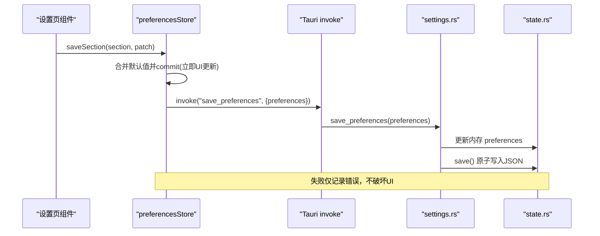
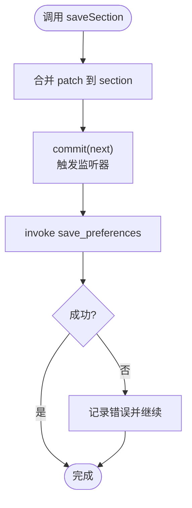
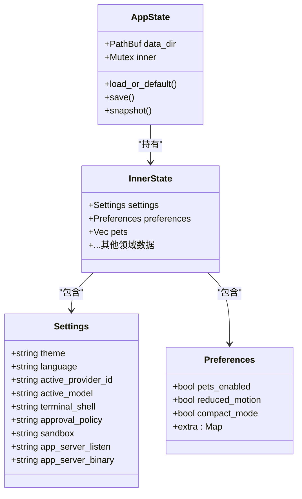
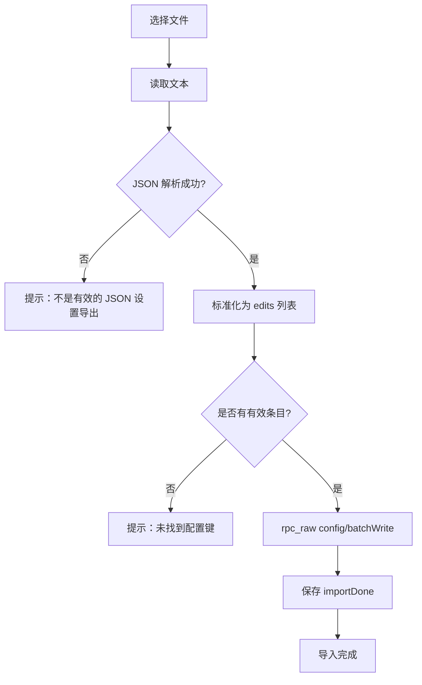
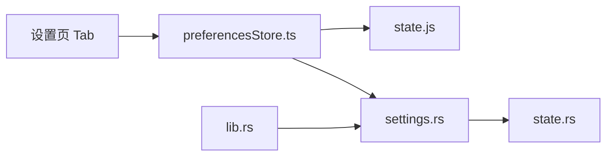

# 设置数据管理

<cite>
**本文引用的文件**
- [preferencesStore.ts](file://frontend/app/state/preferencesStore.ts)
- [state.js](file://frontend/src/js/state.js)
- [settings.rs](file://src-tauri/src/commands/settings.rs)
- [state.rs](file://src-tauri/src/state.rs)
- [lib.rs](file://src-tauri/src/lib.rs)
- [ImportTab.tsx](file://frontend/app/views/settings/tabs/ImportTab.tsx)
- [GeneralTab.tsx](file://frontend/app/views/settings/tabs/GeneralTab.tsx)
- [ComputerUseTab.tsx](file://frontend/app/views/settings/tabs/ComputerUseTab.tsx)
- [BrowserTab.tsx](file://frontend/app/views/settings/tabs/BrowserTab.tsx)
- [SettingsShell.tsx](file://frontend/app/views/settings/SettingsShell.tsx)
- [sections.ts](file://frontend/app/views/settings/sections.ts)
</cite>

## 目录
1. [简介](#简介)
2. [项目结构](#项目结构)
3. [核心组件](#核心组件)
4. [架构总览](#架构总览)
5. [详细组件分析](#详细组件分析)
6. [依赖关系分析](#依赖关系分析)
7. [性能考虑](#性能考虑)
8. [故障排查指南](#故障排查指南)
9. [结论](#结论)
10. [附录](#附录)

## 简介
本文件面向 Codex-Tauri 的“设置数据管理”，聚焦前端状态管理与本地持久化机制，覆盖以下主题：
- 存储架构：前端 preferencesStore 与 Rust 侧 AppState/Preferences 的映射与同步。
- 验证规则、默认值处理与类型转换：合并策略、缺失字段回退、跨层一致性。
- 响应式更新与数据同步：前端即时提交、后端落盘、失败回退与事件广播。
- 备份恢复、版本迁移与兼容性：导入流程、格式兼容、向后兼容策略。
- 加密存储、隐私保护与访问控制：密钥注入方式、敏感信息隔离。
- 导入导出功能、数据格式规范与迁移工具：导入入口、批量写入协议。
- 性能优化与缓存：内存快照、惰性加载、原子写盘。

## 项目结构
设置数据在前后端以“偏好分区（section）”组织，前端通过 React 状态与 Tauri IPC 调用 Rust 命令读写；Rust 侧将全部设置持久化为 JSON 文件。

```mermaid
graph TB
subgraph "前端"
A["preferencesStore.ts<br/>React 状态与 IPC"]
B["state.js<br/>默认值与合并逻辑"]
C["设置页 Tab<br/>General/Import/Browser/ComputerUse"]
end
subgraph "Tauri 后端"
D["lib.rs<br/>插件与命令注册"]
E["settings.rs<br/>get/save_preferences"]
F["state.rs<br/>AppState/Preferences/持久化"]
end
A --> |invoke get_preferences/save_preferences| E
C --> A
A --> |mergePreferences(defaults)| B
E --> F
D --> E
```

图表来源
- [preferencesStore.ts:1-94](file://frontend/app/state/preferencesStore.ts#L1-L94)
- [state.js:60-136](file://frontend/src/js/state.js#L60-L136)
- [settings.rs:35-52](file://src-tauri/src/commands/settings.rs#L35-L52)
- [state.rs:150-217](file://src-tauri/src/state.rs#L150-L217)
- [lib.rs:16-25](file://src-tauri/src/lib.rs#L16-L25)

章节来源
- [preferencesStore.ts:1-94](file://frontend/app/state/preferencesStore.ts#L1-L94)
- [state.js:60-136](file://frontend/src/js/state.js#L60-L136)
- [settings.rs:35-52](file://src-tauri/src/commands/settings.rs#L35-L52)
- [state.rs:150-217](file://src-tauri/src/state.rs#L150-L217)
- [lib.rs:16-25](file://src-tauri/src/lib.rs#L16-L25)

## 核心组件
- 前端偏好状态 store：提供 usePreferences/usePrefSection/getPrefSection/loadPreferences/saveSection，负责读取、合并默认值、局部更新与持久化。
- 默认值与合并：state.js 定义各分区默认值与 mergePreferences，确保前端始终拥有完整键集合。
- Rust 命令层：get_preferences/save_preferences 暴露 IPC 接口，修改内存并落盘。
- Rust 状态与持久化：AppState 持有 InnerState，Preferences 使用 flatten 支持任意扩展分区；save 采用临时文件+rename 原子写。

章节来源
- [preferencesStore.ts:1-94](file://frontend/app/state/preferencesStore.ts#L1-L94)
- [state.js:60-136](file://frontend/src/js/state.js#L60-L136)
- [settings.rs:35-52](file://src-tauri/src/commands/settings.rs#L35-L52)
- [state.rs:49-64](file://src-tauri/src/state.rs#L49-L64)
- [state.rs:176-217](file://src-tauri/src/state.rs#L176-L217)

## 架构总览
设置数据的端到端流程如下：
- 启动时前端调用 get_preferences，合并默认值后渲染 UI。
- 用户修改某个 section 时，前端先本地 commit 再调用 save_preferences 持久化。
- Rust 侧更新内存中的 Preferences，并原子写入 shell-state.json。
- 变更通过 CustomEvent 或后续 IPC 通知其他模块刷新。



图表来源
- [preferencesStore.ts:76-88](file://frontend/app/state/preferencesStore.ts#L76-L88)
- [settings.rs:45-52](file://src-tauri/src/commands/settings.rs#L45-L52)
- [state.rs:209-217](file://src-tauri/src/state.rs#L209-L217)

## 详细组件分析

### 前端偏好状态与响应式更新（preferencesStore）
- 数据结构：Preferences = Record<section, PrefSection>，每个 section 独立维护。
- 默认值合并：loadPreferences 获取原始数据后使用 mergePreferences 与默认值合并，保证键存在且类型安全。
- 响应式：useSyncExternalStore 订阅内部 listeners，commit 触发重渲染；usePrefSection 返回已合并的 section。
- 保存策略：先本地 commit 再异步持久化，避免 UI 卡顿；保存失败仅打印日志，不影响当前视图。
- 事件广播：emitShellEvent 用于跨模块通知（如外观变化）。



图表来源
- [preferencesStore.ts:24-38](file://frontend/app/state/preferencesStore.ts#L24-L38)
- [preferencesStore.ts:76-88](file://frontend/app/state/preferencesStore.ts#L76-L88)

章节来源
- [preferencesStore.ts:1-94](file://frontend/app/state/preferencesStore.ts#L1-L94)

### 默认值、验证与类型转换（state.js）
- 默认值来源：defaultPreferences 定义 appearance/voice/personalization/pets/browser/computerUse/git/environments/worktrees 等分区的初始值。
- 合并算法：mergePreferences 按 key 逐段合并，确保新增字段不会丢失，旧字段可被覆盖。
- 类型安全：前端通过 TypeScript 类型约束 section 结构；Rust 侧 Preferences.extra 使用 serde_json::Map 保持灵活扩展。
- 校验策略：前端不做强校验，依赖默认值与后端容错；导入流程对非 JSON 输入进行解析失败提示。

章节来源
- [state.js:60-136](file://frontend/src/js/state.js#L60-L136)
- [state.rs:49-64](file://src-tauri/src/state.rs#L49-L64)

### Rust 设置命令与持久化（settings.rs + state.rs）
- 命令：get_preferences 返回内存中的 Preferences；save_preferences 替换内存并调用 save。
- 持久化：AppState.save 将 InnerState 序列化为 JSON，写入临时文件后再 rename，保证原子性。
- 路径与加载：数据目录位于系统配置目录下的 CodexDesktop/shell-state.json；首次加载若为空则填充默认值。
- 扩展性：Preferences.extra 使用 flatten，允许新增 section 无需改动后端结构。



图表来源
- [state.rs:27-64](file://src-tauri/src/state.rs#L27-L64)
- [state.rs:150-217](file://src-tauri/src/state.rs#L150-L217)

章节来源
- [settings.rs:35-52](file://src-tauri/src/commands/settings.rs#L35-L52)
- [state.rs:176-217](file://src-tauri/src/state.rs#L176-L217)

### 设置页面与交互（General/Import/Browser/ComputerUse）
- GeneralTab：展示权限相关开关（如 fullAccess），通过 saveSettings/saveSection 更新设置。
- ImportTab：打开文件选择器，读取 JSON/TOML/文本，尝试解析为配置编辑列表，调用 rpc_raw config/batchWrite 批量写入，成功后标记 importDone。
- BrowserTab：站点权限下拉框，变更即调用 saveSection 持久化。
- ComputerUseTab：应用控制权限开关，直接更新 computerUse section。

章节来源
- [GeneralTab.tsx:137-184](file://frontend/app/views/settings/tabs/GeneralTab.tsx#L137-L184)
- [ImportTab.tsx:81-152](file://frontend/app/views/settings/tabs/ImportTab.tsx#L81-L152)
- [BrowserTab.tsx:244-274](file://frontend/app/views/settings/tabs/BrowserTab.tsx#L244-L274)
- [ComputerUseTab.tsx:57-62](file://frontend/app/views/settings/tabs/ComputerUseTab.tsx#L57-L62)

### 导入流程与数据格式兼容
- 输入格式：支持数组 edits/writes/config 或扁平 key→value 映射；keyPath 必填，mergeStrategy 可选（默认 replace）。
- 解析策略：优先 JSON 解析；非 JSON 视为无效并提示；空内容或无有效条目时失败。
- 写入方式：通过 rpc_raw 调用 config/batchWrite，并开启 reloadUserConfig；完成后记录 importDone 以解锁后续选项。
- 兼容性：对历史导出格式做兼容适配，确保不同来源的配置可统一导入。



图表来源
- [ImportTab.tsx:89-152](file://frontend/app/views/settings/tabs/ImportTab.tsx#L89-L152)

章节来源
- [ImportTab.tsx:40-79](file://frontend/app/views/settings/tabs/ImportTab.tsx#L40-L79)
- [ImportTab.tsx:81-152](file://frontend/app/views/settings/tabs/ImportTab.tsx#L81-L152)

### 版本迁移与数据格式兼容性
- 前端默认值作为单一事实源，mergePreferences 保证新增字段自动补齐，避免旧数据缺失导致崩溃。
- Rust 侧 Preferences.extra 使用 flatten，新增 section 无需后端改动即可持久化。
- 首次加载时，AppState.load_or_default 会填充必要默认值（如 theme/language），保障最小可用状态。

章节来源
- [state.js:124-136](file://frontend/src/js/state.js#L124-L136)
- [state.rs:49-64](file://src-tauri/src/state.rs#L49-L64)
- [state.rs:176-207](file://src-tauri/src/state.rs#L176-L207)

### 加密存储、隐私保护与访问控制
- 敏感信息（如 provider API Key）不写入明文配置文件，而是注入 sidecar 环境变量；provider_env_key 生成环境变量名，运行时注入。
- 访问控制：设置项由前端 UI 与后端命令共同约束；部分高风险操作（如 fullAccess）需显式开关。
- 数据落地：shell-state.json 存储应用级设置；敏感凭据不在该文件中出现。

章节来源
- [state.rs:8-25](file://src-tauri/src/state.rs#L8-L25)
- [GeneralTab.tsx:137-184](file://frontend/app/views/settings/tabs/GeneralTab.tsx#L137-L184)

### 设置数据的备份与恢复
- 备份：shell-state.json 即为完整设置快照，可直接复制备份。
- 恢复：将备份文件放回相同路径并在应用启动时自动加载；或通过 ImportTab 导入外部导出的配置（经 batchWrite 写入）。
- 注意：导入流程要求 JSON 格式且包含有效 keyPath，否则拒绝写入。

章节来源
- [state.rs:176-217](file://src-tauri/src/state.rs#L176-L217)
- [ImportTab.tsx:89-152](file://frontend/app/views/settings/tabs/ImportTab.tsx#L89-L152)

### 设置数据的导入导出功能与迁移工具
- 导入：ImportTab 提供文件选择、解析、标准化与批量写入；支持多种历史导出形状。
- 导出：可通过复制 shell-state.json 或使用外部工具导出配置快照（JSON）。
- 迁移：mergePreferences 与 Rust 侧 extra 字段共同实现向前兼容；新增字段自动补齐，旧字段保留。

章节来源
- [ImportTab.tsx:40-79](file://frontend/app/views/settings/tabs/ImportTab.tsx#L40-L79)
- [state.js:124-136](file://frontend/src/js/state.js#L124-L136)
- [state.rs:49-64](file://src-tauri/src/state.rs#L49-L64)

## 依赖关系分析
- 前端依赖：
  - preferencesStore 依赖 state.js 的默认值与合并逻辑。
  - 设置页 Tab 通过 preferencesStore 的 saveSection/usePrefSection 读写设置。
- 后端依赖：
  - settings.rs 命令依赖 state.rs 的 AppState 进行状态读写与持久化。
  - lib.rs 注册插件与命令，初始化 AppState 并启动 sidecar。



图表来源
- [preferencesStore.ts:1-94](file://frontend/app/state/preferencesStore.ts#L1-L94)
- [state.js:60-136](file://frontend/src/js/state.js#L60-L136)
- [settings.rs:35-52](file://src-tauri/src/commands/settings.rs#L35-L52)
- [state.rs:150-217](file://src-tauri/src/state.rs#L150-L217)
- [lib.rs:16-25](file://src-tauri/src/lib.rs#L16-L25)

章节来源
- [preferencesStore.ts:1-94](file://frontend/app/state/preferencesStore.ts#L1-L94)
- [state.js:60-136](file://frontend/src/js/state.js#L60-L136)
- [settings.rs:35-52](file://src-tauri/src/commands/settings.rs#L35-L52)
- [state.rs:150-217](file://src-tauri/src/state.rs#L150-L217)
- [lib.rs:16-25](file://src-tauri/src/lib.rs#L16-L25)

## 性能考虑
- 前端即时更新：saveSection 先 commit 再持久化，避免 UI 阻塞。
- 惰性加载：loadPreferences 仅加载一次，重复调用直接返回。
- 原子写盘：Rust 侧使用临时文件+rename 减少损坏风险。
- 默认值合并：mergePreferences 按分区合并，避免全量重建开销。
- 建议：
  - 对高频设置变更可引入防抖（例如浏览器站点权限批量编辑）。
  - 大对象（如 worktrees/projects）可考虑分页或按需加载。
  - 监控持久化失败率，必要时增加重试与降级策略。

[本节为通用指导，不直接分析具体文件]

## 故障排查指南
- 加载失败：loadPreferences 捕获异常并回退到默认值，检查网络/IPC 是否可用。
- 保存失败：saveSection 捕获异常并记录错误，确认后端 save 是否成功。
- 导入失败：ImportTab 对非 JSON、空文件或无有效条目给出明确提示，检查文件格式与内容。
- 权限问题：fullAccess 等高风险开关需显式启用，确认 UI 状态与后端策略一致。
- 数据不一致：重启应用后检查 shell-state.json 是否被正确写入；必要时从备份恢复。

章节来源
- [preferencesStore.ts:59-68](file://frontend/app/state/preferencesStore.ts#L59-L68)
- [preferencesStore.ts:76-88](file://frontend/app/state/preferencesStore.ts#L76-L88)
- [ImportTab.tsx:89-152](file://frontend/app/views/settings/tabs/ImportTab.tsx#L89-L152)
- [state.rs:209-217](file://src-tauri/src/state.rs#L209-L217)

## 结论
Codex-Tauri 的设置数据管理采用“前端分区状态 + 后端灵活扩展”的设计：
- 前端通过 preferencesStore 提供响应式、可组合的偏好管理，并以默认值合并保证健壮性。
- Rust 侧以 AppState/Preferences 承载状态，使用原子写盘与环境变量注入敏感信息，兼顾安全与可扩展性。
- 导入流程兼容多种导出格式，结合 batchWrite 实现细粒度配置更新。
- 整体架构清晰、职责分离明确，便于后续扩展与维护。

[本节为总结，不直接分析具体文件]

## 附录
- 设置导航分组与标签：sections.ts 定义了设置页面的分组与标签，便于统一渲染与搜索过滤。
- 设置外壳：SettingsShell.tsx 提供侧边栏、搜索与路由切换，集中管理设置页布局。

章节来源
- [sections.ts:44-86](file://frontend/app/views/settings/sections.ts#L44-L86)
- [SettingsShell.tsx:72-161](file://frontend/app/views/settings/SettingsShell.tsx#L72-L161)