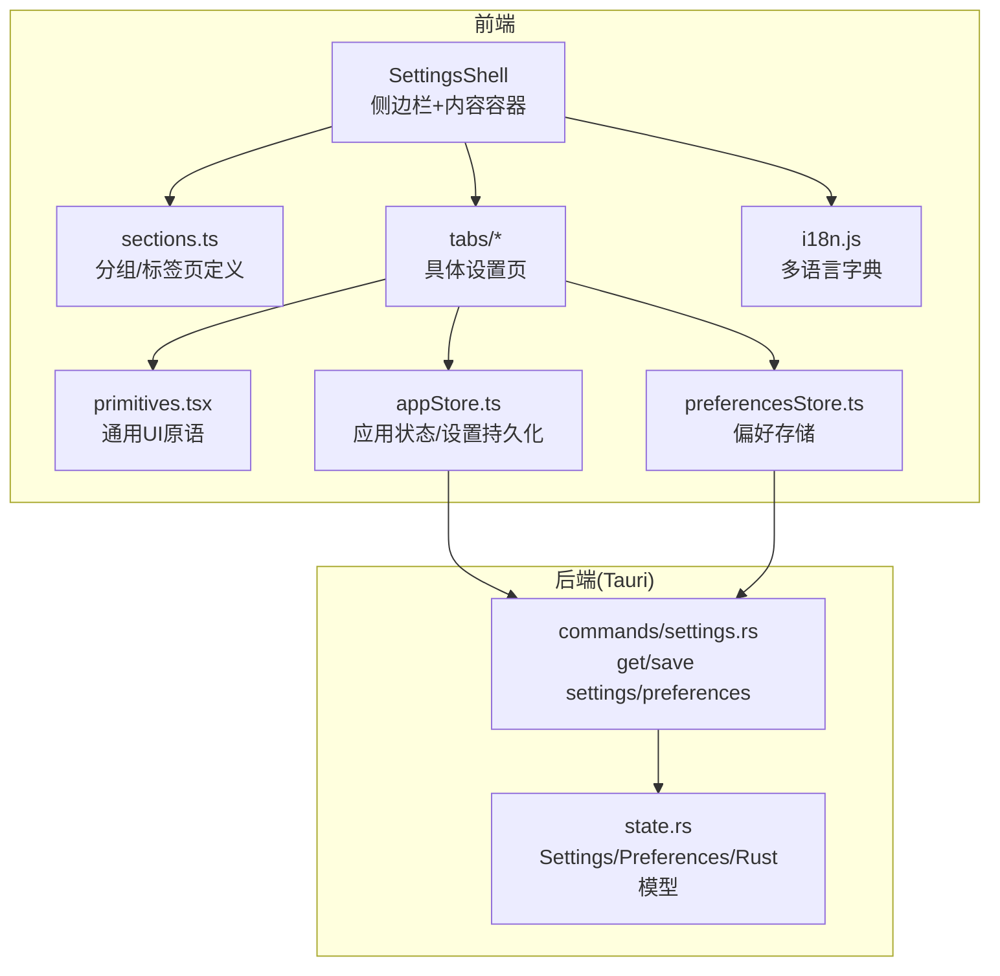
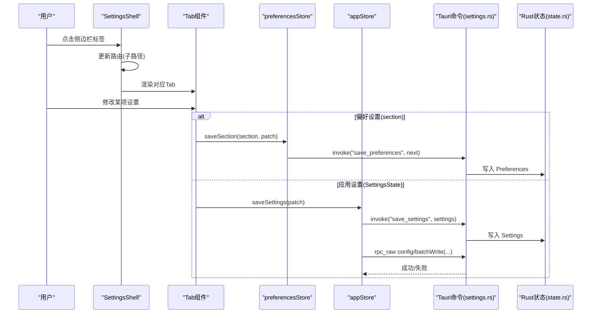
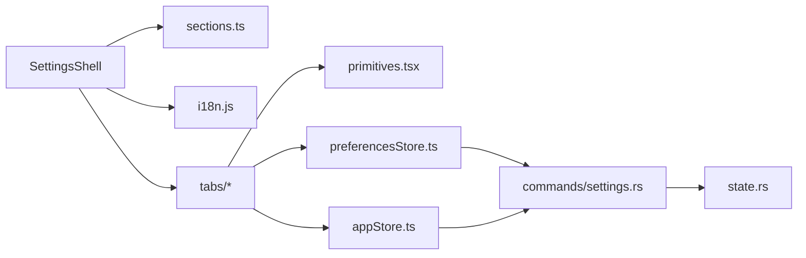

# 设置架构设计

<cite>
**本文引用的文件**
- [SettingsShell.tsx](file://frontend/app/views/settings/SettingsShell.tsx)
- [sections.ts](file://frontend/app/views/settings/sections.ts)
- [primitives.tsx](file://frontend/app/views/settings/primitives.tsx)
- [AccountTab.tsx](file://frontend/app/views/settings/tabs/AccountTab.tsx)
- [GeneralTab.tsx](file://frontend/app/views/settings/tabs/GeneralTab.tsx)
- [preferencesStore.ts](file://frontend/app/state/preferencesStore.ts)
- [appStore.ts](file://frontend/app/state/appStore.ts)
- [i18n.js](file://frontend/src/js/i18n.js)
- [settings.rs](file://src-tauri/src/commands/settings.rs)
- [state.rs](file://src-tauri/src/state.rs)
</cite>

## 目录
1. [简介](#简介)
2. [项目结构](#项目结构)
3. [核心组件](#核心组件)
4. [架构总览](#架构总览)
5. [详细组件分析](#详细组件分析)
6. [依赖关系分析](#依赖关系分析)
7. [性能与懒加载](#性能与懒加载)
8. [验证、错误处理与数据同步](#验证错误处理与数据同步)
9. [扩展新设置组指南](#扩展新设置组指南)
10. [结论](#结论)

## 简介
本文件系统性梳理 Codex-Tauri 设置面板的架构设计与实现要点，覆盖四大分组（个人、集成、编码、归档）、标签页组织机制与路由导航、SettingsShell 的职责与实现、设置数据模型与类型安全、设置项元数据与图标系统、国际化键值映射、动态加载与懒加载策略、验证框架、错误处理机制、数据同步策略，以及扩展新设置组的最佳实践。

## 项目结构
设置面板位于前端 React 应用内，采用“配置即导航”的数据驱动方式：通过集中声明的分组与标签页定义，驱动侧边栏渲染、搜索过滤、路由跳转与页面标题解析；页面内容以 Tab 为单位按需挂载。后端通过 Tauri 命令暴露设置读取/保存能力，并持久化到本地状态文件。

图表来源
- [SettingsShell.tsx:66-161](file://frontend/app/views/settings/SettingsShell.tsx#L66-L161)
- [sections.ts:10-95](file://frontend/app/views/settings/sections.ts#L10-L95)
- [primitives.tsx:11-229](file://frontend/app/views/settings/primitives.tsx#L11-L229)
- [preferencesStore.ts:1-94](file://frontend/app/state/preferencesStore.ts#L1-L94)
- [appStore.ts:446-511](file://frontend/app/state/appStore.ts#L446-L511)
- [settings.rs:8-68](file://src-tauri/src/commands/settings.rs#L8-L68)
- [state.rs:27-64](file://src-tauri/src/state.rs#L27-L64)

章节来源
- [SettingsShell.tsx:66-161](file://frontend/app/views/settings/SettingsShell.tsx#L66-L161)
- [sections.ts:10-95](file://frontend/app/views/settings/sections.ts#L10-L95)

## 核心组件
- SettingsShell：设置面板外壳，负责侧边栏渲染、搜索过滤、路由导航与内容区挂载。
- sections.ts：声明式导航树，包含四大分组与所有标签页，提供 findTab 工具函数。
- primitives.tsx：统一 UI 原语（PageHead、Block、Row、Switch、Segmented、TextInput 等），复用官方样式类名。
- 各 Tab 组件：如 AccountTab、GeneralTab，承载具体设置逻辑与交互。
- preferencesStore.ts：偏好数据的本地 Store，支持按 section 读写与合并默认值。
- appStore.ts：应用级状态与设置持久化，封装 saveSettings 双写策略（shell 状态 + 引擎配置）。
- i18n.js：全局多语言字典，设置项文案与分组标题均通过 key 映射。
- 后端命令与状态：Tauri 命令提供 get/save settings/preferences，Rust 模型定义 Settings/Preferences 等数据结构。

章节来源
- [SettingsShell.tsx:20-161](file://frontend/app/views/settings/SettingsShell.tsx#L20-L161)
- [sections.ts:10-95](file://frontend/app/views/settings/sections.ts#L10-L95)
- [primitives.tsx:11-229](file://frontend/app/views/settings/primitives.tsx#L11-L229)
- [preferencesStore.ts:1-94](file://frontend/app/state/preferencesStore.ts#L1-L94)
- [appStore.ts:63-511](file://frontend/app/state/appStore.ts#L63-L511)
- [i18n.js:14-721](file://frontend/src/js/i18n.js#L14-L721)
- [settings.rs:8-68](file://src-tauri/src/commands/settings.rs#L8-L68)
- [state.rs:27-64](file://src-tauri/src/state.rs#L27-L64)

## 架构总览
设置面板遵循“声明式导航 + 组件化页面 + 跨层数据流”的架构：
- 导航由 sections.ts 驱动，SettingsShell 根据当前路由子路径渲染对应 Tab。
- 页面通过 primitives.tsx 组合出一致的布局与控件。
- 数据流：
  - 偏好设置（preferencesStore）：按 section 合并默认值后持久化到 shell 状态。
  - 应用设置（appStore.saveSettings）：先更新本地状态，再调用 Tauri 命令写入 shell-state.json，并对引擎配置进行 batchWrite 同步。
  - 后端 state.rs 提供 Settings/Preferences 等强类型模型，确保序列化/反序列化一致性。

图表来源
- [SettingsShell.tsx:66-161](file://frontend/app/views/settings/SettingsShell.tsx#L66-L161)
- [preferencesStore.ts:76-88](file://frontend/app/state/preferencesStore.ts#L76-L88)
- [appStore.ts:446-511](file://frontend/app/state/appStore.ts#L446-L511)
- [settings.rs:8-68](file://src-tauri/src/commands/settings.rs#L8-L68)
- [state.rs:27-64](file://src-tauri/src/state.rs#L27-L64)

## 详细组件分析

### SettingsShell：设置外壳与路由导航
- 职责
  - 维护活跃标签页 id（来自路由子路径），提供返回与关闭按钮。
  - 基于查询词对分组与标签进行过滤，保持与旧版行为一致。
  - 渲染侧边栏分组与链接，点击时通过 navigate 切换路由。
  - 在内容区根据 activeId 选择并渲染对应 Tab。
- 实现要点
  - 使用 useMemo 缓存过滤结果，避免重复计算。
  - 通过 t() 获取国际化文案，保证侧边栏与页面标题一致。
  - 未实现的 Tab 以占位形式展示，引导至已实现的“自定义供应商”。

章节来源
- [SettingsShell.tsx:28-64](file://frontend/app/views/settings/SettingsShell.tsx#L28-L64)
- [SettingsShell.tsx:66-161](file://frontend/app/views/settings/SettingsShell.tsx#L66-L161)

### 导航与分组：sections.ts
- 数据结构
  - SettingsGroup：id、labelKey、children（SettingsTab[]）。
  - SettingsTab：id、labelKey、icon（受控于 SettingsIconName 联合类型）。
- 分组
  - personal（个人）：general、import、appearance、voice、configuration、personalization、pets、shortcuts、account。
  - integrations（集成）：computer-use、appshot、plugins、browser。
  - coding（编码）：hooks、connections、git、environments、worktrees。
  - archived（归档）：archived-tasks。
- 工具函数
  - findTab(id)：用于根据 id 查找标签元信息（如 labelKey）。

章节来源
- [sections.ts:10-95](file://frontend/app/views/settings/sections.ts#L10-L95)

### 页面原语：primitives.tsx
- 提供统一的页面头部 PageHead、区块 Block/BlockCustom、行 Row、按钮 SettingsButton、开关 Switch、分段控制 Segmented、文本输入 TextInput、多行文本 TextArea。
- 严格复用官方样式类名，确保视觉与交互一致。

章节来源
- [primitives.tsx:11-229](file://frontend/app/views/settings/primitives.tsx#L11-L229)

### 账户页：AccountTab
- 功能
  - 显示与管理模型提供商列表，设置活动提供商。
  - 新增/编辑提供商表单，支持协议选择与默认模型。
  - 探测连通性（probe_provider），反馈连接结果与可用模型数量。
- 数据流
  - 使用 useAppState 获取 providers 与 settings。
  - 保存提供商调用 Tauri 命令 save_provider，刷新应用状态。
  - 设置活动提供商通过 saveSettings 更新 activeProviderId。

章节来源
- [AccountTab.tsx:55-336](file://frontend/app/views/settings/tabs/AccountTab.tsx#L55-L336)

### 常规页：GeneralTab
- 功能
  - 权限（全量访问开关）、常规（无项目任务文件夹、默认打开应用、终端 Shell、语言、底部面板、提示建议、插件、开源许可证）、编辑器（纯文本编辑器、上下文窗口使用、发送快捷键、跟进模式）、弹出窗口（弹出快捷键、默认独立聊天）、通知（完成通知、权限通知、问题通知）、趣味实验（彩纸）。
- 数据流
  - 偏好设置通过 saveSection("general", patch) 持久化。
  - 语言切换通过 saveSettings({ language }) 触发全局语言应用。
  - 无项目任务文件夹通过原生对话框选择并写入偏好。

章节来源
- [GeneralTab.tsx:93-428](file://frontend/app/views/settings/tabs/GeneralTab.tsx#L93-L428)

### 偏好存储：preferencesStore.ts
- 设计
  - 以 section 为维度的 Map 结构，合并默认值后作为单一事实源。
  - 首次加载从后端读取一次，失败回退到默认值，不阻断 UI。
  - saveSection 先本地提交（即时 UI 更新），再异步持久化。
- 事件
  - emitShellEvent 用于触发壳层级 CustomEvent（如宠物、外观变化）。

章节来源
- [preferencesStore.ts:1-94](file://frontend/app/state/preferencesStore.ts#L1-L94)

### 应用状态与设置持久化：appStore.ts
- 设计
  - 集中管理会话、项目、提供商、设置等状态，使用 useSyncExternalStore 订阅。
  - refreshAppState 并发拉取 sessions/providers/settings，归一化后更新状态。
  - saveSettings 双写策略：
    - 写入 shell 状态（save_settings）。
    - 将需要引擎生效的字段通过 rpc_raw config/batchWrite 写入引擎配置。
- 兼容
  - normaliseSettings 同时接受 camelCase 与 snake_case 字段，提升前后端兼容性。

章节来源
- [appStore.ts:63-511](file://frontend/app/state/appStore.ts#L63-L511)

### 后端命令与状态：settings.rs 与 state.rs
- commands/settings.rs
  - get_settings/save_settings：读取/保存 Settings，并在保存时尝试设置活动提供商。
  - get_preferences/save_preferences：读取/保存 Preferences。
  - list_shortcuts/save_shortcuts：读取/保存快捷键。
- state.rs
  - Settings：主题、语言、活动提供商、活动模型、终端 Shell、审批策略、沙箱、服务端地址/二进制等。
  - Preferences：宠物、动效、紧凑模式及 extra 任意 section 扩展。
  - AppState 持久化到 shell-state.json，原子写入（临时文件 + rename）。

章节来源
- [settings.rs:8-68](file://src-tauri/src/commands/settings.rs#L8-L68)
- [state.rs:27-64](file://src-tauri/src/state.rs#L27-L64)
- [state.rs:176-217](file://src-tauri/src/state.rs#L176-L217)

## 依赖关系分析
- 前端依赖
  - SettingsShell 依赖 sections.ts（导航树）、i18n.js（文案）、useRoute/useI18n（路由与国际化）。
  - 各 Tab 依赖 primitives.tsx（UI 原语）、preferencesStore.ts（偏好）、appStore.ts（设置持久化）。
  - preferencesStore.ts 依赖 i18n 默认值与 mergePreferences。
  - appStore.ts 依赖 Tauri invoke 与 i18n 语言应用。
- 前后端契约
  - 前端通过 Tauri 命令与 Rust 状态交互，字段命名在两端保持一致或做兼容转换。
  - 引擎配置通过 rpc_raw 方法批量写入，确保关键设置实时生效。

图表来源
- [SettingsShell.tsx:66-161](file://frontend/app/views/settings/SettingsShell.tsx#L66-L161)
- [sections.ts:10-95](file://frontend/app/views/settings/sections.ts#L10-L95)
- [primitives.tsx:11-229](file://frontend/app/views/settings/primitives.tsx#L11-L229)
- [preferencesStore.ts:76-88](file://frontend/app/state/preferencesStore.ts#L76-L88)
- [appStore.ts:446-511](file://frontend/app/state/appStore.ts#L446-L511)
- [settings.rs:8-68](file://src-tauri/src/commands/settings.rs#L8-L68)
- [state.rs:27-64](file://src-tauri/src/state.rs#L27-L64)

## 性能与懒加载
- 侧边栏过滤
  - 使用 useMemo 缓存过滤后的分组与标签，减少重复计算。
- 页面懒加载
  - TabContent 仅在当前 activeId 匹配时渲染对应组件，未使用的 Tab 不会初始化，降低首屏开销。
- 数据加载
  - refreshAppState 并发拉取多个资源，缩短加载时间。
  - preferencesStore 仅在首次加载时请求后端，后续变更走本地合并与异步持久化。
- 建议优化
  - 对重型 Tab（如浏览器、插件）可进一步拆分模块与按需 import。
  - 对长列表（如提供商、插件）增加虚拟滚动或分页。
  - 对网络请求增加重试与超时控制，提升鲁棒性。

章节来源
- [SettingsShell.tsx:72-83](file://frontend/app/views/settings/SettingsShell.tsx#L72-L83)
- [SettingsShell.tsx:57-64](file://frontend/app/views/settings/SettingsShell.tsx#L57-L64)
- [appStore.ts:378-408](file://frontend/app/state/appStore.ts#L378-L408)
- [preferencesStore.ts:59-68](file://frontend/app/state/preferencesStore.ts#L59-L68)

## 验证、错误处理与数据同步
- 验证框架
  - 前端以类型约束为主（TypeScript 接口与联合类型），配合业务校验（如必填字段、格式检查）。
  - 后端通过 Rust 结构体与 serde 序列化保证数据完整性。
- 错误处理
  - 偏好加载失败会降级到默认值并记录警告，不影响 UI。
  - 设置保存失败记录错误日志，但优先保证本地状态一致。
  - 引擎配置写入失败视为可选（可能离线），不阻断主流程。
- 数据同步策略
  - 偏好设置：先本地提交，再异步持久化，保证即时响应。
  - 应用设置：双写 shell 状态与引擎配置，确保 UI 与引擎一致。
  - 活动提供商：保存设置时尝试更新适配器状态，使运行时生效。

章节来源
- [preferencesStore.ts:59-88](file://frontend/app/state/preferencesStore.ts#L59-L88)
- [appStore.ts:446-511](file://frontend/app/state/appStore.ts#L446-L511)
- [settings.rs:18-33](file://src-tauri/src/commands/settings.rs#L18-L33)

## 扩展新设置组指南
- 步骤
  1. 在 sections.ts 中新增或修改分组与标签页，补充 id、labelKey、icon。
  2. 创建新的 Tab 组件（如 NewTab.tsx），使用 primitives.tsx 构建界面。
  3. 在 SettingsShell.tsx 的 TabContent 中添加路由分支，渲染新 Tab。
  4. 如需持久化，使用 preferencesStore.saveSection 或 appStore.saveSettings。
  5. 在 i18n.js 中补充对应的文案键值。
  6. 若涉及后端字段，在 state.rs 与 commands/settings.rs 中扩展并测试。
- 最佳实践
  - 保持 labelKey 与 id 的一致性，便于搜索与定位。
  - 使用类型安全的接口定义表单与状态，避免运行时错误。
  - 对复杂交互拆分为子组件，提高可维护性。
  - 对网络操作增加错误边界与用户提示。
  - 对敏感信息（如 API Key）避免明文落盘，遵循后端注入环境变量策略。

章节来源
- [sections.ts:44-86](file://frontend/app/views/settings/sections.ts#L44-L86)
- [SettingsShell.tsx:57-64](file://frontend/app/views/settings/SettingsShell.tsx#L57-L64)
- [preferencesStore.ts:76-88](file://frontend/app/state/preferencesStore.ts#L76-L88)
- [appStore.ts:446-511](file://frontend/app/state/appStore.ts#L446-L511)
- [i18n.js:14-721](file://frontend/src/js/i18n.js#L14-L721)
- [state.rs:27-64](file://src-tauri/src/state.rs#L27-L64)

## 结论
Codex-Tauri 的设置面板以声明式导航为核心，结合组件化页面与跨层数据流，实现了清晰、可扩展且高性能的设置体验。通过 TypeScript 类型约束、Rust 强类型模型与 Tauri 命令，确保了数据的一致性与安全性。未来可通过更细粒度的懒加载、虚拟滚动与更强的错误恢复进一步提升用户体验。