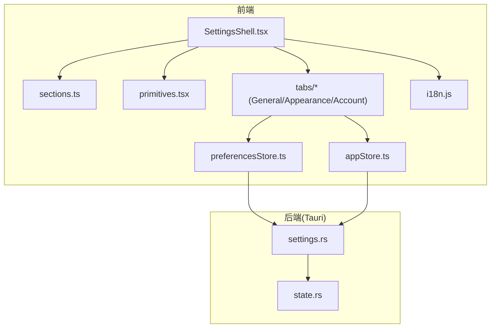
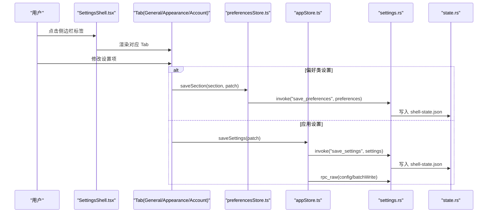
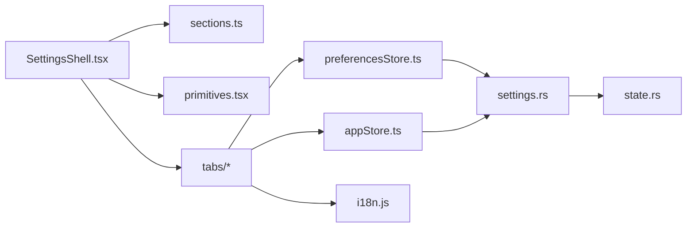

# 设置面板

<cite>
**本文引用的文件**
- [SettingsShell.tsx](file://frontend/app/views/settings/SettingsShell.tsx)
- [sections.ts](file://frontend/app/views/settings/sections.ts)
- [primitives.tsx](file://frontend/app/views/settings/primitives.tsx)
- [AccountTab.tsx](file://frontend/app/views/settings/tabs/AccountTab.tsx)
- [AppearanceTab.tsx](file://frontend/app/views/settings/tabs/AppearanceTab.tsx)
- [GeneralTab.tsx](file://frontend/app/views/settings/tabs/GeneralTab.tsx)
- [preferencesStore.ts](file://frontend/app/state/preferencesStore.ts)
- [appStore.ts](file://frontend/app/state/appStore.ts)
- [settings.rs](file://src-tauri/src/commands/settings.rs)
- [state.rs](file://src-tauri/src/state.rs)
- [state.js](file://frontend/src/js/state.js)
- [i18n.js](file://frontend/src/js/i18n.js)
</cite>

## 目录
1. [简介](#简介)
2. [项目结构](#项目结构)
3. [核心组件](#核心组件)
4. [架构总览](#架构总览)
5. [详细组件分析](#详细组件分析)
6. [依赖关系分析](#依赖关系分析)
7. [性能考虑](#性能考虑)
8. [故障排查指南](#故障排查指南)
9. [结论](#结论)
10. [附录：自定义设置页开发指南与最佳实践](#附录自定义设置页开发指南与最佳实践)

## 简介
本文件为 Codex-Tauri 设置面板的权威技术文档，覆盖整体架构、分组与标签页组织、数据绑定机制、持久化存储、验证规则与默认值处理、国际化支持、表单组件复用、错误处理、动态加载与条件显示、以及自定义设置页面的开发与最佳实践。目标是帮助开发者快速理解并扩展设置面板功能。

## 项目结构
设置面板采用“外壳 + 分组导航 + 标签页内容”的分层结构：
- 外壳（SettingsShell）：负责侧边栏分组渲染、搜索过滤、路由切换与关闭逻辑。
- 分组与标签定义（sections.ts）：集中声明分组、标签、图标与 i18n key，作为单一事实来源供侧边栏、标题查找等使用。
- 通用 UI 原语（primitives.tsx）：提供 PageHead、Block、Row、Switch、Segmented、TextInput、TextArea、SettingsButton 等可复用控件，保持与官方样式一致。
- 标签页实现（tabs/*）：按业务域拆分页面，如通用设置、外观设置、账户设置等。
- 前端状态管理：
  - preferencesStore.ts：偏好分区的读取、合并、保存与事件发射。
  - appStore.ts：应用级设置（语言、模型、沙箱等）的读取、合并、保存与引擎配置同步。
- 后端命令（settings.rs）：暴露 get/save settings/preferences/shortcuts 等 Tauri 命令。
- 后端状态（state.rs）：定义 Settings、Preferences 等数据结构，负责 shell-state.json 的读写与默认值填充。
- 默认值与合并策略（state.js）：前端默认偏好与合并函数，确保 React 与旧版 vanilla 层不漂移。
- 国际化（i18n.js）：多语言字典与语言切换能力。

图表来源
- [SettingsShell.tsx:1-162](file://frontend/app/views/settings/SettingsShell.tsx#L1-L162)
- [sections.ts:1-95](file://frontend/app/views/settings/sections.ts#L1-L95)
- [primitives.tsx:1-229](file://frontend/app/views/settings/primitives.tsx#L1-L229)
- [preferencesStore.ts:1-94](file://frontend/app/state/preferencesStore.ts#L1-L94)
- [appStore.ts:1-526](file://frontend/app/state/appStore.ts#L1-L526)
- [settings.rs:1-69](file://src-tauri/src/commands/settings.rs#L1-L69)
- [state.rs:1-331](file://src-tauri/src/state.rs#L1-L331)
- [i18n.js:1-800](file://frontend/src/js/i18n.js#L1-L800)

章节来源
- [SettingsShell.tsx:1-162](file://frontend/app/views/settings/SettingsShell.tsx#L1-L162)
- [sections.ts:1-95](file://frontend/app/views/settings/sections.ts#L1-L95)
- [primitives.tsx:1-229](file://frontend/app/views/settings/primitives.tsx#L1-L229)

## 核心组件
- 设置外壳（SettingsShell）
  - 职责：渲染侧边栏分组与链接、搜索过滤、当前激活标签高亮、内容区路由到具体 Tab；提供返回与关闭按钮。
  - 关键行为：基于 query 过滤分组与子项；通过 useRoute 获取当前 sub 路由；将 tab id 映射到对应组件或占位符。
- 分组与标签（sections.ts）
  - 职责：集中维护 SETTINGS_GROUPS 树形结构，包含 id、labelKey、icon 与 children；提供 findTab 工具函数。
  - 设计要点：所有侧边栏、标题查找、路由均从该数据源读取，保证一致性。
- 通用 UI 原语（primitives.tsx）
  - 职责：提供 PageHead、Block、BlockCustom、Row、Switch、Segmented、TextInput、TextArea、SettingsButton 等。
  - 设计要点：类名与官方保持一致，便于复用现有样式；统一交互语义与无障碍属性。
- 偏好存储（preferencesStore.ts）
  - 职责：以分区（section）为单位管理偏好；提供 usePrefSection/usePreferences、loadPreferences、saveSection、emitShellEvent。
  - 关键点：首次加载时合并默认值；保存时先本地提交再异步持久化；未知 section 通过 Rust Preferences.extra 透传。
- 应用设置（appStore.ts）
  - 职责：管理全局设置（语言、模型、审批策略、沙箱等），刷新会话/提供者/设置，持久化到 shell-state.json 并同步引擎配置。
  - 关键点：normaliseSettings 兼容驼峰与下划线字段；saveSettings 同时写 shell 与 engine config/batchWrite；语言变更触发 i18n 同步。
- 后端命令（settings.rs）
  - 职责：get_settings/get_preferences/list_shortcuts 及其对应的 save_* 命令；在保存设置时更新活跃 provider。
- 后端状态（state.rs）
  - 职责：定义 Settings、Preferences、StateSnapshot 等；负责 shell-state.json 的加载与保存；提供默认值与持久化路径。
- 默认值与合并（state.js）
  - 职责：提供 defaultPreferences/defaultSettings 及 mergePreferences/mergeSettings；确保前后端默认值一致。
- 国际化（i18n.js）
  - 职责：多语言字典、语言选项、t() 调用；设置页广泛使用 t(key, fallback) 进行文案渲染。

章节来源
- [preferencesStore.ts:1-94](file://frontend/app/state/preferencesStore.ts#L1-L94)
- [appStore.ts:1-526](file://frontend/app/state/appStore.ts#L1-L526)
- [settings.rs:1-69](file://src-tauri/src/commands/settings.rs#L1-L69)
- [state.rs:1-331](file://src-tauri/src/state.rs#L1-L331)
- [state.js:1-238](file://frontend/src/js/state.js#L1-L238)
- [i18n.js:1-800](file://frontend/src/js/i18n.js#L1-L800)

## 架构总览
设置面板的数据流遵循“UI → Store → Tauri Command → State File”的单向流，并在必要时反向通知引擎配置。

图表来源
- [SettingsShell.tsx:66-162](file://frontend/app/views/settings/SettingsShell.tsx#L66-L162)
- [preferencesStore.ts:59-88](file://frontend/app/state/preferencesStore.ts#L59-L88)
- [appStore.ts:446-511](file://frontend/app/state/appStore.ts#L446-L511)
- [settings.rs:8-69](file://src-tauri/src/commands/settings.rs#L8-L69)
- [state.rs:176-217](file://src-tauri/src/state.rs#L176-L217)

## 详细组件分析

### 设置外壳（SettingsShell）
- 分组与搜索
  - 使用 useMemo 计算 filteredGroups，基于 query 对每个 group.children 进行 label 匹配过滤，并移除空组。
  - 侧边栏渲染遵循官方 DOM 契约（aside.settings-sidebar、.settings-links、.settings-group 等）。
- 路由与内容
  - 通过 useRoute().sub 获取当前标签 id，默认 general；根据 id 选择 AccountTab 或占位符。
  - 关闭按钮与返回按钮均调用 navigate 回到主页。
- 国际化
  - 所有可见文本通过 t(key, fallback) 获取，保证多语言一致性。

章节来源
- [SettingsShell.tsx:28-83](file://frontend/app/views/settings/SettingsShell.tsx#L28-L83)
- [SettingsShell.tsx:85-162](file://frontend/app/views/settings/SettingsShell.tsx#L85-L162)

### 分组与标签（sections.ts）
- 数据结构
  - SettingsGroup：id、labelKey、children。
  - SettingsTab：id、labelKey、icon。
  - 四组十九个标签：personal、integrations、coding、archived。
- 工具函数
  - findTab(id)：用于占位符标题解析。

章节来源
- [sections.ts:10-95](file://frontend/app/views/settings/sections.ts#L10-L95)

### 通用 UI 原语（primitives.tsx）
- PageHead：页面标题与描述，支持紧凑模式与富描述节点。
- Block/BlockCustom：区块容器，支持标题与额外操作区域。
- Row：行布局，左侧标题与描述，右侧控件。
- Switch/Segmented/TextInput/TextArea/SettingsButton：常用控件，保持与官方一致的类名与交互。

章节来源
- [primitives.tsx:11-229](file://frontend/app/views/settings/primitives.tsx#L11-L229)

### 通用设置（GeneralTab）
- 权限与常规
  - 全量访问开关通过 saveSettings 写入 shell 设置；无项目任务文件夹通过 engine_status 获取 codexHome 并允许用户更改。
- 编辑器与弹出窗口
  - 发送快捷键、上下文窗口使用、跟随处理模式、弹出窗口快捷键等写入 general 偏好分区。
- 通知与实验
  - 回合完成通知、权限/问题通知开关、彩纸实验等写入 general 偏好分区。
- 开源许可证
  - 通过 Modal 展示内置 LICENSES.md。

章节来源
- [GeneralTab.tsx:1-428](file://frontend/app/views/settings/tabs/GeneralTab.tsx#L1-L428)

### 外观设置（AppearanceTab）
- 主题选择与预览
  - 系统/浅色/深色主题切换，写入 appearance 分区；同时触发 shell 事件以应用主题。
- 主题卡片编辑
  - 支持导入/复制 JSON 主题卡；颜色、字体、对比度等字段写入 appearance 分区。
- 显示偏好
  - 指针光标、减少动画、UI/代码字号、差异标记等写入 appearance 分区。

章节来源
- [AppearanceTab.tsx:1-407](file://frontend/app/views/settings/tabs/AppearanceTab.tsx#L1-L407)

### 账户设置（AccountTab）
- 提供者列表与激活
  - 从 appStore.providers 读取提供者，activeProviderId 通过 saveSettings 写入。
- 添加/编辑提供者
  - 表单包含名称、Base URL、API Key、协议、默认模型；保存调用 save_provider，成功后刷新应用状态。
- 连通性探测
  - probe_provider 返回 ok/error/hint/modelCount/models/modelFound；根据结果展示探测消息。

章节来源
- [AccountTab.tsx:1-336](file://frontend/app/views/settings/tabs/AccountTab.tsx#L1-L336)

### 数据绑定与持久化
- 偏好分区（preferencesStore.ts）
  - 首次加载：invoke("get_preferences") 后 mergePreferences(defaultPreferences()) 合并默认值。
  - 保存：先 commit 本地 state，再 invoke("save_preferences") 持久化；失败仅记录日志。
  - 事件：emitShellEvent 用于跨模块通知（如外观变化）。
- 应用设置（appStore.ts）
  - 刷新：并行获取 sessions/providers/settings，归一化后更新状态；语言变更触发 applyLanguage。
  - 保存：saveSettings 同时写 shell-state.json 与 engine config/batchWrite；兼容驼峰/下划线字段。
- 后端（settings.rs / state.rs）
  - 命令：get/save settings/preferences/shortcuts；保存设置时更新活跃 provider。
  - 持久化：shell-state.json 原子写入（tmp+rename）；默认值在 load_or_default 中补齐。

章节来源
- [preferencesStore.ts:15-94](file://frontend/app/state/preferencesStore.ts#L15-L94)
- [appStore.ts:378-511](file://frontend/app/state/appStore.ts#L378-L511)
- [settings.rs:8-69](file://src-tauri/src/commands/settings.rs#L8-L69)
- [state.rs:176-217](file://src-tauri/src/state.rs#L176-L217)

### 验证规则与默认值处理
- 默认值来源
  - 前端默认：state.js 中的 defaultPreferences/defaultSettings。
  - 后端默认：state.rs 中 load_or_default 对 theme/language/app_server_listen 等字段赋默认值。
- 合并策略
  - mergePreferences：按 section 合并，保留未知 section（Rust Preferences.extra）。
  - normaliseSettings：兼容 camelCase/snake_case，只接受已知字段。
- 输入校验
  - 外观设置：字号范围 10-24；颜色输入自动补前缀 #。
  - 账户设置：Base URL 非空才启用探测；保存时生成 slugify 的 id。

章节来源
- [state.js:60-136](file://frontend/src/js/state.js#L60-L136)
- [state.rs:176-207](file://src-tauri/src/state.rs#L176-L207)
- [AppearanceTab.tsx:140-168](file://frontend/app/views/settings/tabs/AppearanceTab.tsx#L140-L168)
- [AccountTab.tsx:47-53](file://frontend/app/views/settings/tabs/AccountTab.tsx#L47-L53)

### 国际化支持
- 文案来源：i18n.js 提供多语言字典与 LOCALES；设置页通过 t(key, fallback) 获取文案。
- 语言切换：GeneralTab 的语言下拉通过 saveSettings({ language }) 更新，appStore 同步 legacy store 并调用 applyLanguage。
- 回退机制：当键缺失时，fallback 参数提供英文兜底。

章节来源
- [i18n.js:4-166](file://frontend/src/js/i18n.js#L4-L166)
- [GeneralTab.tsx:120-147](file://frontend/app/views/settings/tabs/GeneralTab.tsx#L120-L147)
- [appStore.ts:24-28](file://frontend/app/state/appStore.ts#L24-L28)

### 表单组件复用与错误处理
- 组件复用：primitives.tsx 提供统一控件，避免重复实现；所有控件类名与官方一致。
- 错误处理：
  - preferencesStore.saveSection：捕获异常并 console.error。
  - appStore.refreshAppState/saveSettings：捕获异常并记录日志，不影响 UI 已提交的状态。
  - AccountTab.probeProvider/saveProvider：捕获异常并展示错误消息。

章节来源
- [preferencesStore.ts:76-88](file://frontend/app/state/preferencesStore.ts#L76-L88)
- [appStore.ts:378-408](file://frontend/app/state/appStore.ts#L378-L408)
- [AccountTab.tsx:87-147](file://frontend/app/views/settings/tabs/AccountTab.tsx#L87-L147)

### 动态加载、条件显示与依赖关系
- 动态加载
  - GeneralTab 启动时调用 engine_status 获取 codexHome，若引擎离线则回退到存储值。
  - AccountTab 通过 list_providers 获取提供者列表，为空时显示空状态。
- 条件显示
  - 搜索过滤：SettingsShell 根据 query 过滤分组与子项。
  - 语言下拉：仅在 languageItems.length > 0 时渲染。
- 依赖关系
  - 外观设置保存后 emitShellEvent("codex:appearance-applied") 通知其他模块应用主题。
  - 账户设置保存后 refreshAppState 刷新提供者与模型信息。

章节来源
- [GeneralTab.tsx:102-109](file://frontend/app/views/settings/tabs/GeneralTab.tsx#L102-L109)
- [SettingsShell.tsx:72-83](file://frontend/app/views/settings/SettingsShell.tsx#L72-L83)
- [AppearanceTab.tsx:50-54](file://frontend/app/views/settings/tabs/AppearanceTab.tsx#L50-L54)
- [AccountTab.tsx:87-103](file://frontend/app/views/settings/tabs/AccountTab.tsx#L87-L103)

## 依赖关系分析
- 前端内部依赖
  - SettingsShell 依赖 sections.ts 与 primitives.tsx，并路由到 tabs/*。
  - 各 Tab 依赖 preferencesStore.ts 与 appStore.ts 进行数据读写。
  - i18n.js 被所有设置页引用以获取文案。
- 前后端依赖
  - 前端通过 @tauri-apps/api/core.invoke 调用 settings.rs 暴露的命令。
  - settings.rs 通过 state.rs 读写 shell-state.json。
- 潜在循环依赖
  - 未发现直接循环；store 之间通过函数调用解耦，事件驱动降低耦合。

图表来源
- [SettingsShell.tsx:1-162](file://frontend/app/views/settings/SettingsShell.tsx#L1-L162)
- [sections.ts:1-95](file://frontend/app/views/settings/sections.ts#L1-L95)
- [primitives.tsx:1-229](file://frontend/app/views/settings/primitives.tsx#L1-L229)
- [preferencesStore.ts:1-94](file://frontend/app/state/preferencesStore.ts#L1-L94)
- [appStore.ts:1-526](file://frontend/app/state/appStore.ts#L1-L526)
- [settings.rs:1-69](file://src-tauri/src/commands/settings.rs#L1-L69)
- [state.rs:1-331](file://src-tauri/src/state.rs#L1-L331)
- [i18n.js:1-800](file://frontend/src/js/i18n.js#L1-L800)

章节来源
- [SettingsShell.tsx:1-162](file://frontend/app/views/settings/SettingsShell.tsx#L1-L162)
- [preferencesStore.ts:1-94](file://frontend/app/state/preferencesStore.ts#L1-L94)
- [appStore.ts:1-526](file://frontend/app/state/appStore.ts#L1-L526)
- [settings.rs:1-69](file://src-tauri/src/commands/settings.rs#L1-L69)
- [state.rs:1-331](file://src-tauri/src/state.rs#L1-L331)

## 性能考虑
- 懒加载与一次性加载
  - preferencesStore.loadPreferences 使用 loaded 标志避免重复加载。
  - appStore.refreshAppState 并行请求 sessions/providers/settings，减少等待时间。
- 本地优先更新
  - preferencesStore.saveSection 先 commit 本地状态再异步持久化，提升响应速度。
- 最小化重渲染
  - SettingsShell 使用 useMemo 计算过滤后的分组，避免每次输入都重新遍历。
- 原子写入
  - state.rs 使用 tmp+rename 写入 shell-state.json，避免部分写入导致数据损坏。

[本节为通用指导，无需特定文件来源]

## 故障排查指南
- 偏好保存失败
  - 现象：控制台出现 “[preferences] save failed”。
  - 排查：检查后端命令是否可用；确认 preferences 结构是否符合预期；查看 state.rs 持久化路径权限。
- 应用设置保存失败
  - 现象：控制台出现 “[appStore] saveSettings (shell) failed” 或 “engine config write failed”。
  - 排查：确认 shell-state.json 可写；检查 engine 是否在线；核对 batchWrite 的 keyPath 映射是否正确。
- 账户探测失败
  - 现象：AccountTab 显示错误消息。
  - 排查：确认 Base URL、协议、API Key 正确；检查网络可达性与后端 probe_provider 实现。
- 语言未生效
  - 现象：界面仍显示英文或旧语言。
  - 排查：确认 saveSettings({ language }) 已调用；检查 appStore.syncLegacyI18n 与 applyLanguage 是否执行。

章节来源
- [preferencesStore.ts:83-88](file://frontend/app/state/preferencesStore.ts#L83-L88)
- [appStore.ts:451-511](file://frontend/app/state/appStore.ts#L451-L511)
- [AccountTab.tsx:112-147](file://frontend/app/views/settings/tabs/AccountTab.tsx#L112-L147)
- [appStore.ts:24-28](file://frontend/app/state/appStore.ts#L24-L28)

## 结论
Codex-Tauri 设置面板通过清晰的分层架构、集中的分组与标签定义、统一的 UI 原语与稳健的状态管理，实现了可扩展、可维护且用户体验友好的设置界面。偏好与应用设置分别由 preferencesStore 与 appStore 管理，并通过 Tauri 命令持久化到 shell-state.json，必要时同步引擎配置。国际化、默认值合并、错误处理与性能优化均已到位，便于后续扩展新的设置页与功能。

[本节为总结，无需特定文件来源]

## 附录：自定义设置页开发指南与最佳实践
- 新增标签页步骤
  1. 在 sections.ts 的 SETTINGS_GROUPS 中添加新标签（id、labelKey、icon）。
  2. 在 frontend/app/views/settings/tabs 下创建新 Tab 组件，使用 primitives.tsx 的 PageHead、Block、Row 等构建界面。
  3. 在 SettingsShell.tsx 的 TabContent 中增加路由分支，或直接通过 search/filter 即可显示。
  4. 如需持久化，使用 preferencesStore.saveSection 或 appStore.saveSettings 进行保存。
  5. 如需与引擎交互，调用 Tauri 命令（如 invoke("rpc_raw", ...)）。
- 数据绑定建议
  - 偏好类设置：使用 usePrefSection(section) 读取，saveSection 保存。
  - 应用级设置：使用 useAppState().settings 读取，saveSettings 保存。
  - 语言切换：通过 saveSettings({ language }) 触发 i18n 同步。
- 验证与默认值
  - 在前端进行基础校验（如范围、必填），后端也可做二次校验。
  - 默认值统一来自 state.js 与 state.rs 的默认实现，避免漂移。
- 国际化
  - 所有用户可见文案使用 t(key, fallback)，并在 i18n.js 中补充翻译。
- 错误处理
  - 所有异步操作使用 try/catch，记录日志并向用户反馈友好提示。
- 性能优化
  - 使用 useMemo/useCallback 避免不必要的重渲染。
  - 大列表分页或虚拟滚动（如未来扩展）。
- 安全与隐私
  - API Key 等敏感信息通过环境变量注入 sidecar，不落地明文配置。
  - 导出设置时注意脱敏。

[本节为通用指导，无需特定文件来源]