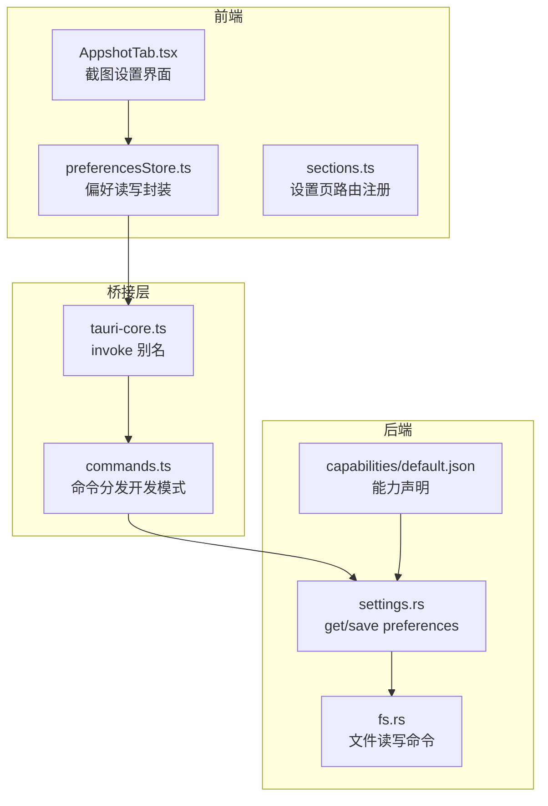
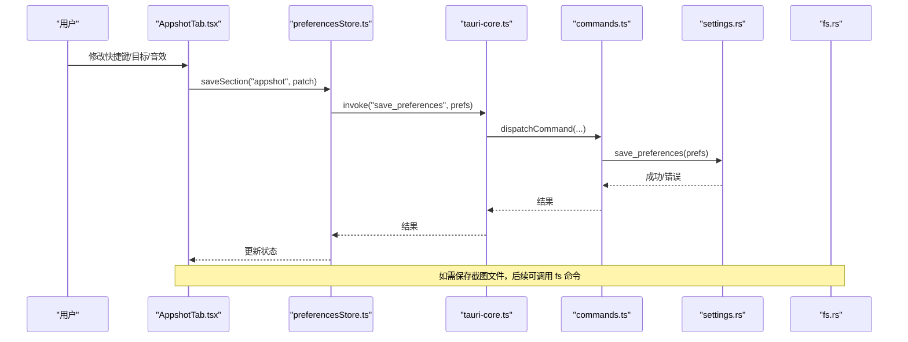
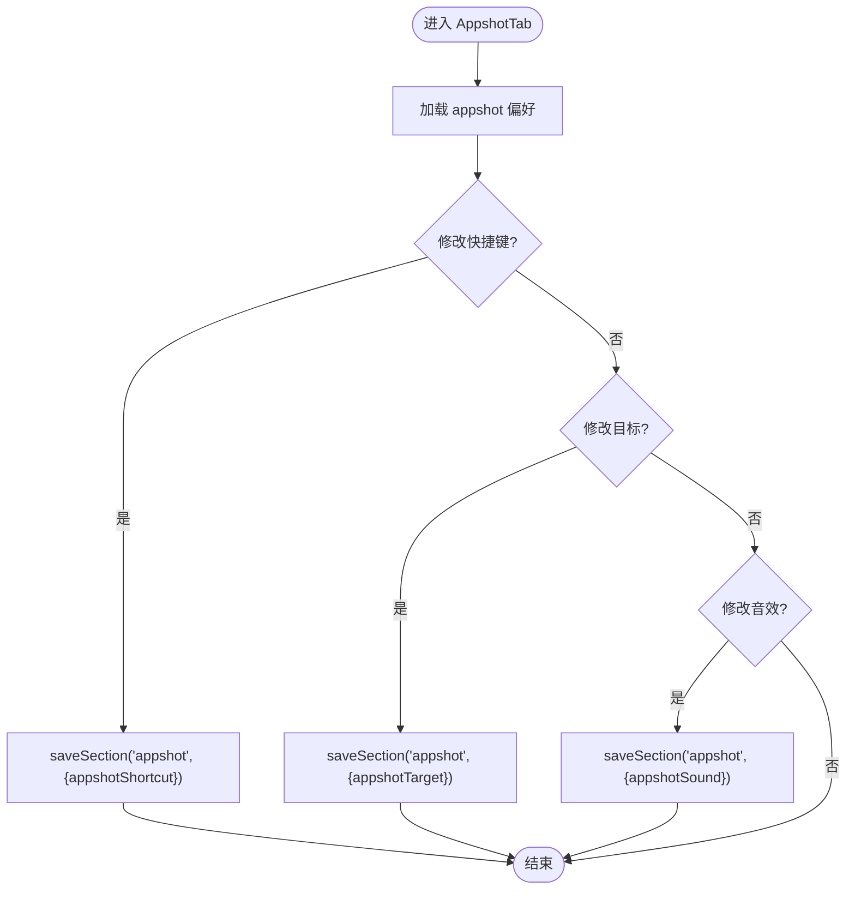
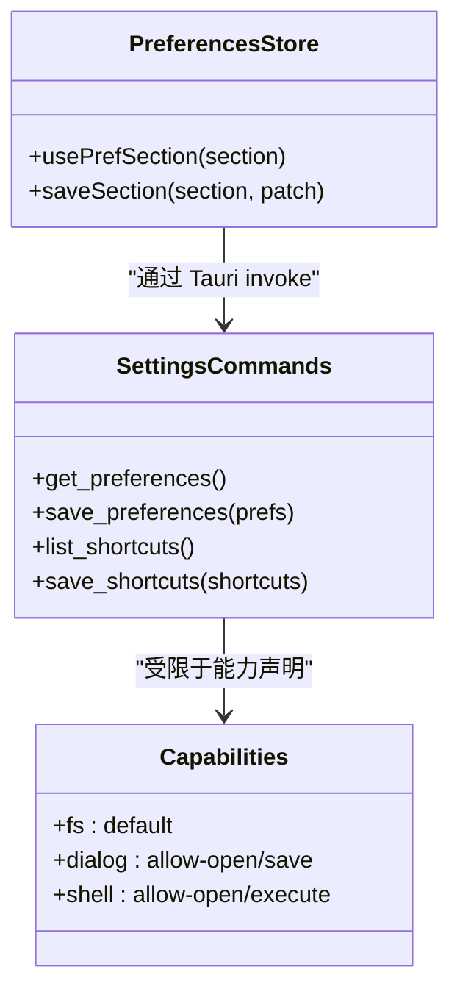
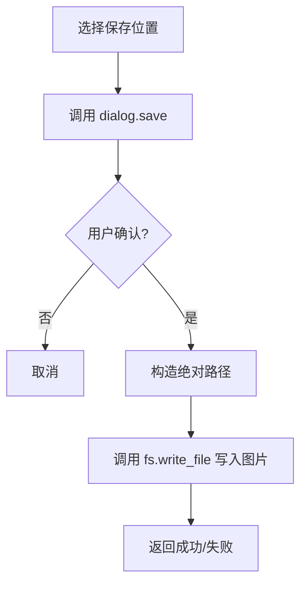
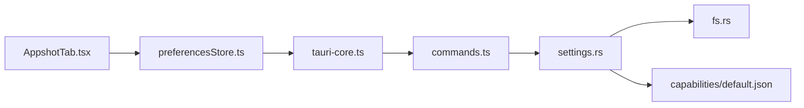

# 应用截图设置

<cite>
**本文引用的文件**
- [AppshotTab.tsx](file://frontend/app/views/settings/tabs/AppshotTab.tsx)
- [sections.ts](file://frontend/app/views/settings/sections.ts)
- [preferencesStore.ts](file://frontend/app/state/preferencesStore.ts)
- [settings.rs](file://src-tauri/src/commands/settings.rs)
- [default.json](file://src-tauri/capabilities/default.json)
- [fs.rs](file://src-tauri/src/commands/fs.rs)
- [tauri-core.ts](file://frontend/app/devbridge/tauri-core.ts)
- [commands.ts](file://frontend/app/devbridge/commands.ts)
- [appshot.txt](file://docs/uia/outlines-t41/appshot.txt)
</cite>

## 目录
1. [简介](#简介)
2. [项目结构](#项目结构)
3. [核心组件](#核心组件)
4. [架构总览](#架构总览)
5. [详细组件分析](#详细组件分析)
6. [依赖关系分析](#依赖关系分析)
7. [性能考虑](#性能考虑)
8. [故障排查指南](#故障排查指南)
9. [结论](#结论)
10. [附录](#附录)

## 简介
本页面聚焦“应用截图设置”（Appshot）功能，面向用户与开发者说明：
- 屏幕捕获的触发方式、目标与音效开关等配置项
- 权限模型与能力声明（Tauri capabilities）
- 截图保存路径与文件命名规则（基于现有能力边界）
- 图像处理的参数设置（分辨率、格式、质量）在仓库中的现状
- 截图预览与批量处理能力的可用性与限制
- 不同操作系统下的权限配置要点与常见问题定位

## 项目结构
截图设置的前端入口位于设置页的“应用快照”标签，通过偏好存储读写配置；后端提供通用的设置与首选项持久化命令。Tauri 能力清单定义了文件系统、对话框等能力，用于支持截图文件的读取/写入与选择。

图表来源
- [AppshotTab.tsx:1-72](file://frontend/app/views/settings/tabs/AppshotTab.tsx#L1-L72)
- [preferencesStore.ts](file://frontend/app/state/preferencesStore.ts)
- [sections.ts:34-65](file://frontend/app/views/settings/sections.ts#L34-L65)
- [tauri-core.ts:1-23](file://frontend/app/devbridge/tauri-core.ts#L1-L23)
- [commands.ts:35-67](file://frontend/app/devbridge/commands.ts#L35-L67)
- [settings.rs:1-69](file://src-tauri/src/commands/settings.rs#L1-L69)
- [fs.rs:101-131](file://src-tauri/src/commands/fs.rs#L101-L131)
- [default.json:1-30](file://src-tauri/capabilities/default.json#L1-L30)

章节来源
- [AppshotTab.tsx:1-72](file://frontend/app/views/settings/tabs/AppshotTab.tsx#L1-L72)
- [sections.ts:34-65](file://frontend/app/views/settings/sections.ts#L34-L65)
- [settings.rs:1-69](file://src-tauri/src/commands/settings.rs#L1-L69)
- [default.json:1-30](file://src-tauri/capabilities/default.json#L1-L30)

## 核心组件
- 截图设置界面（AppshotTab）
  - 提供快捷键、发送目标、音效开关三项配置
  - 使用偏好存储模块进行本地持久化
- 偏好存储（preferencesStore）
  - 提供 usePrefSection 与 saveSection 等接口，按 section 组织配置
- 设置页路由（sections）
  - 将“应用快照”作为设置项之一注册到设置面板
- 后端设置命令（settings.rs）
  - 暴露获取/保存偏好、快捷方式列表等命令
- Tauri 能力（default.json）
  - 声明 fs、dialog、shell 等能力，支撑文件操作与系统交互

章节来源
- [AppshotTab.tsx:16-71](file://frontend/app/views/settings/tabs/AppshotTab.tsx#L16-L71)
- [preferencesStore.ts](file://frontend/app/state/preferencesStore.ts)
- [sections.ts:34-65](file://frontend/app/views/settings/sections.ts#L34-L65)
- [settings.rs:8-69](file://src-tauri/src/commands/settings.rs#L8-L69)
- [default.json:1-30](file://src-tauri/capabilities/default.json#L1-L30)

## 架构总览
截图设置的端到端流程如下：用户在 AppshotTab 中修改配置，调用偏好存储写入；偏好数据通过 Tauri 命令持久化到后端状态并落盘。若后续需要读取或保存截图文件，则通过文件系统命令完成。

图表来源
- [AppshotTab.tsx:22-71](file://frontend/app/views/settings/tabs/AppshotTab.tsx#L22-L71)
- [preferencesStore.ts](file://frontend/app/state/preferencesStore.ts)
- [tauri-core.ts:12-17](file://frontend/app/devbridge/tauri-core.ts#L12-L17)
- [commands.ts:35-67](file://frontend/app/devbridge/commands.ts#L35-L67)
- [settings.rs:18-52](file://src-tauri/src/commands/settings.rs#L18-L52)
- [fs.rs:101-131](file://src-tauri/src/commands/fs.rs#L101-L131)

## 详细组件分析

### 截图设置界面（AppshotTab）
- 配置项
  - 快捷键：当前仅展示一个预设值（双 Alt），可通过下拉框切换（未来可扩展）
  - 发送目标：默认自动，用于决定截屏后内容流向
  - 音效：开关控制是否播放提示音
- 行为
  - 所有变更通过 saveSection 写入 appshot 分区
  - 媒体相关提示区域在当前版本禁用

图表来源
- [AppshotTab.tsx:30-68](file://frontend/app/views/settings/tabs/AppshotTab.tsx#L30-L68)

章节来源
- [AppshotTab.tsx:16-71](file://frontend/app/views/settings/tabs/AppshotTab.tsx#L16-L71)

### 偏好存储与后端持久化
- 前端偏好存储
  - 以 section 为单位管理配置，避免全局污染
  - 提供便捷 Hook 与保存函数
- 后端设置命令
  - get_preferences / save_preferences：读取与保存偏好
  - list_shortcuts / save_shortcuts：管理与截图相关的快捷键
- 能力声明
  - 启用 fs、dialog、shell 等能力，为后续截图文件读写与系统交互做准备

图表来源
- [preferencesStore.ts](file://frontend/app/state/preferencesStore.ts)
- [settings.rs:8-69](file://src-tauri/src/commands/settings.rs#L8-L69)
- [default.json:1-30](file://src-tauri/capabilities/default.json#L1-L30)

章节来源
- [settings.rs:8-69](file://src-tauri/src/commands/settings.rs#L8-L69)
- [default.json:1-30](file://src-tauri/capabilities/default.json#L1-L30)

### 文件系统与截图保存
- 当前可用的文件系统命令
  - read_file / write_file：支持指定工作目录与相对路径的安全拼接与读写
  - 读操作存在大小限制，写操作会自动创建父目录
- 能力与对话框
  - 已声明 dialog:allow-open/save，可用于选择保存位置或打开文件
  - shell:allow-open/execute 可用于打开文件或执行系统命令
- 截图保存路径与命名
  - 仓库未提供专门的“截图保存路径”和“命名模板”配置项
  - 建议结合 dialog.save 与 fs.write_file 实现自定义保存逻辑（需新增命令或扩展现有命令）

图表来源
- [default.json:1-30](file://src-tauri/capabilities/default.json#L1-L30)
- [fs.rs:101-131](file://src-tauri/src/commands/fs.rs#L101-L131)

章节来源
- [fs.rs:101-131](file://src-tauri/src/commands/fs.rs#L101-L131)
- [default.json:1-30](file://src-tauri/capabilities/default.json#L1-L30)

### 图像处理参数（分辨率、格式、质量）
- 现状
  - 仓库中未发现针对截图的分辨率、格式、质量等参数设置
  - 前端未暴露相关控件，后端也未提供对应命令
- 建议
  - 在前端增加参数输入（如分辨率、格式、质量滑块）
  - 在后端新增截图与图像处理命令，接收参数并输出文件
  - 结合 dialog.save 让用户选择保存路径与文件名

[本节为概念性说明，不直接分析具体代码文件]

### 截图预览与批量处理
- 预览
  - 当前截图设置页未包含预览控件
  - 可利用 dialog.open 打开图片进行预览
- 批量处理
  - 未提供批量截图或批量处理的能力
  - 可在后端新增批处理命令，配合循环调用 fs 与图像处理库实现

[本节为概念性说明，不直接分析具体代码文件]

### 无障碍与界面文案
- 设置页的无障碍树显示“应用快照”、“快捷键”、“发送目标”、“播放音效”等条目，便于辅助技术读取
- 这些文案由前端 i18n 驱动，界面元素具备语义化标签

章节来源
- [appshot.txt:73-86](file://docs/uia/outlines-t41/appshot.txt#L73-L86)

## 依赖关系分析
- 前端依赖
  - AppshotTab 依赖 preferencesStore 进行配置读写
  - 设置页通过 sections 注册“应用快照”入口
- 桥接层依赖
  - tauri-core 提供 invoke 别名，commands 负责命令分发
- 后端依赖
  - settings.rs 提供偏好与快捷键命令
  - fs.rs 提供文件读写命令
  - capabilities/default.json 约束可用能力

图表来源
- [AppshotTab.tsx:1-72](file://frontend/app/views/settings/tabs/AppshotTab.tsx#L1-L72)
- [preferencesStore.ts](file://frontend/app/state/preferencesStore.ts)
- [tauri-core.ts:1-23](file://frontend/app/devbridge/tauri-core.ts#L1-L23)
- [commands.ts:35-67](file://frontend/app/devbridge/commands.ts#L35-L67)
- [settings.rs:1-69](file://src-tauri/src/commands/settings.rs#L1-L69)
- [fs.rs:101-131](file://src-tauri/src/commands/fs.rs#L101-L131)
- [default.json:1-30](file://src-tauri/capabilities/default.json#L1-L30)

章节来源
- [AppshotTab.tsx:1-72](file://frontend/app/views/settings/tabs/AppshotTab.tsx#L1-L72)
- [settings.rs:1-69](file://src-tauri/src/commands/settings.rs#L1-L69)
- [default.json:1-30](file://src-tauri/capabilities/default.json#L1-L30)

## 性能考虑
- 偏好读写
  - 偏好变更采用增量 patch，减少不必要的全量同步
- 文件 I/O
  - 读文件存在上限限制，避免大文件导致内存压力
  - 写文件前自动创建目录，减少上层错误分支
- 截图处理（待实现）
  - 建议在后台线程执行重计算任务，避免阻塞主线程
  - 对高分辨率截图进行按需缩放与压缩，降低磁盘占用

[本节提供通用指导，不直接分析具体代码文件]

## 故障排查指南
- 无法保存偏好
  - 检查 Tauri 能力是否包含必要的 fs 与 store 权限
  - 查看后端日志，确认 save_preferences 是否返回错误
- 无法选择或保存文件
  - 确认 capabilities 中 dialog:allow-open/save 已启用
  - 验证路径拼接是否安全（避免目录穿越）
- 快捷键无效
  - 确认快捷键已正确保存到 shortcuts 列表
  - 检查是否有冲突的系统快捷键拦截
- 截图文件过大或读取失败
  - 注意 read_file 的大小限制
  - 分块读取或调整限制策略

章节来源
- [default.json:1-30](file://src-tauri/capabilities/default.json#L1-L30)
- [fs.rs:101-131](file://src-tauri/src/commands/fs.rs#L101-L131)
- [settings.rs:8-69](file://src-tauri/src/commands/settings.rs#L8-L69)

## 结论
- 当前仓库提供了截图设置的前端界面与偏好持久化通道，但尚未实现具体的截图捕获、图像处理与保存流程
- 能力声明已就绪，可在此基础上快速扩展截图与文件操作
- 建议优先补齐：截图命令、图像处理参数、保存路径与命名模板、预览与批量处理能力
- 完成后，用户可在“应用快照”设置中统一配置快捷键、目标、音效以及截图输出参数

[本节为总结性内容，不直接分析具体代码文件]

## 附录
- 术语
  - Appshot：应用快照，即截取当前应用窗口内容
  - 偏好（Preferences）：用户级配置，持久化存储
  - 能力（Capabilities）：Tauri 安全沙箱中允许的操作集合
- 相关文件索引
  - 前端设置页：AppshotTab.tsx、sections.ts
  - 偏好与命令：preferencesStore.ts、settings.rs
  - 文件操作：fs.rs
  - 能力声明：default.json
  - 开发模式桥接：tauri-core.ts、commands.ts
  - 无障碍树：appshot.txt

[本节为参考信息，不直接分析具体代码文件]