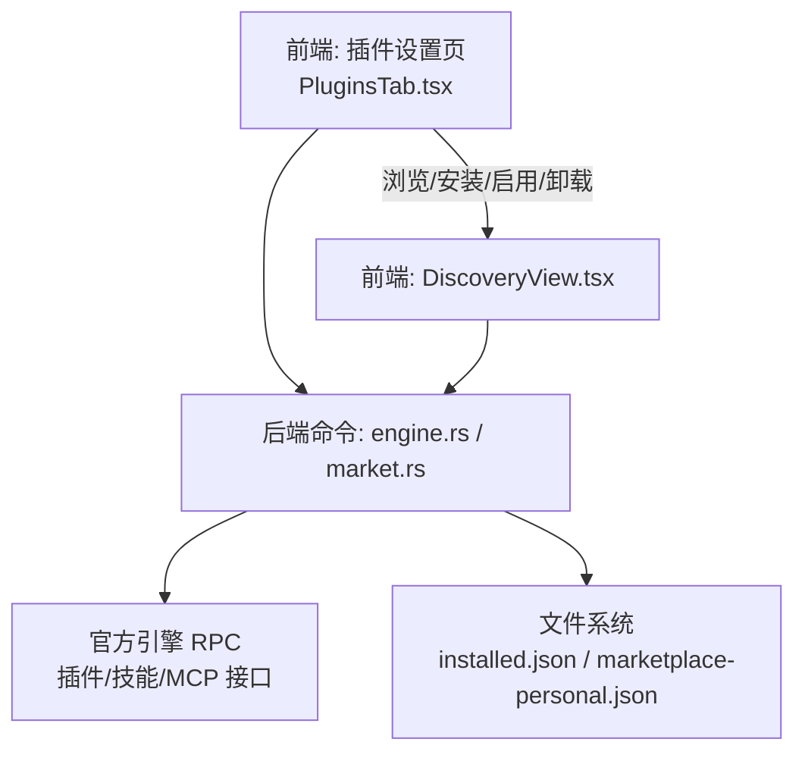
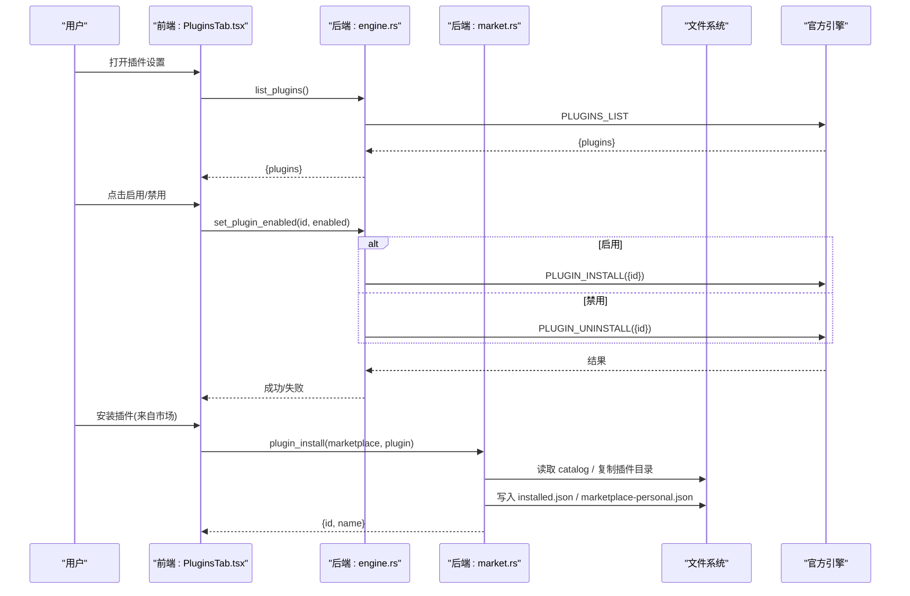
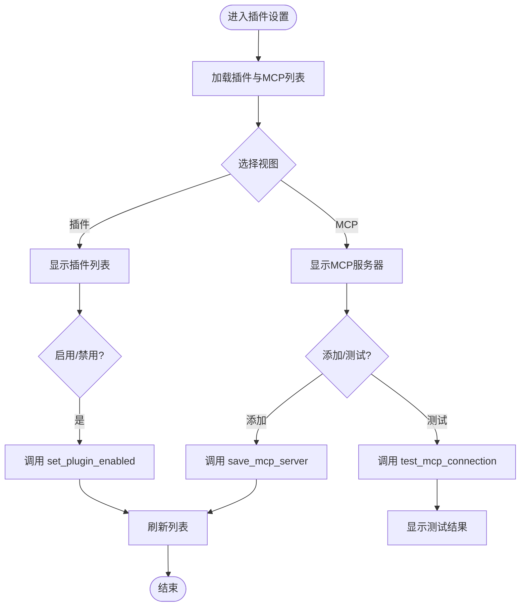
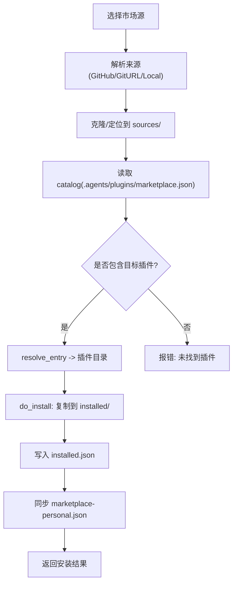

# 插件设置

<cite>
**本文引用的文件**
- [PluginsTab.tsx](file://frontend/app/views/settings/tabs/PluginsTab.tsx)
- [market.rs](file://src-tauri/src/commands/market.rs)
- [engine.rs](file://src-tauri/src/commands/engine.rs)
- [state.rs](file://src-tauri/src/state.rs)
- [DiscoveryView.tsx](file://frontend/app/views/DiscoveryView.tsx)
</cite>

## 目录
1. [简介](#简介)
2. [项目结构](#项目结构)
3. [核心组件](#核心组件)
4. [架构总览](#架构总览)
5. [详细组件分析](#详细组件分析)
6. [依赖关系与冲突处理](#依赖关系与冲突处理)
7. [性能考量](#性能考量)
8. [故障排查指南](#故障排查指南)
9. [结论](#结论)
10. [附录：开发指南与调试](#附录：开发指南与调试)

## 简介
本章节面向“插件设置”页面，系统性说明插件管理系统的安装、卸载、版本控制、配置界面与参数选项、依赖与冲突策略、市场集成与自动更新能力、开发指南与调试工具，以及安全验证与权限管理机制。文档基于前端设置页与后端命令实现进行梳理，帮助读者快速理解并正确使用该功能。

## 项目结构
插件设置由前端“插件标签页”和后端“市场/引擎命令”共同构成：
- 前端设置页提供插件列表、MCP 服务器管理、开关启用/禁用、连接测试等交互。
- 后端通过 Tauri 命令暴露插件市场、本地插件安装、已安装列表、启用/禁用等操作；同时桥接官方引擎协议完成插件生命周期管理。

图表来源
- [PluginsTab.tsx:74-183](file://frontend/app/views/settings/tabs/PluginsTab.tsx#L74-L183)
- [engine.rs:560-693](file://src-tauri/src/commands/engine.rs#L560-L693)
- [market.rs:659-839](file://src-tauri/src/commands/market.rs#L659-L839)
- [DiscoveryView.tsx:1125-1168](file://frontend/app/views/DiscoveryView.tsx#L1125-L1168)

章节来源
- [PluginsTab.tsx:74-183](file://frontend/app/views/settings/tabs/PluginsTab.tsx#L74-L183)
- [engine.rs:560-693](file://src-tauri/src/commands/engine.rs#L560-L693)
- [market.rs:659-839](file://src-tauri/src/commands/market.rs#L659-L839)
- [DiscoveryView.tsx:1125-1168](file://frontend/app/views/DiscoveryView.tsx#L1125-L1168)

## 核心组件
- 插件设置页（前端）：展示插件与 MCP 服务器列表，支持添加/启用/禁用/测试连接。
- 市场模块（后端）：维护市场源、插件清单、已安装记录，执行克隆、复制、同步个人目录等操作。
- 引擎桥接（后端）：将插件/技能/MCP 操作转发到官方引擎协议，统一返回格式。
- 状态持久化（后端）：使用 JSON 文件保存市场源、已安装插件、个人目录清单等。

章节来源
- [PluginsTab.tsx:74-183](file://frontend/app/views/settings/tabs/PluginsTab.tsx#L74-L183)
- [market.rs:25-94](file://src-tauri/src/commands/market.rs#L25-L94)
- [engine.rs:665-693](file://src-tauri/src/commands/engine.rs#L665-L693)

## 架构总览
插件设置的核心数据流如下：
- 前端调用 Tauri 命令获取插件列表、MCP 服务器列表。
- 安装/卸载/启用/禁用通过 engine.rs 的 set_plugin_enabled 映射到官方引擎的 install/uninstall。
- 市场相关操作（添加市场源、列出插件、安装本地或市场插件）由 market.rs 实现，并将结果写入 data_dir/plugins 下的 JSON 文件，同时生成个人目录清单以兼容官方布局。

图表来源
- [PluginsTab.tsx:81-158](file://frontend/app/views/settings/tabs/PluginsTab.tsx#L81-L158)
- [engine.rs:665-693](file://src-tauri/src/commands/engine.rs#L665-L693)
- [market.rs:711-739](file://src-tauri/src/commands/market.rs#L711-L739)
- [market.rs:659-709](file://src-tauri/src/commands/market.rs#L659-L709)

## 详细组件分析

### 插件设置页（前端）
- 列表加载：调用 list_mcp_servers 与 list_plugins，分别渲染 MCP 服务器与插件条目。
- 添加 MCP 服务器：通过 save_mcp_server 写入配置，随后刷新列表。
- 启用/禁用：调用 set_plugin_enabled，成功后刷新。
- 连接测试：调用 test_mcp_connection，解析返回状态并显示。

图表来源
- [PluginsTab.tsx:81-158](file://frontend/app/views/settings/tabs/PluginsTab.tsx#L81-L158)

章节来源
- [PluginsTab.tsx:74-183](file://frontend/app/views/settings/tabs/PluginsTab.tsx#L74-L183)

### 市场与安装（后端）
- 市场源管理：支持 GitHub 简写、Git URL、本地目录三种来源；解析 catalog 并持久化到 marketplaces.json。
- 插件清单解析：优先读取根目录 plugin.json，其次 .codex-plugin/plugin.json；提取名称、描述、版本、logo、品牌色等。
- 安装流程：复制插件目录至 installed/<id>，更新 installed.json，并同步个人目录清单 marketplace-personal.json。
- 卸载流程：从 installed.json 移除记录并删除对应目录，同步个人目录清单。
- 启用/禁用：直接修改 installed.json 中的 enabled 字段。

图表来源
- [market.rs:285-352](file://src-tauri/src/commands/market.rs#L285-L352)
- [market.rs:388-517](file://src-tauri/src/commands/market.rs#L388-L517)
- [market.rs:659-709](file://src-tauri/src/commands/market.rs#L659-L709)
- [market.rs:711-739](file://src-tauri/src/commands/market.rs#L711-L739)

章节来源
- [market.rs:25-94](file://src-tauri/src/commands/market.rs#L25-L94)
- [market.rs:285-352](file://src-tauri/src/commands/market.rs#L285-L352)
- [market.rs:388-517](file://src-tauri/src/commands/market.rs#L388-L517)
- [market.rs:659-709](file://src-tauri/src/commands/market.rs#L659-L709)
- [market.rs:711-739](file://src-tauri/src/commands/market.rs#L711-L739)

### 引擎桥接（插件生命周期）
- 插件列表：list_plugins 调用官方引擎的插件列表接口，规范化返回结构。
- 启用/禁用：set_plugin_enabled 根据 enabled 调用官方引擎的插件安装/卸载接口。
- 技能列表：list_skills/reload_skills 用于获取/刷新技能信息。
- MCP 服务器：list/save/test/enable 均通过引擎配置批量写入与刷新。

章节来源
- [engine.rs:560-693](file://src-tauri/src/commands/engine.rs#L560-L693)

### 状态与持久化
- 市场源与已安装记录：保存在 data_dir/plugins 下的 marketplaces.json 与 installed.json。
- 个人目录清单：每次安装/卸载后同步 marketplace-personal.json，保持与官方布局一致。
- 应用状态：AppState 负责 shell 状态持久化，包括 provider 密钥、协议、端点等。

章节来源
- [market.rs:80-94](file://src-tauri/src/commands/market.rs#L80-L94)
- [market.rs:689-709](file://src-tauri/src/commands/market.rs#L689-L709)
- [state.rs:150-217](file://src-tauri/src/state.rs#L150-L217)

## 依赖关系与冲突处理
- 依赖关系：当前实现未显式声明插件间依赖；插件清单中 skills 可被扫描并汇总，供上层使用。
- 冲突解决：
  - 安装时若目标目录已存在，会先删除再复制，避免残留导致的状态不一致。
  - 个人目录清单在每次安装/卸载后同步，确保 UI 与磁盘状态一致。
  - 对于远程来源（git-subdir/npm/url），当前仅支持本地路径安装，其他来源暂不支持，避免潜在冲突。
- 版本控制：
  - 插件清单中包含 version 字段，安装记录也会记录版本；但当前未提供自动更新机制。
  - 可通过重新安装覆盖旧版本，达到手动更新效果。

章节来源
- [market.rs:659-709](file://src-tauri/src/commands/market.rs#L659-L709)
- [market.rs:711-739](file://src-tauri/src/commands/market.rs#L711-L739)
- [market.rs:782-806](file://src-tauri/src/commands/market.rs#L782-L806)

## 性能考量
- 克隆与复制：git clone --depth 1 减少网络与磁盘开销；copy_dir 跳过 .git 与 node_modules，提升复制效率。
- 图标处理：小尺寸 logo 转为 data URL 以减少额外文件访问；对过大文件进行限制，避免阻塞。
- 超时保护：git clone 设置 180 秒超时，防止长时间阻塞。
- 列表刷新：前端在操作成功后立即刷新，保证 UI 一致性。

章节来源
- [market.rs:258-277](file://src-tauri/src/commands/market.rs#L258-L277)
- [market.rs:354-384](file://src-tauri/src/commands/market.rs#L354-L384)
- [market.rs:165-206](file://src-tauri/src/commands/market.rs#L165-L206)

## 故障排查指南
- 无法克隆市场源：检查 git 是否安装且网络可达；错误信息会提示“git is not installed”或克隆失败详情。
- 找不到插件：确认市场源包含有效的 catalog，且插件名匹配；当前仅支持本地路径来源的安装。
- 插件目录缺失：如果用户手动删除了插件目录，查询时会过滤掉无效记录，需重新安装。
- 连接测试失败：检查 MCP 服务器的 transport/command 配置是否正确；测试后会显示具体状态或错误消息。
- 启用/禁用失败：查看后端日志或控制台输出，确认引擎 RPC 是否成功。

章节来源
- [market.rs:354-384](file://src-tauri/src/commands/market.rs#L354-L384)
- [market.rs:711-739](file://src-tauri/src/commands/market.rs#L711-L739)
- [market.rs:782-806](file://src-tauri/src/commands/market.rs#L782-L806)
- [PluginsTab.tsx:118-149](file://frontend/app/views/settings/tabs/PluginsTab.tsx#L118-L149)

## 结论
插件设置提供了完整的插件生命周期管理能力：从市场源添加、插件安装/卸载、启用/禁用，到 MCP 服务器管理与连接测试。系统通过文件系统持久化与官方引擎协议桥接，保证了状态一致性与兼容性。当前版本尚未实现自动更新与复杂依赖解析，但为后续扩展预留了清晰的数据结构与接口。

## 附录：开发指南与调试
- 插件开发规范：
  - 插件目录需包含 plugin.json 或 .codex-plugin/plugin.json，提供 name、description、version、interface（含 displayName、shortDescription、longDescription、logo/composerIcon、brandColor）。
  - 可选 skills 目录，每个子目录包含 SKILL.md，frontmatter 中定义 name 与 description。
- 调试工具：
  - 前端控制台：插件设置页的操作会在控制台输出警告或错误信息，便于定位问题。
  - 后端日志：Tauri 命令执行失败会返回结构化错误，可在开发者工具中查看。
  - 浏览器开发模式：devbridge 提供虚拟文件系统和对话框模拟，便于在无原生能力的浏览器环境中调试插件交互。
- 安全与权限：
  - 插件安装目录位于 data_dir/plugins，受应用沙箱约束。
  - 敏感信息（如 API Key）不写入明文配置文件，而是通过环境变量注入到侧边进程，避免泄露。
  - 图标资源大小限制与类型白名单，降低恶意资源风险。

章节来源
- [market.rs:141-153](file://src-tauri/src/commands/market.rs#L141-L153)
- [market.rs:214-256](file://src-tauri/src/commands/market.rs#L214-L256)
- [state.rs:8-25](file://src-tauri/src/state.rs#L8-L25)
- [engine.rs:248-404](file://src-tauri/src/commands/engine.rs#L248-L404)