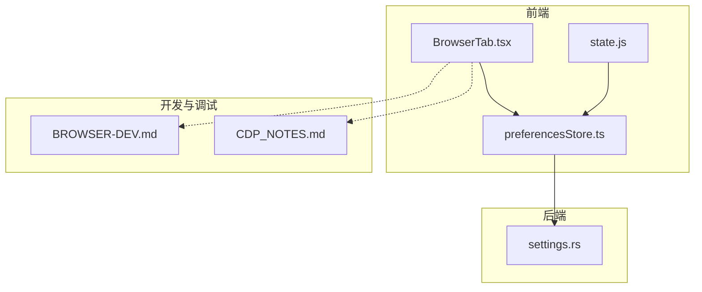
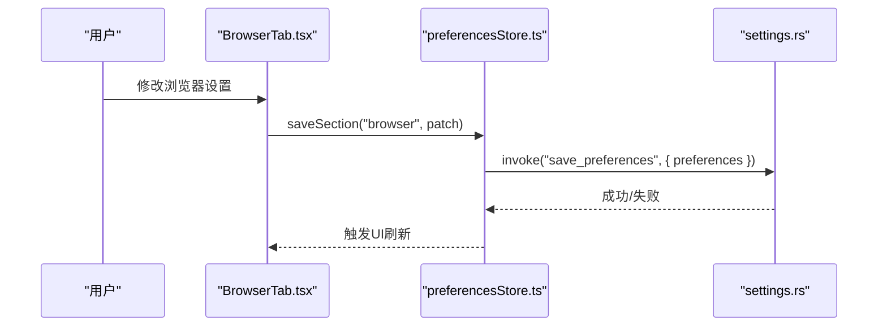
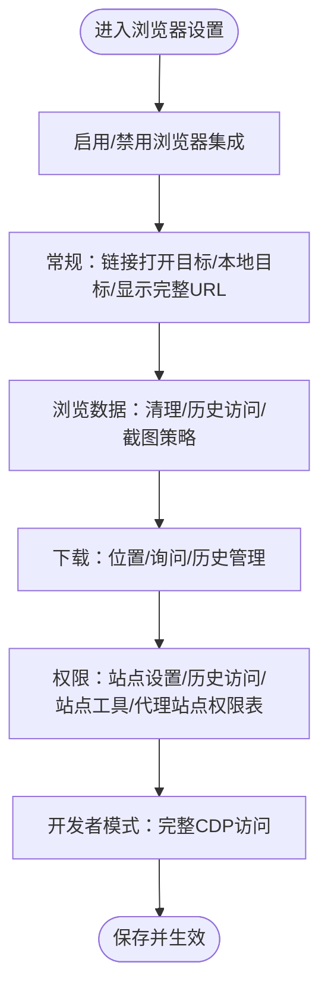
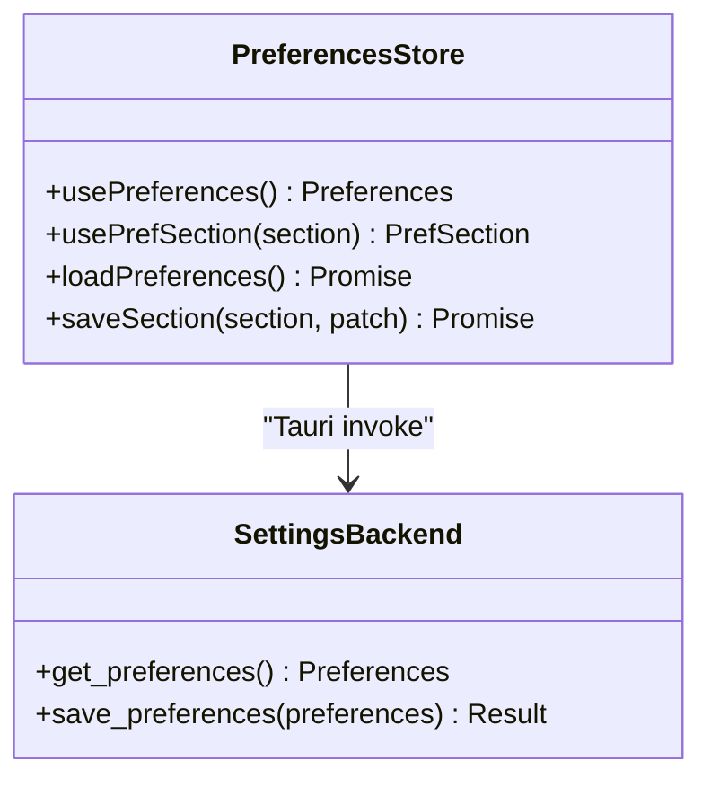
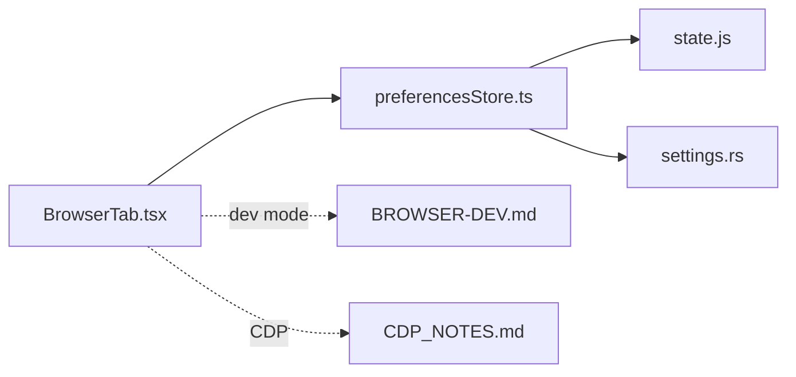

# 浏览器设置

<cite>
**本文引用的文件**
- [BrowserTab.tsx](file://frontend/app/views/settings/tabs/BrowserTab.tsx)
- [ComputerUseTab.tsx](file://frontend/app/views/settings/tabs/ComputerUseTab.tsx)
- [preferencesStore.ts](file://frontend/app/state/preferencesStore.ts)
- [state.js](file://frontend/src/js/state.js)
- [settings.rs](file://src-tauri/src/commands/settings.rs)
- [BROWSER-DEV.md](file://docs/BROWSER-DEV.md)
- [CDP_NOTES.md](file://docs/official-ui/CDP_NOTES.md)
- [browser.txt](file://docs/uia/outlines-t41/browser.txt)
</cite>

## 目录
1. [简介](#简介)
2. [项目结构](#项目结构)
3. [核心组件](#核心组件)
4. [架构总览](#架构总览)
5. [详细组件分析](#详细组件分析)
6. [依赖关系分析](#依赖关系分析)
7. [性能考虑](#性能考虑)
8. [故障排除指南](#故障排除指南)
9. [结论](#结论)
10. [附录](#附录)

## 简介
本文件为“浏览器设置”页面的完整技术文档，聚焦于浏览器集成功能、扩展管理、配置选项与连接设置。内容涵盖：
- 支持的浏览器类型与版本兼容性说明（基于现有代码与文档）
- 浏览器扩展的安装与配置流程现状
- 代理设置与网络配置（开发模式下的 WebSocket 代理）
- 不同浏览器的特定配置要点与常见问题排查
- 安全与隐私保护建议（特别是 CDP 访问与本地调试端口）

## 项目结构
浏览器设置由前端设置页的“浏览器”标签页提供 UI，并通过偏好存储层持久化到后端状态。关键路径如下：
- 前端设置页：`frontend/app/views/settings/tabs/BrowserTab.tsx`
- 偏好存储与持久化：`frontend/app/state/preferencesStore.ts`
- 默认偏好定义：`frontend/src/js/state.js`
- 后端设置命令：`src-tauri/src/commands/settings.rs`
- 开发模式桥接与代理：`docs/BROWSER-DEV.md`
- CDP 相关注意事项：`docs/official-ui/CDP_NOTES.md`
- 界面元素与文案参考：`docs/uia/outlines-t41/browser.txt`

**图表来源**
- [BrowserTab.tsx:1-308](file://frontend/app/views/settings/tabs/BrowserTab.tsx#L1-L308)
- [preferencesStore.ts:1-94](file://frontend/app/state/preferencesStore.ts#L1-L94)
- [state.js:60-122](file://frontend/src/js/state.js#L60-L122)
- [settings.rs:35-52](file://src-tauri/src/commands/settings.rs#L35-L52)
- [BROWSER-DEV.md:1-93](file://docs/BROWSER-DEV.md#L1-L93)
- [CDP_NOTES.md:1-23](file://docs/official-ui/CDP_NOTES.md#L1-L23)

**章节来源**
- [BrowserTab.tsx:1-308](file://frontend/app/views/settings/tabs/BrowserTab.tsx#L1-L308)
- [preferencesStore.ts:1-94](file://frontend/app/state/preferencesStore.ts#L1-L94)
- [state.js:60-122](file://frontend/src/js/state.js#L60-L122)
- [settings.rs:35-52](file://src-tauri/src/commands/settings.rs#L35-L52)
- [BROWSER-DEV.md:1-93](file://docs/BROWSER-DEV.md#L1-L93)
- [CDP_NOTES.md:1-23](file://docs/official-ui/CDP_NOTES.md#L1-L23)

## 核心组件
- 浏览器设置页面（BrowserTab）：提供启用开关、链接打开目标、截图策略、下载行为、历史访问控制、站点工具、权限表以及开发者模式（完整 CDP 访问）等选项。
- 偏好存储（preferencesStore）：负责读取/合并默认偏好、保存用户更改并调用后端命令进行持久化。
- 默认偏好（state.js）：集中定义各模块的默认值，包括 browser 模块的关键键。
- 后端设置命令（settings.rs）：暴露 get_preferences/save_preferences 等 Tauri 命令，将偏好写入应用状态并持久化。

**章节来源**
- [BrowserTab.tsx:28-46](file://frontend/app/views/settings/tabs/BrowserTab.tsx#L28-L46)
- [preferencesStore.ts:40-88](file://frontend/app/state/preferencesStore.ts#L40-L88)
- [state.js:94-102](file://frontend/src/js/state.js#L94-L102)
- [settings.rs:35-52](file://src-tauri/src/commands/settings.rs#L35-L52)

## 架构总览
浏览器设置的数据流：
- 用户在 BrowserTab 中修改选项 → 通过 preferencesStore.saveSection 更新本地状态并调用后端 save_preferences → 后端更新 AppState.preferences 并持久化。
- 启动时 preferencesStore.loadPreferences 调用 get_preferences 加载后端偏好，合并默认值后渲染界面。

**图表来源**
- [BrowserTab.tsx:43-46](file://frontend/app/views/settings/tabs/BrowserTab.tsx#L43-L46)
- [preferencesStore.ts:76-88](file://frontend/app/state/preferencesStore.ts#L76-L88)
- [settings.rs:45-52](file://src-tauri/src/commands/settings.rs#L45-L52)

## 详细组件分析

### 浏览器设置页面（BrowserTab）
- 功能分区
  - 启用开关：控制浏览器集成是否启用。
  - 常规：链接打开目标（嵌入式或默认浏览器）、本地目标、显示完整 URL。
  - 浏览数据：清理浏览数据（当前未接线）、历史记录访问策略、截图策略。
  - 自动填充与密码：管理入口（当前未接线）。
  - 下载：下载位置选择（未接线）、询问保存位置、下载历史管理（未接线）。
  - 权限：站点设置（未接线）、历史访问策略、站点工具开关、代理站点权限表（浏览/下载/上传）。
  - 开发者模式：开启完整 CDP 访问（高风险）。
- 交互与状态
  - 所有可编辑项通过 usePrefSection("browser") 读取与保存。
  - 未对接 L3 命令的功能按钮保持禁用状态，避免误导用户。

**图表来源**
- [BrowserTab.tsx:74-304](file://frontend/app/views/settings/tabs/BrowserTab.tsx#L74-L304)

**章节来源**
- [BrowserTab.tsx:28-304](file://frontend/app/views/settings/tabs/BrowserTab.tsx#L28-L304)
- [browser.txt:140-154](file://docs/uia/outlines-t41/browser.txt#L140-L154)

### 偏好存储与持久化（preferencesStore）
- 读取与合并默认值：使用 state.js 中的 defaultPreferences() 与 mergePreferences() 确保前后端一致。
- 保存流程：先乐观更新本地状态，再调用后端 save_preferences；失败时记录错误但不阻塞 UI。
- 事件与订阅：通过 React 外部存储订阅机制实现响应式更新。

**图表来源**
- [preferencesStore.ts:40-88](file://frontend/app/state/preferencesStore.ts#L40-L88)
- [settings.rs:35-52](file://src-tauri/src/commands/settings.rs#L35-L52)

**章节来源**
- [preferencesStore.ts:1-94](file://frontend/app/state/preferencesStore.ts#L1-L94)
- [settings.rs:35-52](file://src-tauri/src/commands/settings.rs#L35-L52)

### 默认偏好与键映射（state.js）
- 浏览器相关默认键：enabled、openTarget、screenshots、downloads、permissions、developerMode、fullCdpAccess。
- 这些键在 BrowserTab 中被读写，用于驱动界面行为与后端持久化。

**章节来源**
- [state.js:94-102](file://frontend/src/js/state.js#L94-L102)

### 计算机使用与扩展安装（ComputerUseTab）
- 支持 Chrome 与 Edge 的扩展安装入口（当前未接线，按钮禁用），提示“无扩展”。
- 该页面预留了扩展安装能力的位置，待后端 L3 命令实现后启用。

**章节来源**
- [ComputerUseTab.tsx:64-104](file://frontend/app/views/settings/tabs/ComputerUseTab.tsx#L64-L104)

## 依赖关系分析
- 前端依赖
  - BrowserTab 依赖 preferencesStore 进行状态读写。
  - preferencesStore 依赖 state.js 的默认值与合并逻辑。
  - 开发模式下，前端通过 devbridge 与引擎 WebSocket 通信，绕过 Origin 限制。
- 后端依赖
  - settings.rs 提供 get_preferences/save_preferences，维护 AppState.preferences 并持久化。
- 文档与规范
  - BROWSER-DEV.md 描述开发模式的 WS 代理与限制。
  - CDP_NOTES.md 说明生产环境 CDP 的限制与替代方案。

**图表来源**
- [BrowserTab.tsx:1-308](file://frontend/app/views/settings/tabs/BrowserTab.tsx#L1-L308)
- [preferencesStore.ts:1-94](file://frontend/app/state/preferencesStore.ts#L1-L94)
- [state.js:60-122](file://frontend/src/js/state.js#L60-L122)
- [settings.rs:35-52](file://src-tauri/src/commands/settings.rs#L35-L52)
- [BROWSER-DEV.md:1-93](file://docs/BROWSER-DEV.md#L1-L93)
- [CDP_NOTES.md:1-23](file://docs/official-ui/CDP_NOTES.md#L1-L23)

**章节来源**
- [BrowserTab.tsx:1-308](file://frontend/app/views/settings/tabs/BrowserTab.tsx#L1-L308)
- [preferencesStore.ts:1-94](file://frontend/app/state/preferencesStore.ts#L1-L94)
- [state.js:60-122](file://frontend/src/js/state.js#L60-L122)
- [settings.rs:35-52](file://src-tauri/src/commands/settings.rs#L35-L52)
- [BROWSER-DEV.md:1-93](file://docs/BROWSER-DEV.md#L1-L93)
- [CDP_NOTES.md:1-23](file://docs/official-ui/CDP_NOTES.md#L1-L23)

## 性能考虑
- 偏好保存采用乐观更新，减少 UI 卡顿；后端失败仅记录日志，不影响用户体验。
- 开发模式下 WebSocket 重连与握手超时处理，避免长时间阻塞。
- 浏览器截图策略与历史访问控制影响运行时开销，按需调整。

[本节为通用指导，不直接分析具体文件]

## 故障排除指南
- 无法连接引擎（开发模式）
  - 检查 vite dev 模式是否启用，WS 代理是否转发到引擎地址。
  - 确认引擎监听端口与代理路径正确，控制台应出现握手完成日志。
- CDP 访问受限
  - 生产环境可能禁用远程调试；如需 CDP，需打包前启用调试开关或使用非 Store 构建。
- 扩展安装不可用
  - 当前 Chrome/Edge 扩展安装按钮禁用，等待后端 L3 命令实现。
- 权限与历史访问
  - 若站点工具或历史访问策略导致异常，尝试切换为“始终询问”以定位问题。

**章节来源**
- [BROWSER-DEV.md:8-25](file://docs/BROWSER-DEV.md#L8-L25)
- [BROWSER-DEV.md:50-93](file://docs/BROWSER-DEV.md#L50-L93)
- [CDP_NOTES.md:1-23](file://docs/official-ui/CDP_NOTES.md#L1-L23)
- [ComputerUseTab.tsx:76-92](file://frontend/app/views/settings/tabs/ComputerUseTab.tsx#L76-L92)

## 结论
浏览器设置页面提供了完整的配置入口，覆盖启用、常规、数据、下载、权限与开发者模式等关键维度。当前部分高级功能（如导入/清理/管理、扩展安装）尚未对接后端命令，处于禁用状态。开发模式通过 WS 代理实现与引擎的真实通信，便于前端调试。生产环境下 CDP 访问受限，需谨慎启用。建议在后续迭代中逐步补齐缺失的 L3 命令，完善扩展管理与数据管理能力。

[本节为总结性内容，不直接分析具体文件]

## 附录

### 支持的浏览器类型与版本兼容性
- 界面与配置项针对嵌入式浏览器与系统默认浏览器（Chrome/Edge/Firefox）提供选项。
- 开发模式通过 WS 代理与官方引擎通信，不受浏览器 Origin 限制。
- 生产环境的 CDP 能力受限于打包方式与调试开关，需在非 Store 构建或启用调试特性时使用。

**章节来源**
- [GeneralTab.tsx:211-213](file://frontend/app/views/settings/tabs/GeneralTab.tsx#L211-L213)
- [BROWSER-DEV.md:8-25](file://docs/BROWSER-DEV.md#L8-L25)
- [CDP_NOTES.md:1-23](file://docs/official-ui/CDP_NOTES.md#L1-L23)

### 代理设置与网络配置
- 开发模式：vite 插件将 /appserver 请求转发至引擎 WS 地址，去除 Origin 头以避免被拒绝。
- 可通过 URL 查询参数临时指定引擎地址，便于多实例调试。
- 注意：WS 无鉴权，勿将调试端口暴露给不可信网络。

**章节来源**
- [BROWSER-DEV.md:8-25](file://docs/BROWSER-DEV.md#L8-L25)
- [BROWSER-DEV.md:31-49](file://docs/BROWSER-DEV.md#L31-L49)
- [BROWSER-DEV.md:85-93](file://docs/BROWSER-DEV.md#L85-L93)

### 安全与隐私保护措施
- 完整 CDP 访问具有较高风险，仅在必要时启用，并确保本地调试端口不被外网访问。
- 历史访问策略建议设置为“始终询问”，以减少对浏览历史的静默读取。
- 站点工具与权限表可按需限制浏览、下载、上传能力，最小化授权范围。

**章节来源**
- [BrowserTab.tsx:285-304](file://frontend/app/views/settings/tabs/BrowserTab.tsx#L285-L304)
- [BrowserTab.tsx:207-283](file://frontend/app/views/settings/tabs/BrowserTab.tsx#L207-L283)
- [BROWSER-DEV.md:85-93](file://docs/BROWSER-DEV.md#L85-L93)