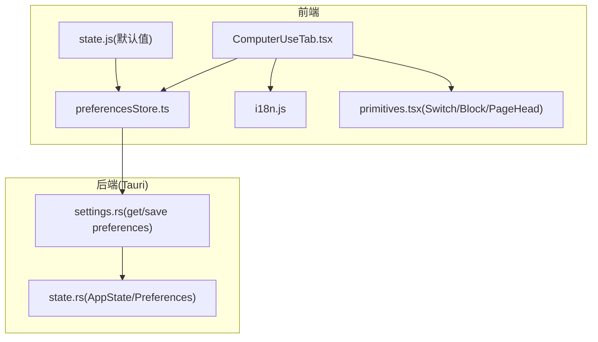
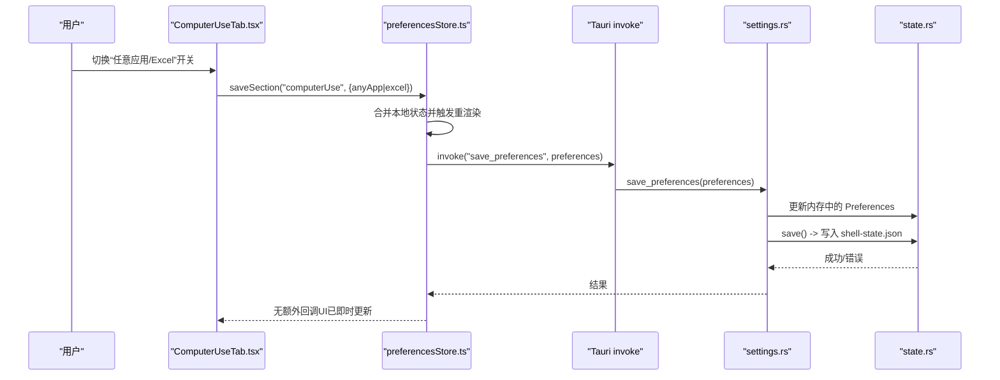
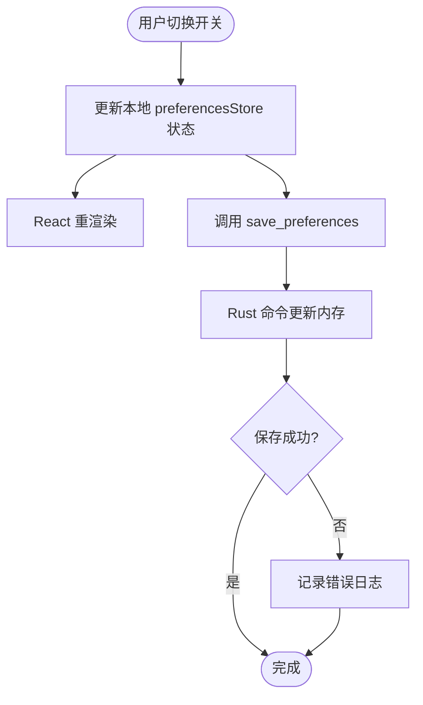
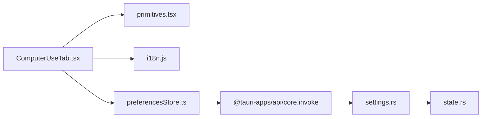

# 计算机使用设置

<cite>
**本文引用的文件**
- [ComputerUseTab.tsx](file://frontend/app/views/settings/tabs/ComputerUseTab.tsx)
- [preferencesStore.ts](file://frontend/app/state/preferencesStore.ts)
- [i18n.js](file://frontend/src/js/i18n.js)
- [state.js](file://frontend/src/js/state.js)
- [primitives.tsx](file://frontend/app/views/settings/primitives.tsx)
- [settings.rs](file://src-tauri/src/commands/settings.rs)
- [state.rs](file://src-tauri/src/state.rs)
- [computer-use.txt](file://docs/uia/outlines-t41/computer-use.txt)
</cite>

## 目录
1. [简介](#简介)
2. [项目结构](#项目结构)
3. [核心组件](#核心组件)
4. [架构总览](#架构总览)
5. [详细组件分析](#详细组件分析)
6. [依赖关系分析](#依赖关系分析)
7. [性能考虑](#性能考虑)
8. [故障排除指南](#故障排除指南)
9. [结论](#结论)
10. [附录](#附录)

## 简介
本页面为“计算机使用设置”，用于管理应用对电脑中其他应用程序的控制权限。当前实现包含：
- 控制区：任意应用程序访问开关、Excel 集成开关，以及 Chrome/Edge 浏览器扩展安装入口（当前禁用）。
- 始终允许的应用白名单区：展示与后续扩展点（当前为空列表占位）。
该页面通过前端状态与持久化存储联动，保证配置在重启后依然生效。

## 项目结构
“计算机使用设置”由以下关键部分组成：
- 设置页签：ComputerUseTab.tsx 负责渲染“控制”和“始终允许的应用”两个区块。
- 偏好存储：preferencesStore.ts 提供读取/保存偏好项的接口，并桥接到后端命令。
- 本地化：i18n.js 提供多语言文案键值。
- 默认值：state.js 定义 computerUse 等偏好区的默认值。
- UI 原语：primitives.tsx 提供 Switch、Block、PageHead 等通用控件。
- 后端命令：settings.rs 暴露 get_preferences/save_preferences 等命令。
- 持久化：state.rs 将 Preferences 序列化为 shell-state.json 进行落盘。

图表来源
- [ComputerUseTab.tsx:57-109](file://frontend/app/views/settings/tabs/ComputerUseTab.tsx#L57-L109)
- [preferencesStore.ts:45-88](file://frontend/app/state/preferencesStore.ts#L45-L88)
- [i18n.js:464-473](file://frontend/src/js/i18n.js#L464-L473)
- [state.js:103-107](file://frontend/src/js/state.js#L103-L107)
- [primitives.tsx:11-51](file://frontend/app/views/settings/primitives.tsx#L11-L51)
- [settings.rs:35-52](file://src-tauri/src/commands/settings.rs#L35-L52)
- [state.rs:49-64](file://src-tauri/src/state.rs#L49-L64)

章节来源
- [ComputerUseTab.tsx:57-109](file://frontend/app/views/settings/tabs/ComputerUseTab.tsx#L57-L109)
- [preferencesStore.ts:45-88](file://frontend/app/state/preferencesStore.ts#L45-L88)
- [i18n.js:464-473](file://frontend/src/js/i18n.js#L464-L473)
- [state.js:103-107](file://frontend/src/js/state.js#L103-L107)
- [primitives.tsx:11-51](file://frontend/app/views/settings/primitives.tsx#L11-L51)
- [settings.rs:35-52](file://src-tauri/src/commands/settings.rs#L35-L52)
- [state.rs:49-64](file://src-tauri/src/state.rs#L49-L64)

## 核心组件
- ComputerUseTab 组件
  - 渲染“控制”区块：任意应用、Chrome、Edge、Excel 四行；其中 Chrome/Edge 的安装按钮当前禁用。
  - 渲染“始终允许的应用”区块：当前显示空列表占位。
  - 使用 i18n 键获取标题、描述与按钮文案。
  - 使用 Switch 控件绑定 anyApp 与 excel 开关，并通过 saveSection 持久化。
- 偏好存储层
  - usePrefSection 读取指定 section 的合并后的偏好数据（含默认值）。
  - saveSection 先更新本地状态再调用后端 save_preferences，失败时记录日志。
- 默认值与合并策略
  - state.js 中 computerUse.anyApp/excel/allowlist 提供默认值。
  - mergePreferences 将后端返回的数据与默认值合并，确保字段存在。
- 持久化
  - settings.rs 的 save_preferences 写入 AppState.preferences。
  - state.rs 的 AppState.save 将 Preferences 序列化到 shell-state.json。

章节来源
- [ComputerUseTab.tsx:57-109](file://frontend/app/views/settings/tabs/ComputerUseTab.tsx#L57-L109)
- [preferencesStore.ts:45-88](file://frontend/app/state/preferencesStore.ts#L45-L88)
- [state.js:103-107](file://frontend/src/js/state.js#L103-L107)
- [settings.rs:35-52](file://src-tauri/src/commands/settings.rs#L35-L52)
- [state.rs:177-217](file://src-tauri/src/state.rs#L177-L217)

## 架构总览
下图展示了从用户交互到持久化的完整链路：

图表来源
- [ComputerUseTab.tsx:64-104](file://frontend/app/views/settings/tabs/ComputerUseTab.tsx#L64-L104)
- [preferencesStore.ts:76-88](file://frontend/app/state/preferencesStore.ts#L76-L88)
- [settings.rs:45-52](file://src-tauri/src/commands/settings.rs#L45-L52)
- [state.rs:209-217](file://src-tauri/src/state.rs#L209-L217)

## 详细组件分析

### 控制区：任意应用程序访问
- 功能说明
  - 开关名称：允许任何应用程序
  - 行为：开启后允许应用控制本机上的任意应用程序。
  - 图标：🖥️
  - 描述文本：来自 i18n 键 computerUse.anyAppDesc。
  - 状态来源：preferencesStore.usePrefSection("computerUse").anyApp
  - 持久化：onChange 调用 saveSection("computerUse", { anyApp: v })
- 默认值
  - computerUse.anyApp 默认为 true（见 state.js）。
- 界面元素
  - 使用 primitives.tsx 的 Switch 控件。
  - 使用 Block/PageHead 组织区块与页面头信息。

章节来源
- [ComputerUseTab.tsx:64-75](file://frontend/app/views/settings/tabs/ComputerUseTab.tsx#L64-L75)
- [preferencesStore.ts:45-88](file://frontend/app/state/preferencesStore.ts#L45-L88)
- [state.js:103-107](file://frontend/src/js/state.js#L103-L107)
- [i18n.js:687-690](file://frontend/src/js/i18n.js#L687-L690)

### 控制区：Excel 集成
- 功能说明
  - 开关名称：Microsoft Excel
  - 行为：允许 ChatGPT 使用 Microsoft Excel 加载项以获得更多控制权限。
  - 图标：📊
  - 描述文本：来自 i18n 键 computerUse.excelDesc。
  - 状态来源：preferencesStore.usePrefSection("computerUse").excel
  - 持久化：onChange 调用 saveSection("computerUse", { excel: v })
- 默认值
  - computerUse.excel 默认为 true（见 state.js）。
- 界面元素
  - 使用 primitives.tsx 的 Switch 控件。

章节来源
- [ComputerUseTab.tsx:94-104](file://frontend/app/views/settings/tabs/ComputerUseTab.tsx#L94-L104)
- [preferencesStore.ts:45-88](file://frontend/app/state/preferencesStore.ts#L45-L88)
- [state.js:103-107](file://frontend/src/js/state.js#L103-L107)
- [i18n.js:470-471](file://frontend/src/js/i18n.js#L470-L471)

### 控制区：浏览器扩展安装（Chrome/Edge）
- 功能说明
  - 目标：安装 Google Chrome / Microsoft Edge 的浏览器扩展。
  - 当前状态：安装按钮处于禁用态（pending L3：尚未实现后端安装能力）。
  - 图标：🌐（Chrome）、🧭（Edge）
  - 描述文本：显示“未安装浏览器扩展程序”（红色圆点提示）。
  - 文案：Install 按钮文案来自 i18n 键 computerUse.install。
- 未来扩展
  - 需要后端实现扩展下载/安装能力，并在前端启用按钮。

章节来源
- [ComputerUseTab.tsx:76-93](file://frontend/app/views/settings/tabs/ComputerUseTab.tsx#L76-L93)
- [i18n.js:466-469](file://frontend/src/js/i18n.js#L466-L469)

### 始终允许的应用白名单机制与安全策略
- 当前实现
  - 页面展示“始终允许的应用”区块，但内容为空占位（暂无）。
  - 数据结构：computerUse.allowlist 存在于默认值中（数组），可用于后续扩展。
- 安全策略建议
  - 白名单应仅包含受信任的应用程序。
  - 新增条目需经过管理员审批或二次确认。
  - 结合系统级权限模型，限制白名单应用的敏感操作范围。
- 未来实现要点
  - 前端：提供添加/移除/搜索白名单应用的 UI。
  - 后端：校验应用标识（如进程名、签名、路径），写入 Preferences.computerUse.allowlist 并持久化。
  - 运行时：当应用尝试控制某程序时，优先匹配白名单策略。

章节来源
- [ComputerUseTab.tsx:107-109](file://frontend/app/views/settings/tabs/ComputerUseTab.tsx#L107-L109)
- [state.js:103-107](file://frontend/src/js/state.js#L103-L107)

### 权限开关的状态管理与持久化存储
- 状态读取
  - usePrefSection("computerUse") 返回合并后的 computerUse 对象，确保 anyApp/excel 等键存在。
- 状态变更
  - onChange 立即更新本地状态，触发 UI 重渲染。
  - 随后异步调用 save_preferences 持久化。
- 持久化流程
  - settings.rs 接收 preferences 并更新内存。
  - state.rs 的 save() 将 Preferences 写入 shell-state.json。
  - 重启后通过 load_or_default 恢复。

图表来源
- [preferencesStore.ts:76-88](file://frontend/app/state/preferencesStore.ts#L76-L88)
- [settings.rs:45-52](file://src-tauri/src/commands/settings.rs#L45-L52)
- [state.rs:209-217](file://src-tauri/src/state.rs#L209-L217)

章节来源
- [preferencesStore.ts:45-88](file://frontend/app/state/preferencesStore.ts#L45-L88)
- [settings.rs:35-52](file://src-tauri/src/commands/settings.rs#L35-L52)
- [state.rs:177-217](file://src-tauri/src/state.rs#L177-L217)

### 各控制项的图标表示、描述文本与本地化支持
- 图标
  - 🖥️ 任意应用程序
  - 🌐 Google Chrome
  - 🧭 Microsoft Edge
  - 📊 Microsoft Excel
- 描述文本与文案
  - 所有标题、描述、按钮文案均通过 i18n 键获取，支持多语言。
  - 相关键包括 computerUse.title/desc/control/chrome/edge/install/excel/excelDesc/alwaysAllow/none 等。
- 无障碍
  - Switch 控件支持 aria-label 透传，便于读屏器识别。

章节来源
- [ComputerUseTab.tsx:64-104](file://frontend/app/views/settings/tabs/ComputerUseTab.tsx#L64-L104)
- [i18n.js:464-473](file://frontend/src/js/i18n.js#L464-L473)
- [i18n.js:687-690](file://frontend/src/js/i18n.js#L687-L690)
- [primitives.tsx:128-153](file://frontend/app/views/settings/primitives.tsx#L128-L153)

## 依赖关系分析
- 组件依赖
  - ComputerUseTab 依赖 primitives 提供的 UI 原语。
  - ComputerUseTab 依赖 i18n 提供文案。
  - ComputerUseTab 依赖 preferencesStore 读写偏好。
- 前后端依赖
  - preferencesStore 通过 Tauri invoke 调用 settings.rs 的命令。
  - settings.rs 依赖 state.rs 的 AppState 进行状态读写与持久化。
- 外部依赖
  - 浏览器扩展安装目前无后端实现，按钮禁用。

图表来源
- [ComputerUseTab.tsx:9-12](file://frontend/app/views/settings/tabs/ComputerUseTab.tsx#L9-L12)
- [preferencesStore.ts:13-15](file://frontend/app/state/preferencesStore.ts#L13-L15)
- [settings.rs:35-52](file://src-tauri/src/commands/settings.rs#L35-L52)
- [state.rs:49-64](file://src-tauri/src/state.rs#L49-L64)

章节来源
- [ComputerUseTab.tsx:9-12](file://frontend/app/views/settings/tabs/ComputerUseTab.tsx#L9-L12)
- [preferencesStore.ts:13-15](file://frontend/app/state/preferencesStore.ts#L13-L15)
- [settings.rs:35-52](file://src-tauri/src/commands/settings.rs#L35-L52)
- [state.rs:49-64](file://src-tauri/src/state.rs#L49-L64)

## 性能考虑
- 即时反馈：saveSection 先更新本地状态再持久化，避免 UI 卡顿。
- 最小化重渲染：仅修改对应 section 的 patch，减少不必要的全量更新。
- 错误容忍：loadPreferences 失败时回退到默认值，不影响页面可用性。
- 持久化原子性：state.rs 使用临时文件 + rename 的方式写入，降低损坏风险。

[本节为通用指导，不直接分析具体文件]

## 故障排除指南
- 浏览器扩展安装不可用
  - 现象：Chrome/Edge 安装按钮禁用。
  - 原因：尚未实现后端安装能力（pending L3）。
  - 处理：等待功能上线；如需测试，可手动安装扩展并验证后续集成。
- 开关更改未持久化
  - 检查网络/IPC 是否可用；查看控制台是否有 save_preferences 错误日志。
  - 确认 shell-state.json 是否存在且可写。
- 白名单为空
  - 当前为占位实现；后续需在前端增加添加/删除逻辑，并在后端校验应用标识。
- 多语言显示异常
  - 检查 i18n 键是否存在；确认当前语言包是否加载成功。

章节来源
- [ComputerUseTab.tsx:76-93](file://frontend/app/views/settings/tabs/ComputerUseTab.tsx#L76-L93)
- [preferencesStore.ts:59-68](file://frontend/app/state/preferencesStore.ts#L59-L68)
- [preferencesStore.ts:76-88](file://frontend/app/state/preferencesStore.ts#L76-L88)
- [state.rs:177-217](file://src-tauri/src/state.rs#L177-L217)

## 结论
“计算机使用设置”页面已实现任意应用程序访问与 Excel 集成的开关控制，并提供浏览器扩展安装的预留入口。偏好数据通过前端状态与后端命令协同，最终持久化到本地文件。白名单功能当前为占位，待后续扩展。建议在后续版本中完善白名单 UI 与后端校验，提升安全性与可控性。

[本节为总结性内容，不直接分析具体文件]

## 附录
- 辅助文档：uia 大纲描述了设置页面的结构与可访问性节点，可用于验收与自动化测试。

章节来源
- [computer-use.txt:73-94](file://docs/uia/outlines-t41/computer-use.txt#L73-L94)