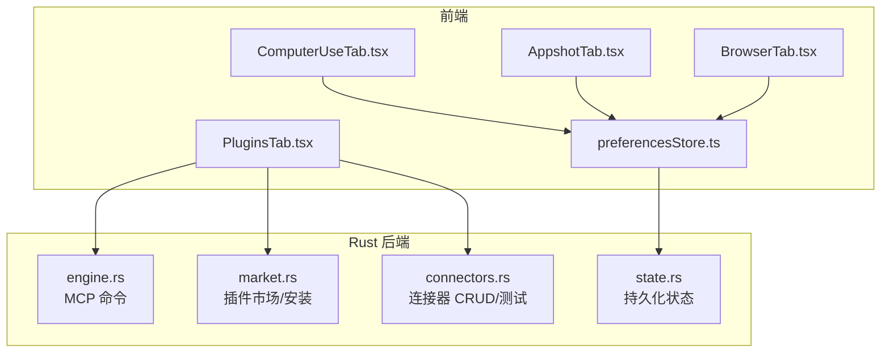
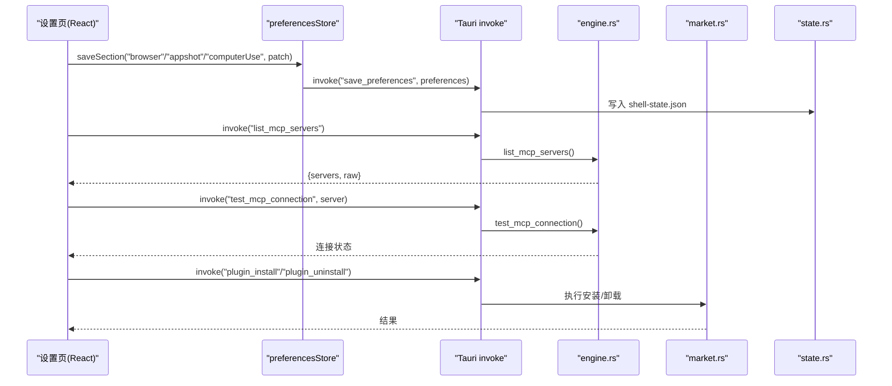
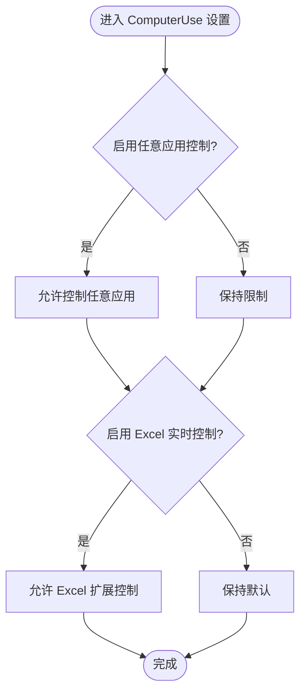
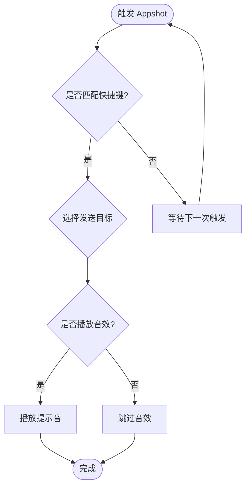
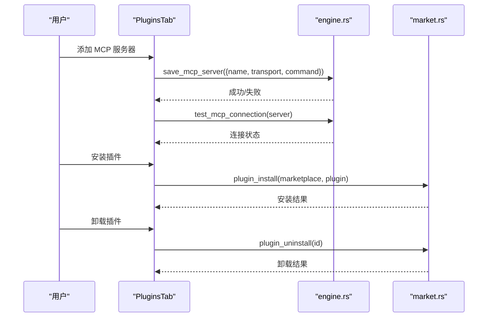
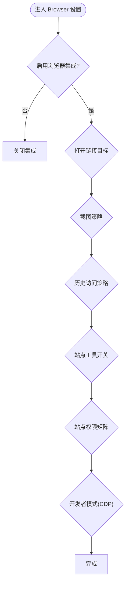
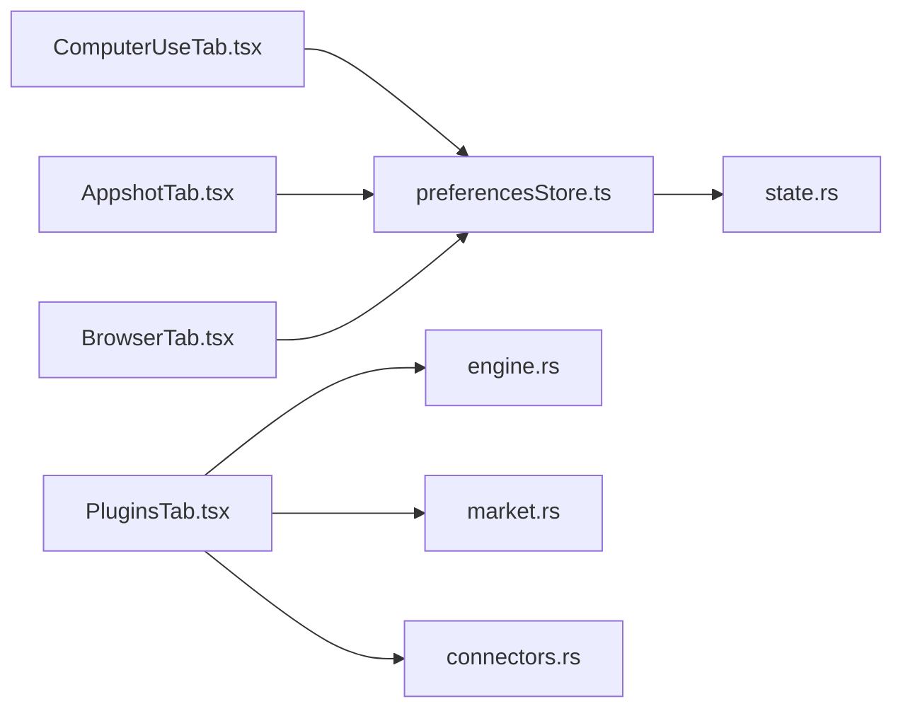

# 集成设置页面

<cite>
**本文引用的文件**
- [ComputerUseTab.tsx](file://frontend/app/views/settings/tabs/ComputerUseTab.tsx)
- [AppshotTab.tsx](file://frontend/app/views/settings/tabs/AppshotTab.tsx)
- [PluginsTab.tsx](file://frontend/app/views/settings/tabs/PluginsTab.tsx)
- [BrowserTab.tsx](file://frontend/app/views/settings/tabs/BrowserTab.tsx)
- [preferencesStore.ts](file://frontend/app/state/preferencesStore.ts)
- [engine.rs](file://src-tauri/src/commands/engine.rs)
- [market.rs](file://src-tauri/src/commands/market.rs)
- [connectors.rs](file://src-tauri/src/commands/connectors.rs)
- [state.rs](file://src-tauri/src/state.rs)
- [browser.txt](file://docs/uia/outlines-t41/browser.txt)
- [computer-use.txt](file://docs/uia/outlines-t41/computer-use.txt)
- [appshot.txt](file://docs/uia/outlines-t41/appshot.txt)
- [plugins.txt](file://docs/uia/outlines-t41/plugins.txt)
</cite>

## 目录
1. [简介](#简介)
2. [项目结构](#项目结构)
3. [核心组件](#核心组件)
4. [架构总览](#架构总览)
5. [详细组件分析](#详细组件分析)
6. [依赖关系分析](#依赖关系分析)
7. [性能考虑](#性能考虑)
8. [故障排除指南](#故障排除指南)
9. [结论](#结论)
10. [附录](#附录)

## 简介
本文件面向 Codex-Tauri 的“集成”相关设置页面，覆盖以下四个 Tab：
- 计算机使用设置（ComputerUseTab）：系统权限与自动化控制开关、浏览器扩展安装入口、Excel 实时控制等。
- 应用截图设置（AppshotTab）：快捷键、目标、音效等截图行为配置。
- 插件设置（PluginsTab）：插件列表与启用状态、MCP 服务器管理（添加、启用/禁用、连接测试）。
- 浏览器设置（BrowserTab）：内嵌/默认浏览器打开、截图策略、历史访问策略、站点工具、下载、权限矩阵与开发者模式（完整 CDP 访问）。

文档同时说明各集成的连接配置、认证机制、错误处理策略、第三方服务集成模板与安全/权限管理要点。

## 项目结构
前端通过 React 组件实现各设置页，统一通过 preferencesStore 读写偏好；部分能力通过 Tauri 命令调用 Rust 后端或引擎 RPC。

图表来源
- [ComputerUseTab.tsx:57-112](file://frontend/app/views/settings/tabs/ComputerUseTab.tsx#L57-L112)
- [AppshotTab.tsx:22-71](file://frontend/app/views/settings/tabs/AppshotTab.tsx#L22-L71)
- [PluginsTab.tsx:74-250](file://frontend/app/views/settings/tabs/PluginsTab.tsx#L74-L250)
- [BrowserTab.tsx:43-307](file://frontend/app/views/settings/tabs/BrowserTab.tsx#L43-L307)
- [preferencesStore.ts:45-88](file://frontend/app/state/preferencesStore.ts#L45-L88)
- [engine.rs:560-621](file://src-tauri/src/commands/engine.rs#L560-L621)
- [market.rs:388-800](file://src-tauri/src/commands/market.rs#L388-L800)
- [connectors.rs:4-53](file://src-tauri/src/commands/connectors.rs#L4-L53)
- [state.rs:150-217](file://src-tauri/src/state.rs#L150-L217)

章节来源
- [ComputerUseTab.tsx:57-112](file://frontend/app/views/settings/tabs/ComputerUseTab.tsx#L57-L112)
- [AppshotTab.tsx:22-71](file://frontend/app/views/settings/tabs/AppshotTab.tsx#L22-L71)
- [PluginsTab.tsx:74-250](file://frontend/app/views/settings/tabs/PluginsTab.tsx#L74-L250)
- [BrowserTab.tsx:43-307](file://frontend/app/views/settings/tabs/BrowserTab.tsx#L43-L307)
- [preferencesStore.ts:45-88](file://frontend/app/state/preferencesStore.ts#L45-L88)
- [engine.rs:560-621](file://src-tauri/src/commands/engine.rs#L560-L621)
- [market.rs:388-800](file://src-tauri/src/commands/market.rs#L388-L800)
- [connectors.rs:4-53](file://src-tauri/src/commands/connectors.rs#L4-L53)
- [state.rs:150-217](file://src-tauri/src/state.rs#L150-L217)

## 核心组件
- ComputerUseTab：提供“任意应用控制”“Chrome/Edge 扩展安装”“Excel 实时控制”开关与“始终允许的应用”白名单区域。当前 Chrome/Edge 扩展安装按钮为占位禁用态。
- AppshotTab：提供截图快捷键、发送目标、音效开关；媒体播放区域为禁用提示。
- PluginsTab：展示插件与 MCP 服务器列表，支持添加 MCP 服务器、切换启用状态、测试连接；插件启用/禁用通过引擎命令完成。
- BrowserTab：提供启用开关、常规选项（打开链接目标、本地目标、显示完整 URL）、浏览数据（截图策略、历史记录访问）、自动填充与密码、下载、站点权限矩阵、开发者模式（完整 CDP 访问）。

章节来源
- [ComputerUseTab.tsx:57-112](file://frontend/app/views/settings/tabs/ComputerUseTab.tsx#L57-L112)
- [AppshotTab.tsx:22-71](file://frontend/app/views/settings/tabs/AppshotTab.tsx#L22-L71)
- [PluginsTab.tsx:74-250](file://frontend/app/views/settings/tabs/PluginsTab.tsx#L74-L250)
- [BrowserTab.tsx:43-307](file://frontend/app/views/settings/tabs/BrowserTab.tsx#L43-L307)

## 架构总览
设置页以“偏好存储 + 引擎命令”为主轴：
- 偏好类设置（如 ComputerUse、Appshot、Browser）通过 preferencesStore 合并并持久化到 shell 状态。
- 插件/MCP 相关操作通过 Tauri 命令调用 engine.rs 中的 MCP 管理命令，或直接调用 market.rs 的插件市场命令。
- 连接器（Connectors）由 connectors.rs 提供增删改查与测试接口。

图表来源
- [preferencesStore.ts:76-88](file://frontend/app/state/preferencesStore.ts#L76-L88)
- [engine.rs:560-621](file://src-tauri/src/commands/engine.rs#L560-L621)
- [market.rs:712-800](file://src-tauri/src/commands/market.rs#L712-L800)
- [state.rs:176-217](file://src-tauri/src/state.rs#L176-L217)

## 详细组件分析

### 计算机使用设置（ComputerUseTab）
- 功能要点
  - “任意应用控制”开关：用于允许/禁止对任意应用的自动化控制。
  - “Chrome/Edge 扩展安装”：当前为禁用占位，待后续 L3 后端接入。
  - “Excel 实时控制”：开启后可增强 Excel 场景的控制能力。
  - “始终允许的应用”白名单：当前为空占位。
- 数据流
  - 所有开关通过 preferencesStore 保存至“computerUse”分区。
- 安全与权限
  - 涉及系统级自动化控制，建议仅在可信环境启用；结合“始终允许的应用”白名单最小化授权范围。

图表来源
- [ComputerUseTab.tsx:57-112](file://frontend/app/views/settings/tabs/ComputerUseTab.tsx#L57-L112)

章节来源
- [ComputerUseTab.tsx:57-112](file://frontend/app/views/settings/tabs/ComputerUseTab.tsx#L57-L112)
- [computer-use.txt:73-95](file://docs/uia/outlines-t41/computer-use.txt#L73-L95)

### 应用截图设置（AppshotTab）
- 功能要点
  - 快捷键：默认双 Alt 触发。
  - 发送目标：默认自动选择。
  - 音效：可开关。
  - 媒体播放：当前不可用（禁用提示）。
- 数据流
  - 通过 preferencesStore 保存至“appshot”分区。
- 图像处理与捕获
  - 该 Tab 仅暴露用户可配置的触发与输出目标；实际屏幕捕获与图像生成逻辑不在本文件中体现。

图表来源
- [AppshotTab.tsx:22-71](file://frontend/app/views/settings/tabs/AppshotTab.tsx#L22-L71)

章节来源
- [AppshotTab.tsx:22-71](file://frontend/app/views/settings/tabs/AppshotTab.tsx#L22-L71)
- [appshot.txt:73-87](file://docs/uia/outlines-t41/appshot.txt#L73-L87)

### 插件设置（PluginsTab）
- 功能要点
  - 插件列表：展示已安装插件及其启用状态。
  - MCP 服务器：列出、添加、启用/禁用、测试连接。
  - 插件市场：支持本地/远程源解析、克隆、安装、卸载、个人目录同步。
- 关键流程
  - 添加 MCP 服务器：收集 name/transport/command → 调用 save_mcp_server → 刷新列表。
  - 测试连接：调用 test_mcp_connection → 读取返回状态并展示。
  - 启用/禁用：调用 set_plugin_enabled 或 set_mcp_server_enabled。
  - 安装/卸载：调用 plugin_install / plugin_uninstall，底层进行目录复制/删除与清单同步。
- 版本控制
  - 安装记录包含 version、installed_at；个人目录 marketplace-personal.json 会随安装/卸载同步。

图表来源
- [PluginsTab.tsx:94-158](file://frontend/app/views/settings/tabs/PluginsTab.tsx#L94-L158)
- [engine.rs:560-621](file://src-tauri/src/commands/engine.rs#L560-L621)
- [market.rs:712-800](file://src-tauri/src/commands/market.rs#L712-L800)

章节来源
- [PluginsTab.tsx:74-250](file://frontend/app/views/settings/tabs/PluginsTab.tsx#L74-L250)
- [engine.rs:560-621](file://src-tauri/src/commands/engine.rs#L560-L621)
- [market.rs:388-800](file://src-tauri/src/commands/market.rs#L388-L800)
- [plugins.txt:73-95](file://docs/uia/outlines-t41/plugins.txt#L73-L95)

### 浏览器设置（BrowserTab）
- 功能要点
  - 启用开关：整体启用/禁用浏览器集成。
  - 常规：打开链接目标（内嵌/默认浏览器）、本地目标、显示完整 URL。
  - 浏览数据：截图策略（总是/从不）、历史记录访问策略（总是允许/总是询问/从不）。
  - 自动填充与密码、下载：下载位置（暂不可选）、询问保存位置、下载历史（暂不可用）。
  - 站点权限：浏览/下载/上传三类权限的默认策略。
  - 开发者模式：完整 CDP 访问开关（高风险）。
- 数据流
  - 所有选项通过 preferencesStore 保存至“browser”分区。
- 安全与权限
  - 完整 CDP 访问具有较高风险，应谨慎开启；站点权限矩阵可按需收紧。

图表来源
- [BrowserTab.tsx:43-307](file://frontend/app/views/settings/tabs/BrowserTab.tsx#L43-L307)

章节来源
- [BrowserTab.tsx:43-307](file://frontend/app/views/settings/tabs/BrowserTab.tsx#L43-L307)
- [browser.txt:140-154](file://docs/uia/outlines-t41/browser.txt#L140-L154)

## 依赖关系分析
- 前端偏好层
  - 所有设置页通过 preferencesStore 的 usePrefSection/saveSection 读写偏好，最终落盘到 state.rs 的 Preferences.extra 中。
- 插件与 MCP
  - PluginsTab 直接调用 Tauri 命令：list_mcp_servers、save_mcp_server、set_mcp_server_enabled、test_mcp_connection、set_plugin_enabled。
  - engine.rs 将 MCP 配置写入引擎配置并通过 RPC 刷新状态。
  - market.rs 负责插件市场的解析、克隆、安装、卸载与个人目录同步。
- 连接器
  - connectors.rs 提供连接器列表、保存、删除与测试（当前为桩实现）。

图表来源
- [preferencesStore.ts:45-88](file://frontend/app/state/preferencesStore.ts#L45-L88)
- [state.rs:150-217](file://src-tauri/src/state.rs#L150-L217)
- [engine.rs:560-621](file://src-tauri/src/commands/engine.rs#L560-L621)
- [market.rs:388-800](file://src-tauri/src/commands/market.rs#L388-L800)
- [connectors.rs:4-53](file://src-tauri/src/commands/connectors.rs#L4-L53)

章节来源
- [preferencesStore.ts:45-88](file://frontend/app/state/preferencesStore.ts#L45-L88)
- [state.rs:150-217](file://src-tauri/src/state.rs#L150-L217)
- [engine.rs:560-621](file://src-tauri/src/commands/engine.rs#L560-L621)
- [market.rs:388-800](file://src-tauri/src/commands/market.rs#L388-L800)
- [connectors.rs:4-53](file://src-tauri/src/commands/connectors.rs#L4-L53)

## 性能考虑
- 偏好保存采用先本地提交再异步持久化的策略，保证 UI 即时响应，避免阻塞交互。
- MCP 连接测试在失败时仍尝试拉取最新状态，提升可用性。
- 插件市场安装/卸载涉及文件系统 IO，建议在长耗时操作中提供进度反馈（当前未在前端体现）。

[本节为通用指导，不直接分析具体文件]

## 故障排除指南
- 偏好保存失败
  - 现象：设置变更后重启丢失或无效果。
  - 排查：检查 preferencesStore.saveSection 的异常日志；确认 state.rs 的持久化路径可写。
  - 参考：[preferencesStore.ts:76-88](file://frontend/app/state/preferencesStore.ts#L76-L88)、[state.rs:176-217](file://src-tauri/src/state.rs#L176-L217)
- MCP 连接测试失败
  - 现象：test_mcp_connection 报错或状态异常。
  - 排查：确认 save_mcp_server 已成功写入；检查网络/进程可达性；查看返回的 servers/data 字段。
  - 参考：[engine.rs:560-621](file://src-tauri/src/commands/engine.rs#L560-L621)、[PluginsTab.tsx:118-149](file://frontend/app/views/settings/tabs/PluginsTab.tsx#L118-L149)
- 插件安装/卸载失败
  - 现象：安装后未出现在列表或无法启用。
  - 排查：检查 market.rs 的 clone/copy 是否成功；确认 manifest 存在且包含必要字段；查看 installed.json 是否更新。
  - 参考：[market.rs:659-800](file://src-tauri/src/commands/market.rs#L659-L800)
- 连接器测试
  - 现象：test_connector 返回桩结果。
  - 排查：当前为占位实现，需按连接器类型补充探测逻辑。
  - 参考：[connectors.rs:34-53](file://src-tauri/src/commands/connectors.rs#L34-L53)

章节来源
- [preferencesStore.ts:76-88](file://frontend/app/state/preferencesStore.ts#L76-L88)
- [state.rs:176-217](file://src-tauri/src/state.rs#L176-L217)
- [engine.rs:560-621](file://src-tauri/src/commands/engine.rs#L560-L621)
- [PluginsTab.tsx:118-149](file://frontend/app/views/settings/tabs/PluginsTab.tsx#L118-L149)
- [market.rs:659-800](file://src-tauri/src/commands/market.rs#L659-L800)
- [connectors.rs:34-53](file://src-tauri/src/commands/connectors.rs#L34-L53)

## 结论
- ComputerUseTab 聚焦系统级自动化控制的开关与白名单，当前浏览器扩展安装尚未接入。
- AppshotTab 提供截图触发与基础行为配置，实际捕获逻辑位于其他模块。
- PluginsTab 实现了完整的插件与 MCP 管理能力，包括添加、启用/禁用、连接测试以及插件市场的安装/卸载。
- BrowserTab 提供了丰富的浏览器集成选项，尤其是站点权限矩阵与开发者模式（CDP），需谨慎开启。
- 所有偏好均通过统一的 preferencesStore 持久化，确保跨会话一致性。

[本节为总结性内容，不直接分析具体文件]

## 附录

### 连接配置与认证机制
- MCP 服务器
  - 配置项：name、transport、command、enabled。
  - 认证：通过引擎配置注入环境变量或凭据（由上层引擎负责），本层仅传递配置。
  - 参考：[engine.rs:578-606](file://src-tauri/src/commands/engine.rs#L578-L606)
- 插件市场
  - 支持 GitHub 简写、Git URL、本地目录三种源；安装过程会克隆/复制并写入 installed.json。
  - 参考：[market.rs:283-352](file://src-tauri/src/commands/market.rs#L283-L352)、[market.rs:712-800](file://src-tauri/src/commands/market.rs#L712-L800)
- 连接器
  - 当前为桩实现，返回固定 ok 结果；后续可按连接器类型实现真实探测。
  - 参考：[connectors.rs:34-53](file://src-tauri/src/commands/connectors.rs#L34-L53)

### 第三方服务集成配置模板
- MCP 服务器模板（示例键名）
  - name: 字符串
  - transport: stdio | http | websocket
  - command: 启动命令或端点地址
  - enabled: 布尔
  - 参考：[PluginsTab.tsx:94-107](file://frontend/app/views/settings/tabs/PluginsTab.tsx#L94-L107)
- 插件市场源模板
  - owner/repo 或 owner/repo@ref
  - https://...git 或 git@...
  - 本地目录路径
  - 参考：[market.rs:283-352](file://src-tauri/src/commands/market.rs#L283-L352)

### 安全考虑与权限管理
- 系统自动化控制（ComputerUse）
  - 建议仅在受信任环境中启用；配合“始终允许的应用”白名单最小化授权。
  - 参考：[ComputerUseTab.tsx:64-109](file://frontend/app/views/settings/tabs/ComputerUseTab.tsx#L64-L109)
- 浏览器开发者模式（CDP）
  - 完整 CDP 访问具有高风险，应谨慎开启并限制使用范围。
  - 参考：[BrowserTab.tsx:285-303](file://frontend/app/views/settings/tabs/BrowserTab.tsx#L285-L303)
- 插件与 MCP
  - 插件安装来自可验证源；安装前校验 manifest；安装后同步个人目录以便审计。
  - 参考：[market.rs:659-709](file://src-tauri/src/commands/market.rs#L659-L709)