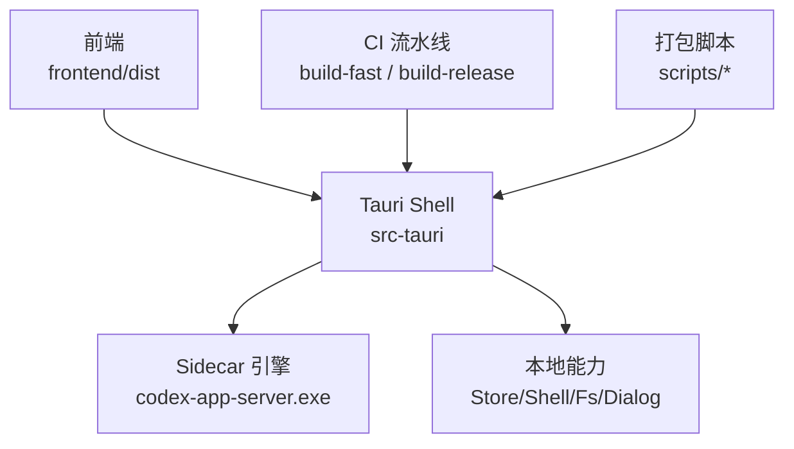
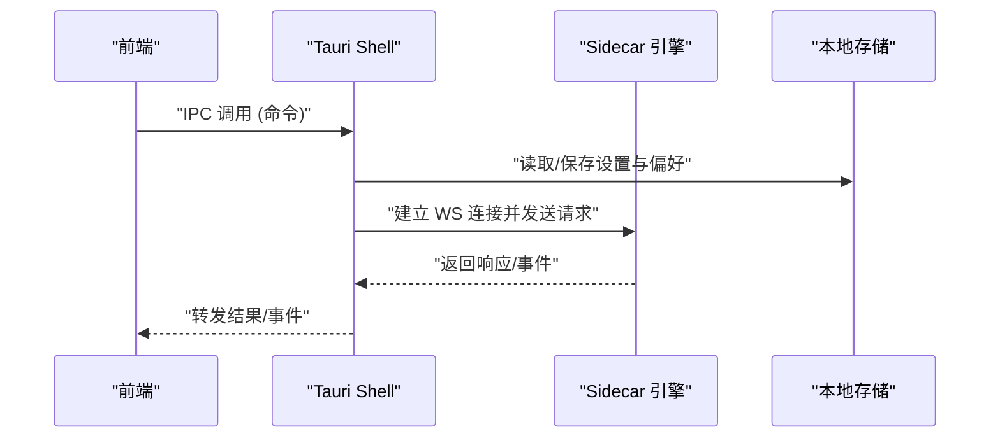
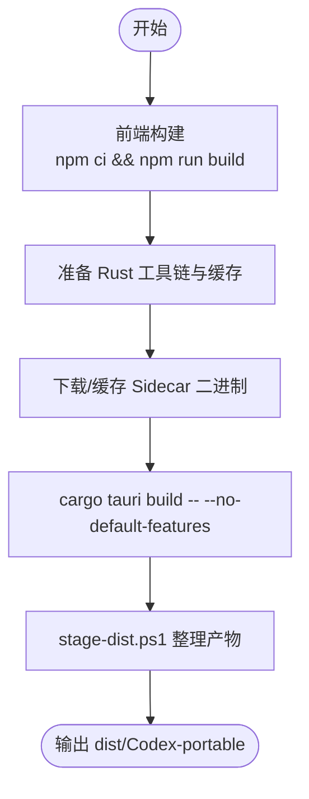
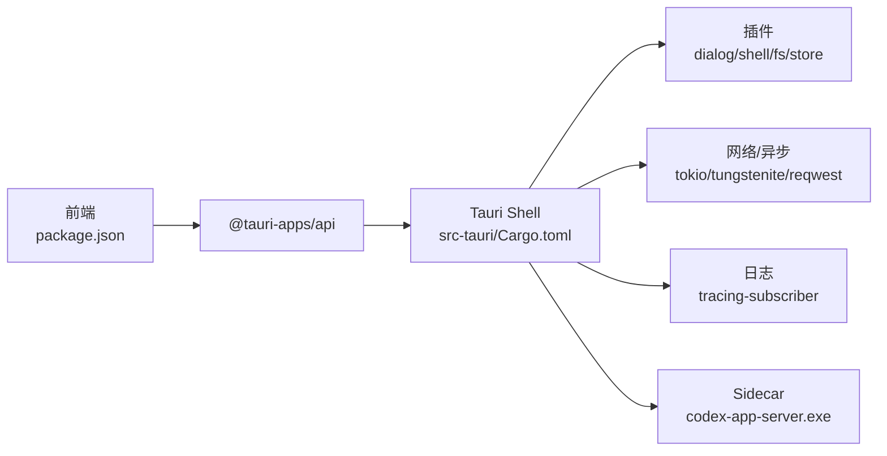

# 部署运维

<cite>
**本文引用的文件**
- [README.md](file://README.md)
- [Cargo.toml](file://Cargo.toml)
- [src-tauri/Cargo.toml](file://src-tauri/Cargo.toml)
- [src-tauri/tauri.conf.json](file://src-tauri/tauri.conf.json)
- [src-tauri/src/main.rs](file://src-tauri/src/main.rs)
- [src-tauri/src/lib.rs](file://src-tauri/src/lib.rs)
- [src-tauri/src/state.rs](file://src-tauri/src/state.rs)
- [.github/workflows/build-fast.yml](file://.github/workflows/build-fast.yml)
- [.github/workflows/build-release.yml](file://.github/workflows/build-release.yml)
- [scripts/build.ps1](file://scripts/build.ps1)
- [scripts/stage-dist.ps1](file://scripts/stage-dist.ps1)
- [frontend/package.json](file://frontend/package.json)
</cite>

## 目录
1. [简介](#简介)
2. [项目结构](#项目结构)
3. [核心组件](#核心组件)
4. [架构总览](#架构总览)
5. [详细组件分析](#详细组件分析)
6. [依赖关系分析](#依赖关系分析)
7. [性能考量](#性能考量)
8. [故障排查指南](#故障排查指南)
9. [结论](#结论)
10. [附录](#附录)

## 简介
本运维文档面向 Codex-Tauri 的打包、分发、版本管理、生产环境配置、环境变量与安全、日志与监控、更新与回滚、流水线与脚本使用，以及常见部署场景与问题定位。应用采用 Tauri v2 桌面壳 + 官方预编译 sidecar（codex-app-server）作为唯一引擎形态；前端为 React/Vite，后端 Rust 仅负责 IPC、本地能力与 sidecar 进程管理。

## 项目结构
- 前端：React + Vite，构建产物输出到 frontend/dist，由 Tauri 在打包时内嵌。
- 后端：Tauri 应用位于 src-tauri，通过 Cargo workspace 管理；sidecar 二进制由 CI 下载并随包分发。
- 构建与发布：GitHub Actions 提供快速构建与正式发布两个工作流；本地可通过 PowerShell 脚本一键构建与打包。
- 配置：Tauri 配置集中在 tauri.conf.json；Rust 编译优化与特性在根与子 crate 的 Cargo.toml 中声明。

**图表来源**
- [src-tauri/tauri.conf.json:6-11](file://src-tauri/tauri.conf.json#L6-L11)
- [src-tauri/tauri.conf.json:37-50](file://src-tauri/tauri.conf.json#L37-L50)
- [.github/workflows/build-fast.yml:53-93](file://.github/workflows/build-fast.yml#L53-L93)
- [.github/workflows/build-release.yml:53-66](file://.github/workflows/build-release.yml#L53-L66)

**章节来源**
- [README.md:16-40](file://README.md#L16-L40)
- [src-tauri/tauri.conf.json:1-61](file://src-tauri/tauri.conf.json#L1-L61)
- [frontend/package.json:1-31](file://frontend/package.json#L1-L31)

## 核心组件
- Tauri 应用入口与初始化：main.rs 调用 lib.rs 的 run()，完成日志、插件、菜单、状态加载、协议适配器启动、sidecar 启动、事件桥接与命令注册。
- Sidecar 引擎：官方 codex-app-server.exe，以独立进程运行并通过 WebSocket 通信；默认监听地址由状态配置决定。
- 本地状态与设置：AppState 持久化至用户配置目录下的 JSON 文件，包含主题、语言、活跃供应商、模型、终端、审批策略、沙箱、app_server 监听地址等。
- 安全与资源：Tauri 启用 assetProtocol 允许访问资源；WebView2 安装模式为下载引导器；bundle 目标为空，仅产出可执行文件与资源。

**章节来源**
- [src-tauri/src/main.rs:1-7](file://src-tauri/src/main.rs#L1-L7)
- [src-tauri/src/lib.rs:8-70](file://src-tauri/src/lib.rs#L8-L70)
- [src-tauri/src/lib.rs:71-159](file://src-tauri/src/lib.rs#L71-L159)
- [src-tauri/src/state.rs:27-47](file://src-tauri/src/state.rs#L27-L47)
- [src-tauri/src/state.rs:176-207](file://src-tauri/src/state.rs#L176-L207)
- [src-tauri/tauri.conf.json:29-50](file://src-tauri/tauri.conf.json#L29-L50)

## 架构总览
Codex-Tauri 的运行时链路如下：React UI 通过 Tauri IPC 调用 Rust shell 命令，shell 再与官方 app-server sidecar 进行 JSON-RPC/WS 交互；同时 shell 维护本地 Store/Shell/Fs/Dialog 等桌面能力。

**图表来源**
- [src-tauri/src/lib.rs:62-68](file://src-tauri/src/lib.rs#L62-L68)
- [src-tauri/src/state.rs:176-207](file://src-tauri/src/state.rs#L176-L207)

## 详细组件分析

### 构建与打包流程
- 前端构建：Node 22，npm ci + npm run build，产物输出到 frontend/dist。
- Rust 工具链：固定 Rust 1.98.1，目标 x86_64-pc-windows-msvc；启用 sccache 加速。
- Sidecar 获取：从 openai/codex releases 下载 rust-v0.154.0 的 Windows x64 二进制，缓存于 src-tauri/binaries。
- Tauri 构建：cargo tauri build -- --no-default-features，仅构建 shell，不编译 in-process 引擎。
- 产物整理：scripts/stage-dist.ps1 将 shell exe、WebView2Loader.dll（若存在）、sidecar 复制到 dist/Codex-portable。

**图表来源**
- [.github/workflows/build-fast.yml:67-93](file://.github/workflows/build-fast.yml#L67-L93)
- [.github/workflows/build-fast.yml:113-138](file://.github/workflows/build-fast.yml#L113-L138)
- [.github/workflows/build-fast.yml:183-197](file://.github/workflows/build-fast.yml#L183-L197)
- [scripts/stage-dist.ps1:1-75](file://scripts/stage-dist.ps1#L1-L75)

**章节来源**
- [.github/workflows/build-fast.yml:29-52](file://.github/workflows/build-fast.yml#L29-L52)
- [.github/workflows/build-release.yml:16-31](file://.github/workflows/build-release.yml#L16-L31)
- [scripts/build.ps1:1-24](file://scripts/build.ps1#L1-L24)
- [scripts/stage-dist.ps1:17-75](file://scripts/stage-dist.ps1#L17-L75)

### 分发策略与版本管理
- 分发形态：便携版（无安装器），包含 shell exe、可选 WebView2Loader.dll、sidecar 二进制。
- 版本来源：
  - 应用版本：workspace 与 tauri.conf.json 分别声明；CI 通过 tag v* 触发 release 流程。
  - 引擎版本：CODEX_APP_SERVER_TAG=rust-v0.154.0，固定来源 openai/codex releases。
  - Tauri CLI：固定版本 2.11.4，通过缓存下载。
- 工件保留：release 工件保留 90 天，fast 构建工件保留 7 天。

**章节来源**
- [Cargo.toml:7-13](file://Cargo.toml#L7-L13)
- [src-tauri/tauri.conf.json:3-5](file://src-tauri/tauri.conf.json#L3-L5)
- [.github/workflows/build-release.yml:7-10](file://.github/workflows/build-release.yml#L7-L10)
- [.github/workflows/build-release.yml:172-179](file://.github/workflows/build-release.yml#L172-L179)
- [.github/workflows/build-fast.yml:225-232](file://.github/workflows/build-fast.yml#L225-L232)

### 生产环境配置与环境变量管理
- 应用服务器监听地址：默认 ws://127.0.0.1:17457，可通过设置项覆盖。
- 供应商密钥注入：通过 provider_env_key 生成环境变量名（如 CODEX_PROVIDER_<ID>_API_KEY），在 spawn sidecar 时注入，避免明文落盘。
- Tauri 安全：CSP 关闭，assetProtocol 启用且作用域开放；Windows WebView2 安装模式为下载引导器。
- 日志级别：tracing-subscriber 根据环境变量或默认规则初始化（info,codex_tauri=debug）。

**章节来源**
- [src-tauri/src/state.rs:8-25](file://src-tauri/src/state.rs#L8-L25)
- [src-tauri/src/state.rs:195-197](file://src-tauri/src/state.rs#L195-L197)
- [src-tauri/src/lib.rs:9-14](file://src-tauri/src/lib.rs#L9-L14)
- [src-tauri/tauri.conf.json:29-50](file://src-tauri/tauri.conf.json#L29-L50)

### 日志收集、监控告警与性能分析
- 日志：基于 tracing-subscriber，支持按环境变量过滤；建议在生产环境开启结构化输出并接入集中式日志系统。
- 性能：CI 使用 sccache 加速编译；release profile 启用 thin LTO、行表调试信息；fast profile 降低优化等级以提升构建速度。
- 监控：当前未内置遥测上报；可在 shell 层集成 OpenTelemetry 或 Sentry（仓库已引入相关依赖但未在启动路径中启用）。

**章节来源**
- [src-tauri/src/lib.rs:9-14](file://src-tauri/src/lib.rs#L9-L14)
- [Cargo.toml:289-339](file://Cargo.toml#L289-L339)
- [.github/workflows/build-fast.yml:42-52](file://.github/workflows/build-fast.yml#L42-L52)
- [.github/workflows/build-release.yml:159-164](file://.github/workflows/build-release.yml#L159-L164)

### 更新机制、回滚策略与故障恢复
- 更新机制：当前为静态便携包分发；如需热更新，可在 shell 层实现侧载检查与替换 binaries/ 下 sidecar 二进制，并重启进程。
- 回滚策略：保留上一版本 portable 包；若新版本异常，切换回旧版本目录即可。
- 故障恢复：
  - Sidecar 无法启动：检查 binaries/ 是否存在、端口是否被占用、网络代理/防火墙。
  - WebView2 缺失：确保系统具备 WebView2 运行时或允许下载引导器安装。
  - 状态损坏：删除 shell-state.json 后重启，应用会加载默认值。

**章节来源**
- [src-tauri/src/lib.rs:149-158](file://src-tauri/src/lib.rs#L149-L158)
- [src-tauri/src/state.rs:176-207](file://src-tauri/src/state.rs#L176-L207)
- [scripts/stage-dist.ps1:58-66](file://scripts/stage-dist.ps1#L58-L66)

### 部署脚本使用说明
- 本地构建：运行 scripts/build.ps1，自动校验 sidecar 存在、执行 cargo tauri build、整理产物到 dist/。
- 产物整理：scripts/stage-dist.ps1 将 shell exe、WebView2Loader.dll（若有）、sidecar 复制到 dist/Codex-portable。
- CI 触发：push main/master 触发 fast 构建；tag v* 触发 release 构建。

**章节来源**
- [scripts/build.ps1:1-24](file://scripts/build.ps1#L1-L24)
- [scripts/stage-dist.ps1:1-75](file://scripts/stage-dist.ps1#L1-L75)
- [.github/workflows/build-fast.yml:18-23](file://.github/workflows/build-fast.yml#L18-L23)
- [.github/workflows/build-release.yml:7-10](file://.github/workflows/build-release.yml#L7-L10)

### 自动化流水线配置
- Fast 构建：用于日常 PR/推送，启用前端类型检查与构建、下载 sidecar、rust-cache、sccache、cargo tauri build、归档工件。
- Release 构建：用于正式版本，逻辑同 fast，但工件保留期更长，适合发布。
- 关键环境变量：
  - TAURI_SKIP_SIDECAR_CHECK：跳过 sidecar 存在性检查，交由下载步骤控制失败。
  - CODEX_APP_SERVER_TAG/NAME/DIR：指定引擎版本与位置。
  - CARGO_PROFILE_RELEASE_*：控制 release 构建优化与符号。

**章节来源**
- [.github/workflows/build-fast.yml:29-52](file://.github/workflows/build-fast.yml#L29-L52)
- [.github/workflows/build-fast.yml:113-197](file://.github/workflows/build-fast.yml#L113-L197)
- [.github/workflows/build-release.yml:16-31](file://.github/workflows/build-release.yml#L16-L31)
- [.github/workflows/build-release.yml:79-157](file://.github/workflows/build-release.yml#L79-L157)

### 运维最佳实践
- 固定依赖版本：Rust 工具链、Tauri CLI、引擎版本均固定，避免漂移。
- 缓存优先：利用 actions/cache 缓存 sidecar 与 cargo-tauri，减少下载时间。
- 最小权限与安全：仅在必要时启用 shell/fs 插件能力；生产环境限制 assetProtocol 作用域。
- 可观测性：统一日志格式，接入集中式日志；对关键错误（sidecar 启动失败、IPC 异常）设置告警。
- 灰度发布：先小范围试用新版 portable，验证后再全量替换。

[本节为通用指导，不直接分析具体文件]

## 依赖关系分析
- 前端依赖：React、Vite、@tauri-apps/api。
- 后端依赖：Tauri 及其插件（dialog/shell/fs/store）、tokio/tungstenite、reqwest、tracing 等。
- 外部依赖：官方 codex-app-server 二进制、WebView2 运行时。

**图表来源**
- [frontend/package.json:15-29](file://frontend/package.json#L15-L29)
- [src-tauri/Cargo.toml:17-49](file://src-tauri/Cargo.toml#L17-L49)

**章节来源**
- [frontend/package.json:1-31](file://frontend/package.json#L1-L31)
- [src-tauri/Cargo.toml:17-58](file://src-tauri/Cargo.toml#L17-L58)

## 性能考量
- 构建性能：启用 sccache 与 rust-cache；fast profile 降低 LTO 与优化等级以缩短构建时间。
- 运行性能：release profile 启用 thin LTO 与行表调试信息；保持二进制符号以便后续符号化。
- I/O 与内存：避免在主线程阻塞操作；sidecar 通信采用异步 tokio 运行时。

**章节来源**
- [Cargo.toml:289-339](file://Cargo.toml#L289-L339)
- [.github/workflows/build-fast.yml:42-52](file://.github/workflows/build-fast.yml#L42-L52)

## 故障排查指南
- Sidecar 缺失或尺寸异常：检查 CI 下载步骤与本地 src-tauri/binaries；确认文件大小大于阈值。
- WebView2 未安装：确认系统具备 WebView2 或允许下载引导器；必要时手动安装。
- 端口冲突：修改 app_server_listen 配置，避免与已有服务冲突。
- 状态文件损坏：删除 shell-state.json 后重启，应用会重建默认状态。
- 日志定位：调整 tracing 环境变量，查看 sidecar 启动与 IPC 调用日志。

**章节来源**
- [.github/workflows/build-fast.yml:123-138](file://.github/workflows/build-fast.yml#L123-L138)
- [src-tauri/src/state.rs:176-207](file://src-tauri/src/state.rs#L176-L207)
- [src-tauri/src/lib.rs:9-14](file://src-tauri/src/lib.rs#L9-L14)

## 结论
Codex-Tauri 采用“壳 + 预编译 sidecar”的稳定架构，配合 GitHub Actions 实现可重复的构建与发布流程。通过固定依赖版本、缓存优化、安全配置与清晰的日志体系，可满足生产环境的可靠性与可维护性要求。建议在后续迭代中补充灰度发布、遥测与集中式日志接入，进一步提升可观测性与运维效率。

## 附录

### 常见部署场景与配置示例
- 本地开发：
  - 安装 Node 22、Rust 1.98.1、Tauri CLI 2.11.4。
  - 下载 sidecar 到 src-tauri/binaries。
  - 运行 scripts/build.ps1 构建并生成 dist/Codex-portable。
- CI 快速构建：
  - push 到 main/master 自动触发 build-fast，产出工件保留 7 天。
- 正式发布：
  - 打 tag v* 触发 build-release，工件保留 90 天。
- 生产环境：
  - 将 dist/Codex-portable 分发到目标机器；确保 WebView2 可用；按需调整 app_server_listen 与日志级别。

**章节来源**
- [scripts/build.ps1:1-24](file://scripts/build.ps1#L1-L24)
- [.github/workflows/build-fast.yml:18-23](file://.github/workflows/build-fast.yml#L18-L23)
- [.github/workflows/build-release.yml:7-10](file://.github/workflows/build-release.yml#L7-L10)
- [src-tauri/src/state.rs:195-197](file://src-tauri/src/state.rs#L195-L197)