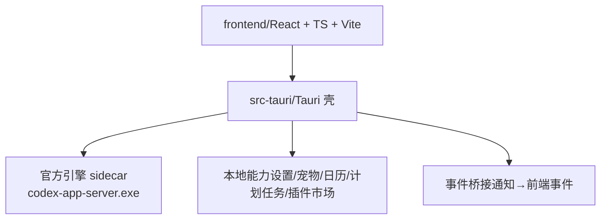
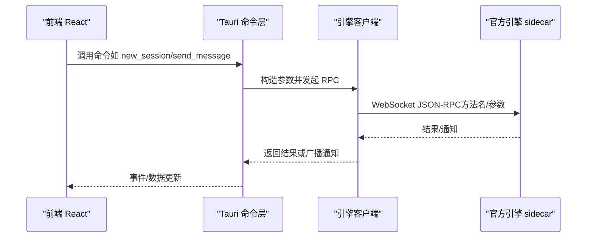
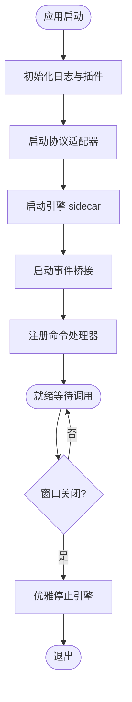
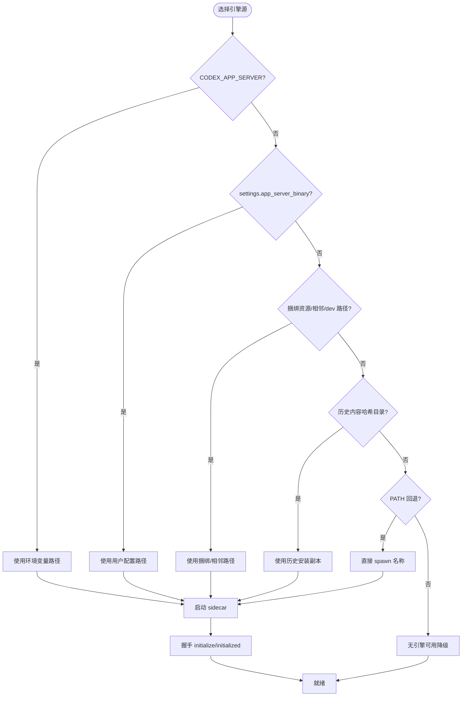
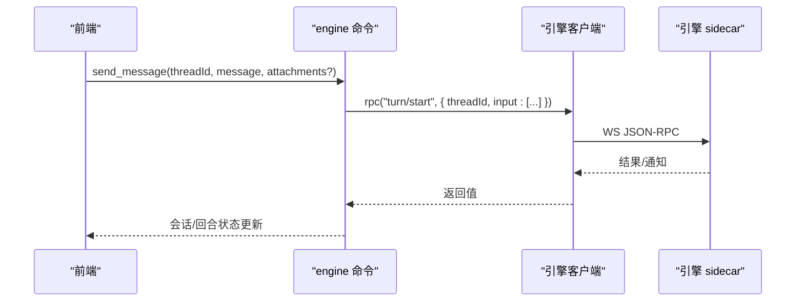
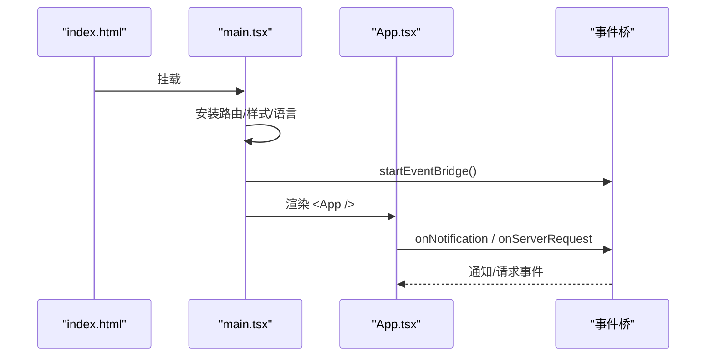
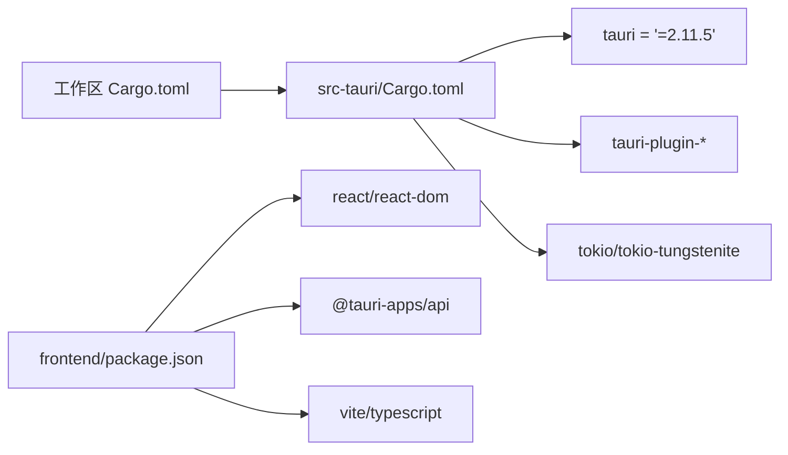

# 项目概述

<cite>
**本文引用的文件**
- [README.md](file://README.md)
- [Cargo.toml（工作区）](file://Cargo.toml)
- [src-tauri/Cargo.toml](file://src-tauri/Cargo.toml)
- [src-tauri/tauri.conf.json](file://src-tauri/tauri.conf.json)
- [src-tauri/src/main.rs](file://src-tauri/src/main.rs)
- [src-tauri/src/lib.rs](file://src-tauri/src/lib.rs)
- [src-tauri/src/commands/engine.rs](file://src-tauri/src/commands/engine.rs)
- [src-tauri/src/codex/mod.rs](file://src-tauri/src/codex/mod.rs)
- [frontend/package.json](file://frontend/package.json)
- [frontend/app/main.tsx](file://frontend/app/main.tsx)
- [frontend/app/App.tsx](file://frontend/app/App.tsx)
- [docs/RUST_BACKEND.md](file://docs/RUST_BACKEND.md)
- [docs/LAYOUT.md](file://docs/LAYOUT.md)
</cite>

## 目录
1. [简介](#简介)
2. [项目结构](#项目结构)
3. [核心组件](#核心组件)
4. [架构总览](#架构总览)
5. [详细组件分析](#详细组件分析)
6. [依赖关系分析](#依赖关系分析)
7. [性能与构建特性](#性能与构建特性)
8. [快速开始指南](#快速开始指南)
9. [故障排查](#故障排查)
10. [结论](#结论)

## 简介
Codex-Tauri 是一个基于 Tauri v2 的桌面应用程序，作为官方 Codex app-server 的桌面外壳。其唯一引擎形态是预编译的 sidecar（来自官方 GitHub Releases 的 codex-app-server 二进制），通过 WebSocket JSON-RPC 与引擎通信。前端采用 React + TypeScript，使用 Vite 构建；后端由 Rust 编写的 Tauri Shell 提供 IPC、本地能力（设置、宠物、日历、计划任务等）以及对引擎的封装调用。整体遵循分层架构：React UI → Tauri Shell API → app-server JSON-RPC → 官方引擎。

## 项目结构
仓库采用“壳工程 + 前端资源”的组织方式：
- frontend：React + TypeScript 前端，Vite 构建产物输出到 dist，供 Tauri 打包。
- src-tauri：Tauri 壳工程，包含 Rust 入口、命令层、引擎侧车管理、协议适配器等。
- docs：架构、布局、后端集成说明与官方方法清单。
- scripts：CI、协议校验、构建辅助脚本。
- .github/workflows：CI 流水线（lint、fast build、release）。

**图表来源**
- [src-tauri/src/lib.rs:16-69](file://src-tauri/src/lib.rs#L16-L69)
- [src-tauri/tauri.conf.json:37-47](file://src-tauri/tauri.conf.json#L37-L47)
- [docs/RUST_BACKEND.md:25-129](file://docs/RUST_BACKEND.md#L25-L129)

**章节来源**
- [README.md:16-39](file://README.md#L16-L39)
- [docs/LAYOUT.md:16-23](file://docs/LAYOUT.md#L16-L23)

## 核心组件
- Tauri 壳入口与初始化：负责日志、插件注册、菜单、状态加载、协议适配器启动、引擎 sidecar 启动、事件桥接、命令注册与窗口关闭清理。
- 引擎侧车管理：解析并启动官方 codex-app-server，维护连接、握手、RPC 转发、请求响应与通知广播。
- 命令层（commands）：将前端调用映射为对引擎的 JSON-RPC 调用或本地能力操作（会话、消息、配置、MCP、技能、插件、文件系统、计划任务等）。
- 前端应用：React 根组件订阅引擎通知与服务端请求，路由安装、主题与国际化初始化，渲染主界面。

**章节来源**
- [src-tauri/src/lib.rs:8-160](file://src-tauri/src/lib.rs#L8-L160)
- [src-tauri/src/commands/engine.rs:13-200](file://src-tauri/src/commands/engine.rs#L13-L200)
- [frontend/app/App.tsx:15-46](file://frontend/app/App.tsx#L15-L46)
- [frontend/app/main.tsx:33-60](file://frontend/app/main.tsx#L33-L60)

## 架构总览
分层架构清晰，职责边界明确：
- L4 前端（React UI）：用户交互、视图渲染、事件订阅、状态管理。
- L3 Tauri Shell API（产品 IPC）：暴露给前端的命令集合，封装本地能力与引擎调用。
- L2 引擎客户端（WebSocket JSON-RPC）：连接、握手、方法名映射、通知广播。
- L1 官方引擎（sidecar）：业务逻辑执行者，提供线程/回合/配置/MCP/插件等能力。

**图表来源**
- [src-tauri/src/commands/engine.rs:30-127](file://src-tauri/src/commands/engine.rs#L30-L127)
- [docs/RUST_BACKEND.md:144-171](file://docs/RUST_BACKEND.md#L144-L171)
- [src-tauri/src/lib.rs:62-68](file://src-tauri/src/lib.rs#L62-L68)

## 详细组件分析

### Tauri 壳初始化与生命周期
- 初始化日志与插件：tracing-subscriber、dialog/shell/fs/store 插件。
- 协议适配器：启动自定义供应商适配器（用于 Chat/Anthropic/Ollama → Responses 转换），从状态中注入路由与密钥。
- 引擎侧车：启动官方 codex-app-server，管理进程生命周期，并在窗口关闭时优雅停止。
- 事件桥接：将引擎通知转换为前端可订阅的事件。
- 命令注册：集中注册所有 IPC 命令，包括引擎转发与本地能力。

**图表来源**
- [src-tauri/src/lib.rs:8-69](file://src-tauri/src/lib.rs#L8-L69)
- [src-tauri/src/lib.rs:149-160](file://src-tauri/src/lib.rs#L149-L160)

**章节来源**
- [src-tauri/src/lib.rs:8-160](file://src-tauri/src/lib.rs#L8-L160)

### 引擎侧车与传输
- 唯一引擎形态：预编译 sidecar（官方 releases 的二进制），不在此仓库编译引擎源码。
- 启动策略：支持环境变量、用户配置、捆绑资源、内容寻址安装、PATH 回退等多级解析；默认监听 ws://127.0.0.1:17457。
- 握手流程：initialize → 服务端响应 → initialized 通知，超时与容量控制确保稳定性。
- 降级策略：未找到引擎时壳仍可启动，引擎相关视图显示为空，仅本地能力可用。

**图表来源**
- [docs/RUST_BACKEND.md:71-129](file://docs/RUST_BACKEND.md#L71-L129)
- [docs/RUST_BACKEND.md:144-171](file://docs/RUST_BACKEND.md#L144-L171)
- [docs/RUST_BACKEND.md:278-286](file://docs/RUST_BACKEND.md#L278-L286)

**章节来源**
- [docs/RUST_BACKEND.md:25-129](file://docs/RUST_BACKEND.md#L25-L129)
- [docs/RUST_BACKEND.md:144-171](file://docs/RUST_BACKEND.md#L144-L171)
- [docs/RUST_BACKEND.md:278-286](file://docs/RUST_BACKEND.md#L278-L286)

### 命令层与引擎转发
- 会话管理：创建、列出、读取、删除、归档/取消归档。
- 消息发送：turn/start 输入格式为 UserInput[]，支持附件。
- 中断与审批：turn/interrupt；审批以服务端请求 id 回复决策对象。
- 配置与模型：config/read、model/list、provider 列表与探测。
- MCP/技能/插件：查询、启用/禁用、安装/卸载、工具调用等。
- 文件系统与 Shell：目录读取、文件读写、模糊搜索；命令行执行与 I/O。
- 原始 RPC：允许透传任意方法名与参数。

**图表来源**
- [src-tauri/src/commands/engine.rs:102-127](file://src-tauri/src/commands/engine.rs#L102-L127)
- [docs/RUST_BACKEND.md:183-207](file://docs/RUST_BACKEND.md#L183-L207)

**章节来源**
- [src-tauri/src/commands/engine.rs:22-200](file://src-tauri/src/commands/engine.rs#L22-L200)
- [docs/RUST_BACKEND.md:183-207](file://docs/RUST_BACKEND.md#L183-L207)

### 前端应用与事件桥接
- 根组件 App：订阅通知与服务端请求，维护待处理请求队列，渲染主壳。
- 入口 main.tsx：安装样式、路由、事件桥、偏好与语言，最小化启动遮罩时间。
- 开发模式：支持浏览器模式 dev:browser，便于在不编译 Rust 的情况下调试真实引擎。

**图表来源**
- [frontend/app/main.tsx:33-60](file://frontend/app/main.tsx#L33-L60)
- [frontend/app/App.tsx:15-46](file://frontend/app/App.tsx#L15-L46)

**章节来源**
- [frontend/app/main.tsx:33-60](file://frontend/app/main.tsx#L33-L60)
- [frontend/app/App.tsx:15-46](file://frontend/app/App.tsx#L15-L46)

## 依赖关系分析
- 工作区与包版本：
  - 工作区仅包含 src-tauri 成员，统一版本与 lint 配置。
  - 前端依赖 React、Tauri API、Vite、TypeScript。
- Tauri 配置：
  - 产品名称、标识符、窗口尺寸与行为、安全策略、资源打包（嵌入 sidecar）、插件开关。
- 引擎模块组织：
  - codex 子模块提供适配器、客户端、事件、协议、侧车管理。

**图表来源**
- [Cargo.toml（工作区）:1-13](file://Cargo.toml#L1-L13)
- [src-tauri/Cargo.toml:17-49](file://src-tauri/Cargo.toml#L17-L49)
- [frontend/package.json:15-29](file://frontend/package.json#L15-L29)

**章节来源**
- [Cargo.toml（工作区）:1-13](file://Cargo.toml#L1-L13)
- [src-tauri/Cargo.toml:17-49](file://src-tauri/Cargo.toml#L17-L49)
- [frontend/package.json:15-29](file://frontend/package.json#L15-L29)

## 性能与构建特性
- 构建优化：
  - 工作区 release 配置启用 thin LTO、行表调试信息、代码生成单元数平衡。
  - CI-fast 配置降低优化级别以提升构建速度。
- 资源打包：
  - tauri.conf.json 将 sidecar 二进制作为资源嵌入安装包，避免外部依赖。
- 运行时性能：
  - 通知广播使用 tokio broadcast channel，避免阻塞请求通道。
  - 引擎超时与容量限制保障稳定性。

**章节来源**
- [Cargo.toml（工作区）:289-339](file://Cargo.toml#L289-L339)
- [src-tauri/tauri.conf.json:37-47](file://src-tauri/tauri.conf.json#L37-L47)
- [docs/RUST_BACKEND.md:169-171](file://docs/RUST_BACKEND.md#L169-L171)

## 快速开始指南
- 环境准备：
  - 安装 Node.js 与 npm（用于前端开发与构建）。
  - 安装 Rust 工具链与 Tauri CLI（用于壳工程构建与运行）。
- 安装依赖：
  - 进入 frontend 目录，执行依赖安装与类型检查、构建。
- 运行应用：
  - 使用 Tauri 开发模式启动，前端通过 Vite 热重载，壳工程加载本地开发服务器。
- 获取引擎二进制：
  - 将官方 codex-app-server 二进制放置于 src-tauri/binaries 或通过环境变量/用户配置指定路径。
- 浏览器调试模式：
  - 使用前端脚本在浏览器模式下运行，配合真实引擎进行调试。

**章节来源**
- [README.md:42-49](file://README.md#L42-L49)
- [docs/RUST_BACKEND.md:71-129](file://docs/RUST_BACKEND.md#L71-L129)
- [frontend/package.json:7-14](file://frontend/package.json#L7-L14)

## 故障排查
- 引擎未找到：
  - 现象：engine_status.connected == false，引擎相关视图为空。
  - 解决：放置二进制到 src-tauri/binaries、设置 CODEX_APP_SERVER 或 settings.app_server_binary。
- 端口冲突：
  - 现象：WS 连接失败（常见错误码）。
  - 解决：修改 settings.app_server_listen 或使用其他端口。
- 审批卡住：
  - 现象：turn 等待审批但未收到决策。
  - 解决：确保前端正确处理 approval/user-input 事件并调用 respond 接口。
- 通知未处理：
  - 现象：部分通知已发出但前端未处理，导致 turn 停滞。
  - 解决：在前端 bridge/events.ts 中添加对应监听与处理逻辑。

**章节来源**
- [docs/RUST_BACKEND.md:278-286](file://docs/RUST_BACKEND.md#L278-L286)
- [docs/RUST_BACKEND.md:241-263](file://docs/RUST_BACKEND.md#L241-L263)
- [src-tauri/src/commands/engine.rs:137-183](file://src-tauri/src/commands/engine.rs#L137-L183)

## 结论
Codex-Tauri 以简洁清晰的壳工程形态，将官方引擎封装为桌面应用，提供一致的 React UI 与丰富的本地能力。通过分层架构与严格的命令映射，保证了可扩展性与可维护性。预编译 sidecar 的策略简化了构建流程，提升了交付效率。未来可在传输安全、进程健康监控与更多通知处理方面持续完善。